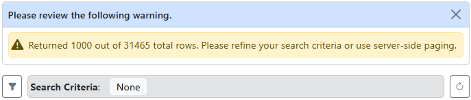
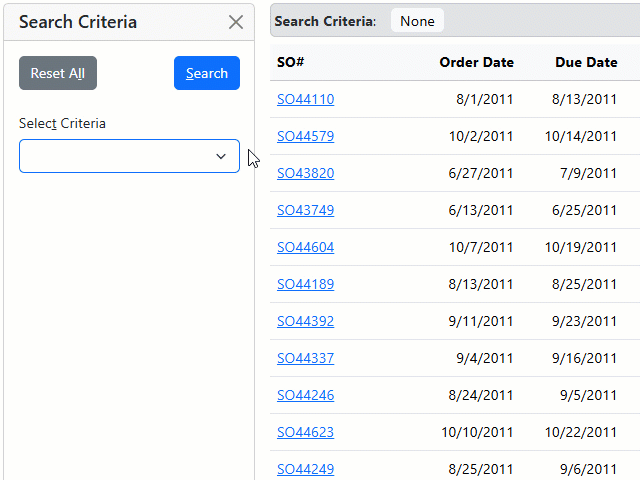
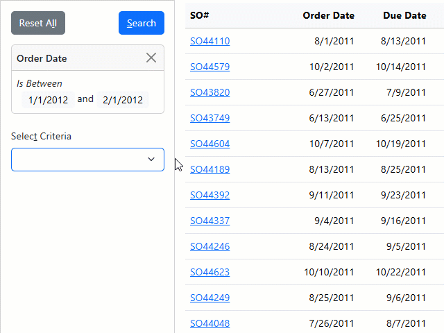
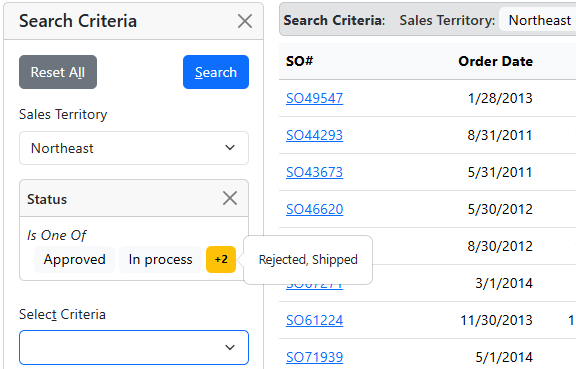
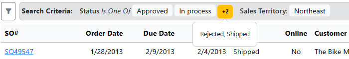

# What's new in Xomega 9.13

We are happy to announce the new major release 9.13 of Xomega.Net. Thanks to your feedback, it's loaded with some cool new features, improvements, and bug fixes.


The main improvements are around building powerful search screens, consisting of the following:


- Support for **browsing large data sets**, including limiting results, and server-side paging and sorting.
- **Building clean powerful search screens** with lots of criteria using dynamic criteria and simplified criteria models.
- Control generated **main menu with auto-search** and other parameters.

Read on to learn more about these new and exciting features. 

<!-- truncate -->

## Browsing large data sets

Previously the `ReadList` service operation generated by Xomega would return to the client all records that matched the specified criteria. Those would be used to populate the [data list object](/docs/framework/common-ui/data-lists#populating-data) that your search results grid is bound to, but you were able to display paged results in the grid.

However, if the user runs a search against a large database table with no criteria, or with non-restrictive criteria that match a large number of records, the large data set returned could cause some serious performance issues, including timeouts and memory issues. To address those, you needed to add custom code to each service operation to limit the number of records returned, which was tedious and not scalable.

The new release provides some automatic tools to handle this situation in a standardized and better way, as described below.

### Limiting returned results

If you use client-side paging, as before, and run a query that returns a large data set, the generated service operation will automatically [limit the number of records](/docs/framework/services/querying#limiting-results) returned to 1000 by default.

You can [configure the model to change this default limit](/docs/visual-studio/modeling/services#configuring-result-limiting) for a specific service operation, or you can add custom code to change it in the generated operation, or even remove it there by setting it to `null`.

To let the users know that they are viewing a limited result set, the generated service operation will also return a warning message showing how many records were returned, **as well as the total number of records** matched, which will be displayed in the UI, as shown below.



### Server-side sorting

So far, sorting the search results grid on the UI would apply only to the data in the list object on the client side. However, this does not work well when the service operation returns a limited result set, since you will never be able to see the data outside this limit.

In the new release, the sort criteria applied on the client side will also be [sent to the service operation](/docs/framework/common-ui/data-lists#server-side-sorting), which will [apply them to the data set on the server side](/docs/framework/services/querying#server-side-sorting). This way, even if your data set is limited, you will be able to see the properly sorted data in the grid.

### Server-side paging

Finally, the new release allows you to configure full-fledged [server-side paging](/docs/framework/common-ui/data-lists#paging-mode), where the client sends to the service operation the number of rows to skip based on the current page in the grid, as well as the number of rows to return based on the selected page size.

The operation will then return only the requested number of records for the current page, as well as the total number of records matched, which will be used to calculate the total number of pages.

Client-side paging is still used by default, but you can [configure the model](/docs/visual-studio/modeling/services#paging-configuration) to use server-side paging for your operation, as shown below.

```xml
<operation name="read list" type="readlist">
  <input>
    <struct name="criteria">[...]
  </input>
  <output list="true">[...]
  <config>
<!-- highlight-next-line -->
    <xfk:paging mode="server"/>
    <rest:method verb="GET" uri-template="sales-order?{criteria}"/>
  </config>
</operation>
```

:::note
You can also set the [`PagingMode.Server`](/docs/framework/common-ui/data-lists#paging-mode) in your customized data list object, but if your `read list` operation has no input criteria, then you need to configure it in the model as described above, so that the operation could be generated to properly accept the paging and sorting parameters. 
:::

:::warning
Server-side paging and sorting is currently available only in the generated **Blazor** search screens. Legacy technologies such as **ASP.NET**, **SPA** and **WPF** should continue to use client-side paging and sorting.
:::

## Powerful search criteria

Adding many different criteria to search your data by can help you build really powerful search screens. So far, Xomega allowed you to define any needed criteria in the model and generate the search screens based on those. However, this process was quite cumbersome, and the generated screens could get pretty unwieldy with many criteria.

The new release aims to simplify the process of defining criteria in the model, as well as significantly improve the UX of the generated search screens with many criteria, as described below.

### Simplified criteria model

Normally, you describe the search criteria for your `read list` operation under the `criteria` input structure in the model. Previously, in order to declare search criteria by a specific field, you had to add up to three parameters under that structure - one for the field value, one for the operator, if you want to allow the users to select an operator, and the third one for the second field value, if you want to allow filtering by a range of values.

You also needed to specify the `required="false"` attribute for each value parameter to override the `required` value inferred from the corresponding field. While the [generator of the default CRUD operations](/docs/generators/model/crud) would automatically add all those parameters for you, it was still pretty cumbersome to manage them in the model, especially when adding new criteria.

This has been **significantly simplified** in the new release, such that all you have to do is just add one parameter for each field you want to filter by. You can still override the `type` inferred from the corresponding field, or make the criteria multi-valued as shown below.

```xml
<operation name="read list" type="readlist">
  <input>
    <struct name="criteria">
<!-- removed-lines-start -->
      <param name="order date operator" type="operator"/>
      <param name="order date" type="date" required="false"/>
      <param name="order date2" type="date" required="false"/>
<!-- removed-lines-end -->
<!-- added-next-line -->
      <param name="order date" type="date"/>
<!-- removed-lines-start -->
      <param name="status operator" type="operator"/>
      <param name="status" required="false" list="true"/>
<!-- removed-lines-end -->
<!-- added-lines-start -->
      <param name="status" list="true"/>
<!-- added-lines-end -->
      ...
    </struct>
  </input>
  <output list="true">[...]
</operation>
```

:::note
All criteria are not required by default. The only case when you need to set the [`required="true"`](/docs/visual-studio/modeling/services#filter-criteria) attribute is if the underlying field is required and uses a primitive data type. This is needed to make sure that the generated type for the criteria parameter matches the type of the field being filtered by.
:::

#### Configure criteria operators

Even though you no longer get to specify separate operator parameters, you can still configure the operators for each field in the `ui:display/ui:fields` section of the [definition of the criteria data object](/docs/visual-studio/modeling/presentation#criteria-config).

In that section you can configure a criteria field to have no operator, specify a different default operator, or use a custom logical type to display a custom set of operators for the field. This is done by using the `op-none`, `op-default`, and `op-type` attributes, respectively, as illustrated below.

```xml
<xfk:data-object class="SalesOrderCriteria">
  <ui:display>
    <ui:fields>
<!-- highlight-start -->
      <ui:field param="status" op-none="true"/>
      <ui:field param="customer name" op-default="CN"/>
      <ui:field param="order date" op-type="order date operator"/>
<!-- highlight-end -->
    </ui:fields>
  </ui:display>
</xfk:data-object>
```

### Dynamic criteria

When you defined multiple search criteria for your `read list` operation in the previous versions, the generated Blazor search screen would add them statically and stacked up vertically to the Search Criteria panel, which opens up on the left side of the results grid.

This can become unwieldy when you have many such criteria defined, as the panel can take up a lot of space and the users will have to scroll through it to find the right criteria. As the users set a few of those criteria for the search, it may also be difficult for them to see the selected criteria values in the long list of all criteria.

To address this, the new version added an easy and elegant way to **dynamically add and edit criteria** in the search panel, displaying only the selected criteria, and therefore taking up much less space on the screen.

#### Adding/deleting dynamic criteria

To dynamically add criteria in the generated Blazor search screens, the users can select the field name from a drop-down list, populate the operator and criteria values, and click the *Add* button.

The edit panel will display any validation errors, but otherwise the selected value(s) will be added to the criteria panel above it, as illustrated in the following animation.



The criteria values for each field are displayed in its own sub-panel, which you can close to clear and remove those criteria from the search, as shown in the animation above.

#### Editing dynamic criteria

To edit the values of the selected dynamic criteria, the users can either select the field name from the drop-down list again, or click on any value of the selected criteria in the panel.

This will open the edit panel, where you can change the values and click the *Update* button to apply the changes, as illustrated in the animation below.



:::tip
You don't have to click the *Add* or *Update* buttons if you are ready to run your search. You can just click the *Search* button, and the criteria will be added to the search automatically.
:::

#### Mixing static and dynamic

By default all criteria in the new generated Blazor search screens are dynamic. However, you can still define some or all of them as static, so that they are always displayed in the criteria panel. This makes sense if your search screen has only a few criteria, or if you want to display a few most commonly used criteria statically, while allowing the users to add less common criteria dynamically.

All you have to do is to [set the `static` attribute](/docs/visual-studio/modeling/presentation#criteria-config) on the parent `ui:fields` element and/or on the individual `ui:field` elements as needed, as shown below.

```xml
<xfk:data-object class="SalesOrderCriteria">
  <ui:display>
    <ui:fields>
      <ui:field param="sales person id" label="Sales Person"/>
      <ui:field param="territory id" label="Sales Territory"
<!-- highlight-next-line -->
                static="true" op-none="true"/>
    </ui:fields>
  </ui:display>
</xfk:data-object>
```

The following picture illustrates a setup where the *Sales Territory* criteria is selected statically without an operator, while you can dynamically add other criteria, such as the order *Status*.

The latter allows selecting multiple values to filter by, but, to save space, only the first two values and the number of remaining values are displayed in the criteria panel. You can click on that number to reveal the remaining values.



:::warning
Selecting dynamic criteria is currently available only in the generated **Blazor** search screens. Legacy technologies such as **ASP.NET**, **SPA** and **WPF** still have all the criteria displayed statically in the criteria panel above the results grid.
:::

### Applied criteria display

The UX of the [applied criteria panel](/docs/framework/blazor/components#criteriabar) above the results grid has been also improved in the new release to make the applied values more prominent and consistent with the display of the selected dynamic criteria, as shown below.



Just like with dynamic criteria display, applied criteria that have multiple values will show only the first two values and the number of remaining values to make them fit neatly above the grid. You can click on that number to reveal the other values.

:::tip
You can also click on the values in the Applied Criteria panel to easily open the Search Criteria panel on the side and edit the criteria. 
:::

## Main menu modeling

Previously, the top-level navigation menu was generated for all views without the `child` attribute. To customize the main navigation menu, you had to add code in the `MainMenuCustomized.cs` file for the `MainMenu` class.

To give you more control over the structure of the generated main menu, the new release allows you to explicitly configure the top-level views to be included in the main menu by adding the [`ui:main-link`](/docs/visual-studio/modeling/presentation#main-menu-links) element to the `ui:view` in the model.

By default it will be placed in a group menu derived from the view's module, and the menu text will be derived from the name of the link, but you can customize those values in the nested `ui:display` element, as shown below.

```xml
<ui:view name="SalesOrderListView" title="Sales Order List">
  <ui:view-model data-object="SalesOrderList"/>
<!-- highlight-start -->
  <ui:main-link name="sales order list">
    <ui:display title="Sales Orders" group="Sales" icon="list-check"/>
  </ui:main-link>
<!-- highlight-end -->
</ui:view>
```

:::note
The generator of the [default CRUD operations and views](/docs/generators/model/crud) will automatically add the `ui:main-link` elements for the top-level views.
:::

### Configure auto-search

With the new `main-link` element, you can easily configure the main menu links to [auto-run the search](/docs/visual-studio/modeling/presentation#opening-views-with-auto-search) when opening the search view. This is done by adding the `ui:params` element with the `_action` parameter set to `search`, as shown below.

```xml
<ui:view name="SalesOrderListView" title="Sales Order List">
  <ui:view-model data-object="SalesOrderList"/>
  <ui:main-link name="sales order list">
<!-- highlight-start -->
    <ui:params>
      <ui:param name="_action" value="search"/>
    </ui:params>
<!-- highlight-end -->
  </ui:main-link>
</ui:view>
```

### Configure parameters

In addition to the `_action` parameter, you can also configure the values for other activation parameters, which will be used to pre-populate the values when creating new objects on a details view, or to pre-populate the criteria on the search views, as shown below.

```xml
<ui:view name="SalesOrderListView" title="Sales Order List">
  <ui:view-model data-object="SalesOrderList"/>
  <ui:main-link name="pending sales orders">
<!-- highlight-start -->
    <ui:params>
      <ui:param name="_action" value="search"/>
      <ui:param name="status" value="1"/>
    </ui:params>
<!-- highlight-end -->
  </ui:main-link>
</ui:view>
```

## Conclusion

As you can see, the new release of Xomega.Net 9.13.0 is packed with some great new features and improvements that will help you build powerful search screens for your applications.

### You spoke, we listened

The new features are largely driven by your feedback, so we would like to thank you for your continued support and suggestions.

Please [download the new version](https://xomega.net/product/download), and **let us know what you think** about these new features in the [comments](https://github.com/orgs/Xomega-Net/discussions/23). You can also [contact us directly](https://xomega.net/about/contactus) with any questions or suggestions.

### Other changes

For other minor changes and bug fixes, please refer to the [release notes](/docs/platform/releases/vs2022#version-9130).