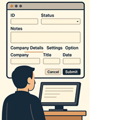
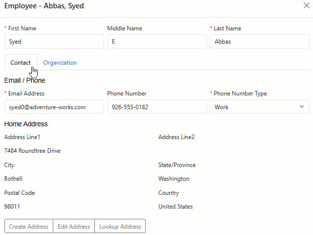

# Details layout in Xomega 9.13.1


We are pleased to announce the release of Xomega.Net 9.13.1, which brings several enhancements for building advanced details screens and other improvements, including:



- Support for **flexible layout of details views** in generated Blazor views.
- **Security enhancements** to help you implement advanced security in details views.
- Support for **custom joins in `read list` operations** and additional improvements.

Read on to learn more about these exciting new features.

<!-- truncate -->


## Details layout enhancements

This release introduces significant model enhancements that make it much easier to generate complex details screens.

### UI field groups


Previously, all data properties of data objects were displayed in a single panel in generated details screens. If you had a large details screen with many fields that you wanted to organize into multiple panels, you had to define child data objects for each panel.

To streamline both reading and saving data, the structure of your service operations needed to mimic the structure of the data objects and, consequently, the UI. Additionally, the order of UI fields in the panel was determined by the natural order of parameters in the service operations, requiring you to arrange your output or input parameters to control the UI field layout.

With this release, you can define UI field groups under the `ui:display` element of the data object by adding `<ui:fields>` elements with the `group` attribute and an optional localizable `title`, as illustrated below.

```xml
<xfk:data-object class="EmployeeObject">
  <ui:display>
    <ui:fields>
      <ui:field param="business entity id" hidden="true"/>
    </ui:fields>
<!-- highlight-next-line -->
    <ui:fields group="name" title="Employee Name">
      <ui:field param="first name"/>
      <ui:field param="middle name"/>
      <ui:field param="last name"/>
    </ui:fields>
<!-- highlight-next-line -->
    <ui:fields group="personal" title="Personal Info">
      <ui:field param="birth date"/>
      <ui:field param="gender"/>
      <ui:field param="national id number"/>
      <ui:field param="marital status"/>
    </ui:fields>
  </ui:display>
</xfk:data-object>
```


Unlike the default `ui:fields` element without a `group` attribute, which allows you to configure UI fields as needed, named field groups let you list specific fields in the exact order they should appear in the UI. Their `ui:field` elements support the same configuration options, such as labels, as the default `ui:fields` element.

Once you group your fields this way, you can specify a particular field group for a given panel or tab when defining the view layout. If you add a panel without specifying a field group, it will include all fields not part of any group, unless they are explicitly listed in the default `ui:fields` element.

For more information, see the [UI Field Groups documentation](/docs/visual-studio/modeling/presentation#ui-field-groups).

### Panel and tabs layout


Previously, you could only lay out child objects and the main panel for the data object by adding `ui:child-panels` and `ui:tabs` elements to specify which child objects should be displayed as panels and which as tabs below all panels.

With the addition of UI field groups, this design has been reworked to allow you to lay out field groups and child objects more flexibly using any combination of panels and tabs. Specifically, you can now add a single `ui:panel-layout` element that contains either `ui:panel` or `ui:tabs` elements.

Each `ui:tab` element can contain its own `ui:panel` or nested `ui:tabs` elements, allowing you to create more complex layouts for your details views. Panels (and tabs) can be bound either to a specific field group or to a child object, which may have its own layout defined. A single panel with no group or child will show the default field group, which contains all fields not included in any other group.

#### Example Layout


Consider the following display configuration for an `EmployeeObject` data object that serves as a view model for the Employee Details view.

The data object has two child objects: a list of employee `reports` and an `address` object. We also organized the properties of the employee data object into several field groups, such as "email phone", "department", and "position".

These field groups do not include employee name properties, such as "first name", "middle name", and "last name", so those fields will be included in the default field group. We'll include that default group as the first panel in the `ui:panel-layout` element, as illustrated below.

```xml
<xfk:data-object class="EmployeeObject">
  <xfk:add-child name="reports" class="EmployeeReportsList"/>
  <xfk:add-child name="address" class="EmployeeAddressObject"/>
  <ui:display>
    <ui:fields>
      <ui:field param="business entity id" hidden="true"/>
    </ui:fields>
    <ui:fields group="email phone" title="Email / Phone">[...]
    <ui:fields group="department">[...]
    <ui:fields group="position">[...]
<!-- highlight-start -->
    <ui:panel-layout>
      <ui:panel field-cols="3"/>
      <ui:tabs>
        <ui:tab title="Contact">
          <ui:panel group="email phone" field-cols="3"/>
          <ui:panel child="address" title="Home Address"/>
        </ui:tab>
        <ui:tab title="Organization">
          <ui:panel group="department"/>
          <ui:panel group="position" field-cols="3"/>
          <ui:panel child="reports" title="Direct Reports"/>
        </ui:tab>
      </ui:tabs>
    </ui:panel-layout>
<!-- highlight-end -->
  </ui:display>
</xfk:data-object>
```


As you can see, we organized the panels for the remaining field groups and child objects into separate tabs: "Contact" and "Organization". The "Contact" tab contains the "email phone" field group, as well as the `address` child object with its own layout. The "Organization" tab contains the "department" and "position" panels, as well as the "Direct Reports" grid for the `reports` child list.

If you generate the Blazor `EmployeeView` and run the application, you will see how this layout is rendered in the UI, as illustrated below.




The main panel with the employee name fields is displayed first, above the tabs, while the "Contact" and "Organization" tabs contain the remaining fields organized into their respective groups.

The "email phone" and "position" panels with the `field-cols="3"` attribute have their fields laid out in three columns, while the "department" panel uses the default four columns. You can also display panels side by side instead of stacking them vertically by using the `panel-cols` attribute. To learn more about panel and tabs layouts, refer to the [Panel and Tab Layout documentation](/docs/visual-studio/modeling/presentation#panel-and-tab-layout).

### Links in field groups


By default, any links to other views that you declare on a data object are displayed at the bottom of that data object in the generated views, right below all the panels. If your data object is a child object, then the links will be displayed at the bottom of the panel for that child object, as illustrated by the "Home Address" panel in the example above.

However, if employee address properties were directly on the `EmployeeObject` rather than in a separate child object, the links would previously be displayed at the bottom of the main panel for the employee. In this release, you can set a `group` attribute on the `ui:display` element of the link to place it in the panel for a specific field group, as shown below.

```xml
<xfk:data-object class="EmployeeObject">
  <ui:display>
<!-- highlight-next-line -->
    <ui:fields group="address">[...]
  </ui:display>
<!-- highlight-next-line -->
  <ui:link name="edit address" view="AddressView" child="true">
    <ui:params>
      <ui:param name="address id" field="address id"/>
    </ui:params>
    <ui:result>[...]
<!-- highlight-next-line -->
    <ui:display group="address"/>
  </ui:link>
</xfk:data-object>
```


For more details on object links, refer to the [Object Links documentation](/docs/visual-studio/modeling/presentation#object-links-to-views).

## Security enhancements


In addition to layout improvements, this release includes several enhancements to help you implement security in your applications more efficiently.

### Control panel visibility


Previously, you could control the visibility of individual fields bound to data properties by updating the `Visible` attribute or using an expression for [computed visibility](/docs/framework/common-ui/properties/base#computed-visibility). However, to hide entire panels or tabs based on certain conditions, you needed to customize the generated view and bind the visibility of those panels or tabs to boolean properties on your view model.

With this release, you can use the `visible-flag` attribute on `ui:panel` and `ui:tab` elements to generate a Boolean property on your view model that is bound to the visibility of the panel or tab. In the customized view model, you can then implement the logic to control visibility based on your requirements.

In the following example, we set the `visible-flag` attribute on the "History" tab to show it only for existing employees, and on its child panel "Pay History" to display it only when the user has the proper permissions to view employee pay history. You can set the `visible-flag` attribute to a specific string to be used for the flag name, or leave it empty to generate a default flag name.

```xml
<xfk:data-object class="EmployeeAddressObject">
  <ui:display>
    <ui:panel-layout>
      <ui:tabs>
<!-- highlight-next-line -->
        <ui:tab title="History" visible-flag="IsHistoryTab">
          <ui:panel child="department history"/>
<!-- highlight-next-line -->
          <ui:panel child="pay history" visible-flag=""/>
        </ui:tab>
      </ui:tabs>
    </ui:panel-layout>
  </ui:display>
</xfk:data-object>
...
<ui:view name="EmployeeView" title="Employee" policy="Employee_View">
<!-- highlight-next-line -->
  <ui:view-model data-object="EmployeeObject" customize="true"/>
</ui:view>
```

We also set the `customize="true"` attribute on the `ui:view-model` element to indicate that we want to customize the view model for this view.

In the customized view model, we override the generated `IsHistoryTab_Visible` property to return `false` when creating a new employee, and the `PanelPayHistory_Visible` property to check if the user is viewing their own details or has the "Employee_View_Others_Pay" permission, as shown below.

```cs
public class EmployeeViewModelCustomized : EmployeeViewModel
{
/* highlight-next-line */
    public override bool IsHistoryTab_Visible => !MainObj.IsNew;

    private bool IsSelf() =>
        MainObj.BusinessEntityIdProperty.Value?.Id ==
        MainObj.CurrentPrincipal.GetPersonId()?.ToString();

/* highlight-start */
    public override bool PanelPayHistory_Visible => IsSelf() ||
        MainObj.CurrentPrincipal.HasPermission("Employee_View_Others_Pay");
/* highlight-end */
}
```


For more information, see the documentation on conditional panel visibility [here](/docs/visual-studio/modeling/presentation#conditional-panel-visibility).

### Auth policy on menu


Previously, main menu links used the security policy defined for the view, if any. In this release, you can set a different security policy for a view's main menu link by adding a `policy` attribute to the `ui:main-link` element, as shown below.

```xml
<ui:view name="EmployeeView" title="Employee" policy="Employee_View">
  <ui:view-model data-object="EmployeeObject" customize="true"/>
<!-- highlight-next-line -->
  <ui:main-link name="new employee" policy="Employee_Create">
    <ui:params>
      <ui:param name="_action" value="create"/>
    </ui:params>
  </ui:main-link>
</ui:view>
```


In this example, the `EmployeeView` view, which allows both viewing and creating employees, has a policy set to `Employee_View`, while the main menu link for creating a new employee has a different, more restrictive policy set to `Employee_Create`.

### Conditional auth policy


Sometimes the same view may require different security policies based on the parameters passed in the URL. For example, the `EmployeeView` view may accept an `EmployeeId` query parameter to view a specific employee or the `action=create` query parameter to create a new employee. In this case, you may need to use the following security policies based on the activation parameters:
- `Employee_Create` – when the `action=create` parameter is present.
- `Employee_View` – when the `EmployeeId` parameter is for the currently logged-in user.
- `Employee_View_Others` – when the `EmployeeId` parameter is for another user.

The generated `EmployeeViewPage.razor` file will include a field `AuthPolicy` set to the view's `policy` attribute, as well as a partial method `SetAuthPolicy()`, as shown below.

```cs title="EmployeeViewPage.razor"
<AuthorizeView Policy="@AuthPolicy">[...]

@code {
    private string AuthPolicy = "Employee_View";

    protected override async Task OnParametersSetAsync()
    {
        await base.OnParametersSetAsync();
        SetAuthPolicy();
    }

    partial void SetAuthPolicy();
}
```

To implement conditional security policies, you can add a partial class `EmployeeViewPage` in the `EmployeeViewPage.razor.cs` file and implement the `SetAuthPolicy()` partial method to set the `AuthPolicy` field based on the parameters passed to the view, as illustrated below.

```cs title="EmployeeViewPage.razor.cs"
public partial class EmployeeViewPage
{
    [Inject] IServiceProvider ServiceProvider { get; set; }

    partial void SetAuthPolicy()
    {
        var qry = QueryHelpers.ParseQuery(
            Navigation.ToAbsoluteUri(Navigation.Uri).Query);

        if (qry.TryGetValue(ViewParams.Action.Param, out var action)
            && action == ViewParams.Action.Create)
/* highlight-next-line */
            AuthPolicy = "Employee_Create";

        if (qry.TryGetValue("EmployeeId", out var id))
        {
            var usr = ServiceProvider.GetCurrentPrincipal();
            var empId = usr.GetPersonId()?.ToString();
/* highlight-next-line */
            AuthPolicy = id == empId ? "Employee_View" : "Employee_View_Others";
        }
    }
}
```

## Other enhancements


In addition to details layout and security enhancements, this release also includes several other improvements.

### Custom joins in search


Previously, the LINQ query for the implementation of the generated `read list` operation included only the main entity in the `from` clause. Therefore, when adding custom code for unknown return parameters that the generator doesn't know where to source from, you could use only the navigation properties from the main entity, which by default are limited to child objects and entities referenced by foreign key relationships.

With this release, the generator has been enhanced to support custom joins in the `read list` operation, allowing you to supply custom code to join any other entities needed for your custom output parameters.

In the following example, we left join the `SalesPerson` entity to the `Employee` entity in the `ReadListAsync` method to determine if an employee is a sales person and return it in the `IsSales` output parameter.

```cs title="EmployeeService.cs"
public virtual async Task<Output<ICollection<Employee_ReadListOutput>>> ReadListAsync(
    Employee_ReadListInput_Criteria _criteria, CancellationToken token = default)
{
    ...
    var qry = from obj in src
        // CUSTOM_CODE_START: join other collections to the obj as needed for ReadList operation below
/* highlight-start */
        join sp in ctx.SalesPerson on obj.BusinessEntityId equals sp.BusinessEntityId into spg
        from salesPerson in spg.DefaultIfEmpty() // left join for non-sales employees
/* highlight-end */
        // CUSTOM_CODE_END
        select new Employee_ReadListOutput() {
            BusinessEntityId = obj.BusinessEntityId,
            OrganizationLevel = obj.OrganizationLevel,
            JobTitle = obj.JobTitle,
            // CUSTOM_CODE_START: set the Sales output parameter of ReadList operation below
/* highlight-next-line */
            IsSales = salesPerson != null, // CUSTOM_CODE_END
            Gender = obj.Gender,
            HireDate = obj.HireDate,
        };
    ...
}
```

:::note
Since the custom join is specified between the `CUSTOM_CODE_START` and `CUSTOM_CODE_END` comments, it will be preserved during the code generation process.
:::

### Minor changes and fixes

For other minor changes and bug fixes, please refer to the [release notes](/docs/platform/releases/vs2022#version-9131).

## Conclusion


As you can see, Xomega.Net release 9.13.1 introduces a number of valuable new features and improvements that enable you to generate more complex details screens and implement advanced security policies.

These new features are largely driven by your feedback, so we would like to thank you for your continued support and suggestions.

Please [download the new version](https://xomega.net/product/download), and **let us know what you think** about these new features in the [comments](https://github.com/orgs/Xomega-Net/discussions/24). You can also [contact us directly](https://xomega.net/about/contactus) with any questions or suggestions.

