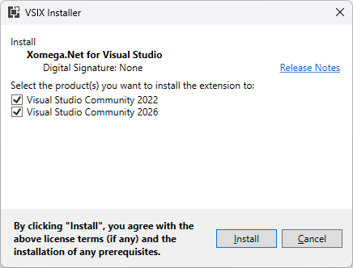
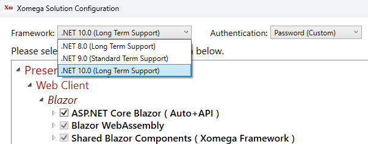
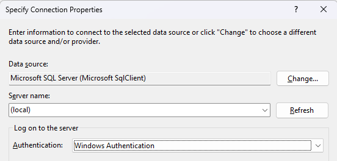
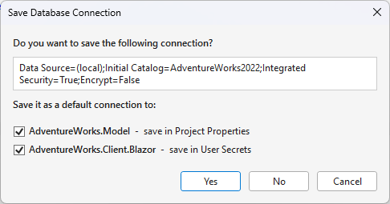
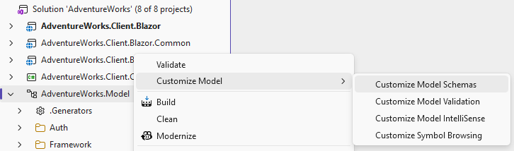
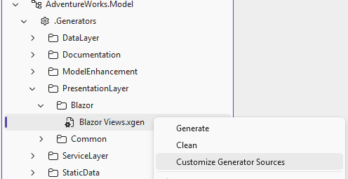
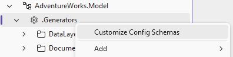
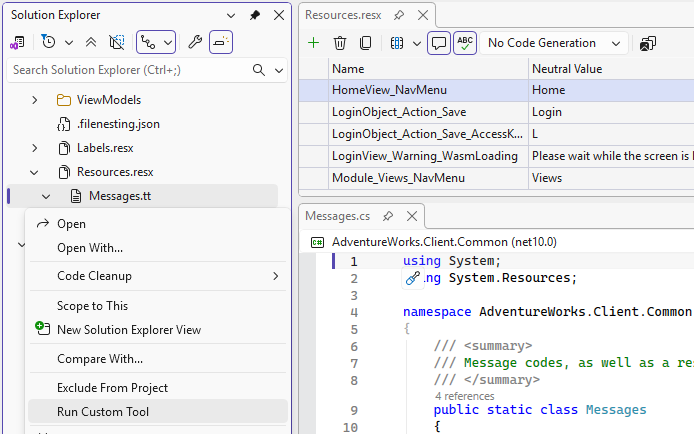
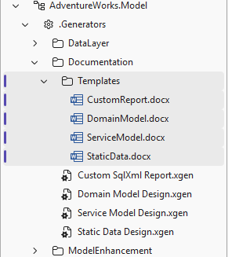

# Xomega 10.0 for VS 2026

We are happy to announce **completely modernized Xomega.Net 10.0** for Visual Studio 2026! The new release provides enhanced developer experience and new capabilities including:


- Support for **Visual Studio 2026** and **.NET 10**.
- Simplified **VSIX-based** installation.
- Modernized **SDK-style model project**.
- Improved **generator configuration**.
- Intuitive and safe DB connection handling.
- **Model** structure **extensibility**.
- **Generator** source code **customization**.
- Other **quality-of-life improvements** for developers.

Here are the details of the new features and improvements that went into the new release...

<!-- truncate -->

## VS 2026 and .NET 10

Xomega 10.0 is now fully compatible with Visual Studio 2026 and .NET 10, allowing you to take advantage of the latest features in the IDE and runtime while building Xomega-based applications.

:::note
You can still install the new Xomega 10.0 version for **Visual Studio 2022**, but you will be limited to using .NET 9 or 8 for your projects, as .NET 10 is only supported in Visual Studio 2026.
:::

### VSIX installation

Installation of the Xomega.Net VS extension has been completely redesigned in version 10.0 to make installing, updating and uninstalling Xomega much simpler and more flexible.

Instead of the old MSI-based installer that was placing Xomega files directly into some system folders like GAC or common Visual Studio locations, the new version uses a standard VSIX extension package that neatly adds Xomega extension files to a single user-specific Visual Studio extensions folder.

This allows for installing, updating and uninstalling Xomega directly from the VS Extension Manager / Marketplace or from a VSIX file using the standard VSIX Installer dialog, where you can select the target VS instance(s) as shown in the screenshot below.



:::note
This also means that you will no longer see Xomega.Net in the list of installed programs in Windows Control Panel, so you'll have to use VS Extension Manager to manage the installation, update or removal of the Xomega extension.
:::

### .NET 10 support

In the new version 10.0, Xomega.Net fully supports the latest long-term support release of .NET, which is .NET 10, helping you take advantage of the newest features and performance improvements in the runtime. This will be the default target framework for new Xomega projects created in Visual Studio 2026 as illustrated in the screenshot below.



You still have the option to target earlier versions of .NET that are still supported, such as .NET 9 or .NET 8, but you should start targeting .NET 10 as soon as possible before support for the earlier versions is phased out and they reach end-of-life.

## SDK-style model project

Starting with version 10.0, Xomega model projects now use the modern SDK-style project format, which, together with moving generator configurations into separate files, makes the project file much smaller and cleaner, with minimal properties that you can edit directly in the project file without unloading the project in Visual Studio, as shown in the example below.

```xml title="AdventureWorks.Model.xomproj"
<!-- highlight-next-line -->
<Project Sdk="Xomega.Sdk/10.0.1">
  <PropertyGroup Label="Globals">
    <ProjectGuid>{1D5A5684-F773-4004-8137-EB6067765CE4}</ProjectGuid>
    <Name>AdventureWorks.Model</Name>
    <XomegaProjectType>Model</XomegaProjectType>
  </PropertyGroup>
  <PropertyGroup Label="Database">
    <Database>sqlsrv</Database>
    <DbVersion></DbVersion>
    <DbCase></DbCase>
  </PropertyGroup>
</Project>
```

The new SDK style of the Xomega model project also provides more flexibility in organizing and managing your model files and generator configuration files by supporting standard file-based operations such copying, renaming, moving and grouping files in folders, where the project system automatically reflects the file structure in the Solution Explorer.

### Xomega SDK updates

The `Sdk` attribute at the top of the project file specifies the version of the Xomega SDK for the project, which provides model schemas, model validation and intellisense support, generators and their config schemas, as well as build targets and properties.

Xomega SDK comes as a published NuGet package, which means that you can easily update to the latest version of the Xomega model structure and generators by simply updating the SDK version in your project file without having to install a new version of Xomega extension, as long as the new SDK version is compatible with the installed Xomega extension.

## Generator config files

As we have mentioned earlier, in the new Xomega 10.0 release generator configurations have been moved out of the `.xomproj` project file into separate `.xgen` files, which are now grouped in physical folders under the top-level `.Generators` folder in the project.

Coupled with the SDK-style project format, this allows you to manage generator configurations as first-class files in the project, taking advantage of Visual Studio's file management capabilities such as drag-and-drop to move files between folders, renaming files directly in Solution Explorer, etc.

As compared to the previous versions where verbose generator configuration sections were embedded directly in the project file and viewed or edited via property pages in Visual Studio, the new generator config files provide a powerful, yet easy to use XML structure that can be edited directly in the VS editor, as shown in the example below.

```xml title="Import from Database.xgen"
<XomGeneratorConfig xmlns="http://schemas.xomega.net/v10/xgen"
                    xmlns:dbi="http://schemas.xomega.net/v10/xgen/db-import">
  <!--
  Generates object model from your existing database schema.
  See https://xomega.net/docs/generators/model/import for more details.
  -->
  <Generator Xsl="Model/import_from_db.xsl"
<!-- highlight-next-line -->
             DbSchemaNeeded="true"/>

  <dbi:Output Path="Import/{Module/}{File}.xom"/>

  <dbi:NamingConventions
    KeepTableNames="true"
    KeepColumnNames="true"
    KeepConstraintNames="false"
    NamingCase="lower"
    NamingDelimiter="space"/>

</XomGeneratorConfig>
```

With plenty of space available in the config files, they can provide XML comments that describe the purpose and usage of the generator and its configuration options, as well as links to the relevant documentation, helping developers work with the generators more effectively and understand how to configure them properly.

Unlike relatively flat property pages, the XML structure for generator configs allows for nested elements and attributes that can better represent more complex configuration hierarchies. It can also allow large configuration values, such as lists or multi-line SQL queries.

### Config schemas

Generator configs use a number of XML schemas included in the Xomega SDK package, which define the structure, allowed elements and attributes, and data types for each generator's configuration.

These schemas provide validation, descriptions and IntelliSense support in Visual Studio, helping developers understand what elements and attributes are allowed in a given generator config file, what values are expected, and providing hover-over documentation directly in the XML editor.

The common generator configuration elements, such as `<Generator>`, are defined in a base schema using the default namespace, while configuration that is specific to a certain class of generators (typically based on the type of output they produce) is defined in separate schemas that use their own prefixed namespaces.

## DB connection handling

Previously, for generators that required a database connection, such as the "Import from Database", you had to configure the connection string in the generator properties first before running the generator, which was not very intuitive for first-time users.

If you saved the connection in the project settings, the "EF Domain Objects" generator would use it to create a `db.config` file that was copied to the startup projects on build, so that your app could connect to the database you specified. This obscure process has been simplified and made much more transparent in the new release, as you'll see below.

### Connection dialog

In the new release, you don't need to pre-configure the connection string in the generator properties before running the generator. Instead, when you run a generator that requires a database connection, e.g. when the `DbSchemaNeeded` attribute is set to `true`, the generator will automatically prompt you with a connection dialog where you can enter the connection details as shown below.



:::note
The list of data sources shown in the connection dialog has been updated to be limited to `Microsoft.SqlClient` for SQL Server and `Npgsql` for PostgreSQL. Old Windows-specific data sources, such as ODBC and OleDB, have been removed.
:::

### Saving DB connection

Once you enter the connection details in the dialog, the system will prompt you to save the connection as the default for the model project, as well as to set it as the connection that is used for running the application in the startup projects of your solution, as illustrated in the screenshot below.



If you save the connection as the default for the model project, it will be stored encrypted in the project's user settings, and the subsequent runs of generators that require a database connection will automatically use it without prompting you again. You can always change or reset the saved connection in the model project's Properties tab.

For modern .NET startup projects, the system will now save the specified connection string in the corresponding User Secrets, so that the application can retrieve it at runtime without a risk of exposing the connection string in source control or configuration files.

:::note
For legacy .NET startup projects that do not support user secrets, such as Web Forms or WCF applications, the connection string will still be saved in the `db.config` file under the startup project, and you will need to ensure that this file is not checked into source control.
:::

## Customization support

Xomega.Net 10.0 introduces enhanced support for extending and customizing both the model and generator behavior, allowing you to tailor the generated code to better fit your application's needs.

:::note
Customization support is enabled for the Full Xomega licenses, and some limited customization is available for Full Evaluation licenses.
:::

### Model customization

Model customization allows you to *extend Xomega model schemas* using predefined extension points in the schema definitions, so that you can add new custom elements, attributes, or metadata within your custom namespaces, similar to existing Xomega extension namespaces prefixed with `ui:`, `xfk:` etc.

In the Xomega schemas, you can also configure which elements should be collapsed or expanded when the user selects the *Collapse to Definitions* context menu in the Xomega model editor.

While schemas provide basic validation for the structure and content of the model definitions, customization allows you to *extend model validation* and add additional rules or constraints for your model elements beyond what the schemas enforce.

Similarly, while schemas can specify some fixed allowed values for certain attributes, customization allows you to implement more complex *IntelliSense* support that can dynamically supply values and descriptions for attributes based on the current context, as well as perform *Go To Definition* navigation for custom elements and attributes directly from the model editor.

Finally, you can add display of your custom model elements in the *Object Browser* by updating Xomega's symbol browsing logic.

To add any of these model customizations in the new Xomega release, you can right-click on the model project in the Solution Explorer, select the *Customize Model* menu, and then pick the appropriate menu option as shown in the screenshot below.



This will add the corresponding schemas or XSL stylesheets to your model project, so that you can then modify them to implement your customizations, and will configure the project to use the customized schemas or stylesheets instead of the default ones.

### Generator customization

To customize the code generated by Xomega generators, you can either modify the XSL stylesheets for the existing generators or add new XSL stylesheets for additional generators that you want to create. Custom generators can leverage any new custom model elements or attributes that you add during model customization, as described in the previous section.

To customize the code for any particular generator, right-click on that generator's configuration file in the model project and select the *Customize Generator Sources* menu option as follows.



This will add the XSL stylesheets used by that generator to your model project, so that you can then modify them to implement your custom code generation logic, and will configure the generator to use the customized stylesheets instead of the default ones.

If you delete any of the customized XSL stylesheets from your model project, the corresponding stylesheet supplied by Xomega SDK will be used instead, but you will lose the ability to view its source if you need it for your customizations or debugging purposes. However, you can always restore the original XSL stylesheet from the SDK by using the *Customize Generator Sources* menu option again.

To add a new generator, you can add a new XSL transformation stylesheet that may import existing generator stylesheets as needed to reuse common templates or logic, and then add a new generator configuration file to your model project that references that stylesheet.

The new stylesheet, or the customized existing stylesheet, may require additional configuration settings in the generator configuration file that are not defined in the default configuration schemas.

To provide support for such custom settings along with their descriptions and allowed values, you can customize the generator configuration schemas by right-clicking on the top-level *.Generators* node in the model project and selecting the *Customize Config Schemas* menu option as shown below.



This will add all of the generator configuration schemas to your model project, so that you can then add new configuration schemas with your custom namespace for your new generator settings. Xomega will use the schemas from your model project when validating generator configuration files.

### Schema validation config

Xomega 10.0 introduces an easy way to configure the severity of schema validation errors for different namespaces directly in the model project file. This allows you to specify whether validation issues for particular namespaces should be treated as warnings, errors, or ignored entirely, giving you finer control over how strict schema validation should be for different parts of your model.

For example, if you extend the Xomega model with custom schemas and namespaces, you can specify that validation issues for your custom namespace should only be treated as warnings, while validation issues for the default Xomega namespaces should continue to be treated as errors.

You can configure this in your model project file by adding a `ModelSchemaValidationSeverity` property, where you specify the namespace regex patterns as keys and the desired severity (`warning`, `error`, or `none`) as values, as illustrated in the example below.

```xml title="AdventureWorks.Model.xomproj"
<Project Sdk="Xomega.Sdk/10.0.1">
  <PropertyGroup Label="Globals">
    <ProjectGuid>{1D5A5684-F773-4004-8137-EB6067765CE4}</ProjectGuid>
    <Name>AdventureWorks.Model</Name>
    <XomegaProjectType>Model</XomegaProjectType>
<!-- added-lines-start -->
    <ModelSchemaValidationSeverity>
      http://www.xomega.net/svc = warning;
      http://www.xomega.net/.* = error;
    </ModelSchemaValidationSeverity>
<!-- added-lines-end -->
  </PropertyGroup>
</Project>
```

Xomega will apply the specified rules in the order they are listed in the property, matching the namespace patterns against the namespaces of the elements being validated. Therefore, you want to list the more specific namespace patterns first, followed by the more general default patterns.

:::note
This severity configuration applies only to schema validation performed during the model build that runs Xomega generators, and allows you to suppress certain schema validation errors to enable running the generators. The Xomega model editor may still show those validation issues as errors in VS, but they will not prevent the generators from running when building the model.
:::

## Other notable changes

In addition to the major new features described above, Xomega 10.0 also includes several other quality-of-life improvements and enhancements that make working with Xomega models and generators more convenient and efficient.

### Flexible model structure

Previously, Xomega model structure required many unrelated elements under the same parent element, such as `types`, `enums`, `objects`, etc. under the root `module` element, to always go in a certain order in the model. For example, adding `enums` before the `types` element would result in a schema validation error, as shown below.

```xml
<module>  
  <enums>[...]
  <!--
   This causes a schema validation error, since 'enums' must go after 'types'.
   Also, the 'types' element won't appear in IntelliSense at this point.
   -->
  <types>[...]
</module>
```

While using **consistent ordering of elements in the model is still the best practice** for readability and maintainability that also helps minimize merge conflicts in team environments, the strict rules enforced by the schema could make it confusing or cumbersome for new users when working on the model, or even for AI agents that are trying to generate or manipulate the model programmatically.

Therefore, Xomega 10.0 relaxes these ordering restrictions in the schema so that elements under the same parent can go in any order, making it easier to work with the model. Developers are still encouraged to maintain a consistent ordering of elements, but it won't be dictated by the schema anymore.

### Message constants auto-generated

When developing localizable applications, Xomega allows you to [generate message constants](../../framework/services/errors#message-constants-generator) from the resource files, which you can then use in the error messages to display localized text to the user.

Previously, to regenerate the message constants after updating the resource files, you had to manually right-click on the `Messages.tt` file nested under the resource file in Solution Explorer and select *Run Custom Tool* to trigger the T4 template that generates the constants, as shown in the screenshot below.



In the new release, Xomega 10.0 **automatically triggers the regeneration** of the message constants whenever the resource files are updated, so you no longer need to manually run the custom tool on the `Messages.tt` file.

:::note
When you edit the resource files for the first time after opening the solution, regeneration of the message constants may take a few seconds to complete as VS initializes the T4 engine and runs the template for the first time.
:::

### Word docx templates in model project

Xomega provides the ability to generate MS Word documentation directly from the model using simple but powerful `.docx` templates, where you can use content controls to specify what data from the model should be inserted into the document and how it should be displayed.

By default, Xomega includes templates and generators for creating Word documentation for the [Domain Model Design](../../generators/docs/domain-model), [Service Model Design](../../generators/docs/service-model), and [Static Data Design](../../generators/docs/static-data), as well as a sample generator and template for generating a word [document report from SQL](../../generators/docs/sqlxml) database data.

Developers are supposed to customize these documentation templates for their specific project needs, but those templates where previously located in the common Xomega installation folder, which didn't provide a good developer experience for editing and versioning them as part of the project.

In the new release, these templates are now copied into the model project under the `.Generators/Documentation/Templates` folder, so you can edit and version them directly as part of your project, as shown in the screenshot below.



Note that when configuring a documentation generator in your `.xgen` configuration file to use a template from your model project, you should reference the template using the path relative to the project folder, and not relative to the folder containing the `.xgen` file itself, as follows.

```xml title="Domain Model Design.xgen"
<XomGeneratorConfig xmlns="http://schemas.xomega.net/v10/xgen"
                    xmlns:doc="http://schemas.xomega.net/v10/xgen/docx">

  <Generator Xsl="Docs/docx_model.xsl"/>
  
  <doc:Output Path="../Docs/DomainModelDesign.docx"/>
  
<!-- highlight-next-line -->
  <doc:Document Template=".Generators/Documentation/Templates/DomainModel.docx"
                Title="AdventureWorks Domain Model"
                Subject="Technical design for the AdventureWorks domain model"
                Creator="[User]"
                Company="[Company]"/>

</XomGeneratorConfig>
```

The new release also includes a better sample template for generating Word documents from database data using SQL that returns XML. By default, the sample generator prompts for the DB connection information and then creates a document that lists all tables in the database with their primary keys, columns and data types, and is available for both SQL Server and PostgreSQL.

### Minor changes and fixes

For other minor changes and bug fixes, please refer to the [release notes](/docs/platform/releases/vs2026#version-1001).

## Conclusion

The new release 10.0 provides a total modernization of the Xomega platform with the focus on improving the developer experience, extensibility and customization capabilities, and support for the latest .NET and Visual Studio tooling.

These new features are largely driven by your feedback, so we would like to thank you for your continued support and suggestions.

Please [download the new version](https://xomega.net/product/download), and **let us know what you think** about these new features in the [comments](https://github.com/orgs/Xomega-Net/discussions/25). You can also [contact us directly](https://xomega.net/about/contactus) with any questions or suggestions.

