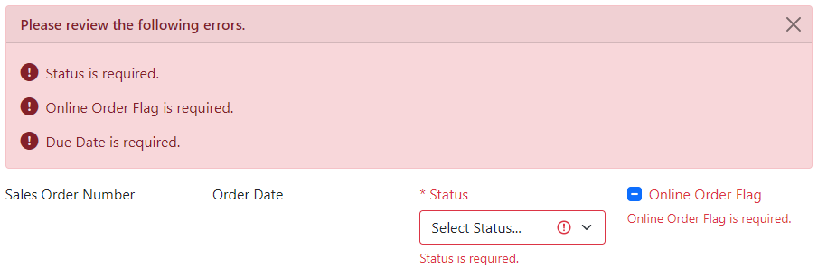
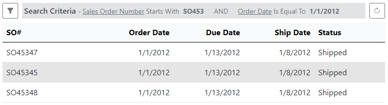
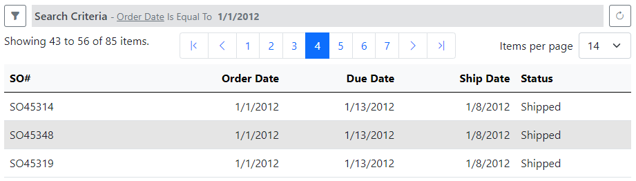
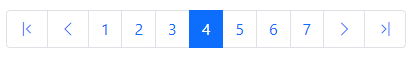

# Blazor View Components

import Tabs from '@theme/Tabs';
import TabItem from '@theme/TabItem';

Xomega Framework provides a number of components that are dependent on or used by the framework's classes, which help you build your Blazor views and applications. Below you can find a list of such Blazor components.

## NavMenu

Xomega Framework provides a Bootstrap-styled, **security-enabled** `NavMenu` component with hierarchical grouping to let you navigate to [top-level views](views#top-level-views). Typically, you would use it within a layout component, where you can add the `NavMenu` menu component to your sidebar or top-level header for a dropdown menu, as described below.

<Tabs>
  <TabItem value="sidebar" label="Sidebar collapsible menu">

For using `NavMenu` in a sidebar, you need to set its `Items` parameter to the list of your top-level [menu items](#menuitem-class).

```razor title="MainLayout.razor"
<div class="sidebar bg-dark navbar-dark"
     style="width: @(sbWidth)px; margin-left: @(SidebarOpen ? 0 : -sbWidth)px; transition: margin 0.3s">
<!-- highlight-next-line -->
    <NavMenu Class="navbar-nav" Items="MainMenu.Items"/>
</div>
```

The menu will display as a hierarchical collapsible tree view, as shown below.


  </TabItem>
  <TabItem value="dropdown" label="Dropdown menu (start)">

When adding your `NavMenu` to the top-level header to be displayed as a dropdown menu, you need to set the `IsDropdown="true"` parameter. If you use a dark-themed header, you may also want to set the `dropdown-menu-dark` CSS class in the `DropdownClass` parameter as follows.

```razor title="MainLayout.razor"
<header class="navbar navbar-dark sticky-top bg-dark flex-md-nowrap p-0 shadow">
    <nav class="navbar-expand">
        <NavMenu Class="navbar-nav" Items="MainMenu.Items"
<!-- highlight-next-line -->
                 IsDropdown="true" DropdownClass="dropdown-menu-dark" />
    </nav>
</header>
```

The menu will display as a hierarchical dropdown menu with sub-menus opening up on hovering over the corresponding menu item, as shown below.


  </TabItem>
  <TabItem value="dropdown-end" label="Dropdown menu (end)">

When your `NavMenu` is at the end of your top header bar, you may want to make the dropdown menus open up to the left by setting the `dropdown-menu-end dropdown-submenu-left` additional styles in the `DropdownClass` parameter.

```razor title="MainLayout.razor"
<header class="navbar navbar-dark sticky-top bg-dark flex-md-nowrap p-0 shadow">
    <nav class="navbar-expand">
        <NavMenu Class="navbar-nav" Items="MainMenu.Items"
<!-- highlight-start -->
                 IsDropdown="true"
                 DropdownClass="dropdown-menu-dark dropdown-menu-end dropdown-submenu-left" />
<!-- highlight-end -->
    </nav>
</header>
```

In this case, the dropdown menus will be right-aligned, and the sub-menus will open to the left, as shown below.


  </TabItem>
</Tabs>

:::note
The `NavMenu` component is used recursively for any nested groupings within the navigation menu. 
:::

### MenuItem class

The navigation menu structure is defined using a list of hierarchical `MenuItem` objects, as illustrated below.

```cs
using Xomega.Framework.Blazor.Components;

public class MainMenu
{
    public static List<MenuItem> Items = new List<MenuItem>()
    {
        new MenuItem()
        {
/* highlight-start */
            ResourceKey = "HomeView_NavMenu",
            IconClass = "bi bi-house-door",
/* highlight-end */
            Href = "/"
        }
        new MenuItem()
        {
            ResourceKey = "Module_Sales_NavMenu",
            IconClass = "bi bi-columns",
/* highlight-next-line */
            Items = new List<MenuItem>()
            {
                new MenuItem()
                {
/* highlight-next-line */
                    Text = "Customer List",
                    IconClass = "bi bi-person-lines-fill",
/* highlight-next-line */
                    Href = "CustomerListView"
                },
                ...
            }
        }, ...
    };
}
```

For any `MenuItem` that opens a specific top-level view, you need to set the `Href` property to the relative path of that view's page. `NavMenu` will highlight the menu item for the currently open view. Alternatively, you can provide a list of child menu items in the `Items` property, and the current menu item will serve as a grouping item.

:::note
If you set **both** `Href` and `Items` properties for a grouping item, that item will be displayed as a **split-menu**. Clicking on the grouping item's text will open up the associated view, while clicking on the toggle next to it will expand/collapse the child items.
:::

To specify the localized text of the menu item, you can set the `ResourceKey` property for the corresponding resource. You can also set the `Text` property directly if you don't need localization. If you want to display an additional icon before the text, you can also set the `IconClass` property for that item.

### Menu security

The `NavMenu` component allows you to set up security for each menu item and will hide the menus that the user is not authorized to access. If the user doesn't have access to any items in a specific sub-menu, such as *Admin*, the `NavMenu` will also hide the corresponding grouping item to avoid showing an empty group.

To configure security for any individual menu item, you can either set its `Policy` property or assign an array of `Roles` that the current user should have to be able to access it. If the user's authorization changes in the app, such as after login/logout, the `NavMenu` will be **automatically updated** to reflect the new permissions.

:::tip
To remove security from a menu item, you need to set both the `Policy` and `Roles` properties to `null`. You can also set the `Policy` to an empty string to restrict it only to authorized users, regardless of their privileges.
:::

For example, let's say that you define a *Sales* policy in your app configuration as follows.

```cs title="Startup.cs"
services.AddAuthorization(o => {
/* highlight-next-line */
    o.AddPolicy("Sales", policy => policy.RequireAssertion(ctx =>
        ctx.User.IsEmployee() || ctx.User.IsIndividualCustomer() || ctx.User.IsStoreContact()));
});
```

To apply it to your menu items, you can either assign it directly on each item using the `Policy` property or call a recursive function `ForEachItem` on each top-level item, where you can configure your security based on the `Href` value, as illustrated below.

```cs
foreach (var mi in MainMenu.Items)
/* highlight-next-line */
    mi.ForEachItem(SecureMenu);
...
private void SecureMenu(MenuItem mi)
{
    if (mi?.Href == null) return;
    if (mi.Href.StartsWith("Sales") || mi.Href.StartsWith("Customer"))
/* highlight-start */
        mi.Policy = "Sales";
    else mi.Policy = ""; // visible for all authorized users
/* highlight-end */
}
```

:::warning
**Securing the navigation menu is not enough** for client-side security since the user can manually enter the URL for any particular page or pull it up using a bookmark. You also need to secure specific pages using the same policy or roles in the page's `Authorize` attribute, as follows.
```razor
@attribute [Authorize(Policy = "Sales")]
```
:::

## ViewTitle

The `ViewTitle` component allows you to display the current value of your [view model's title](../common-ui/vm/view-models#view-title) as part of your view header. In addition to static text, the title of your view may include dynamic information, such as the key value(s), and a trailing asterisk indicating that the view has been modified, as illustrated below.


To ensure that the **title gets updated automatically** by the base view, you need to assign your `ViewTitle` to the inherited `TitleComponent` property and set the `Title` parameter to the view model's `ViewTitle` property as follows.

```razor
<div class="modal-header">
  <h5 class="modal-title">
<!-- highlight-next-line -->
    <ViewTitle @ref="TitleComponent" Title="@Model?.ViewTitle"></ViewTitle>
  </h5>
  <XActionButton Class="btn-close" NoText="true" OnClick="OnCloseAsync"
                 Action="@VM?.CloseAction"></XActionButton>
</div>
```

:::tip
The `ViewTitle` component doesn't offer any customization, but you can wrap it in other elements to style it, such as the `h5` element in the above example. You can also include it with other data elements in the header, such as the title of the parent view. Finally, you can develop your own component inherited from the `ViewTitle`, e.g., a breadcrumb, and use it instead of this one.
:::

## TabSet

The `TabSet` component allows you to group some elements of your view into Bootstrap-styled tabs, as shown below.


For each tab in your `TabSet` you need to add a `TabPage` child component, set its `Title` parameter, and nest the tab's content within that `TabPage`, as follows.

```razor
<!-- highlight-start -->
<TabSet>
  <TabPage Title="@VM?.MainObj?.GetChildTitle(SalesOrderObject.Customer)">
<!-- highlight-end -->
    <div class="row pt-3">
      <fieldset class="@GetPanelCol(2, 2)">
        <legend>@VM?.MainObj?.CustomerObject?.GetTitle()</legend>
        <div class="row @GetRowCol(2)">
          <XDataLabel Class="mb-3" Property="@VM?.MainObj?.CustomerObject?.StoreNameProperty"></XDataLabel>
          ...
        </div>
      </fieldset>
      ...
    </div>
  </TabPage>
  <TabPage Title="@VM?.MainObj?.GetChildTitle(SalesOrderObject.Detail)">[...]
  <TabPage Title="@VM?.MainObj?.GetChildTitle(SalesOrderObject.Payment)">[...]
  <TabPage Title="@VM?.MainObj?.GetChildTitle(SalesOrderObject.Sales)">[...]
</TabSet>
```

### Localizing the tabs' texts

For localized titles of the tabs, data objects provide a utility method `GetChildTitle` that reads the localized title using a resource key formatted as `{object class}-{child name}_Title`. The resources for the titles in the above example would look as follows.

|Name|Value|Comment|
|-|-|-|
|SalesOrderObject-Customer_Title|Customer||
|SalesOrderObject-Detail_Title|Detail||
|SalesOrderObject-Payment_Title|Payment||
|SalesOrderObject-Sales_Title|Sales||

## Errors

The `Errors` component is bound to the `ErrorList` for the [view model's errors](../common-ui/vm/view-models#error-list) that were reported during the last operation. This includes validation errors for individual fields, cross-field validation errors, or any error messages received from the business services.

While individual data controls will also show their client validation error(s), those controls may be in different tabs, and not currently showing on the screen. Therefore, it's important to show the summary of all the errors in a place that's always visible, such as at the top of the view. Below is a sample picture illustrating the `Errors` component.



The color of the control will be based on the maximum severity of the messages in the current error list. So, if it contains only warnings or only info messages, then the color will be yellow or light blue respectively, as per the Bootstrap styles. The icon next to each text will be based on the actual severity of that message though.

:::note
If you noticed, the text of the validation errors includes the field label, rather than a generic message, such as *This field is required.* This allows displaying those errors in the summary `Errors` control, and point the user to the specific field in error.
:::

To add the `Errors` component to your view, put it at the top of the view or in any other place that is always visible, and set the `ErrorList` parameter to the `@Model?.Errors` value, as follows.

```razor
<div class="modal-body">
  <div class="row g-0">
<!-- highlight-next-line -->
    <Errors Class="mb-3" ErrorList="@Model?.Errors" ViewKey="@Model?.GetResourceKey()"></Errors>
    <fieldset class="@GetPanelCol(1, 4)">
      <div class="row @GetRowCol(4)">
        <XDataLabel Class="mb-3" Property="@VM?.MainObj?.SalesOrderNumberProperty"></XDataLabel>
        <XDataLabel Class="mb-3" Property="@VM?.MainObj?.OrderDateProperty"></XDataLabel>
        <XSelect Class="mb-3" Property="@VM?.MainObj?.StatusProperty"></XSelect>
        <XCheckBox Class="mb-3" Property="@VM?.MainObj?.OnlineOrderFlagProperty"></XCheckBox>
        ...
</div>
```

The `Errors` component has a *Close* button, which will clear all the message in the error list, thereby closing the error summary.

### Localizing the errors title

The title text displayed at the top of the error summary comes from the framework's resources using the following keys based on the highest severity of the messages and whether there is a single or multiple messages.

|Name|Value|Comment|
|-|-|-|
|View_Error|Please review the following error.||
|View_Errors|Please review the following errors.||
|View_Warning|Please review the following warning.||
|View_Warnings|Please review the following warnings.||
|View_Message|Please review the following message.||
|View_Messages|Please review the following messages.||

You can customize these strings in your application resources or localize it for different languages. You can also define custom resources for your specific view by setting the resource prefix in the `ViewKey` parameter. For example, if you set it to `@Model?.GetResourceKey()` from the example above, you'll be able to override the title text for your view as follows.

|Name|Value|Comment|
|-|-|-|
|SalesOrderView_Error|Cannot save sales order due to the following error.||
|SalesOrderView_Errors|Cannot save sales order due to the following errors.||


## Panel

The `Panel` component represents a simple Bootstrap card with a title and a *Close* button that allows closing the panel, as shown below.


You can set the title text via the `Title` parameter and also bind the `Collapsed` parameter to your own boolean property, which will allow you to control the open/close state of your panel from your code. The following example shows how you can bind those parameters of the search criteria panel to the base properties of the [`BlazorSearchView`](views#search-views).

```razor
<!-- highlight-next-line -->
<Panel Class="me-3" Title="@CriteriaText" @bind-Collapsed="CriteriaCollapsed">
  <div>
    <XActionButton Action="VM?.List?.ResetAction" OnClick="OnResetAsync"></XActionButton>
    <XActionButton Action="VM?.List?.SearchAction" OnClick="OnSearchAsync" IsPrimary="true"
                   Class="float-end"></XActionButton>
  </div>
  ...
</Panel>
```

## CriteriaBar

`CriteriaBar` is a specialized component that shows the summary of the [currently applied criteria](../common-ui/data-lists#applied-criteria) in your search views. It also provides a button to open up the collapsed criteria panel and a button to refresh the data in the results grid by rerunning the current criteria. You would typically place it right above the results grid, as shown below.



You can bind parameters of the `CriteriaBar` directly to the corresponding methods and properties provided by the `BlazorSearchView` base class as follows.

```razor
<!-- highlight-start -->
<CriteriaBar Title="@CriteriaText" @bind-CriteriaCollapsed="@CriteriaCollapsed"
             AppliedCriteria="@ListObject?.AppliedCriteria"
             OnRefresh="@OnRefreshAsync"></CriteriaBar>
<!-- highlight-end -->
<XGrid List="@VM?.ListObj" @bind-CurrentPage="CurrentPage" AllowSelection="true">[...]
```

### Applied criteria

The actual summary of applied criteria in the `CriteriaBar` is rendered using a separate `Criteria` component. You can use it independently, if you don't want to use the `CriteriaBar` component and want to implement custom buttons for opening the criteria panel or refreshing the grid. All you need to do is to set the `AppliedCriteria` and `Title` parameters as follows.

```razor
<Criteria AppliedCriteria="@ListObject?.AppliedCriteria" Title="@CriteriaText" />
```

The localized text for the title comes from the resources using the key `View_Criteria`. You can also customize it for a specific view by prefixing it with the view model's resource key, as follows.

|Name|Value|Comment|
|-|-|-|
|View_Criteria|Search Criteria||
|SalesOrderView_Criteria|Sales Order Criteria||

By default, the field names in the applied criteria are highlighted with underline, while the values use bold font, as shown below. 

```css
/* criteria summary styles */
.cs-field {
  text-decoration: underline
}

.cs-value {
  font-weight: 700
}
```

You can customize this behavior by configuring the corresponding CSS classes, such as `cs-field`, `cs-operator`, `cs-value`, etc.

## Pager

The `Pager` component is used as part of the `XGrid` to display the [grid page navigation](grid#paging) at the bottom. However, you can also use it to add paging to other list controls, or to add (another) pager at the top of `XGrid`, as shown below.



All you need is to set the `ItemsCount` on the pager and bind the `CurrentPage` and `CurrentPageSize` parameters to your properties.

```razor
<CriteriaBar Title="@CriteriaText" @bind-CriteriaCollapsed="@CriteriaCollapsed"
             AppliedCriteria="@ListObject?.AppliedCriteria"
             OnRefresh="@OnRefreshAsync"></CriteriaBar>
<div class="mb-2">
<!-- highlight-start -->
    <Pager ItemsCount="@VM.List.RowCount" ResourceKey="@Model?.GetResourceKey()"
           @bind-CurrentPage="CurrentPage" @bind-PageSize="CurrentPageSize"/>
<!-- highlight-end -->
</div>
<XGrid List="@VM?.ListObj" ResourceKey="@Model?.GetResourceKey()"
       @bind-CurrentPage="CurrentPage" @bind-PageSize="CurrentPageSize"
       AllowSelection="true">[...]
```

:::tip
If you want to use a different pagination style, you can create a custom component and inherit it from the `Pager` component to reuse the pagination logic.
:::

### Customizing page sizes

The user can change the number of rows to display on each page using a dropdown list with the page sizes at the bottom right. By default, the list of page sizes is set to the following values: 7, 14, 25, 50, and 100. You can explicitly set the `CurrentPageSize` to indicate the initial page size to use. Otherwise, when available, the grid will default to the second option (e.g., 14).

You can customize the list of page sizes from which the user can select by setting the `PageSizes` attribute to an array of integers, as illustrated below.

```razor
<Pager List="@VM.List.RowCount" @bind-CurrentPage="CurrentPage" @bind-PageSize="CurrentPageSize"
<!-- highlight-next-line -->
       PageSizes="new [] { 10, 25, 50, 100}"/>
```

The above example will result in the following selection of page sizes, with the initial page size being set to 10 (first option).


### Customizing page navigation

The pager shows a navigation panel at the bottom center of the grid to allow the user to switch from one page to another in the grid. That panel will enable you to jump to the first or the last pages, turn to the next or previous pages, or pick some pages around the current page, as shown below.



The number of pages around the current page you can jump to is determined by the `PagesToShow` parameter, which is defaulted to 7. If you want to show more pages, or if your pager doesn't have enough space and you want to show fewer pages, then you can customize this parameter in your pager as follows.

```razor
<Pager List="@VM.List.RowCount" @bind-CurrentPage="CurrentPage" @bind-PageSize="CurrentPageSize"
<!-- highlight-start -->
       PagesToShow="5"/>
<!-- highlight-end -->
```

:::tip
You may want to **pick an odd number** for the `PagesToShow` value so that the current page would be in the middle when there are more pages to the left and the right.
:::

### Localizing pager texts

The strings that the `Pager` component uses to display on the screen or as a tooltip of the navigation buttons are retrieved from the current resources using the following keys.

|Name|Value|Comment|
|-|-|-|
|Pager_First|First Page||
|Pager_Last|Last Page||
|Pager_Next|Next Page||
|Pager_Prev|Previous Page||
|Pager_PageSize|Items per page||
|Pager_Summary|Showing {0} to {1} of {2} items.|{0}=Lower range boundary, {1}=Upper range boundary, {2}=Total number of items|

You can create localized resources for these texts that are translated into the desired language(s). Also, if you would like to change the wording for these default resources, e.g. say *rows* instead of *items*, then you can redefine them in a new resource file using [hierarchical resources](../services/errors#hierarchical-resourcesresources).

If you want to override these labels for a specific grid or view, then you can set the `ResourceKey` parameter on the pager. For example, the following code sets the `ResourceKey` parameter to the base name of the view model's class (*SalesOrderList*).

```razor title="SalesOrderListView.razor"
<Pager List="@VM.List.RowCount" @bind-CurrentPage="CurrentPage" @bind-PageSize="CurrentPageSize"
<!-- highlight-next-line -->
       ResourceKey="@Model?.GetResourceKey()"/>
```

This will allow you to set the text of the labels specifically for that view, saying *orders* instead of *items*, as follows.

|Name|Value|Comment|
|-|-|-|
|SalesOrderListPager_PageSize|Orders per page||
|SalesOrderListPager_Summary|Showing {0} to {1} of {2} orders.|{0}=Lower range boundary, {1}=Upper range boundary, {2}=Total number of items|
