# Blazor Data Controls

import Tabs from '@theme/Tabs';
import TabItem from '@theme/TabItem';

Blazor UI data controls are Bootstrap-styled components that are designed to be bound to a [data property](../common-ui/properties/base) of your view model's data object by setting the `Property` parameter, e.g., `Property="@VM.MainObj.StatusProperty"`. The data controls reflect the current value(s) of the data properties and keep their visibility and editability states in sync with those of the data property.

Most data controls include a label placed at the top of the control to allow for easy support of RTL (right-to-left) cultures, where the label would be right-aligned. The label text comes from the [localized property label](../common-ui/properties/base#property-label) and may include a localized access key to provide quick access to it via the keyboard, as illustrated below.

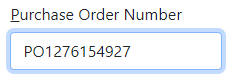

The labels of editable data controls bound to a required property will show a red asterisk in front, but you can customize it by redefining its CSS style `form-label`. An editable data control will set the user-entered or selected value(s) directly on the data property. If the value is invalid, it will show the [validation errors from the property](../common-ui/properties/base#property-validation) below the control and will set the `is-invalid` CSS class that will highlight it in red as follows.

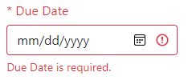

Selection controls that bind to an instance of the [`EnumProperty`](../common-ui/properties/enum), such as [`XSelect`](#xselect), will use the [property's list of possible values](../common-ui/properties/enum#value-selection-list) to show a list of selection options, as shown below.

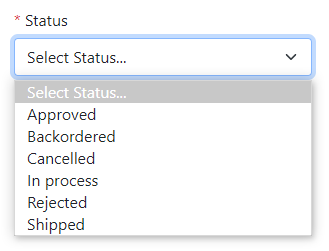

Making a data property not visible or restricted based on security permissions will hide the bound data control along with its label and any validation errors.

## Base components

Xomega Framework defines several base classes that all data controls inherit from, which makes it rather easy to define any custom property-bound data controls.

### XComponent

`XComponent` is the base class for all data controls, which implements the common property binding behavior and defines a number of useful methods and accessors that can be used by the subclassed controls, as well as some common input parameters for data controls, as listed below.
- `Property` - the data property the component is bound to.
- `Class` - the top-level class to use for the component, usually defining its layout in the parent container.
- `ShowLabel` - whether or not to show the component label.
- `Placeholder` - custom placeholder for the component.
- `AccessKey` - explicit access key to use for the component. If not set, the localized access key for the property will be used.
- `AdditionalAttributes` - any additional unmatched attributes with their values to be specified on the component.

:::note
Not all of these parameters are necessarily used by all data controls. Plus, data controls can define their own additional parameters as needed.
:::

The base component also defines the following cascading parameters that get set based on where the data control is used.
- `Row` - the row in a data list object that the component is bound to when used in a list or a data grid. It gets passed to all methods of the data property as an extra [`DataRow`](../common-ui/data-lists#row-collection) parameter.
- `EditContext` - Blazor edit context associated with the current component. Usually, it's not required since this functionality is implemented by the underlying data object. When set, though, the data control will notify it about changes in the field values or validation state.

### XOptionsComponent

The `XOptionsComponent` is a base component for various selection controls that are bound to an [`EnumProperty`](../common-ui/properties/enum) and use its list of possible values to display a selection list for the user. The base class reads the list of available items from the property both during the initialization and whenever that list changes based on the corresponding [property change event](../common-ui/properties/base#property-change-events).

It provides several useful methods and properties to access selected items or items to display, which depends on whether or not the property is editable. This helps to minimize the code for building the selection lists in the actual selection controls that inherit from this base class.

Normally, each item in the selection list is rendered using the [`ValueFormat.DisplayString`](../common-ui/properties/base#value-formats) for the data property. However, the base class provides support for specifying a custom `ItemDisplayTemplate`, which allows you to customize the way each item is displayed.

## Readonly controls

Xomega Framework includes the following data controls that show the bound data property value without allowing editing it.

### XDataText

The `XDataText` is the simplest data control that displays the value of its bound data property in the [display format](../common-ui/properties/base#value-formats) **without the property label**. You can use it to output the value of a data property as part of some text or in other places that don't require the property label, such as in a grid cell, as illustrated below.

```razor
<XGridColumn Property="@VM.MainObj.DetailList.ProductIdProperty">
  <Template>
    <a role="button" @onclick="async () => await LinkDetailDetails_ClickAsync(context)"
       class="btn-link @(DisabledIfNot(VM.LinkDetailDetails_Enabled(context)))">
<!-- highlight-next-line -->
      <XDataText Property="@VM.MainObj.DetailList.ProductIdProperty"></XDataText>
    </a>
  </Template>
</XGridColumn>
```

### XDataLabel

The `XDataLabel` control is used to display **read-only fields with a label on top**. The value is displayed in a read-only input element, which allows you to navigate to that field and copy the value via the keyboard either through tabbing or by using an access key configured for the label, as shown below.

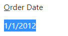

All you need for the `XDataLabel` is to bind it to your data property and optionally set the CSS `Class` as follows.

```razor
<XDataLabel Class="mb-3" Property="@VM.MainObj.OrderDateProperty"></XDataLabel>
```

## Standard controls

Xomega Framework defines a basic set of standard data controls, as described below.

### XCheckBox

The `XCheckBox` control is typically bound to a [`BooleanProperty`](../common-ui/properties/standard#booleanproperty) and provides a way to edit a single option with a dedicated label, as illustrated below.

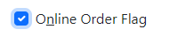

You just need to bind your `XCheckBox` to your data property and optionally set the CSS `Class` as follows.

```razor
<XCheckBox Class="mb-3" Property="@VM.MainObj.OnlineOrderFlagProperty"></XCheckBox>
```

#### Indeterminate state

If the value of the property [is null](../common-ui/properties/base#null-values), the checkbox will show an indeterminate state, as shown below.

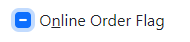

If your data property is marked as not required, meaning that the users should be able to set the `null` value, the bound `XCheckBox` control will cycle through three states and set the indeterminate state after you click on a checked checkbox.

:::warning
The label of a required checkbox will not show a red asterisk in front of it, but you can customize its CSS class if you want to highlight required (or optional) checkboxes in some way.
:::

### XInputText

The `XInputText` data control is used for editing data properties using the standard input element. You would typically bind it to a [`TextProperty`](../common-ui/properties/standard#textproperty) by setting the standard `Property` parameter as follows.

```razor
<XInputText Class="mb-3" Property="@VM.MainObj.PurchaseOrderNumberProperty"></XInputText>
```

Here is what it will look like.


:::note
The `XInputText` data control will update the bound data property on each keystroke and set the `Editing` flag to false when you leave the field, which will trigger the [property validation](../common-ui/properties/base#property-validation).
:::

If the property is [multi-valued](../common-ui/properties/base#multi-valued-properties), the users will be able to enter multiple values separated by a comma or any other of the `ParseListSeparators` configured for the property.

If the property is not multi-valued, the text field will automatically limit the text input to the `Size` of the property.

#### Specialized input types

You can set the additional `Type` parameter on the `XInputText` control for specialized input types, such as *email*. For example, the following is a configuration for a password field.

```razor
<XInputText Class="mb-3" Property="@VM.MainObj.PasswordProperty" Type="password"></XInputText>
```

This will mask the input characters, as shown below.

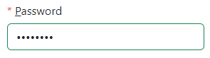

:::tip
For date/time editing, you should use an `XDatePicker` control instead of setting a `Type` on the `XInputText` component.
:::

### XDatePicker

The `XDatePicker` control is designed to be bound to a [`DateTimeProperty`](../common-ui/properties/standard#datetime-properties) using the standard `Property` parameter as follows.

```razor
<XDatePicker Class="mb-3" Property="@VM.MainObj.PaymentObject.DueDateProperty"></XDatePicker>
```

The `XDatePicker` control will render differently based on the specific type of data property it is bound to, as well as whether or not the property is multi-valued, as described under each tab below.

<Tabs>
  <TabItem value="date" label="DateProperty">

If the bound data property is an instance of a [`DateProperty`](../common-ui/properties/standard#dateproperty), the control will allow only a date selection.

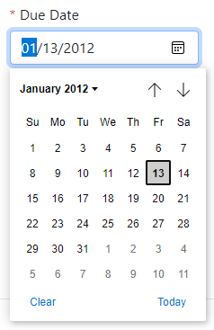

  </TabItem>
  <TabItem value="datetime" label="DateTimeProperty">

If the bound data property is a `DateTimeProperty` and not a `DateProperty`, the control will support both date and time selection.

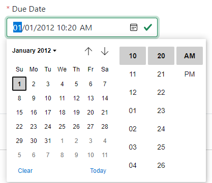

  </TabItem>
  <TabItem value="multi" label="Multi-valued">

If the data property is multi-valued (or is not a `DateTimeProperty`), then the control will render as a regular text box, where you will need to enter comma-separated dates and times in the proper format, as illustrated below.

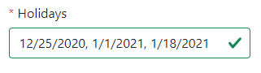

  </TabItem>
</Tabs>

:::tip
The `XDatePicker` also provides a `Type` parameter that allows you to override the input type of the HTML element.
:::

### XNumericBox

`XNumericBox` is a special control for editing [integer data properties](../common-ui/properties/standard#integer-properties) or [decimal data properties](../common-ui/properties/standard#decimal-properties) that you bind via the `Property` parameter.

```razor
<XNumericBox Class="mb-3" Property="@VM.MainObj.OrderQtyProperty"></XNumericBox>
```

It displays a text box with a numeric scroller, which allows you to increment or decrement the current value using a mouse or up/down arrow keys, as shown below.

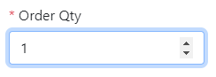

The value selection will be limited by the `MinimumValue` and `MaximumValue` parameters defined for the data property. You can control the increment step by setting the `Step` parameter on the control.

#### Range slider

For bounded ranges, you can also set the `Type` parameter to *range*, as follows.

```razor
<XNumericBox Class="mb-3" Property="@VM.MainObj.DiscountProperty" Type="range"></XNumericBox>
```

This will display the control as a range slider, as shown below.

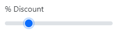

:::note
If your data property is multi-valued, the `XNumericBox` will always show a regular text input box where you can enter comma-separated values.
:::

## Selection controls

Selection controls extend the [`XOptionsComponent`](#xoptionscomponent) and are bound to an [`EnumProperty`](../common-ui/properties/enum), which allows them to display a list of items to select the value(s) from using the property's [`ItemsProvider`](../common-ui/properties/enum#value-selection-list).

### XAutoComplete

`XAutoComplete` control shows a text box that allows you to type a partial string and select the value from a dropdown list of matching items. If the bound property is multi-valued, you'll be able to enter multiple comma-separated values, and the control will adequately show the matching list for the current value under the cursor.

:::warning
By default, the selection items are rendered using the [value format](../common-ui/properties/base#value-formats) `DisplayString` and inserted into the text box using the `EditString` format, which uses the [`KeyFormat`](../common-ui/properties/enum#value-display) of the `EnumProperty`.
:::

For example, let's consider that we bind our `XAutoComplete` to a multi-valued data property for sales territories, as follows.

```razor
<XAutoComplete Class="mb-3" Property="@VM.MainObj.SalesObject.TerritoryProperty"></XAutoComplete>
```

Suppose we set the property's `KeyFormat` to `Header.FieldText` to make it show the entire text in the box. Then our `XAutoComplete` control will look as shown below.

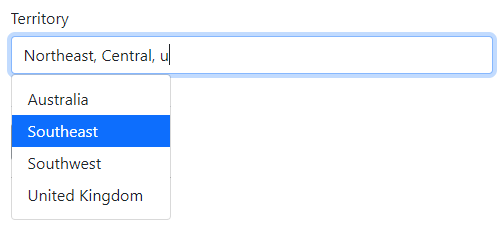

#### Custom item template

You can customize the way each selection item is displayed by configuring a custom `ItemDisplayTemplate` for the control.

For example, let's say that we want to show the country of each sales territory using the corresponding [flag icon](https://flagicons.lipis.dev/). You can add an `ItemDisplayTemplate` with a flag icon next to the name of the sales territory by using the `country region code` [additional attribute](../common-ui/lookup#additional-attributes) of each territory as follows.

```razor
<XAutoComplete Class="mb-3" Property="@VM.MainObj.SalesObject.TerritoryProperty">
<!-- highlight-start -->
    <ItemDisplayTemplate>
        <i class="fi fi-@((context as Header)?["country region code"]?.ToString()?.ToLower())"></i>
        @VM.MainObj.SalesObject.TerritoryProperty.ValueToString(context, ValueFormat.DisplayString)
    </ItemDisplayTemplate>
<!-- highlight-end -->
</XAutoComplete>
```

As a result, the control will show the flag of each sales territory's country, as illustrated below.

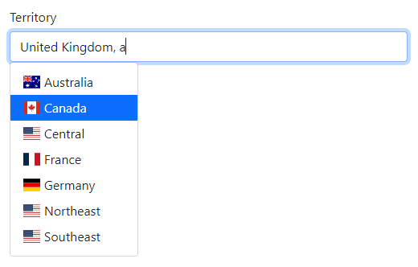

### XSelect

`XSelect` control uses a Bootstrap-styled `select` element to allow the selection of single or multiple values.

```razor
<XSelect Class="mb-3" Property="@VM.MainObj.StatusProperty"></XSelect>
```

The `XSelect` control may look different based on the configuration of the bound data property, as described below.

<Tabs>
  <TabItem value="dropdown" label="Single select (dropdown)">

For required data properties that are not multi-valued, the control will show a `Select [Label]...` prompt when the [value is null](../common-ui/properties/base#null-values), which will be removed as soon as you select any value.


  </TabItem>
  <TabItem value="optional" label="Non-required (blank option)">

For non-required data properties that are not multi-valued, the control will show an additional blank option, which allows you to blank out the value, as shown below.

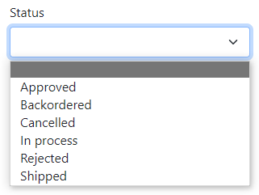

:::tip
If you want to show specific text instead of an empty string there, you can set the [`NullString`](../common-ui/properties/base#null-values) on the bound property to the desired text, e.g., `[Not set]`.
:::

  </TabItem>
  <TabItem value="listbox" label="Multi-valued (list box)">

When the bound data property is multi-valued, the `XSelect` control will show a multi-select list box, as shown below.

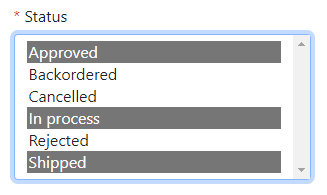

:::tip
You can control the number of visible rows in the list box by setting the `Rows` parameter on the control.
:::

  </TabItem>
</Tabs>


### XOptions

The `XOptions` control is best suited for binding to data properties that provide a small and limited set of options to select from, as follows.

```razor
<XOptions Class="mb-3" Property="@VM.MainObj.StatusProperty"></XOptions>
```

The control displays all options at once without any scrolling, which is why this list should be reasonably small. The options are displayed as radio buttons, check boxes, or switches depending on the property and control configuration, as described below.

<Tabs>
  <TabItem value="radio" label="Radio options">

When bound to a single-valued data property, the `XOptions` control will show a radio button group, as illustrated below.

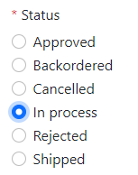

:::note
The name of the group will be based on the property name. If it conflicts with the name of another group, you can override it by setting the `Name` parameter directly on the control.
:::

  </TabItem>
  <TabItem value="blank" label="Blank option">

If your single-value data property is not required, and you want to allow the users to clear the selection, then you can set the [`NullString`](../common-ui/properties/base#null-values) parameter of the property to a non-empty value (e.g., `[Not set]`). This will add a new blank option to the selection, allowing the user to set the property to null, as shown below.

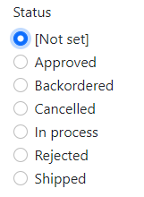

:::tip
If you don't want the control to add a blank option in such a case, you can explicitly set the `ShowBlankOption` parameter to `false`.
:::

  </TabItem>
  <TabItem value="check" label="Checkbox options">

If your bound data property is multi-valued, the `XOptions` control will be rendered as a group of checkboxes where you can select multiple values, as shown below.

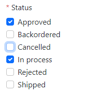

  </TabItem>
  <TabItem value="inline" label="Inline options">

By default, the selection options displayed are stacked vertically, as you can see from other examples. If you would like them displayed inline in one row, then you can specify the `Inline="true"` parameter. Depending on the number of options and the available horizontal space, the options may wrap in multiple rows, as illustrated below.

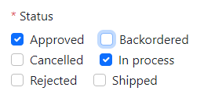

  </TabItem>
  <TabItem value="switch" label="Switch options">

You can also display your options as a group of switches by setting the `Switches="true"` parameter on the control, which will look as shown below.

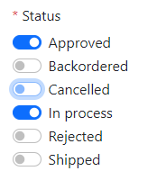

  </TabItem>
</Tabs>

### XPickList

`XPickList` is a more advanced control that allows selecting multiple values from a longer list of values. You can bind it to a multi-valued property by setting the standard `Property` parameter as follows.

```razor
<XPickList Class="mb-3" Property="@VM?.MainObj.SalesObject.SalesReasonProperty"></XPickList>
```

The `XPickList` control displays two lists of *Available* and _Selected_ items and control buttons that let you move highlighted or all items from one list to another, as illustrated below.

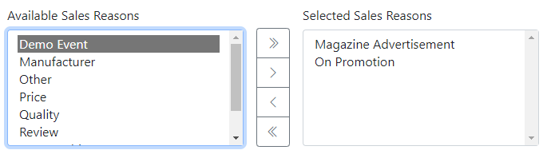

:::tip
You can control the number of visible rows in the list boxes by setting the `Rows` parameter on the control.
:::

#### Localizing pick-list texts

The strings that the `XPickList` component uses to display on the screen or as a tooltip of the buttons are retrieved from the current resources using the following keys.

|Name|Value|Comment|
|-|-|-|
|PickList_Available|Available {0}|{0}=Property name|
|PickList_Selected|Selected {0}|{0}=Property name|
|PickList_Add|Add Selected||
|PickList_AddAll|Add All|
|PickList_Remove|Remove Selected||
|PickList_RemoveAll|Remove All||

You can create localized resources for these texts that are translated into the desired language(s). Also, if you would like to change the wording for these default resources, then you can redefine them in a new resource file using [hierarchical resources](../services/errors#hierarchical-resourcesresources).

## Action controls

Action controls are bound to a special [`ActionProperty`](../common-ui/properties/action) in the view model or any of its data objects. This allows them to use the [action's localized text](../common-ui/properties/action#localized-action-text) as a label and maintain its [visibility](../common-ui/properties/action#control-action-visibility) or [enabled state](../common-ui/properties/action#manage-enabled-state) based on the state of the action property, including when the state of the action property is computed using specific visibility or enabling conditions.

:::warning
You still need to provide a callback function for the click handler, which is not part of the bound action property.
:::

Xomega Framework provides a base class `XActionComponent` for action controls to extend from, which defines the `OnClick` event handler and a set of common parameters for the control.

### XActionButton

The `XActionButton` control represents a Bootstrap-styled button that you can bind to an action property using the `Action` parameter as follows.

```razor
<XActionButton OnClick="OnCloseAsync"
<!-- highlight-next-line -->
               Action="@VM.CloseAction"></XActionButton>
```

<Tabs>
  <TabItem value="primary" label="Primary buttons">

For a primary action on the view, you can set the `IsPrimary="true"` parameter on the button as follows.

```razor
<XActionButton OnClick="OnSaveAsync" Action="@VM.MainObj.SaveAction"
<!-- highlight-next-line -->
               IsPrimary="true"></XActionButton>
```

The button will be displayed as shown below.

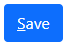

  </TabItem>
  <TabItem value="secondary" label="Secondary buttons">

Non-primary actions don't need any special parameters set on the button as follows.

```razor
<XActionButton OnClick="OnDeleteAsync" Action="@VM.MainObj.DeleteAction" Class="me-auto"></XActionButton>
```

This will render it as a secondary button, as shown below.

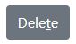

  </TabItem>
  <TabItem value="outline" label="Outline buttons">

For auxiliary actions, you can set the `Outline="true"` parameter on the button.

```razor
<XActionButton OnClick="async () => await LinkNew_ClickAsync()" Action="@VM.ListObj.NewAction"
<!-- highlight-next-line -->
               Outline="true"></XActionButton>
```

This will show them using only the button outline like this.

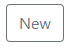

  </TabItem>
  <TabItem value="no text" label="No text buttons">

If you don't want the button to display the action's text but rather show an icon from the provided CSS class, then you can set the `NoText="true"` parameter.

For example, the *Close* button at the upper right corner of the view uses the `btn-close` class with no text, as follows.

```razor
<XActionButton OnClick="OnCloseAsync" Action="@VM.CloseAction" Class="btn-close"
<!-- highlight-next-line -->
               NoText="true"></XActionButton>
```

Here is how it will look on the screen.

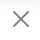

  </TabItem>
</Tabs>