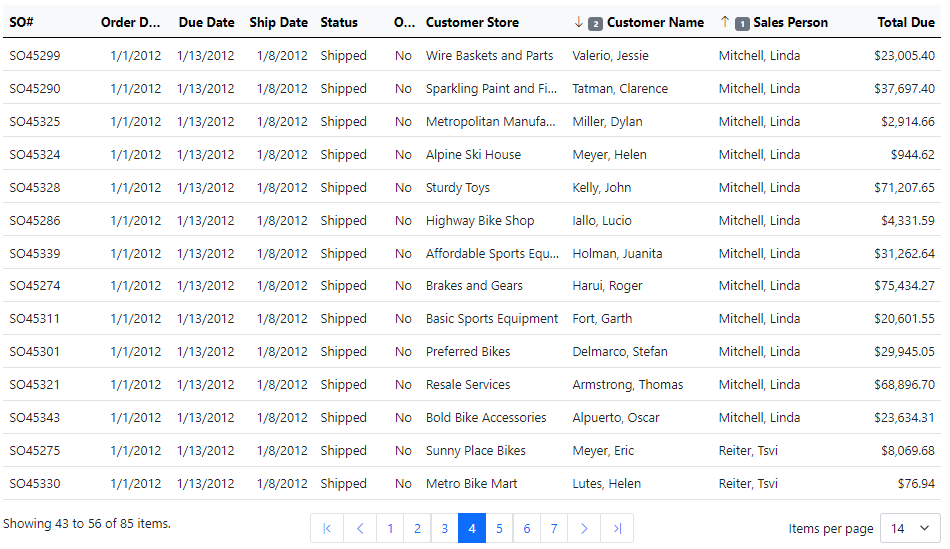
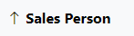
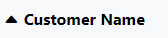
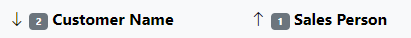
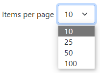
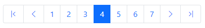

# Blazor Data Grid

import Tabs from '@theme/Tabs';
import TabItem from '@theme/TabItem';

Xomega Framework provides a simple, yet quite powerful, Blazor component `XGrid` for showing the data from your [`DataListObject`](../common-ui/data-lists) in a tabular Bootstrap-styled grid. It provides some basic features such as paging, multi-column sorting, row selection, and formatting of the values in each cell. 

The following picture illustrates the results grid for a *Sales Order List* view, as well as the Blazor markup that is used to configure it.

<Tabs>
  <TabItem value="pic" label="Sales Orders Grid" default>



  </TabItem>
  <TabItem value="markup" label="SalesOrderListView.razor" default>

```razor
<XGrid List="@VM?.ListObj" ResourceKey="@Model?.GetResourceKey()"
        @bind-CurrentPage="CurrentPage"
        AllowSelection="true"
        RowSelected="async (arg) => await LinkDetails_ClickAsync(arg)">
  <GridColumns>
    <XGridColumn Property="@VM?.ListObj?.SalesOrderNumberProperty" Width="10%"></XGridColumn>
    <XGridColumn Property="@VM?.ListObj?.OrderDateProperty" Width="8%"></XGridColumn>
    <XGridColumn Property="@VM?.ListObj?.DueDateProperty" Width="8%"></XGridColumn>
    <XGridColumn Property="@VM?.ListObj?.ShipDateProperty" Width="8%"></XGridColumn>
    <XGridColumn Property="@VM?.ListObj?.StatusProperty" Width="8%"></XGridColumn>
    <XGridColumn Property="@VM?.ListObj?.OnlineOrderFlagProperty" Width="40px"
                  TextAlign="Alignment.Center"></XGridColumn>
    <XGridColumn Property="@VM?.ListObj?.CustomerStoreProperty" Width="16%"></XGridColumn>
    <XGridColumn Property="@VM?.ListObj?.CustomerNameProperty" Width="16%"></XGridColumn>
    <XGridColumn Property="@VM?.ListObj?.SalesPersonIdProperty" Width="16%"></XGridColumn>
    <XGridColumn Property="@VM?.ListObj?.TotalDueProperty" Width="9%"></XGridColumn>
  </GridColumns>
</XGrid>
```

  </TabItem>
</Tabs>

:::caution
Currently, the basic `XGrid` component doesn't support resizing, hiding, or reordering columns, nor in-grid editing of the values. For those and other advanced features, please check the [Syncfusion Data Grid](syncfusion/grid).
:::

## Data binding

To bind an `XGrid` component to a `DataListObject`, you need to assign the `List` attribute to the corresponding data list object in your view model, which will set it as a data source for your grid. Next, for each grid column that is bound to a property of your data list object, you need to set that data property to the `Property` attribute on the `XGridColumn` element, as follows.

```razor
<!-- highlight-next-line -->
<XGrid List="@VM?.ListObj">
  <GridColumns>
<!-- highlight-next-line -->
    <XGridColumn Property="@VM?.ListObj?.SalesOrderNumberProperty"></XGridColumn>
    ...
  </GridColumns>
</XGrid>
```

When a grid column is bound to a data property, it will use it to configure the default header label, text alignment, and formatting for the data values. It will also use the visibility of the property to show or hide the column dynamically. All of this minimizes any additional configuration that you need for each column, which you can still customize as described below.

## Grid columns

Column configuration for the `XGrid` component is done within the nested `GridColumns` element. Most of the columns would be bound to a specific data property of your data list object, but you can also have columns that are not bound to a specific property.

For example, if your column needs to display a combination of the first and last name properties, then you can set it up with a custom template that will format the values from those properties.

:::tip
For such scenarios, we recommend adding a new [`ComboProperty`](../common-ui/properties/specialty#comboproperty) or a [computed property](../common-ui/properties/base#computed-properties) to your list object and binding it to your column. This will allow you to sort by this column, control its visibility from the data object, format it properly when both values are `null`, and minimize the column configuration in the UI layer.
:::

### Header text

By default, when your `XGridColumn` is bound to a data property, it will use the [localized label](../common-ui/properties/base#property-label) for that property as the header text for the column. If your column is not bound to a data property or you cannot use the property label as the header, you can specify custom text for the header in the `HeaderText` attribute, as follows.

```razor
<XGridColumn Property="@VM?.ListObj?.OnlineOrderFlagProperty"
<!-- highlight-next-line -->
             HeaderText="Online"></XGridColumn>
```

Note that the `HeaderText` value you specify will be used as is and not translated to the current language. If you need to localize that text, you can do it manually by injecting a `ResourceManager` and using it to resolve the label, as shown below.

```razor
<!-- highlight-next-line -->
@inject ResourceManager resMgr
...
<XGridColumn Property="@VM?.ListObj?.OnlineOrderFlagProperty"
<!-- highlight-next-line -->
             HeaderText="@resMgr.GetString("Online")"></XGridColumn>
```

### Column widths

`XGrid` is rendered as an HTML table, meaning that if you don't specify the widths of the columns, it will be determined automatically based on the current data in each column. You can explicitly set the width of each column in the `Width` attribute using either percentage or absolute width in pixels, as illustrated below.

```razor
<XGridColumn Property="@VM?.ListObj?.StatusProperty"
<!-- highlight-next-line -->
             Width="8%"></XGridColumn>
<XGridColumn Property="@VM?.ListObj?.OnlineOrderFlagProperty"
<!-- highlight-next-line -->
             Width="30px"></XGridColumn>
```

### Text alignment

When you don't set a specific alignment for the column data, and your column is bound to a data property, then it will use the default alignment (at the start of the cell) unless the property is one of the [integer properties](../common-ui/properties/standard#integer-properties), [decimal properties](../common-ui/properties/standard#decimal-properties) or [date/time properties](../common-ui/properties/standard#datetime-properties), which will use the alignment at the end of the cell.

You can always manually set the alignment by assigning the `TextAlign` parameter to a value of the `Alignment` enumeration from the `Xomega.Framework.Blazor.Components` namespace, as follows.

```razor
<XGridColumn Property="@VM?.ListObj?.OnlineOrderFlagProperty"
<!-- highlight-next-line -->
             TextAlign="Alignment.Center"></XGridColumn>
```

The `Alignment` enumeration contains one of the following values:
- `Start` - alignment at the start (left in LTR cultures).
- `Center` - alignment at the center.
- `End` - alignment at the end (right in LTR cultures).

### Wrapping

By default, the values in each cell do not wrap to a new line and get truncated with an ellipsis if the value is longer than the width of the column. You can customize this behavior for each column by setting the `AllowWrap` parameter to `true` as follows.

```razor
<XGridColumn Property="@VM?.ListObj?.CustomerStoreProperty"
<!-- highlight-next-line -->
             AllowWrap="true"></XGridColumn>
```

### Custom template

If you want to specify a custom display template for the value of any `XGridColumn`, then you can do it in the nested `Template` element. To display a value of any list object's data property in a certain format, you can call their `GetStringValue` method and pass a `context` parameter of type [`DataRow`](../common-ui/data-lists#row-collection) and the desired [`ValueFormat`](../common-ui/properties/base#value-formats), as follows.

```razor
<XGridColumn HeaderText="SO Id" Property="@VM.ListObj.SalesOrderIdProperty">
<!-- highlight-next-line -->
  <Template>@VM.ListObj.SalesOrderIdProperty.GetStringValue(ValueFormat.DisplayString, context)</Template>
</XGridColumn>
```

Alternatively, you can use a property-bound control, such as [`XDataText`](controls#xdatatext), in the custom template to display the value as follows.

```razor
<XGridColumn Property="@VM.MainObj.DetailList.ProductIdProperty">
<!-- highlight-start -->
  <Template>
    <a role="button" @onclick="async () => await LinkDetailDetails_ClickAsync(context)"
       class="btn-link @(DisabledIfNot(VM.LinkDetailDetails_Enabled(context)))">
      <XDataText Property="@VM.MainObj.DetailList.ProductIdProperty"></XDataText>
    </a>
  </Template>
<!-- highlight-end -->
</XGridColumn>
```

## Sorting

The `XGrid` component and its `XGridColumn` columns use the bound `DataListObject` to store the currently applied sort criteria and perform [sorting of data list rows](../common-ui/data-lists#sorting-rows), which uses data properties of the data list object. Therefore, to allow sorting by a specific column, it needs to be bound to a data property using the `Property` parameter.

:::caution
The column tries to sort the values using their internal format when the value type implements `IComparable`, which may result in a different sort order than the one from using a display format.

This may also be the case if you use a [custom template](#custom-template) to display the column values.
:::

### Sorting by a single column

If you want to sort your `XGrid` by a single column that allows sorting, then you can just click on the header of that column. If the grid is not currently sorted by that column, it will sort by it in ascending order. Otherwise, it will toggle the current sort order for the column.

By default, the column header will show the sort direction using an up or down arrow, as shown below.



If you want to customize the icon for the sort indicator, then you can set the `AscendingClass` and `DescendingClass` properties on each column as appropriate. For example, to display the sort indicator like this



you can configure these parameters as follows.

```razor
<XGridColumn Property="@VM?.ListObj?.CustomerNameProperty"
<!-- highlight-next-line -->
             AscendingClass="bi-caret-up-fill" DescendingClass="bi-caret-down-fill"></XGridColumn>
```

:::tip
To **remove sorting** by a specific column, you can click on the column's header while holding the `Ctrl` key down.
:::

### Sorting by multiple columns

If you want to sort the grid by multiple columns, you can click on the header of the first column and then single-click on the header of any additional column while holding the `Ctrl` key down. You can then change the sort direction on any of such columns by clicking on the header again without the `Ctrl` key.

:::caution
If you click on any column that is not sorted **without** holding the `Ctrl` key, the grid will **remove the multi-column sorting** and will sort just by that new column.
:::

In addition to the sort direction, the sort indicator will include a number that shows the order of that column in the multi-column sort, as illustrated below.



You can remove sorting by any specific column from the multi-column sort by clicking on the column's header while holding the `Ctrl` key down.

### Disabling sorting

By default, the grid allows sorting by any column bound to a data property. You can disallow sorting by specific columns in the grid by setting their `Sortable` parameter to `false` as follows.

```razor
<XGridColumn Property="@VM?.ListObj?.SalesOrderNumberProperty"
<!-- highlight-next-line -->
             Sortable="false"></XGridColumn>
```

You can also disable sorting for the entire grid by setting its `AllowSorting` parameter to `false` as follows.

```razor
<XGrid List="@VM?.ListObj"
<!-- highlight-next-line -->
       AllowSorting="false">
...
</XGrid>
```

## Paging

The `XGrid` uses a [`Pager`](components#pager) component in the grid's footer to allow the user to control the grid paging.

### Controlling current page

If you would like to control or have access to the currently displayed page of your `XGrid`, then you need to bind its `CurrentPage` parameter to a property on your view, as shown below.

```razor
<XGrid List="@VM?.ListObj"
<!-- highlight-next-line -->
       @bind-CurrentPage="CurrentPage">
...
</XGrid>
```

For example, if you have a results grid in a search view, then you should bind it to the `CurrentPage` property that is declared on the base [`BlazorSearchView`](views#search-views) class. This will allow the base class to reset the grid to the first page when you run a new search.

### Customizing page sizes

The user can change the number of rows to display on each page using a dropdown list with the page sizes at the bottom right. By default, the list of page sizes is set to the following values: 7, 14, 25, 50, and 100. You can explicitly set the `PageSize` parameter to indicate the initial page size to use. Otherwise, when available, the grid will default to the second option (e.g. 14).

You can customize the list of page sizes from which the user can select by setting the `PageSizes` attribute to an array of integers, as illustrated below.

```razor
<XGrid List="@VM?.ListObj"
<!-- highlight-start -->
       PageSizes="new [] { 10, 25, 50, 100}"
       PageSize="10">
<!-- highlight-end -->
...
</XGrid>
```

The above example will result in the following selection of page sizes, with the initial page size being set to 10 (first option).



:::tip
If you need to have access to (or control) the page size that is currently selected by the user, then you can also bind it to your own property on the view, e.g. `@bind-PageSize="CurrentPageSize"`.
:::

### Customizing page navigation

The pager shows a navigation panel at the bottom center of the grid to allow the user to switch from one page to another in the grid. That panel will enable you to jump to the first or the last pages, turn to the next or previous pages, or pick some pages around the current page, as shown below.



The number of pages around the current page you can jump to is determined by the `PagesToShow` parameter, which is defaulted to 7. If you want to show more pages, or if your grid doesn't have enough space and you want to show fewer pages, then you can customize this parameter in your grid as follows.

```razor
<XGrid List="@VM?.ListObj"
<!-- highlight-start -->
       PagesToShow="5">
<!-- highlight-end -->
...
</XGrid>
```

:::tip
You may want to **pick an odd number** for the `PagesToShow` value so that the current page would be in the middle when there are more pages to the left and the right.
:::

### Localizing pager texts

The strings that the `Pager` component uses to display on the screen or as a tooltip of the navigation buttons are retrieved from the current resources using the following keys.

|Name|Value|Comment|
|-|-|-|
|Pager_First|First Page||
|Pager_Last|Last Page||
|Pager_Next|Next Page||
|Pager_Prev|Previous Page||
|Pager_PageSize|Items per page||
|Pager_Summary|Showing {0} to {1} of {2} items.|{0}=Lower range boundary, {1}=Upper range boundary, {2}=Total number of items|

You can create localized resources for these texts that are translated into the desired language(s). Also, if you would like to change the wording for these default resources, e.g. say *rows* instead of *items*, then you can redefine them in a new resource file using [hierarchical resources](../services/errors#hierarchical-resourcesresources).

If you want to override these labels for a specific grid or view, then you can set the `ResourceKey` parameter on the grid. For example, the following code sets the `ResourceKey` parameter to the base name of the view model's class (*SalesOrderList*).

```razor title="SalesOrderListView.razor"
<XGrid List="@VM?.ListObj"
<!-- highlight-start -->
       ResourceKey="@Model?.GetResourceKey()">
<!-- highlight-end -->
...
</XGrid>
```

This will allow you to set the text of the labels specifically for that view, saying *orders* instead of *items*, as follows.

|Name|Value|Comment|
|-|-|-|
|SalesOrderListPager_PageSize|Orders per page||
|SalesOrderListPager_Summary|Showing {0} to {1} of {2} orders.|{0}=Lower range boundary, {1}=Upper range boundary, {2}=Total number of items|

### Disabling paging

Paging is enabled on the `XGrid` component by default, but you can disable it by setting the `AllowPaging` parameter to `false` as follows.

```razor
<XGrid List="@VM?.ListObj"
<!-- highlight-next-line -->
       AllowPaging="false">
...
</XGrid>
```

:::caution
This will make the `XGrid` display all rows without the pager or scrolling within the grid. Therefore, we **don't recommend disabling paging** for large grids, since it may significantly degrade the UI performance.
:::

## Row selection

The `XGrid` component highlights the [row selection](../common-ui/data-lists#row-selection) in the bound `DataListObject`. It also allows you to enable grid row selection, which will let you select a single or multiple rows based on the `RowSelectionMode` of the bound data list object.

:::note
**Selected row(s)** in the bound data list objects **will be always highlighted** in the grid regardless of whether or not you enable row selection.

This way, for example, you can have a grid that doesn't support selection, but allows opening a details view by clicking on a link or a button in one of the columns. If you set that row as selected in the list object, it will be highlighted in the master grid when the current row's details are opened in a separate view.
:::

### Enabling row selection

Row selection is not enabled on the `XGrid` component by default. To enable it you need to set the `AllowSelection` parameter to `true` as follows.

```razor
<XGrid List="@VM?.ListObj"
<!-- highlight-next-line -->
       AllowSelection="true">
...
</XGrid>
```

### Handling row selection

If you use your grid to allow selecting one or several rows that you can later return to the calling view or perform some operations on, then you don't need to provide any custom selection handlers for the grid. All you have to do is to enable selection and the grid will automatically update the [selected rows](../common-ui/data-lists#row-selection) in the bound `DataListObject`. You can always listen to the [list object's selection events](../common-ui/data-lists#selection-events).

If, however, you need to perform an action **while the row is being selected** with the ability to cancel it, such as opening a details view, then you will need to provide a custom selection handler in the `RowSelected` callback as follows.

```razor
<XGrid List="@VM?.ListObj"
       AllowSelection="true"
<!-- highlight-next-line -->
       RowSelected="async (arg) => await LinkDetails_ClickAsync(arg)">
...
</XGrid>
```

:::warning
When you provide a custom selection handler, `XGrid` will not automatically update selection of the corresponding data rows in the bound list object. **Your selection handler will need to update selected rows in the list object** as appropriate.

In some cases you may decide not to update the list selection, such as when the user opts to not discard unsaved changes, which will effectively amount to cancelling of the selection of that row.
:::

:::tip
If your selection handler calls the standard `NavigateToAsync` to [open a child view](views#opening-views) from a search or details view, then their base view models will try to automatically handle the [child opening](../common-ui/vm/view-models#child-view-events) `ViewEvent`, find the corresponding data row in its list object and [set it as selected](../common-ui/vm/search-view#updating-selection) so that you won't have to do it manually.
:::