# Syncfusion Data Controls

import Tabs from '@theme/Tabs';
import TabItem from '@theme/TabItem';

The `Xomega.Syncfusion.Blazor` package includes a number of data control components based on the standard Syncfusion components to allow binding them to the [data properties](../../common-ui/properties/base) of your data objects by setting the `Property` parameter, e.g., `Property="@VM.MainObj.StatusProperty"`.


The data controls reflect the current value(s) and visibility and editability states of the bound data property. They use the configuration of the data property to provide validation, value formatting, and selection from the list of possible values while adding other rich features provided by the Syncfusion components.

Most data controls include a label placed above the control, where the label text comes from the [localized property label](../../common-ui/properties/base#property-label). You can hide the label by setting the `ShowLabel` parameter to `false`. You can also make the label displayed as a placeholder in the empty fields by setting the `FloatLabel` parameter to `true`, which would look as shown below.

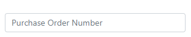

When such a control gets a focus, the label will float above it like this.

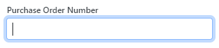

To use custom label text, you can set the `Placeholder` parameter of the control, but you need to localize it as required.

The labels of editable data controls bound to a required property will show a red asterisk in front. An editable data control will set the user-entered or selected value(s) directly to the data property. If the value is invalid, it will highlight it in red and show the [validation errors from the property](../../common-ui/properties/base#property-validation) in the tooltip when you hover over the control, as shown below.

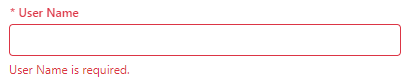


## Base components

The `Xomega.Syncfusion.Blazor` package defines a couple of base components for Syncfusion components, which in turn are based on the Xomega Framework's [base components](../controls#base-components).

### XSfComponent

The `XSfComponent` component extends the [`XComponent`](../controls#xcomponent) class and serves as a base class for standard Syncfusion data controls that don't allow selection from a list of possible values. The functionality this control provides on top of its base class includes the following.

- Static constants and methods for styling [error messages](../../services/errors#message) and conditionally showing them as a tooltip.
- `TooltipPosition` parameter and methods to show the error tooltip as needed.
- `FloatLabel` parameter to display the label as a placeholder on empty controls that floats above the control on focus.
- `FloatLabelType` property that determines how to show the label on Syncfusion controls.

### XSfOptionsComponent

The `XSfOptionsComponent` component extends the [`XOptionsComponent`](../controls#xoptionscomponent) class and serves as a base class for Syncfusion [selection controls](#selection-controls) that provide a selection from a list of possible values. It is a generic class that usually takes the [`Header`](../../common-ui/lookup#headers) class as a type parameter. In addition to its base class functionality, this base component provides the following functionality.

- `FloatLabel` parameter to display the label as a placeholder on empty controls that floats above the control on focus.
- `FloatLabelType` property that determines whether or not to show the label on Syncfusion controls.
- `TooltipPosition` parameter and methods to show the error tooltip as needed.
- `AllowFiltering` parameter for Syncfusion controls that allow additional filtering of the selection list.
- `AllowCustom` parameter for Syncfusion controls that allow custom values to be entered.
- `GroupByAttribute` parameter for Syncfusion controls that allow grouping items in the selection list.
- `GroupTemplate` parameter for a custom template to use for group headers when grouping is enabled.
- `ValueDisplayTemplate` parameter for a custom template to use for values, where supported.
- Configuration of the default item, value, and group templates to display the value using [`ValueFormat.DisplayString`](../../common-ui/properties/base#value-formats).
- Implementation of some typical Syncfusion callback methods and helper methods.

## Readonly controls

If you need to output a read-only value of a data property as part of some text or in other places that don't require the property label, such as in a grid cell, then you can use the standard Xomega Blazor control [`XDataText`](../controls#xdatatext) and style it as needed using CSS classes.

### XSfDataLabel

The `XSfDataLabel` control is used to display **read-only fields with a label on top**. The value is displayed in a read-only input element, which allows you to tab to that field via the keyboard and copy the value, as shown below.

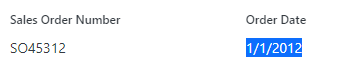

All you need for the `XSfDataLabel` is to bind it to your data property and optionally set the CSS `Class` as follows.

```razor
<XSfDataLabel Class="mb-3" Property="@VM.MainObj.SalesOrderNumberProperty"></XSfDataLabel>
<XSfDataLabel Class="mb-3" Property="@VM.MainObj.OrderDateProperty"></XSfDataLabel>
```

## Standard controls

The `Xomega.Syncfusion.Blazor` package defines a basic set of standard data controls, as described below.

### XSfCheckBox

The `XSfCheckBox` control is typically bound to a [`BooleanProperty`](../../common-ui/properties/standard#booleanproperty) and provides a way to edit a single option with a dedicated label, as illustrated below.

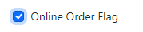

You just need to bind your `XSfCheckBox` to your data property and optionally set the CSS `Class` as follows.

```razor
<XSfCheckBox Class="mb-3" Property="@VM.MainObj.OnlineOrderFlagProperty"></XSfCheckBox>
```

#### Indeterminate state

If the value of the property [is null](../../common-ui/properties/base#null-values), the checkbox will show an indeterminate state, as shown below.

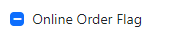

If your data property is marked as not required, meaning that the users should be able to set the `null` value, the bound `XSfCheckBox` control will cycle through three states and set the indeterminate state after you click on a checked checkbox.

:::caution
The label of a required checkbox will not show a red asterisk in front of it, but you can customize its CSS class if you want to highlight required (or optional) checkboxes in some way.
:::


### XSfTextBox

The `XSfTextBox` data control is used for editing data properties using the standard text box. You would typically bind it to a [`TextProperty`](../../common-ui/properties/standard#textproperty) by setting the standard `Property` parameter as follows.

```razor
<XSfTextBox Class="mb-3" Property="@VM.MainObj.PurchaseOrderNumberProperty"></XSfTextBox>
```

Here is what it will look like.

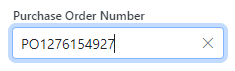

:::note
The `XSfTextBox` data control will update the bound data property on each keystroke and set the `Editing` flag to false when you leave the field, which will trigger the [property validation](../../common-ui/properties/base#property-validation).
:::

If the property is [multi-valued](../../common-ui/properties/base#multi-valued-properties), the users will be able to enter multiple values separated by a comma or any other of the `ParseListSeparators` configured for the property.

If the property is not multi-valued, the text field will automatically limit the text input to the `Size` of the property. 

If the property value allows line breaks, then you can set the `Multiline` parameter to `true.` If you want to hide the *Clear* button (`X`) in the text box, you can set the `ShowClearButton` parameter to `false`.

#### Specialized input types

You can set the additional `Type` parameter on the `XSfTextBox` control for specialized input types, such as *email*. For example, the following is a configuration for a password field.

```razor
<XSfTextBox Class="mb-3" Property="@VM.MainObj.PasswordProperty"
<!-- highlight-next-line -->
            Type="InputType.Password"></XSfTextBox>
```

This will mask the input characters, as shown below.

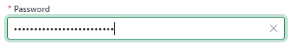

### XSfDatePicker

The `XSfDatePicker` control is designed to be bound to a [`DateTimeProperty`](../../common-ui/properties/standard#datetime-properties) using the standard `Property` parameter as follows.

```razor
<XSfDatePicker Class="mb-3" Property="@VM.MainObj.PaymentObject.DueDateProperty"></XSfDatePicker>
```

The `XSfDatePicker` control will render differently based on the specific type of data property it is bound to, as well as whether or not the property is multi-valued, as described under each tab below.

<Tabs>
  <TabItem value="date" label="DateProperty">

If the bound data property is an instance of a [`DateProperty`](../../common-ui/properties/standard#dateproperty), the control will allow only a date selection. The values will be formatted using the value of the `Format` property of the bound `DateProperty`, but you can override it by setting the `Format` parameter on the `XSfDatePicker`.

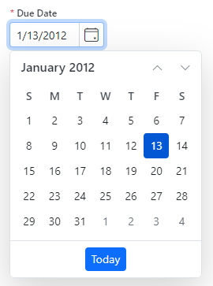

  </TabItem>
  <TabItem value="datetime" label="DateTimeProperty">

If the bound data property is a `DateTimeProperty` and not a `DateProperty`, the control will support both date and time selection. The values will be formatted using the value of the `Format` property of the bound `DateTimeProperty`, but you can override it by setting the `Format` parameter on the `XSfDatePicker`.


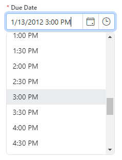

  </TabItem>
  <TabItem value="multi" label="Multi-valued">

If the data property is multi-valued (or is not a `DateTimeProperty`), then the control will render as a regular text box, where you will need to enter comma-separated dates (and times) in the proper format. The values will be formatted using the value of the `Format` property of the bound `DateTimeProperty`.

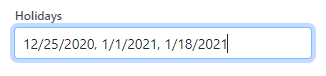

  </TabItem>
</Tabs>

By default, the `X` button to clear the value is not shown in the `XSfDatePicker`, but you can enable it by setting the `ShowClearButton` parameter to `true`.

### XSfNumericTextBox

`XSfNumericTextBox` is a special control for editing [integer data properties](../../common-ui/properties/standard#integer-properties) or [decimal data properties](../../common-ui/properties/standard#decimal-properties) that you bind via the `Property` parameter.

```razor
<XSfNumericTextBox Class="mb-3" Property="@VM.MainObj.OrderQtyProperty"></XSfNumericTextBox>
```

It displays a text box with a numeric scroller, which allows you to increment or decrement the current value using a mouse or the up/down arrow keys, as shown below.

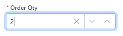

The value selection will be limited by the `MinimumValue` and `MaximumValue` values defined for the data property. You can control the increment step by setting the `Step` parameter on the control.

You can hide the *Clear* button (`X`) by setting the `ShowClearButton` parameter to `false`. You can also customize the value format by setting the `Format` parameter on the `XSfNumericTextBox`.

## Selection controls

Selection controls extend the [`XSfOptionsComponent`](#xsfoptionscomponent) and are bound to an [`EnumProperty`](../../common-ui/properties/enum), which allows them to display a list of items to select the value(s) from using the property's [`ItemsProvider`](../../common-ui/properties/enum#value-selection-list).

### XSfAutoComplete

`XSfAutoComplete` control can be bound to an [`EnumProperty`](../../common-ui/properties/enum) that is **not multi-valued** and shows a text box that allows you to type a partial string and select the value from a dropdown list of matching items.

:::caution
By default, the selection items in the dropdown list are rendered using the [value format](../../common-ui/properties/base#value-formats) `DisplayString`. However, the selected item in the text box is displayed using the `DefaultFormat` of that `Header`, which is normally its `Text` field.
:::

For example, let's consider that our data property for sales territories is configured to display the value using the "ID - Text" format, as follows.

```cs
TerritoryProperty.DisplayFormat = $"{Header.FieldId} - {Header.FieldText}";
```

If we bind an `XSfAutoComplete` control to this data property using

```razor
<XSfAutoComplete Property="@VM.MainObj.SalesObject.TerritoryProperty"></XSfAutoComplete>
```

then the dropdown list will show a combination of `ID` and `Text`, but the text box will only show the `Text` of the selected item, as illustrated below.

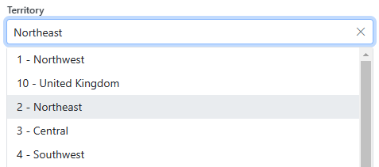

For additional features provided by the control, please click on one of the tabs below.

<Tabs>
  <TabItem value="custom" label="Auto-suggest mode">

The auto-suggest mode allows you to enter **custom text** into the field in addition to selecting it from a list of the suggested values. Since the custom value is specified as a string, your property should be a string-based `EnumProperty`, where the `ID` is the same as the `Text`. It should not be based on any of the [typed enum properties](../../common-ui/properties/enum#typed-enum-properties), such as `EnumIntProperty`. 

To enable the auto-suggest mode, you need to **relax the property validation** rules to allow custom values that are not in the lookup table, as shown below.

```cs
TerritoryProperty.LookupValidation = LookupValidationType.None;
```

This will configure the `XSfAutoComplete` control to allow custom values, as illustrated below.

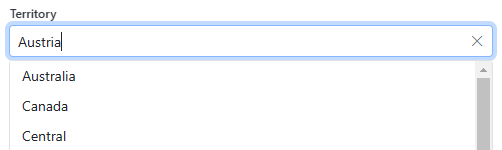

:::tip
You can also explicitly force the `XSfAutoComplete` control to allow or disallow custom values by setting its `AllowCustom` attribute as needed.
:::

  </TabItem>
  <TabItem value="template" label="Custom item template">

You can customize the way each selection item is displayed by configuring a custom `ItemDisplayTemplate` for the control.

For example, let's say that we want to show the country of each sales territory using the corresponding [flag icon](https://flagicons.lipis.dev/). You can add an `ItemDisplayTemplate` with a flag icon next to the name of the sales territory by using the `country region code` [additional attribute](../../common-ui/lookup#additional-attributes) of each territory as follows.

```razor
<XSfAutoComplete Class="mb-3" Property="@VM.MainObj.SalesObject.TerritoryProperty">
<!-- highlight-start -->
    <ItemDisplayTemplate>
        <i class="fi fi-@((context as Header)?["country region code"]?.ToString()?.ToLower())"></i>
        @VM.MainObj.SalesObject.TerritoryProperty.ValueToString(context, ValueFormat.DisplayString)
    </ItemDisplayTemplate>
<!-- highlight-end -->
</XSfAutoComplete>
```

As a result, the control will show the flag of each sales territory's country, as shown below.

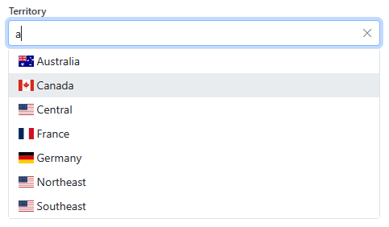

  </TabItem>
  <TabItem value="grouping" label="Grouping">

You can group items in the selection dropdown list of a `XSfAutoComplete` by a specific field or [attribute](../../common-ui/lookup#additional-attributes) of the `Header` by setting the `GroupByAttribute` parameter to the name of that field or attribute. You can also specify a custom template for displaying the group items in the list.

In the following example, we group the list of territories by country code and configure the `GroupTemplate` to display that country code with the corresponding flag.

```razor
<XSfAutoComplete Property="@VM.MainObj.SalesObject.TerritoryProperty"
<!-- highlight-next-line -->
                 GroupByAttribute="country region code">
    <GroupTemplate>
<!-- highlight-start -->
        <i class="fi fi-@((context.Text)?.ToLower())"></i>
        <span>@(context.Text)</span>
<!-- highlight-end -->
    </GroupTemplate>
</XSfAutoComplete>
```

With this configuration, our `XSfAutoComplete` control will look as follows.

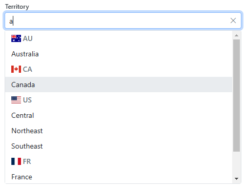

  </TabItem>
</Tabs>

### XSfDropDownList

`XSfDropDownList` control can be bound to an [`EnumProperty`](../../common-ui/properties/enum) that is **not multi-valued** and allows you to select the value from a dropdown list.

:::note
By default, the selection items both in the dropdown list and in the field are rendered using the [value format](../../common-ui/properties/base#value-formats) `DisplayString`.
:::

For example, let's consider that our data property for sales territories is configured to display the value using the "ID - Text" format, as follows.

```cs
TerritoryProperty.DisplayFormat = $"{Header.FieldId} - {Header.FieldText}";
```

If we bind an `XSfDropDownList` control to this data property as follows,

```razor
<XSfDropDownList Property="@VM.MainObj.SalesObject.TerritoryProperty"></XSfDropDownList>
```

then both the dropdown list and the selected item will show a combination of `ID` and `Text`, as illustrated below.

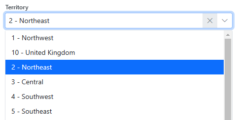

If the property is not required, then the control will also have an `X` button to clear the value, as shown above. For required properties, there will be no clear button, and the label will have an asterisk.

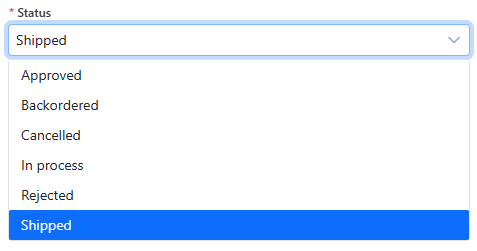

For additional features provided by the control, please click on one of the tabs below.

<Tabs>
  <TabItem value="filter" label="Filtering">

If your property has a long list of possible values to select from, you can enable filtering of your `XSfDropDownList` by setting the `AllowFiltering` parameter to `true`, as follows.

```razor
<XSfDropDownList Property="@VM.MainObj.SalesObject.TerritoryProperty"
<!-- highlight-next-line -->
                 AllowFiltering="true">
</XSfDropDownList>
```

In this case, the dropdown list will display a text box where you can start typing to filter down the list to only the matching items, as shown below.

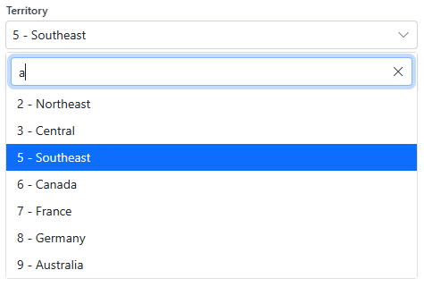

  </TabItem>
  <TabItem value="template" label="Custom item template">

You can customize the way each selection item is displayed in the dropdown list by configuring a custom `ItemDisplayTemplate` for the control.

:::tip
It will also be used automatically as a template for the actual selected value in the field unless you configure a different value template using the `ValueDisplayTemplate` element.
:::

For example, let's say that we want to show the country of each sales territory using the corresponding [flag icon](https://flagicons.lipis.dev/). You can add an `ItemDisplayTemplate` with a flag icon next to the name of the sales territory by using the `country region code` [additional attribute](../../common-ui/lookup#additional-attributes) of each territory as follows.

```razor
<XSfDropDownList Class="mb-3" Property="@VM.MainObj.SalesObject.TerritoryProperty">
<!-- highlight-start -->
    <ItemDisplayTemplate>
        <i class="me-1 fi fi-@((context as Header)?["country region code"]?.ToString()?.ToLower())"></i>
        @VM.MainObj.SalesObject.TerritoryProperty.ValueToString(context, ValueFormat.DisplayString)
    </ItemDisplayTemplate>
<!-- highlight-end -->
</XSfDropDownList>
```

As a result, the control will show the flag of each sales territory's country both in the dropdown list and in the selected value, as shown below.

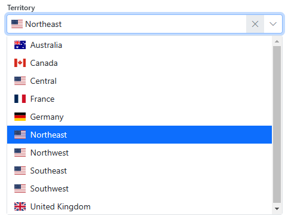

  </TabItem>
  <TabItem value="grouping" label="Grouping">

You can group items in the selection dropdown list of a `XSfDropDownList` by a specific field or [attribute](../../common-ui/lookup#additional-attributes) of the `Header` by setting the `GroupByAttribute` parameter to the name of that field or attribute. You can also specify a custom template for displaying the group items in the list.

In the following example, we group the list of territories by country code and configure the `GroupTemplate` to display that country code with the corresponding flag.

```razor
<XSfDropDownList Property="@VM.MainObj.SalesObject.TerritoryProperty"
<!-- highlight-next-line -->
                 GroupByAttribute="country region code">
    <GroupTemplate>
<!-- highlight-start -->
        <i class="me-1 fi fi-@((context.Text)?.ToLower())"></i>
        <span>@(context.Text)</span>
<!-- highlight-end -->
    </GroupTemplate>
</XSfDropDownList>
```

With this configuration, our `XSfDropDownList` control will look as follows.

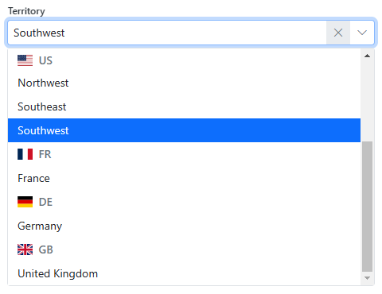

  </TabItem>
</Tabs>

### XSfComboBox

`XSfComboBox` control can be bound to an [`EnumProperty`](../../common-ui/properties/enum) that is **not multi-valued** and shows a text box that allows you to type a partial string and jump to the matching value in the dropdown list. You can also open up the dropdown list by clicking on the down arrow on the right or by pressing `Alt+Down` and then selecting the value from that list.

:::caution
By default, the selection items in the dropdown list are rendered using the [value format](../../common-ui/properties/base#value-formats) `DisplayString`. However, the selected item in the text box is displayed using the `DefaultFormat` of that `Header`, which is normally its `Text` field.
:::

For example, let's consider that our data property for sales territories is configured to display the value using the "ID - Text" format, as follows.

```cs
TerritoryProperty.DisplayFormat = $"{Header.FieldId} - {Header.FieldText}";
```

If we bind an `XSfComboBox` control to this data property using

```razor
<XSfComboBox Property="@VM.MainObj.SalesObject.TerritoryProperty"></XSfComboBox>
```

then the dropdown list will show a combination of `ID` and `Text`, but the field will only show the `Text` of the selected item, as illustrated below.

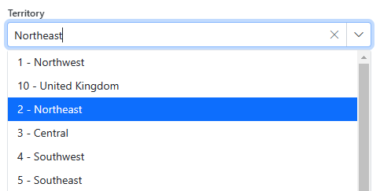

`XSfComboBox` bound to a required property will have a label with a red asterisk, while for non-required properties, it will display the `X` clear button that allows you to clear the value.

For additional features provided by the control, please click on one of the tabs below.

<Tabs>
  <TabItem value="filter" label="Filtering dropdown list">

Similar to the [`XSfAutoComplete`](#xsfautocomplete) control, you can allow filtering the dropdown list when typing in the `XSfComboBox` by setting the `AllowFiltering` parameter to `true`, as follows.

```razor
<XSfComboBox Property="@VM.MainObj.SalesObject.TerritoryProperty"
<!-- highlight-next-line -->
             AllowFiltering="true"></XSfComboBox>
```

The list will be filtered using the property's `AsyncItemsProvider`, which, by default, uses case-insensitive search anywhere in the value converted to a string format. In this case, the control will look as shown below.

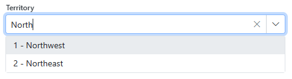

  </TabItem>
  <TabItem value="custom" label="Custom value">

`XSfComboBox` allows you to enter a custom value into the field in addition to selecting it from the dropdown list. Since the custom value is specified as a string, your property should be a string-based `EnumProperty`, where the `ID` is the same as the `Text`. It should not be based on any of the [typed enum properties](../../common-ui/properties/enum#typed-enum-properties), such as `EnumIntProperty`. 

To enable this behavior, you need to **relax the property validation** rules to allow custom values that are not in the lookup table, as shown below.

```cs
TerritoryProperty.LookupValidation = LookupValidationType.None;
```

This will configure the `XSfComboBox` control to allow custom values, as illustrated below.

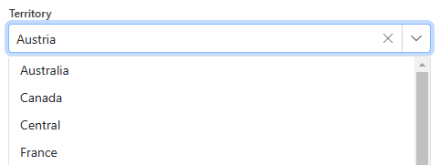

:::tip
You can also explicitly force the `XSfComboBox` control to allow or disallow custom values by setting its `AllowCustom` attribute.
:::

  </TabItem>
  <TabItem value="template" label="Custom item template">

You can customize the way each selection item is displayed by configuring a custom `ItemDisplayTemplate` for the control.

For example, let's say that we want to show the country of each sales territory using the corresponding [flag icon](https://flagicons.lipis.dev/). You can add an `ItemDisplayTemplate` with a flag icon next to the name of the sales territory by using the `country region code` [additional attribute](../../common-ui/lookup#additional-attributes) of each territory as follows.

```razor
<XSfComboBox Class="mb-3" Property="@VM.MainObj.SalesObject.TerritoryProperty">
<!-- highlight-start -->
    <ItemDisplayTemplate>
        <i class="fi fi-@((context as Header)?["country region code"]?.ToString()?.ToLower())"></i>
        @VM.MainObj.SalesObject.TerritoryProperty.ValueToString(context, ValueFormat.DisplayString)
    </ItemDisplayTemplate>
<!-- highlight-end -->
</XSfComboBox>
```

As a result, the control will show the flag of each sales territory's country, as shown below.

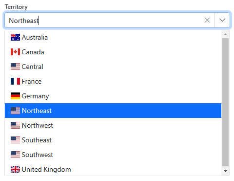

  </TabItem>
  <TabItem value="grouping" label="Grouping">

You can group items in the selection dropdown list of a `XSfComboBox` by a specific field or [attribute](../../common-ui/lookup#additional-attributes) of the `Header` by setting the `GroupByAttribute` parameter to the name of that field or attribute. You can also specify a custom template for displaying the group items in the list.

In the following example, we group the list of territories by country code and configure the `GroupTemplate` to display that country code with the corresponding flag.

```razor
<XSfComboBox Property="@VM.MainObj.SalesObject.TerritoryProperty"
<!-- highlight-next-line -->
             GroupByAttribute="country region code">
    <GroupTemplate>
<!-- highlight-start -->
        <i class="fi fi-@((context.Text)?.ToLower())"></i>
        <span>@(context.Text)</span>
<!-- highlight-end -->
    </GroupTemplate>
</XSfComboBox>
```

With this configuration, our `XSfComboBox` control will look as follows.

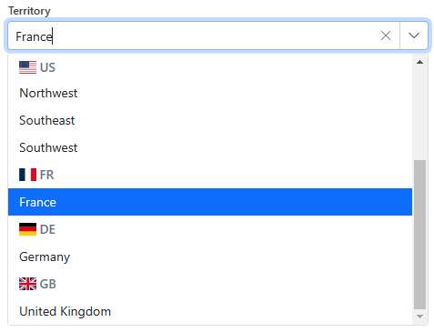

  </TabItem>
</Tabs>

### XSfMultiSelect

`XSfMultiSelect` control can be bound to a [**multi-valued**](../../common-ui/properties/base#multi-valued-properties) [`EnumProperty`](../../common-ui/properties/enum) and provides a text box where you can type the part of the value and a dropdown list for you to select the matching values.

:::note
By default, the selection items both in the dropdown list and in the field are rendered using the [value format](../../common-ui/properties/base#value-formats) `DisplayString`.
:::

Here is how you can bind an `XSfMultiSelect` control to a data property containing a list of selected sales reasons.

```razor
<XSfMultiSelect Class="mb-3" Property="@VM.MainObj.SalesObject.SalesReasonProperty"></XSfMultiSelect>
```

Selection of multiple values for the sales reason is illustrated below.

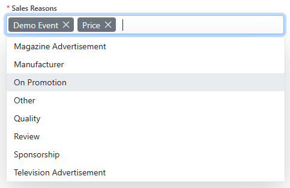

When you are not entering values, and the control has no focus, it will show the values delimited by the data property's `DisplayListSeparator`, as shown below.

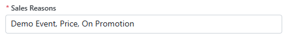

:::tip
To still show the values as chips when the field is not in focus, you can set the `Mode` parameter to `VisualMode.Box`.
:::

For additional features provided by the control, please click on one of the tabs below.

<Tabs>
  <TabItem value="filter" label="Filtering dropdown list">

Similar to other controls, you can allow filtering the dropdown list when typing in the `XSfMultiSelect` by setting the `AllowFiltering` parameter to `true`, as follows.

```razor
<XSfMultiSelect Class="mb-3" Property="@VM.MainObj.SalesObject.SalesReasonProperty"
<!-- highlight-next-line -->
                AllowFiltering="true"></XSfMultiSelect>
```

The list will be filtered using the property's `AsyncItemsProvider`, which, by default, uses case-insensitive search anywhere in the value converted to a string format. In this case, the control will look as shown below.

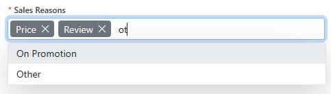

  </TabItem>
  <TabItem value="custom" label="Custom value">

`XSfMultiSelect` allows you to enter a custom value into the field in addition to selecting it from the dropdown list. Since the custom value is specified as a string, your property should be a string-based `EnumProperty`, where the `ID` is the same as the `Text`. It should not be based on any of the [typed enum properties](../../common-ui/properties/enum#typed-enum-properties), such as `EnumIntProperty`. 

To enable this behavior, you need to **relax the property validation** rules to allow custom values that are not in the lookup table, as shown below.

```cs
SalesReasonProperty.LookupValidation = LookupValidationType.None;
```

This will configure the `XSfMultiSelect` control to allow custom values, which will appear in the dropdown list, as shown below.

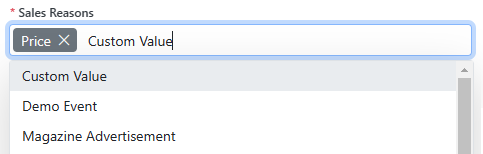

You must select it from the dropdown list to add this value to the property.

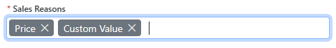

:::tip
You can also explicitly force the `XSfMultiSelect` control to allow or disallow custom values by setting its `AllowCustom` attribute.
:::

  </TabItem>
  <TabItem value="template" label="Custom item template">

You can customize the way each selection item is displayed in the dropdown list by configuring a custom `ItemDisplayTemplate` for the control.

:::tip
It will also be used automatically as a template for the actual selected value in the field unless you configure a different value template using the `ValueDisplayTemplate` element.
:::

For example, let's say that we have a multi-valued sales territory property, and we want to show the country of each sales territory using the corresponding [flag icon](https://flagicons.lipis.dev/). You can add an `ItemDisplayTemplate` with a flag icon next to the name of the sales territory by using the `country region code` [additional attribute](../../common-ui/lookup#additional-attributes) of each territory as follows.

```razor
<XSfMultiSelect Class="mb-3" Property="@VM.MainObj.SalesObject.TerritoryProperty">
<!-- highlight-start -->
    <ItemDisplayTemplate>
        <i class="fi fi-@((context as Header)?["country region code"]?.ToString()?.ToLower())"></i>
        @VM.MainObj.SalesObject.TerritoryProperty.ValueToString(context, ValueFormat.DisplayString)
    </ItemDisplayTemplate>
<!-- highlight-end -->
</XSfMultiSelect>
```

As a result, the control will show the flag of each sales territory's country, as shown below.

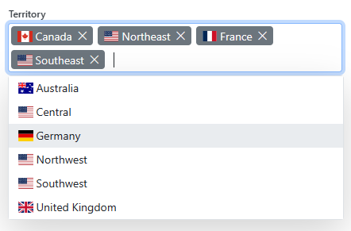

  </TabItem>
  <TabItem value="checkbox" label="Checkboxes">

Instead of opening the dropdown to select each additional value, `XSfMultiSelect` allows you to select multiple values from the same dropdown using checkboxes. To enable that, you need to set the `Mode` parameter to `VisualMode.CheckBox` value. You can also enable an extra checkbox that allows you to select or deselect all values by setting the `ShowSelectAll` parameter as follows.

```razor
<XSfMultiSelect Class="mb-3" Property="@VM.MainObj.SalesObject.SalesReasonProperty"
<!-- highlight-next-line -->
                Mode="VisualMode.CheckBox" ShowSelectAll="true"></XSfMultiSelect>
```

The multi-select list with a checkbox configured like that will look as shown below.

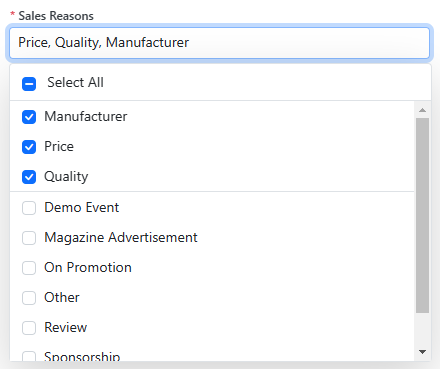

  </TabItem>
  <TabItem value="grouping" label="Grouping">

Similar to other selection controls, you can group items in the selection dropdown list of a `XSfMultiSelect` by a specific field or [attribute](../../common-ui/lookup#additional-attributes) of the `Header` by setting the `GroupByAttribute` parameter to the name of that field or attribute. You can also specify a custom template for displaying the group items in the list using the `GroupTemplate` element.

However, when using the `CheckBox` mode, you can also allow selecting or deselecting all the items in any group by setting the `EnableGroupCheckBox` parameter to `true`.

In the following example, we group the list of territories by the country code, use checkboxes both for the items and the group, and configure the group template to display that country code with the corresponding flag.


```razor
<XSfMultiSelect Class="mb-3" Property="@VM.MainObj.SalesObject.TerritoryProperty"
                Mode="VisualMode.CheckBox" ShowSelectAll="true"
<!-- highlight-next-line -->
                GroupByAttribute="country region code" EnableGroupCheckBox="true">
    <GroupTemplate>
<!-- highlight-start -->
        <i class="fi fi-@((context.Text)?.ToLower())"></i>
        <span>@(context.Text)</span>
<!-- highlight-end -->
    </GroupTemplate>
</XSfMultiSelect>
```

With this configuration, our control will allow clicking on a country to select all its territories at once, as shown below.

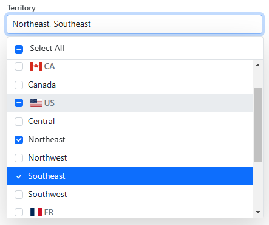

  </TabItem>
</Tabs>

## Action controls

Action controls are bound to a special [`ActionProperty`](../../common-ui/properties/action) in the view model or any of its data objects. This allows them to use the [action's localized text](../../common-ui/properties/action#localized-action-text) as a label and set up the access key configured for the `ActionProperty` to provide a keyboard shortcut for that action and underscore that key in the label, where possible.

The action will maintain its [visibility](../../common-ui/properties/action#control-action-visibility) or [enabled state](../../common-ui/properties/action#manage-enabled-state) based on the state of the action property, including when the state of the action property is computed using specific visibility or enabling conditions.

:::caution
You still need to provide a callback function for the click handler, which is not part of the bound action property.
:::

### XSfActionButton

The `XSfActionButton` control inherits from the `XActionComponent` and represents a button that you can bind to an action property using the `Action` parameter and supply the click handler in the `OnClick` parameter as follows.

```razor
<XSfActionButton OnClick="OnCloseAsync"
<!-- highlight-next-line -->
                 Action="@VM.CloseAction"></XSfActionButton>
```

The tabs below describe additional configurations for the `XSfActionButton` control.

<Tabs>
  <TabItem value="primary" label="Primary buttons">

For a primary action on the view, you can set the `IsPrimary="true"` parameter on the button as follows.

```razor
<XSfActionButton OnClick="OnSaveAsync" Action="@VM.MainObj.SaveAction"
<!-- highlight-next-line -->
                 IsPrimary="true"></XSfActionButton>
```

The button will be displayed as shown below.

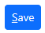

  </TabItem>
  <TabItem value="secondary" label="Secondary buttons">

Non-primary actions don't need any special parameters set on the button as follows.

```razor
<XSfActionButton OnClick="OnDeleteAsync" Action="@VM.MainObj.DeleteAction" Class="me-auto"></XSfActionButton>
```

This will render it as a secondary button, as shown below.

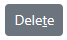

  </TabItem>
  <TabItem value="outline" label="Outline buttons">

For auxiliary actions, you can set the `Outline="true"` parameter on the button.

```razor
<XSfActionButton OnClick="async () => await LinkNew_ClickAsync()" Action="@VM.ListObj.NewAction"
<!-- highlight-next-line -->
                 Outline="true"></XSfActionButton>
```

This will show them using only the button outline like this.

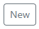

  </TabItem>
  <TabItem value="no text" label="No text buttons">

If you don't want the button to display the action's text but rather show an icon from the provided CSS class, then you can set the `NoText="true"` parameter.

For example, the following code configures a *Delete* button using the `e-trash` class with no text.

```razor
<XSfActionButton Action="@VM.MainObj.DeleteAction" OnClick="OnDeleteAsync"
<!-- highlight-next-line -->
                 NoText="true" Outline="true" Class="e-icons e-trash"></XSfActionButton>
```

Here is how it will look on the screen.

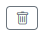

  </TabItem>
</Tabs>