# Syncfusion Data Grid

import Tabs from '@theme/Tabs';
import TabItem from '@theme/TabItem';

The `Xomega.Syncfusion.Blazor` package includes a data grid component `XSfGrid` based on the advanced Syncfusion component `SfGrid`, which allows showing and editing the data from your [`DataListObject`](../../common-ui/data-lists) in a tabular grid.

The `XSfGrid` simplifies the configuration of the Syncfusion data grid by using the configuration of the bound data list object and its properties and inherits its advanced features, including, but not limited to, the following.
- Showing or hiding columns.
- Resizing and auto-resizing columns.
- Reordering columns.
- Filtering the grid using various styles: filter bar, menu, checkboxes, or Excel style.
- Searching for a value across all columns.
- Sorting by single or multiple columns.
- Paging and scrolling.
- Grouping by columns.
- Exporting grid data to Excel or PDF.
- Selection of rows, columns, or individual cells.
- Editing row data using different modes: inline or dialog.

:::tip
For the complete set of the Syncfusion data grid features and their details, please refer to the [official Syncfusion documentation](https://blazor.syncfusion.com/documentation/datagrid/getting-started).
:::

The following picture illustrates the results grid for a *Sales Order List* view using the `XSfGrid`, as well as the Blazor markup used to configure it.

<Tabs>
  <TabItem value="pic" label="Sales Orders Grid">

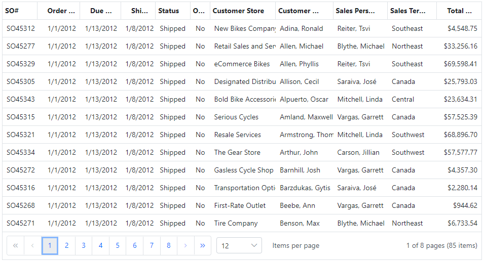

  </TabItem>
  <TabItem value="markup" label="SalesOrderListView.razor">

```razor
<XSfGrid List="@VM.ListObj"
         AllowPaging="true"
         AllowReordering="true"
         AllowResizing="true"
         AllowSorting="true">
  <XSfDataManager></XSfDataManager>
  <GridPageSettings PageSizes="true"></GridPageSettings>
  <GridColumns>
    <XSfGridColumn Field="@SalesOrderList.SalesOrderNumber" Width="10%"></XSfGridColumn>
    <XSfGridColumn Field="@SalesOrderList.OrderDate" Width="7%"></XSfGridColumn>
    <XSfGridColumn Field="@SalesOrderList.DueDate" Width="7%"></XSfGridColumn>
    <XSfGridColumn Field="@SalesOrderList.ShipDate" Width="7%"></XSfGridColumn>
    <XSfGridColumn Field="@SalesOrderList.Status" Width="7%"></XSfGridColumn>
    <XSfGridColumn Field="@SalesOrderList.OnlineOrderFlag" Width="20px"
                   TextAlign="TextAlign.Center"></XSfGridColumn>
    <XSfGridColumn Field="@SalesOrderList.CustomerStore" Width="14%"></XSfGridColumn>
    <XSfGridColumn Field="@SalesOrderList.CustomerName" Width="14%"></XSfGridColumn>
    <XSfGridColumn Field="@SalesOrderList.SalesPersonId" Width="14%"></XSfGridColumn>
    <XSfGridColumn Field="@SalesOrderList.TerritoryId" Width="7%"></XSfGridColumn>
    <XSfGridColumn Field="@SalesOrderList.TotalDue" Width="9%"></XSfGridColumn>
  </GridColumns>
</XSfGrid>
```

  </TabItem>
</Tabs>

:::warning
The **current document** describes mostly those aspects of the Syncfusion data grid that are either **related to Xomega Framework or different** from the original `SfGrid` component.
:::

## Data binding

To bind an `XSfGrid` component to a `DataListObject`, you need to assign the `List` attribute to the corresponding data list object in your view model and use `XSfDataManager`, which will use your data list object as a data source for your grid.

For each grid column bound to a property of your data list object, you need to add an `XSfGridColumn` element and set the [data property name](../../common-ui/properties/base#property-name) on the `Field` attribute, as follows.

```razor
<!-- highlight-start -->
<XSfGrid List="@VM.ListObj">
  <XSfDataManager></XSfDataManager>
<!-- highlight-end -->
  <GridColumns>
<!-- highlight-next-line -->
    <XSfGridColumn Field="@SalesOrderList.SalesOrderNumber"></XSfGridColumn>
    ...
  </GridColumns>
</XSfGrid>
```

:::tip
To avoid hardcoding property names, we recommend defining static constant stings for them on the corresponding data object, such as the `SalesOrderList.SalesOrderNumber` above.
:::

When a grid column is bound to a data property, it will use it to configure the default header label, text alignment, and formatting for the data values. It will also use the property's visibility to show or hide the column dynamically. All of this minimizes any additional configuration that you need for each column, which you can still customize using the plethora of Syncfusion configuration options.

:::note
You can also use a regular Syncfusion `GridColumn` element for any column instead of the `XSfGridColumn`, but you will have to configure it manually, and it won't automatically update its visibility based on the data property's visibility.
:::

## Grid columns

Column configuration for the `XSfGrid` component is done within the nested `GridColumns` element. Most of the columns would be bound to a specific data property of your data list object, but you can also have columns that are not bound to a specific property.

For example, if your column needs to display a combination of the first and last name properties, then you can set it up with a custom template that will format the values from those properties.

:::tip
For such scenarios, we recommend adding a new [`ComboProperty`](../../common-ui/properties/specialty#comboproperty) or a [computed property](../../common-ui/properties/base#computed-properties) to your list object and binding it to your column. This will allow you to sort by this column, control its visibility from the data object, format it properly when both values are `null`, and minimize the column configuration in the UI layer.
:::

### Header text

By default, when your `XSfGridColumn` is bound to a data property, it will use the [localized label](../../common-ui/properties/base#property-label) for that property as the header text for the column. If your column is not bound to a data property or you cannot use the property label as the header, you can specify custom text for the header in the `HeaderText` parameter, as follows.

```razor
<XSfGridColumn Field="@SalesOrderList.OnlineOrderFlag"
<!-- highlight-next-line -->
               HeaderText="Online"></XSfGridColumn>
```

Note that the `HeaderText` value you specify will be used as is and not translated to the current language. If you need to localize that text, you can do it manually by injecting a `ResourceManager` and using it to resolve the label, as shown below.

```razor
<!-- highlight-next-line -->
@inject ResourceManager resMgr
...
<XSfGridColumn Field="@SalesOrderList.OnlineOrderFlag"
<!-- highlight-next-line -->
               HeaderText="@resMgr.GetString("Online")"></XSfGridColumn>
```

### Column groups

You can stack columns in column groups by nesting them inside the `GridColumns` of another column. The grid will allow reordering the columns only within their parent column group. If you want to reorder them with columns outside that group, you will need to move the entire column group. To allow reordering columns, you need to set the `AllowReordering="true"` parameter.

In the following example, we group the *Customer Store* and *Customer Name* columns under a *Customer Info* group.

```razor
<XSfGrid List="@VM.ListObj" AllowReordering="true" AllowResizing="true">
  <XSfDataManager></XSfDataManager>
  <GridColumns>
    <XSfGridColumn Field="@SalesOrderList.SalesOrderNumber"></XSfGridColumn>
    <XSfGridColumn Field="@SalesOrderList.OrderDate"></XSfGridColumn>
    ...
<!-- highlight-start -->
    <GridColumn HeaderText="Customer Info" HeaderTextAlign="TextAlign.Center">
      <GridColumns>
        <XSfGridColumn Field="@SalesOrderList.CustomerStore"></XSfGridColumn>
        <XSfGridColumn Field="@SalesOrderList.CustomerName"></XSfGridColumn>
      </GridColumns>
    </GridColumn>
<!-- highlight-end -->
    ...
  </GridColumns>
</XSfGrid>
```

These columns will be displayed in the grid as shown below.

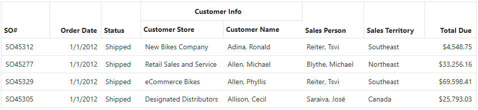


### Column widths

You can configure a Syncfusion data grid to allow resizing column widths using the `AllowResizing` parameter. You can also set this parameter to `false` on any specific column that you want to disallow resizing of.

For the initial column widths, you can set the `Width` parameter to either an absolute value in pixels or to a percentage of the total grid width. You can also set the `MinWidth` and `MaxWidth` parameters to limit the width of the column that it can be resized to.

To auto-fit the width of the column to the currently displayed content, you can set the `AutoFit="true"` parameter for the initial column width and invoke the corresponding method programmatically as needed. The users can also manually auto-fit the column width by double-clicking on the column's right edge.

The following example illustrates various parameters you can use to control the column widths and resizing behavior.

```razor
<XSfGrid List="@VM.ListObj"
<!-- highlight-next-line -->
          AllowResizing="true">
  <GridColumns>
    <XSfGridColumn Field="@SalesOrderList.SalesOrderNumber"
<!-- highlight-next-line -->
                   Width="10%"></XSfGridColumn>
    <XSfGridColumn Field="@SalesOrderList.OrderDate"
<!-- highlight-next-line -->
                   AutoFit="true"></XSfGridColumn>
    <XSfGridColumn Field="@SalesOrderList.Status"
<!-- highlight-next-line -->
                   Width="80px" MinWidth="50px" MaxWidth="100px"></XSfGridColumn>
    <XSfGridColumn Field="@SalesOrderList.DueDate"
<!-- highlight-next-line -->
                   Width="100px" AllowResizing="false"></XSfGridColumn>
    ...
  </GridColumns>
</XSfGrid>
```

### Default formatting

The `XSfGridColumn` will automatically configure the column based on the configuration of the bound data property unless you provide a different configuration in the column definition. Following are the default formatting configurations that it will use.
- The column will use a template to display the property values in the [`DisplayString`](../../common-ui/properties/base#value-formats) value format unless you specify a [custom template](#custom-template) for that column.
- Columns bound to a numeric or a date/time property will be right-aligned unless you set the `TextAlign` parameter explicitly.
- For decimal and date/time properties, the column will set the `Format` parameter to the `DisplayFormat` and `Format` fields of those properties if that parameter is not explicitly specified.
- For any property marked as `IsKey`, the grid column will set the `IsPrimaryKey` parameter to `true`.


### Custom template

If you want to specify a custom display template for the value of any `XSfGridColumn`, then you can do it in the nested `Template` element. To display a value of any list object's data property in a particular format, you can call their `GetStringValue` method and pass the `context` parameter as a [`DataRow`](../../common-ui/data-lists#row-collection) and the desired [`ValueFormat`](../../common-ui/properties/base#value-formats), as follows.

```razor
<XSfGridColumn HeaderText="SO Id" Field="@SalesOrderList.SalesOrderId">
<!-- highlight-start -->
  <Template>
    @VM.ListObj.SalesOrderIdProperty.GetStringValue(ValueFormat.DisplayString, context as DataRow)
  </Template>
<!-- highlight-end -->
</XSfGridColumn>
```

To display the value, you can also use property-bound controls, such as [`XDataText`](../controls#xdatatext), in the custom template. In that case, you need to wrap the content of your template in the `CascadingValue` element, where you cast the `context` parameter as a `DataRow`, as follows.

```razor
<XSfGridColumn Field="@SalesOrderDetailList.ProductId">
  <Template>
<!-- highlight-next-line -->
    <CascadingValue Value="context as DataRow">
      <a role="button"
         @onclick="async () => await LinkDetailDetails_ClickAsync(context as DataRow)"
         class="btn-link @(DisabledIfNot(VM.LinkDetailDetails_Enabled(context as DataRow)))">
<!-- highlight-next-line -->
        <XDataText Property="@VM.MainObj.DetailList.ProductIdProperty"></XDataText>
      </a>
    </CascadingValue>
  </Template>
</XSfGridColumn>
```

### Column chooser

You can allow the users to choose which columns to show or hide via a dedicated *ColumnChooser* option that you can add to either the grid toolbar or to the menu on each particular column. Of course, you can also use both options at the same time.

<Tabs>
  <TabItem value="toolbar" label="Grid toolbar">

To show a column chooser on a toolbar, you need to set the `ShowColumnChooser="true"` parameter on the grid and add the *ColumnChooser* option to your grid's `Toolbar` as follows.

```razor
<XSfGrid List="@VM.ListObj"
<!-- highlight-start -->
         ShowColumnChooser="true"
         Toolbar="@(new [] { "ColumnChooser" })">
<!-- highlight-end -->
          ...
</XSfGrid>
```

The toolbar menu and the column chooser dialog will look as shown below.

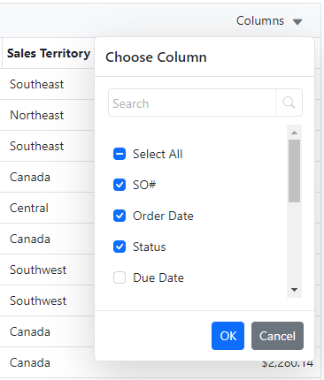

  </TabItem>
  <TabItem value="menu" label="Column menu">

To show a column chooser on the menu of each column, you need to set the `ShowColumnMenu="true"` parameter on the grid and add the *ColumnChooser* option to your grid's `ColumnMenuItems` as follows.

```razor
<XSfGrid List="@VM.ListObj"
<!-- highlight-start -->
         ShowColumnMenu="true"
         ColumnMenuItems="@(new [] { "ColumnChooser" })">
<!-- highlight-end -->
          ...
</XSfGrid>
```

:::note
You can also disable the column menu on specific columns by setting `ShowColumnMenu="false"` on them.
:::

The column menu with the only *ColumnChooser* option from above will look as shown below.

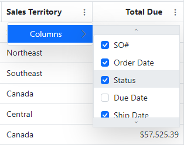

You can add other menu items to the column menu for sorting, grouping, auto-fitting, and filtering. If you don't specify the `ColumnMenuItems`, the grid will show a default set of column menus. 

  </TabItem>
</Tabs>

:::tip
You can customize which columns will be available in the column chooser menu by setting the `ShowInColumnChooser="false"` parameter on the columns that you don't want to show there.
:::

## Filtering

To retrieve the data in [Search Views](../views#search-views) and populate the main data list object, you can use flexible criteria defined in your [CriteriaObject](../../common-ui/data-lists#criteria-object). The `XSfGrid` component provides additional **in-grid filtering** that allows you to further filter the data in the results list object or large child lists by setting the `AllowFiltering="true"` parameter.

Syncfusion data grid implements several types of in-grid filtering, as described below.

<Tabs>
  <TabItem value="bar" label="FilterBar">

The filter bar is the default filter type, where you specify the filter criteria in a top bar for each column. All you have to do to turn it on is to set the `AllowFiltering` parameter as follows.

```razor
<XSfGrid List="@VM.ListObj"
<!-- highlight-next-line -->
         AllowFiltering="true">
  ...
</XSfGrid>
```

Depending on the default operator for each column, you can filter text columns by a partial string entered in the text fields and use some comparison operators for numeric and date columns. For the columns bound to an [`EnumProperty`](../../common-ui/properties/enum), the filter bar in the `XSfGrid` will automatically display a dropdown list with a list of possible values, as illustrated below.

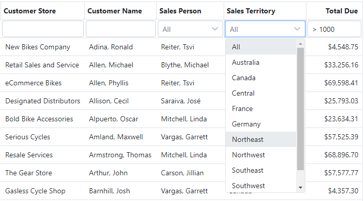

  </TabItem>
  <TabItem value="menu" label="Menu">

The *Menu* filter type is invoked from a column menu by clicking on a funnel icon in the column header. The icon will be highlighted for the columns that have any filtering applied. To set up this type for the grid or a specific column, you need to set the `Type` parameter on the corresponding filter settings to the `FilterType.Menu` value, as illustrated below.

```razor
<XSfGrid List="@VM.ListObj"
<!-- highlight-start -->
         AllowFiltering="true">
  <GridFilterSettings Type="FilterType.Menu"></GridFilterSettings>
<!-- highlight-end -->
<!-- removed-next-line -->
  <XSfDataManager></XSfDataManager>
<!-- added-lines-start -->
  <SfDataManager Adaptor="Adaptors.CustomAdaptor">
     <DataListAdaptor List="@VM?.ListObj"></DataListAdaptor>
  </SfDataManager>
<!-- added-lines-end -->
  ...
</XSfGrid>
```

:::warning
To make the Menu-type filtering work for the Syncfusion grid, **do not use the `XSfDataManager`** in the `XSfGrid`. Use the standard `SfDataManager` with a custom adaptor and a nested `DataListAdaptor` that is bound to your data list object, as illustrated above.
:::

Clicking on the filter icon will pop up a dialog for that column, where you can specify the operator and a filter value, as shown below.

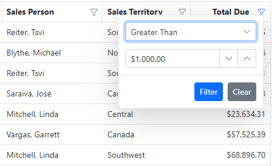

  </TabItem>
  <TabItem value="checkbox" label="CheckBox">

The *CheckBox* filter type is invoked from a column menu by clicking on a funnel icon in the column header. The icon will be highlighted for the columns that have any filtering applied. To set up this type for the grid or a specific column, you need to set the `Type` parameter on the corresponding filter settings to the `FilterType.CheckBox` value, as illustrated below.

```razor
<XSfGrid List="@VM.ListObj"
<!-- highlight-start -->
         AllowFiltering="true">
  <GridFilterSettings Type="FilterType.CheckBox"></GridFilterSettings>
<!-- highlight-end -->
  ...
</XSfGrid>
```

Clicking on the filter icon will pop up a dialog for that column, where you can select (or deselect) the values from all the distinct values in that column, which will be used to filter the grid rows, as shown below.

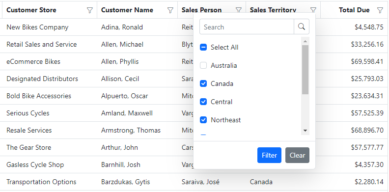

  </TabItem>
  <TabItem value="excel" label="Excel">

The *Excel* filter type is invoked from a column menu by clicking on a funnel icon in the column header. The icon will be highlighted for the columns that have any filtering applied. To set up this type for the grid or a specific column, you need to set the `Type` parameter on the corresponding filter settings to the `FilterType.Excel` value, as illustrated below.

```razor
<XSfGrid List="@VM.ListObj"
<!-- highlight-start -->
         AllowFiltering="true">
  <GridFilterSettings Type="FilterType.Excel"></GridFilterSettings>
<!-- highlight-end -->
  ...
</XSfGrid>
```

Clicking on the filter icon will pop up a dialog for that column, where you can select (or deselect) the values from all the distinct values in that column, similar to the *CheckBox* type. However, it will also have a menu that pops up a dialog for specifying custom filter criteria using Excel style, as shown below.

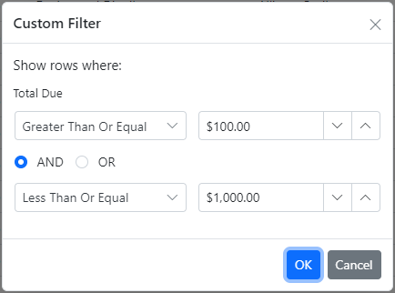

  </TabItem>
</Tabs>

:::note
Filtering the grid will use internal values to apply the specified criteria. For example, any numbers and dates/times that you enter as criteria will be automatically converted to typed values.
:::

## Searching

The `XSfGrid` component allows you to enable searching for a specific text across all or several columns. To enable search, you need to add a *Search* toolbar item and, optionally, configure the `GridSearchSettings`, as illustrated below.

```razor
<XSfGrid List="@VM.ListObj"
<!-- highlight-start -->
         Toolbar="@(new [] { "Search" })">
  <GridSearchSettings IgnoreCase="true" Operator="Operator.Contains"></GridSearchSettings>
<!-- highlight-end -->
  ...
</XSfGrid>
```

All columns are included in the search by default, but you can either indicate specific columns to search by in the `Fields` parameter of the `GridSearchSettings` or exclude a particular column from being searched by setting its `AllowSearching="false"` parameter. The search toolbar item will look as follows.

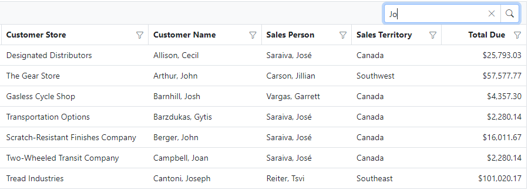

:::warning
The `XSfGrid` will search column values using their **display format**, which means, for instance, that you have to enter `4,357` for the third row above to match the last column since entering just `4357` will not match that display value.
:::

## Row selection

Syncfusion data grid provides a rich selection model, which allows you to select rows, cells, or both. The `XSfGrid` component helps you to synchronize the data grid's row selection with the [selected rows in the bound data list object](../../common-ui/data-lists#row-selection). This will allow you to write **generic presentation logic** using the list object selection rather than accessing the selection directly from the data grid.

There are two ways to keep the grid's selection in sync with that of the bound data list object. The grid can either propagate its row selection to the bound data list object or always use the row selection from the bound list. We discuss both of these options below.

### Updating list object selection

You can set up your grid to update the row selection of the bound data list object when your grid is used for selecting one or more rows without a need to reflect the changes to the list object's selected rows that happen outside of the grid.

This behavior is enabled by default when you set the grid's `AllowSelection` parameter to `true` and **use the `XSfGridEvents`** element **without a `RowSelected` handler**, as follows.

```razor
<XSfGrid List="@VM.ListObj"
<!-- highlight-next-line -->
         AllowSelection="true">
  <XSfDataManager></XSfDataManager>
<!-- highlight-start -->
  <XSfGridEvents></XSfGridEvents>
  <XSfGridSelectionSettings PersistSelection="true"></XSfGridSelectionSettings>
<!-- highlight-end -->
  ...
</XSfGrid>
```

:::note
If you use `XSfGridSelectionSettings` instead of the standard `GridSelectionSettings` element, then the grid will automatically use the [`RowSelectionMode`](../../common-ui/data-lists#row-selection) configuration of the bound data list object to determine if the grid should support single or multiple selection unless you explicitly specify the `Type` parameter on that element.
:::

You can prevent changing the selection by configuring a `RowSelecting` event handler on your `XSfGridEvents` element, where you can set the `Cancel` flag to `true` on the passed `RowSelectingEventArgs` as required.

:::tip
To make sure your selection is preserved after you reload the grid with new data, you may want to set the `PersistSelection` parameter to `true` on your grid selection settings. You will need to make sure, though, that one or more of the list's data properties are marked with `IsKey`, or one of the grid's columns is marked with `IsPrimaryKey`.
:::

### Using list object selection

If you want to set up your grid to always reflect the currently selected rows in the bound data list object, then you can set the `UseListSelection="true"` parameter on your `XSfGridSelectionSettings` as follows.

```razor
<XSfGridSelectionSettings UseListSelection="true" ...></XSfGridSelectionSettings>
```

Alternatively, you can specify a custom `RowSelected` handler on your `XSfGridEvents`, as follows.

```razor
<XSfGrid List="@VM.ListObj"
<!-- highlight-next-line -->
         AllowSelection="true">
  <XSfDataManager></XSfDataManager>
<!-- highlight-start -->
  <XSfGridEvents RowSelected="async (arg) => await LinkDetails_ClickAsync(arg.Data)"></XSfGridEvents>
  <XSfGridSelectionSettings EnableToggle="false"></XSfGridSelectionSettings>
<!-- highlight-end -->
  ...
</XSfGrid>
```

For example, if selecting a row is supposed to open a details view in the master-details view, then your `RowSelected` handler should check if the current details view can be closed, open the new details view, and then select the new row in the master list object, which will get automatically highlighted in the grid.

:::warning
Your custom `RowSelected` handler **should always update the data list selection** as appropriate. The grid will not update its selection automatically when a `RowSelected` handler is present to keep its selection in sync with the bound data list object.
:::

## Editing

The Syncfusion grid component provides powerful capabilities for editing its rows and cells. The `XSfGrid` builds on these capabilities to leverage the bound data list object and its data properties, which simplifies the configuration of the editable grids.

To enable editing of your `XSfGrid`, you need to configure it as follows.
- Enable selection by setting the `AllowSelection` parameter.
- Add `Toolbar` items to allow adding, editing, and deleting the selected row, as needed. You also need to add toolbar items for canceling the edits and for updating the row being edited with the new values.
- Add `GridEditSettings` and configure the `AllowAdding`, `AllowEditing`, and `AllowDeleting` parameters as appropriate.

:::note
Syncfusion grid provides a ton of other configuration parameters to fine-tune the editing setup.
:::

The following snippet illustrates this configuration.

```razor
<XSfGrid List="@VM.MainObj.DetailList"
<!-- highlight-start -->
          AllowSelection="true"
          Toolbar="@(new List<string>() { "Add", "Edit", "Delete", "Cancel", "Update" })"
<!-- highlight-end -->
          AllowPaging="true">
  <XSfDataManager></XSfDataManager>
  <XSfGridEvents></XSfGridEvents>
  <XSfGridSelectionSettings PersistSelection="true" EnableToggle="false"></XSfGridSelectionSettings>
  <GridPageSettings PageSizes="true"></GridPageSettings>
<!-- highlight-start -->
  <GridEditSettings AllowAdding="true" AllowEditing="true" AllowDeleting="true">
  </GridEditSettings>
<!-- highlight-end -->
  <GridColumns>
    <XSfGridColumn Field="@SalesOrderDetailList.ProductId" Width="22%"></XSfGridColumn>
    <XSfGridColumn Field="@SalesOrderDetailList.OrderQty" Width="12%"></XSfGridColumn>
    <XSfGridColumn Field="@SalesOrderDetailList.UnitPrice" Width="12%"></XSfGridColumn>
    <XSfGridColumn Field="@SalesOrderDetailList.UnitPriceDiscount" Width="10%"></XSfGridColumn>
    <XSfGridColumn Field="@SalesOrderDetailList.SpecialOfferId" Width="16%"></XSfGridColumn>
    <XSfGridColumn Field="@SalesOrderDetailList.LineTotal" Width="12%"></XSfGridColumn>
    <XSfGridColumn Field="@SalesOrderDetailList.CarrierTrackingNumber" Width="16%"></XSfGridColumn>
  </GridColumns>
</XSfGrid>
```

As a result, your grid will have the editing toolbar for the selected row, as illustrated below.

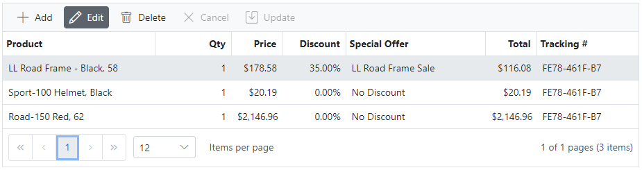

To add a new row, you can click the *Add* button, while to edit or delete an existing row, you need to select it first and then click the *Edit* or *Delete* buttons, respectively. By default, the grid is also configured to start editing a row when you double-click it.

The `XSfGrid` will automatically configure editors for each field based on the bound data property. If the data property is not editable, e.g., when it's calculated from other fields, then its column will not show an editor. Otherwise, the default editor will be based on the type of the data property, as follows.
- An [`EnumProperty`](../../common-ui/properties/enum) will automatically use an [`XSfDropDownList`](controls#xsfdropdownlist) as the editor.
- Numeric or text properties will use an [`XSfTextBox`](controls#xsftextbox) as the editor.
- A [`DateTimeProperty`](../../common-ui/properties/standard#datetime-properties) will automatically use an [`XSfDatePicker`](controls#xsfdatepicker) as the editor.

### Edit modes

The base Syncfusion data grid supports several edit modes: inline, dialog, and batch. **The Batch edit mode is currently not supported** by the `XSfGrid` component, and the other edit modes are described below.

<Tabs>
  <TabItem value="inline" label="Inline grid editing">

Inline grid editing is the default mode, but you can specify it explicitly by setting the `Mode` parameter to the `EditMode.Normal` value.

```razor
  <GridEditSettings AllowAdding="true" AllowEditing="true" AllowDeleting="true"
<!-- highlight-next-line -->
                    Mode="EditMode.Normal"></GridEditSettings>
```

The following picture illustrates inline grid editing using default editors when some columns are not editable since their data properties are calculated from other fields.

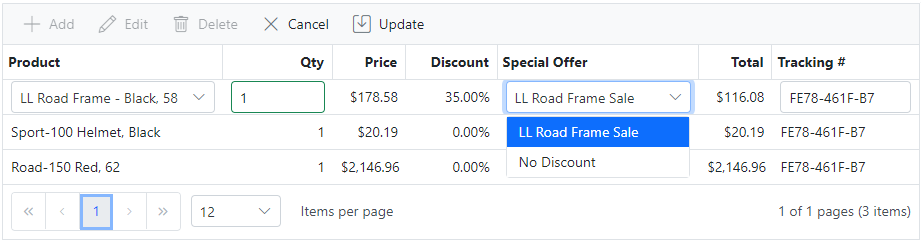

  </TabItem>
  <TabItem value="dialog" label="Dialog grid editing">

You can configure adding or editing grid rows via a separate dialog by setting the `Mode` parameter to the `EditMode.Dialog` value.

```razor
  <GridEditSettings AllowAdding="true" AllowEditing="true" AllowDeleting="true"
<!-- highlight-next-line -->
                    Mode="EditMode.Dialog"></GridEditSettings>
```

The default dialog will have the row's fields stacked up, but you can customize this layout in the grid's configuration. The read-only fields will be displayed using the [`XSfDataLabel`](controls#xsfdatalabel) control, while editable fields will use the default editors, with required fields marked by an asterisk in front of the label, as illustrated by the following pictures.

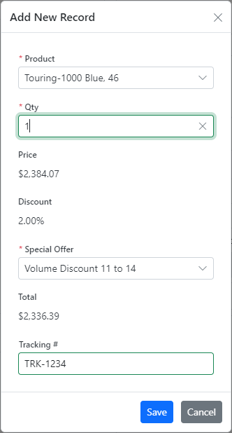 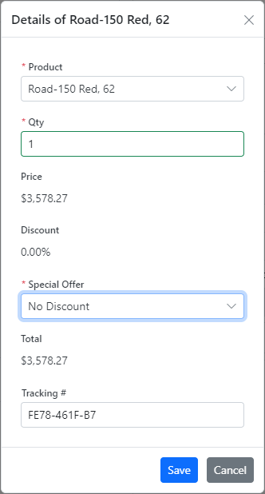

  </TabItem>
</Tabs>

### Edit commands column

Instead of selecting a row and clicking *Edit* or *Delete* buttons on the grid's toolbar, you can configure your editable grid to have an extra column for edit commands, as shown below.

```razor
<GridColumn HeaderText="Edit / Delete" Width="120">
  <GridCommandColumns>
    <GridCommandColumn Type="CommandButtonType.Edit"
      ButtonOption="@(new CommandButtonOptions() { IconCss = "e-icons e-edit", CssClass = "e-flat" })">
    </GridCommandColumn>
    <GridCommandColumn Type="CommandButtonType.Delete"
      ButtonOption="@(new CommandButtonOptions() { IconCss = "e-icons e-delete", CssClass = "e-flat" })">
    </GridCommandColumn>
    <GridCommandColumn Type="CommandButtonType.Save"
      ButtonOption="@(new CommandButtonOptions() { IconCss = "e-icons e-update", CssClass = "e-flat" })">
    </GridCommandColumn>
    <GridCommandColumn Type="CommandButtonType.Cancel"
      ButtonOption="@(new CommandButtonOptions() { IconCss = "e-icons e-cancel-icon", CssClass = "e-flat" })">
    </GridCommandColumn>
  </GridCommandColumns>
</GridColumn>
```

With this addition, the grid will have an extra column at the end with the *Edit* and *Delete* icons on each row. If you click on the *Edit* icon or add a new row via the toolbar's *Add* button, the edited row will have the *Update* and *Cancel* icons in that commands column, as illustrated by the following picture.

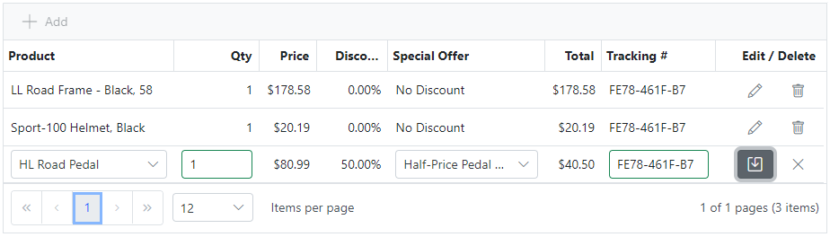

### Cell validation

When you edit row values in the grid, they will be automatically validated by the underlying [data property validation](../../common-ui/properties/base#property-validation) rules. The grid will display any validation errors in a tooltip below or above the corresponding field when you either leave that field or click the *Update* button, as shown below.

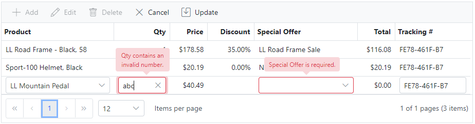

### Custom edit template

If you would like to use a different editor for a specific column, you can easily customize it by configuring a custom `EditTemplate` for that column.

:::note
Just like with the [custom templates](#custom-template), if you use a **property-bound control** in your edit template, make sure to **wrap it in a `CascadingValue` element**, where you cast the current `context` parameter as a `DataRow`.
:::

For example, let's say that instead of the default `XSfTextBox`, you would like to use the [`XSfNumericTextBox`](controls#xsfnumerictextbox) control for the editor of the order quantity column. In this case, you can set up your `EditTemplate` as follows.

```razor
<XSfGridColumn Field="@SalesOrderDetailList.OrderQty" Width="12%">
  <EditTemplate>
<!-- highlight-start -->
    <CascadingValue Value="context as DataRow">
      <XSfNumericTextBox ID="@SalesOrderDetailList.OrderQty"
                         Property="@VM.MainObj.DetailList.OrderQtyProperty" />
    </CascadingValue>
<!-- highlight-end -->
  </EditTemplate>
</XSfGridColumn>
```

Now, if you edit a row in such a grid, you will see that the *Qty* column uses a numeric box with up and down arrows, as shown below.

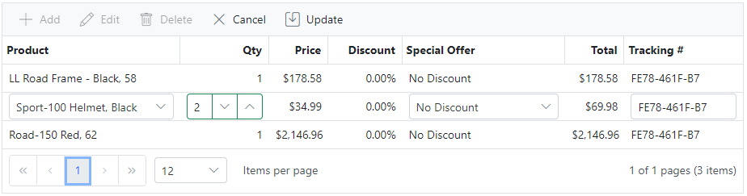

:::warning
For field validation messages to be properly displayed in the grid, you should **set the `ID` parameter to the property name** on the custom cell editor control, e.g., `ID="OrderQty"`. It should also match the column's `Field` parameter.
:::