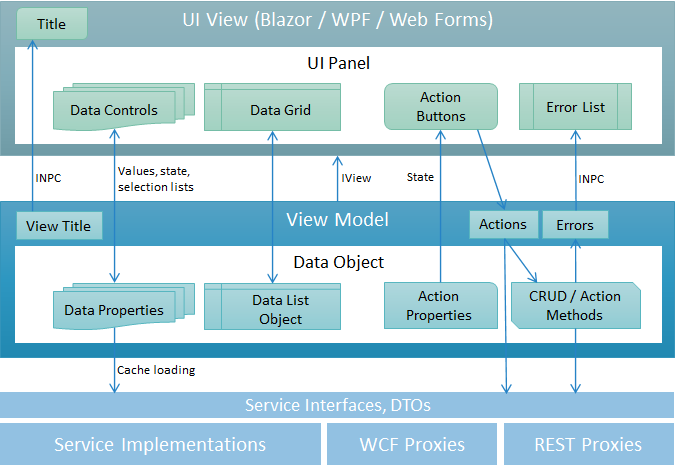

# UI Architecture

The user interface for the applications built with Xomega Framework use a **layered UI architecture**, with cleanly separated layers that allow you to write platform-independent presentation logic, which you can also reuse with various .NET UI frameworks - both web-based, such as Blazor or WebForms, and native, such as WPF or *MAUI*.

## View models

Xomega Framework UI clients use a variant of *MVVM* architecture, where the presentation logic for a view is implemented in a generic [*View Model*](vm/view-models) class that is bound to the UI view implemented by a particular .NET UI framework. The part of the view model that handles the data for the view is encapsulated within [*Data Objects*](data-objects) that may roughly map to the view's panels or other groups of visual elements.

Individual data controls on the view are bound to the [*Data Properties*](properties/base) of the data objects, while data grids on the view are bound to the [*Data List Objects*](data-lists), as illustrated by the following diagram.

Data objects and their data properties take care of converting the values to or from the display formats, validating the values, tracking modifications, propagating changes, and a ton of other common things that you otherwise would have to do in your view models.

:::info
By their structure, Data Objects and Data Properties can be compared to the Angular's *Form Groups* and *Form Controls* on steroids.
:::

Both the view model and its data objects may have regular properties, such as [*View Title*](vm/view-models#view-title), which you can listen to using the standard `INotifyPropertyChanged` (*INPC*) interface, and update the title of the bound view accordingly.

The view model may also call back certain view's methods via the `IView` or `IAsyncView` interfaces, if it needs to perform platform-specific actions, such as getting a confirmation from the user, without adding explicit dependencies on that platform.

In addition to the data properties, data objects and view models may have [*Action Properties*](properties/action) that the view's action buttons can be bound to. This allows you to control the state of those buttons from the view model, including specifying enabling or visibility conditions.

## Calling services

The action buttons usually invoke methods in the view model, which may in turn call the appropriate action methods in the data objects. The latter can use the data of their data objects to call the business services, and populate the data objects from the returned results.

If the validation or the service calls return any [errors or messages](../services/errors), those would be stored in the `Errors` property of the view model, and subsequently displayed in the bound *Error List* control on the view.

[*Enum Properties*](properties/enum) may also call business services indirectly to load and cache [*Lookup Data*](lookup) that is used to display selection lists, or to validate the entered values.

The business services are called via *Service Interfaces* and *DTOs* (data transfer objects), which may invoke the service implementations either directly, or via remote proxies, depending on your [Services Architecture](../services/common#architecture).