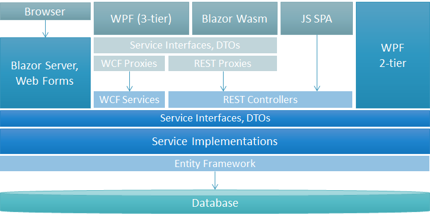

# Services Framework

Xomega Framework encourages you to use a layered structure for your applications, where you develop your business logic in a set of business services. This will allow you to keep the business services platform independent and reuse them in various multi-tier architectures.

## Services architecture{#architecture}

To describe the business services you want to define a set of *Service Interfaces* with your service operations, as well as Data Transfer Objects (*DTOs*), that are used for the input and output of those operations. Then you would provide implementations of those interfaces in a set of stateless service classes, where you implement the business logic for your app.

Defining your services as interfaces allows you to decouple the client logic from the business logic, and use Dependency Injection (DI) to provide the *Service Implementations*. It also allows you to expose your services via REST API, WCF or another communication protocol, and have your clients call your services remotely through the same interfaces using a set of client proxies, as illustrated below.



This way you can **reuse the same business services** with multiple architectures - from server-side and two-tier clients, where the client calls the services directly, to multi-tier, where the clients call them remotely via your communication framework of choice.

Moreover, the fact that .Net-based clients call the services the same way via interfaces supplied by the DI container allows you to also **reuse the same client code** across various architectures.

:::note
The JS SPA client in the above picture won't be able to reuse the common UI logic, since it's written in JavaScript and not .Net.
:::

## Service operations

When defining service operations for Xomega Framework, you need to follow certain standards and conventions, as outlined below.

### Asynchronous methods

First of all, you want to make your operations asynchronous in most of the cases to enable using them for remote calls. This means that the method for the operation should return a `Task`, and should usually accept a `CancellationToken` as the last argument to allow cancellations.

:::caution
If you plan to expose your service via the legacy WCF framework, then you should drop the cancellation token argument since WCF doesn't support those.
:::

### Operation output

The async methods for Xomega Framework service operations should return the `Output` class that is defined in the `Xomega.Framework.Service` namespace. The `Output` class contains a list of standard error or warning messages from the operation and the HTTP status code for the REST API.

If your operation returns some data, then you should define a class for that data structure, and use that class as a parameter of the `Output` class. The actual output data will be available in the `Result` field of the `Output` class.

:::note
The `Output` classes are configured to be serializable for returning them either from the REST API or from the WCF calls.
:::

For example, if the `ReadList` operation of the `ISalesOrderService` returns a collection of sales order data, which is defined by the `SalesOrder_ReadListOutput` class, then the interface method should be declared as follows.

```cs
public interface ISalesOrderService
{
/* highlight-next-line */
    Task<Output<ICollection<SalesOrder_ReadListOutput>>> ReadListAsync(...);
}
```

### Operation input

When declaring the input parameters of the operation's method, you want to make sure they would be compatible with the REST API, or with any other communication framework that you want to support.

Typically, you would declare a special class to hold the input data, which would be passed in the request body, when using REST API. However, you may need to pass certain simple parameters as individual arguments, to allow sourcing them from the URL path.

In the following example, we pass the `_salesOrderId` as a separate argument, so that it could be provided in the URL, while the rest of the input data would come from the request body using our `SalesOrder_UpdateInput_Data` structure, as illustrated below.

```cs
    Task<Output<SalesOrder_UpdateOutput>> UpdateAsync(
/* highlight-next-line */
      int _salesOrderId, SalesOrder_UpdateInput_Data _data, CancellationToken token = default);
```

As mentioned above, the input arguments should also have a cancellation token for asynchronous methods.

## Service implementations

Once you define the interfaces for your service operations, you'll need to implement them in the specific classes that you will register with the DI container during the application startup. The main service implementations should perform the business logic of the service operation and access the database as needed, as represented by the *Service Implementations* box in the architecture diagram [above](#architecture).

:::note
If you expose your services via REST API, you should also create separate implementations of these interfaces for the *REST Proxies*.
:::

### Service registrations

The implementation classes for the service interfaces should be instantiated for each request using dependency injection (DI), so you will need to register them with the DI container as scoped services in your application's `Startup` class, as follows.

```cs
public class Startup
{
    public void ConfigureServices(IServiceCollection services)
    {
        ...
    /* highlight-next-line */
        services.AddScoped<ISalesOrderService, SalesOrderService>();
        ...
    }
}
```

In order to simplify the `Startup` class, we recommend creating a separate extension method for the service collection, which registers all your business service implementation classes, as illustrated below.

```cs
public static class ServiceImplementations
{
/* highlight-next-line */
    public static IServiceCollection AddServiceImplementations(this IServiceCollection services)
    {
        services.AddScoped<ISalesOrderService, SalesOrderService>();
        ...
        return services;
    }
}
```

This way you'll be able to register your service implementations in the `Startup` class with a single line, as follows.

```cs
    services.AddServiceImplementations();
```

:::note
You can use the same approach to register *REST Proxies* implementations on the client side.
:::

### Base service class

To help you develop the implementation of your business service, Xomega Framework provides a base class `BaseService` that your service implementation classes can extend. The base service class provides you with support for querying data, error reporting, security and other services that are common to most business service implementations.

The base service class requires the current `IServiceProvider` to be passed to its constructor, so your service will need to accept that in the constructor as well. This allows the base class to access all the necessary services it needs from the DI container, and you won't have to change your service implementation classes if you upgrade to a newer version of the Xomega Framework, where the base service requires additional services.

The following example demonstrates a service implementation for the `ISalesOrderService` interface, which uses the `BaseService` as the base class.

```cs
using Xomega.Framework.Services;

/* highlight-next-line */
public class SalesOrderService : BaseService, ISalesOrderService
{
    protected YourEntitiesContext ctx;

/* highlight-next-line */
    public SalesOrderService(IServiceProvider serviceProvider) : base(serviceProvider)
    {
        ctx = serviceProvider.GetService<YourEntitiesContext>();
    }
    ...
}
```

In the next sections, you'll learn the details about specific common aspects of the service implementations that are provided by the `BaseService` class and by the Xomega Framework in general.