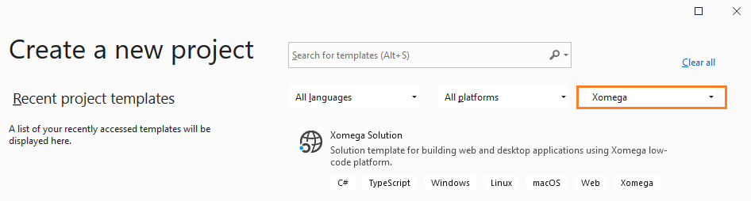
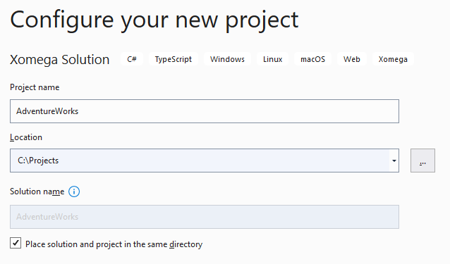
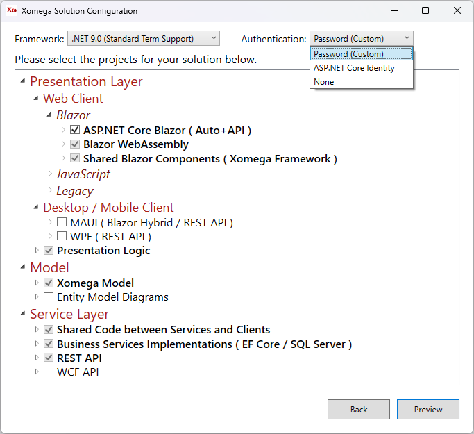
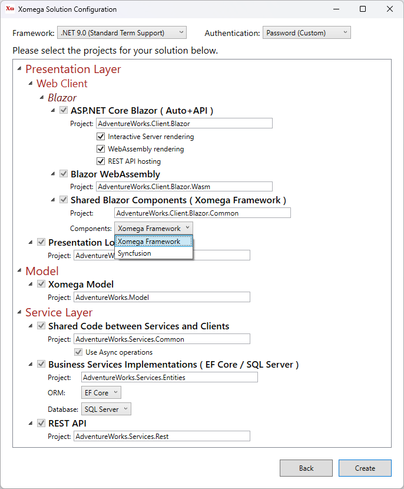
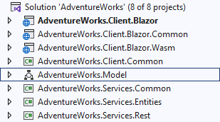

# 1.1 Create Xomega solution

Xomega.Net adds a new project template to Visual Studio that allows you to create and configure your solution for a specific architecture.

## Xomega project template

To create a new Xomega solution select the *New Project* option in your Visual Studio 2019 and then pick *Xomega* project type or enter *Xomega* in the search box to find the *Xomega Solution* template, as shown below.

Select the* Xomega Solution* template, and click *Next* to get to the following screen.

Set *AdventureWorks* as the project name, select the location to create the solution in, check the checkbox to place solution and project in the same directory, and click *Create*.

## Xomega solution configuration

You should see a *Xomega Solution Configuration* screen, which allows you to pick and configure client-side and server-side technologies and projects that you want to use in your solution. Any other projects that are required for your selection will be automatically included in the solution as well.

We are going to start with the Blazor technology in this tutorial, so let's include *Blazor WebAssembly* and *Blazor Server* in our solution, as shown below.

You'll notice that all required projects with common logic and services will be automatically selected. The WebAssembly project will also require a REST API to access the business services.

:::note
If you want to target several technologies at the same time, such as WPF, you can select additional projects here, and they'll share most of the presentation and business logic of your solution. 
:::

Once you select the projects for your solution, click *Preview* to view and update configuration of the selected projects. You can customize the name of each project, and specify project-specific options, such as which Blazor components to use, as shown below.

:::tip
You can also specify this configuration for each project on the previous screen by expanding the corresponding projects.
:::

We will use the default configuration, so you can go ahead and click the *Create* button.

## Blazor solution structure

Creating a solution with all the projects may take a while as all the dependency packages are being restored, and the projects are being configured, but once the dust settles, you can collapse all projects and see the following eight projects created in your solution.

- **AdventureWorks.Model** is the project that will contain your XML domain and service models for the application, and various generators that perform model transformations and code generation.
- **AdventureWorks.Services.Common** project will have all interfaces and data contracts (DTOs) for your service model, as well as other classes that are shared between the client and the services layers.
- **AdventureWorks.Services.Entities** project will contain the back-end domain object classes based on Entity Framework, as well as implementations of the services that use these domain objects.
- **AdventureWorks.Services.Rest** project will contain Web API controllers that expose the services via REST interface.
- **AdventureWorks.Client.Common** project will contain Xomega Framework C# data objects for the presentation layer, as well as view models for different views, and will encapsulate a significant part of the client logic. These objects and view models are not specific to any particular client, and are reused by all C# based clients, such as WPF clients, Blazor Server or WebForms. This is why they are configured to have their own project.
- **AdventureWorks.Client.Blazor.Common** project will contain Blazor views and components that are shared between the Blazor Server and WebAssembly projects.
- **AdventureWorks.Client.Blazor.Server** project is the main application project for the Blazor Server client.
- **AdventureWorks.Client.Blazor.Wasm** project is the main application project for the Blazor WebAssembly client.

Now that you understand the solution structure, let's import our initial Xomega model from the sample database.
