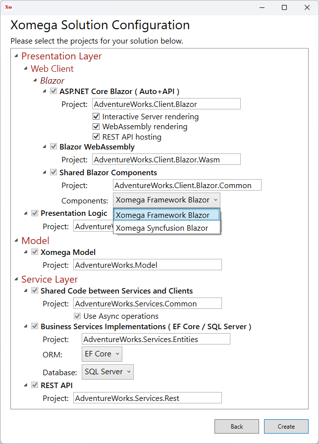

# 1.1 Create Xomega solution

Xomega.Net adds a new project template to Visual Studio that allows you to create and configure your solution for a specific architecture.

## Xomega project template

To create a new Xomega solution select the *New Project* option in your Visual Studio and then pick *Xomega* project type or enter *Xomega* in the search box to find the *Xomega Solution* template, as shown below.

Select the *Xomega Solution* template, and click *Next* to get to the following screen.

Set *AdventureWorks* as the project name, select the location where to create the solution, check the checkbox to place the solution and project in the same directory, and click *Create*.

:::note
If you are using Xomega for the first time, you may get asked to supply a license file here, as shown below.

If you haven't done it yet, you'll need to download the license file from your order, and then select that file in the next dialog.
:::

## Xomega solution configuration

You should see a *Xomega Solution Configuration* screen, which allows you to pick and configure client-side and server-side technologies and projects that you want to use in your solution. Any other projects that are required for your selection will be automatically included in the solution as well.

We are going to start with the Blazor technology in this tutorial, so let's select *ASP.NET Core Blazor* project, as shown below.

You'll notice that all required projects with common logic and services will be automatically selected. The WebAssembly project will also require a REST API to access the business services.

:::note
If you want to target several technologies at the same time, such as WPF, you can select additional projects here, and they'll share most of the presentation and business logic of your solution. 
:::

Once you select the projects for your solution, click *Preview* to view and update the configuration of the selected projects. You can customize the name of each project, and specify project-specific options, such as which Blazor components to use, as shown below.

:::tip
You can also specify this configuration for each project on the previous screen by expanding the corresponding projects.
:::

We will use the default configuration that includes both Blazor Server and WebAssembly interactive rendering using the `Auto` mode and hosts the REST API right in the Blazor project, so that you don't have to run a separate project for it. Therefore you can just go ahead and click the *Create* button.

## Blazor solution structure

Creating a solution with all the projects may take a while as all the dependency packages are being restored, and the projects are being configured, but once the dust settles, you can collapse all projects and see the following eight projects created in your solution.

- **AdventureWorks.Model** is the project that will contain your XML domain and service models for the application, and various generators that perform model transformations and code generation.
- **AdventureWorks.Services.Common** project will have all interfaces and data contracts (DTOs) for your service model, as well as other classes that are shared between the client and the services layers.
- **AdventureWorks.Services.Entities** project will contain the back-end domain object classes based on Entity Framework, as well as implementations of the services that use these domain objects.
- **AdventureWorks.Services.Rest** project will contain Web API controllers that expose the services via the REST interface.
- **AdventureWorks.Client.Common** project will contain Xomega Framework C# data objects for the presentation layer, as well as view models for different views, and will encapsulate a significant part of the client logic. These objects and view models are not specific to any particular client and are reused by all C# based clients, such as WPF clients, Blazor Server or WebForms. This is why they are configured to have their own project.
- **AdventureWorks.Client.Blazor.Common** project will contain Blazor views and components that are shared between the Blazor Server and WebAssembly projects.
- **AdventureWorks.Client.Blazor.Wasm** project contains the Blazor WebAssembly client.
- **AdventureWorks.Client.Blazor** project is the main application project for the Blazor client.

## Review the empty application{#login}

Now that you understand the solution structure, let's build the solution and run the application that we got out of the box. Our solution template created an empty application that is secured with a user name and password, so you should see the following login screen.

:::note
The basic classes for the login screen and its supporting services are actually generated from a model file `login.xom` that came with the solution template, but the template also included some customized classes to make the screen look properly.
:::

:::warning
The template also added some code to **pre-populate the user name and password** with some default values to make it easier for you to run the app during the development. You should [**remove this code**](../security/authentication#remove-default-credentials) after you implement proper security for your app.
:::

Given that the login screen has been generated from the model as a details view, you can immediately see some standard features of the details views that you get for free.

For example, all required fields are automatically marked with a red asterisk in front of their labels. Any invalid fields will be highlighted in red, with the validation message displayed right below the field. And if you try to submit an invalid form, the summary of all validation errors will be also displayed at the top, as illustrated in the following picture.

Furthermore, the initial solution template has set up all the plumbing for checking the security, where you just need to implement the last bit of the actual check for the user name and password in a special login service, which we will do [at the end of this tutorial](../security/authentication).

By default, it allows any user name and the word `password` as the password. If you enter a different password, you'll see the following error from the login service, which gives you an idea of how an invalid login will look and feel in the real app.

If you enter the default user name and *password*, then you should get to a blank *Home* screen with a (rather empty) sidebar menu, as illustrated below.

:::note
Take note of the logged-in user's name in the top right corner, as well as a *Sign out* menu, which will log you out and will take you back to the *Login* screen.
:::

Now that we have reviewed the blank initial Blazor application that we created, let's import our Xomega model from a sample database, so that we could build out our app further.
