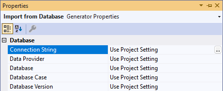
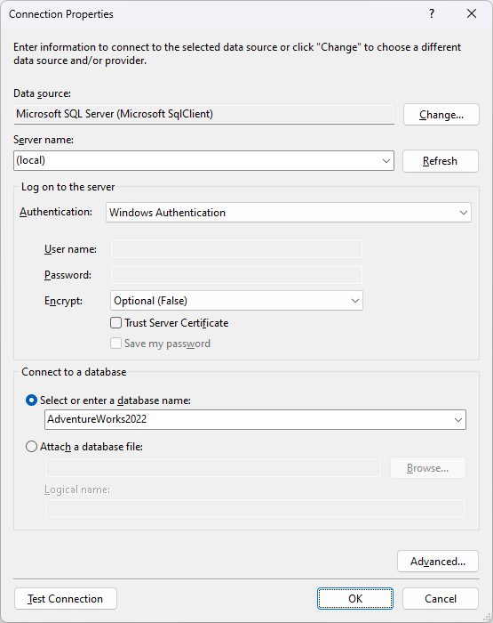

# 1.2 Import Xomega model

The first thing you need to do to import the Xomega model from a database is to set up the connection properties for the corresponding generator.

## Configure database connection

Expand the *Generators* node in the *AdventureWorks.Model* project, and find the *Import from Database* generator under the *Model Enhancement* folder, which groups generators that enhance the model with additional information.

 

Double-click on the generator to open its properties, and click on the editor for the *Database Connection* property, which will pop up a *Database Connection Configuration* dialog as follows.

You will need to provide the connection string, which you can also specify in a separate dialog by clicking the *Configure* button. We will select the *Microsoft OLE DB Provider for SQL Server*, and the sample *AdventureWorks2022* database on the local SQL server instance using windows authentication, as shown below.

  

Once you set up the connection string and click *Next*, you will be prompted to exclude any tables from the import. We'll include all tables in the import, so you can just click *Next* again to view the summary of the connection settings, as follows.

Verify the database information, select the option to save it as a project default configuration, and then click *Finish*.

## Run the import from a database

To run the import from the database, right-click on the *Import from Database* generator, and select the *Generate* option from the context menu.

Once the generator is finished running, you should see the imported model files under the *Import* folder, which is specified in the generator's *Output Path* property by default. The imported files are organized to have each object in its own file, which roughly maps to the database tables, and grouped by module, which is derived from the database schema of the table. Here's how it will look.

The model objects were imported from the database using the database structure, as well as any model setup that existed before the import, such as the logical types defined.

This is a good start, but it is not enough to build a fully-fledged application beyond just a "database table editor". To model our application and describe different services and views that it will have, we need to further enhance our model with all that information about application views, data objects and services, which is what we're going to do next.
