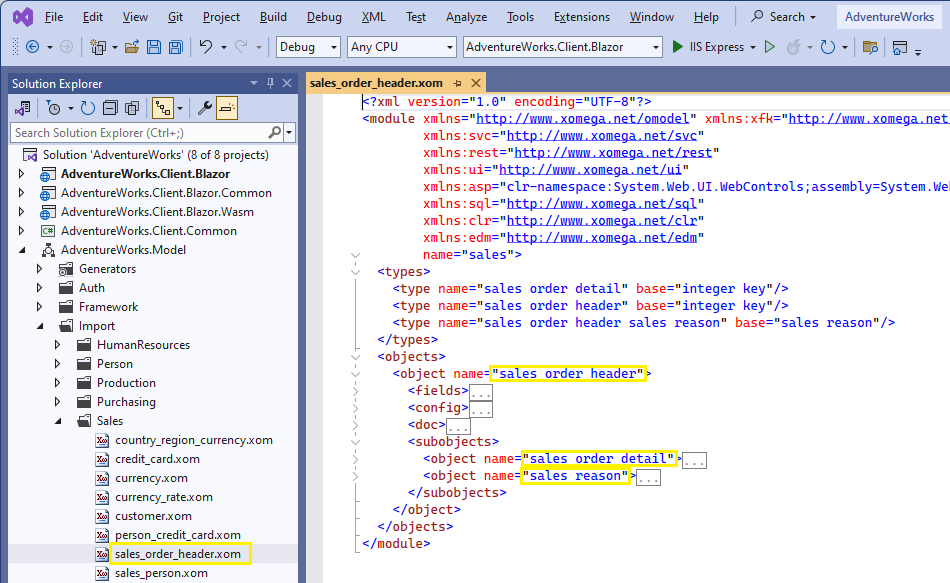
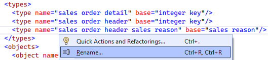
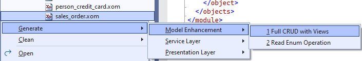

# 1.3 Add CRUD operations

When you are building a real application, you will pretty much know what kind of views you want and which objects they will be based on. But, for this tutorial, let's pick the `sales order` object to build a list screen for searching sales orders, and a details screen for creating new and editing existing sales orders. This is a reasonably large and complex object to demonstrate different features of the Xomega platform, which can also realistically represent the sales module of our application.

## Sales Order domain object

Let's go ahead and open up the imported `sales_order_header.xom` file, which contains the XML for our Xomega object model. To make reading and browsing this XML much easier, Xomega allows you to collapse it to definitions of different model entities. So go ahead and select the *Outlining > Collapse To Definitions* in the context menu for that XML to see it better, or just press the Ctrl+M, Ctrl+O shortcut.

:::tip
If the editor for the `sales_order_header.xom` doesn't show XML syntax highlighting or the *Collapse To Definitions* command, then try closing and reopening that file, as the Xomega Editor may not have been loaded on the initial open.
:::

Based on the special relationships (with cascading delete) between the `SalesOrderHeader` table and its child tables (`SalesOrderDetails` and `SalesReason`), the latter have been imported as subobjects of the sales order object, and automatically include its keys implicitly. The following picture demonstrates this.

However, the objects' names (highlighted) have been derived from the corresponding tables' names, and may not provide particularly good choices for other entities, such as data objects or views, that will be generated from them. This is especially true for subobjects since Xomega generators always try to fully qualify them with their parent object's name.

Therefore, before we move any further, let's rename these objects to make them more succinct, and to work better with the Xomega generators as follows.

## Refactoring before adding CRUD

We will rename `sales order header` to just `sales order` (including the file name), `sales order detail` to `detail`, and `sales reason` to `reason`. It is important to **do it before** we add any standard data objects or views to avoid tedious renaming afterward.

While we're at it, we can also rename some long type names, such as the ones shown below, but it's not that critical at this point, since we can do it at any time later.

Xomega provides standard refactoring capabilities, where you can right-click on a type, and pick *Rename* from the context menu. Along with the *Rename* dialog, where you supply the new name, the system will also display all references to the current type, which will be renamed as well, as shown in the following picture.

## Adding CRUD operations and views

Once all objects are properly renamed, all you have to do is to right-click on the `sales_order.xom` file and run the *Full CRUD with Views* generator under the *Model Enhancement* submenu. This is a powerful generator that can add various model elements, as configured, to one or more selected objects.

Here is a high-level view of the different things it added.

As you can see, it added standard `create`, `read`, `update`, `delete` (CRUD) and `read list` operations to the objects, defined Xomega data objects for view models, as well as the actual search and details views for the objects and subobjects in the file.

Under the hood, it also configured each of these elements properly, so that views are bound to the data objects, and the data objects are tied to the operations, set up as each other children as appropriate, and have proper links to other views.
