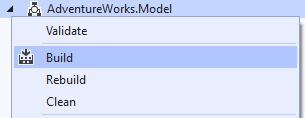
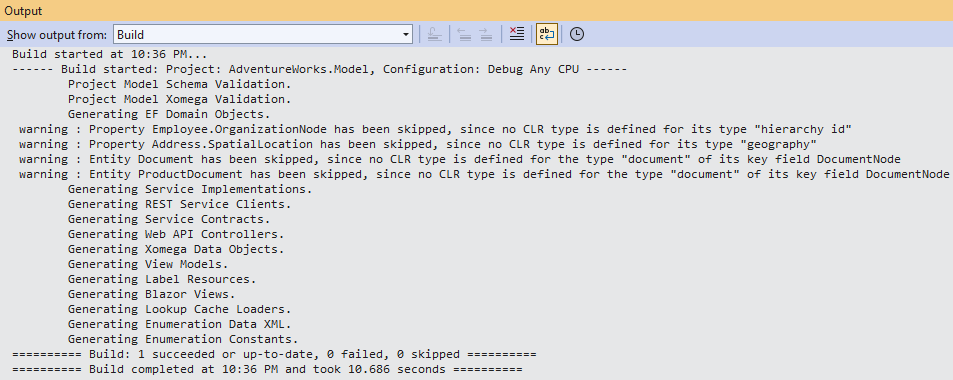

# 1.4 Build the model

Now that we have a domain model and a basic service model with views for the sales order object, we need to run all re-runnable generators to generate the actual code for our application. All such generators have *Include in Build* property set to *True* by default, which you can configure as you like to control which generators are run when you build the model project.

:::caution
Note that the **model** project will **not** be **built automatically** when you build the entire solution, since it needs to be built only if the model changes, so you need to build it manually.
:::

In order to build the model you have to manually run the build for the model project by right-clicking on the project and selecting the *Build* menu option.

This will run the generators and write their output to the respective output paths, as configured for each generator.

:::danger
**Do not run the *Rebuild*** option, which runs the *Clean* option followed by the *Build*, unless you know what you are doing.

The *Clean* option will **delete** all **generated files**, and any **mixed in customizations**.

Cleaning/rebuilding is only useful when you are renaming model entities in such a way, that it affects the names of the generated files, and you need to clean up the old files. Always check in your files to your source control first.
:::

## Model build output

The output console for the build will print the generators being run and any warnings or other output from the generators as shown below.

You can resolve the warning about the `numeric` logical type later by updating the type that inherits from it.

The warnings from the *EF Domain Objects* generator tell you that some fields in the database and the model use a `hierarchy` type that is not supported by the Entity Framework yet, or a `geography` type, for which there is currently no mapping in the model, and therefore will be skipped in the generated domain classes.

As you can see, the model build process, among other artifacts, also generated Service Implementations and Blazor Views. This allows us to go straight to building the entire solution and running the application.
