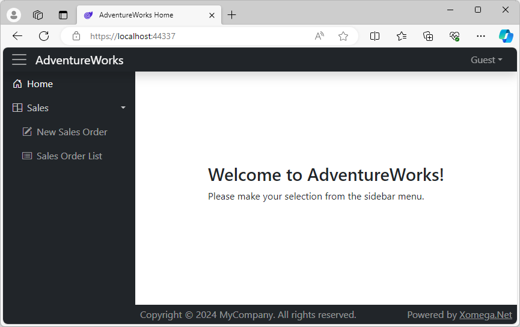
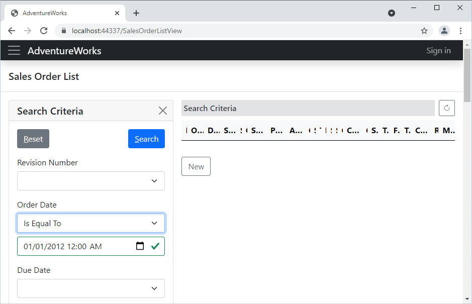
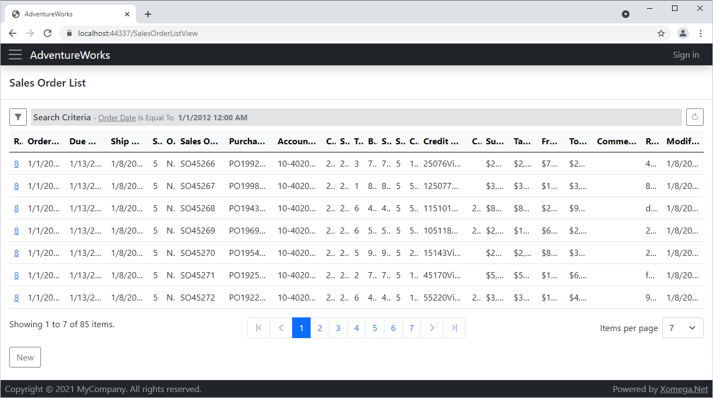
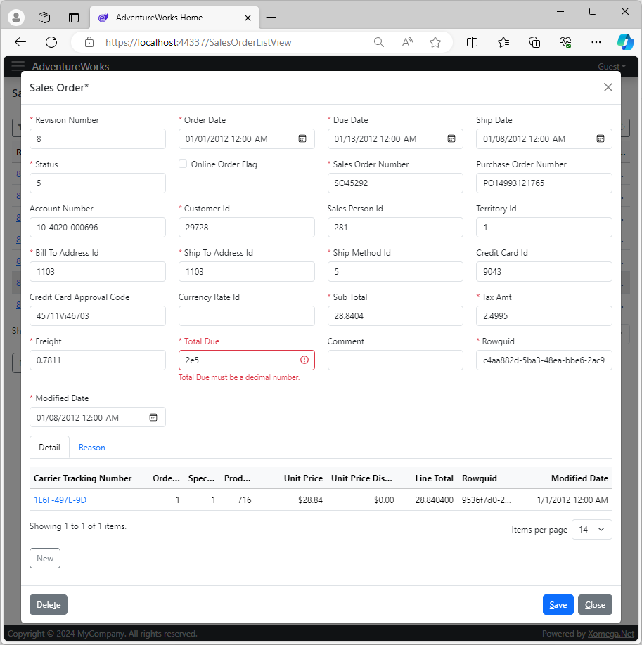
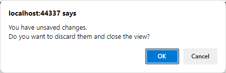
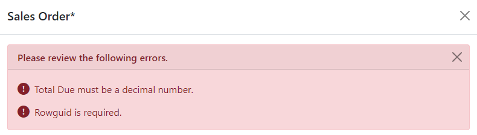

# 1.5 Run the application

Let's go ahead and build the solution. If everything has been set up and run correctly, you should get no build errors.

## Interactive render modes

The way we configured our solution initially was to use the `InteractiveAuto` render mode for Blazor pages. This means that **while Blazor WebAssembly libraries are being loaded** by the browser, any interactivity on the screens will be provided by the *Blazor Server*. Once the WebAssembly is loaded, the screens will transition to being rendered by the Blazor WebAssembly technology.

However, you can easily change the render mode in the `App.razor` file under the `AdventureWorks.Client.Blazor.Common` project. For example, if you want to run the application exclusively using Blazor Server, you can change the `RenderModeForPage` to be `InteractiveServer` as follows.

```razor title='App.razor'
...
@code {
<!-- removed-next-line -->
    private IComponentRenderMode RenderModeForPage => InteractiveAuto;
<!-- added-next-line -->
    private IComponentRenderMode RenderModeForPage => InteractiveServer;
}
```

Similarly, you can change it to `InteractiveWebAssembly` to have the screens rendered by Blazor WebAssembly only. The only difference for this mode with the `InteractiveAuto` would be that the app will show a *loading* screen while WebAssembly libraries are being loaded, instead of rendering it with Blazor Server.

These architectures are substantially different under the hood, where Blazor Server has direct access to the database and other server-side resources, while Blazor WebAssembly needs to make REST API calls to read or save data. However, thanks to the flexible Xomega architecture, our application is designed to work the same way whichever render mode you choose.

## Reviewing new screens

To review the new *Sales Order* screens that we generated from the model, let's run the application and click the *Login* button on the [login screen](create#login) using default *Guest* credentials.

### Sidebar menu

If you expand the sidebar menu on the *Home* screen, you'll notice that it now has a sub-menu for our *Sales* module, which contains menu options to open the search form for sales orders, and a form to create new sales orders as follows.



Let's click on the *Sales Order List* menu to see the generated search form for sales orders.

### Search criteria

As you can see below, the *Sales Order List* form has a collapsible side panel, where you can specify search criteria by all of the sales order fields. For maximum flexibility, each criterion allows selection of an operator based on the type of field.



Let's enter some criteria by the Order Date, and click *Search*. The view will validate your input, run the search, and then collapse the criteria panel and show the data in the results grid.

### Search results grid

The generated results grid displays paged results, as well as a summary of applied search criteria above the grid, as shown below.



:::note
Since we added default CRUD operations without any modifications, both the results grid and the criteria panel show **all sales order fields**, which makes them too large and not as useful. We will improve this in the later part of this tutorial.
:::

The grid supports multi-column sorting of the results by clicking on the corresponding columns. It will then display a sort indicator with an up/down for the sort order. Clicking on a sorted column will change the sort direction while clicking on another column with a Ctrl key down will add or remove that column as a secondary sort column with a smaller indicator.

The grid pager shows the number of items on the current page out of the total number of matching results and allows changing the number of items to display on one page.

Notice that the *Sales Order Id* column is hidden, but the first column has a link to the details view. Let's click on that link to view or edit the sales order details.

### Details view 

The details view will open up as a popup window, which displays all fields of the sales order using a responsive layout in several columns, based on the width of the screen. Below the main fields are two tabs for its child lists - sales order details and sales reasons.



It is worth noting a number of editing features that the details view will provide out of the box, as follows.

**Required fields** are automatically highlighted with a red asterisk here.

**Modification tracking.** If you change any field, the *Save* button will become enabled, and you'll notice an asterisk next to the view title indicating that the view has been modified. If you try to close a modified details view, you'll get the following warning about unsaved changes, where you can either discard the changes and close the view, or cancel and keep the view open.



**Fields validation.** If you enter invalid values into the fields or leave a required field blank, the invalid fields will turn red, and you'll see a validation message under each field. If you also try to save an invalid view, you'll see a summary of validation errors displayed at the top of the view, as shown below.



## Summary

As you can see, with virtually no effort we were able to generate some basic but pretty powerful, search and details forms out of the box. Granted that such basic forms will hardly be very useful as is, without any customization, unless they are really simple.

We clearly don't want to display all possible object fields, including internal ones like the row GUIDs. Nor do we want to view or edit internal raw IDs using plain text boxes.

Therefore, in the following sections, we will show you how to mold our model to display the forms the way we want them to look, as well as how to customize any generated code to make the application behave the way we need it to.
