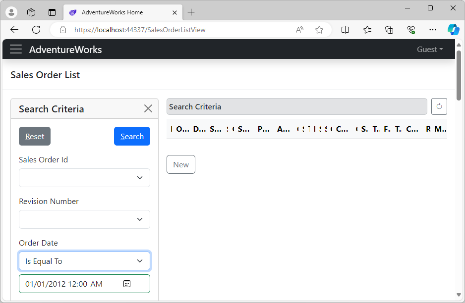
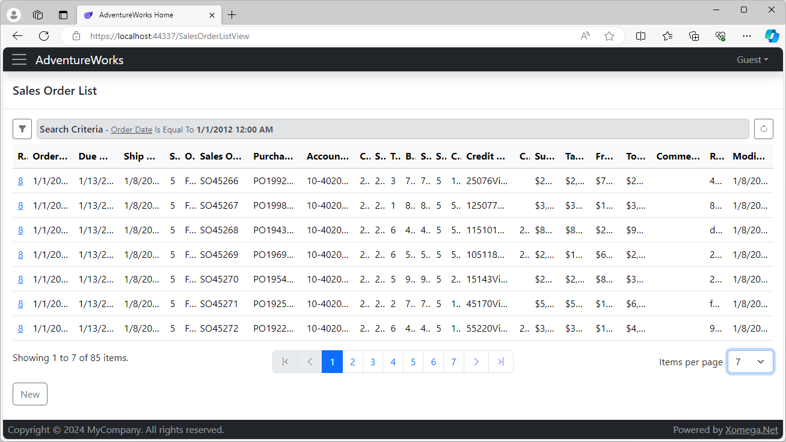
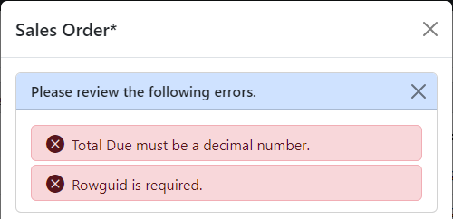

# 1.5 Run the application

Let's go ahead and build the solution. If everything has been set up and run correctly, you should get no build errors.

## Running Blazor Server application

In order to run a Blazor Server application you can right-click on the *AdventureWorks.Client.Blazor.Server* project, set it as a startup project, and then hit F5 to start the application in the Debug mode.

### Home page

Your browser should launch the *Home* screen of the web application with a collapsible side navigation menu. The menu will have a sub-menu for our Sales module, which contains menu options to open the search form for sales orders, and a form to create new sales orders.

Let's click on the *Sales Order List* menu to see the generated search form for sales orders.

### Search criteria

As you can see below, the *Sales Order List* form has a collapsible side panel, where you can specify search criteria by all of the sales order fields. For maximum flexibility, each criteria allows selecting an operator based on the type of the field.

Let's enter some criteria by the Order Date, and click *Search*. The view will validate your input, run the search, and then collapse the criteria panel and show the data in the results grid.

### Search results grid

The generated results grid displays paged results, as well as a summary of applied search criteria above the grid, as shown below.

:::note
Since we added default CRUD operations without any modifications, both the results grid and the criteria panel show **all sales order fields**, which makes them too large and not as useful. We will improve this in the later part of this tutorial.
:::

The grid supports multi-column sorting of the results by clicking on the corresponding columns. It will then display a sort indicator with an up/down for the sort order. Clicking on a sorted column will change the sort direction, while clicking on another column with a Ctrl key down will add or remove that column as a secondary sort column with a smaller indicator.

The grid pager shows the number of items on the current page out of the total number of matching results, and allows changing the number of items to display on one page.

Notice that the *Sales Order Id* column is hidden, but the first column has a link to the details view. Let's click on that link to view or edit the sales order details.

### Details view 

The details view will open up as a popup window, which displays all fields of the sales order using responsive layout in several columns, based on the width of the screen. Below the main fields are two tabs for its child lists - sales order details and sales reasons.

It is worth noting a number of editing features that the details view will provide out of the box, as follows.

**Required fields** are automatically highlighted with a red asterisk here.

**Modification tracking.** If you change any field, the *Save* button will become enabled, and you'll notice an asterisk next to the view title indicating that the view has been modified. If you try to close a modified details view, you'll get a warning about unsaved changes, where you can either discard the changes and close the view, or cancel and keep the view open.

**Fields validation.** If you enter invalid values into the fields, or leave a required field blank, the invalid fields will turn red, and you'll see a validation message under each field. If you also try to save an invalid view, you'll see a summary of validation errors displayed at the top of the view, as shown below.

As you know, Blazor Server applications are run on the server, and can access any libraries and resources, including directly calling the business services. Let's take a look at what it would take to run our application as a WebAssembly.

## Running WebAssembly application

Thanks to the Xomega architecture and the solution structure that cleanly separate application layers, you can run Blazor apps as a WebAssembly without any code changes. Since WebAssembly applications run entirely in the browser, they need to access business and data services via a REST API, or via some other HTTP-based API.

Luckily, Xomega solution wizard already included the REST API project for our business services. So, in order to run our app as a WebAssembly, all you have to do is to open the solution properties, and set both the WebAssembly and REST API projects as startup projects, as follows.

If you run the application now, you'll see that it looks exactly like the Blazor Server application, despite using a different architecture.

You may notice the standard 'Loading...' message during the initial load, or if you refresh the page, but otherwise the only visible difference would be a different port in the application URL.

## Summary

As you can see, with virtually no effort we were able to generate some basic, but pretty powerful, search and details forms out of the box. Granted that such basic forms will hardly be very useful as is, without any customization, unless they are really simple.

We clearly don't want to display all possible object fields, including internal ones like the row GUIDs. Nor do we want to view or edit internal raw IDs using plain text boxes.

Therefore, in the following sections we will show you how to mold our model to display the forms the way we want them to look, as well as how to customize any generated code to make the application behave the way we need it to.
