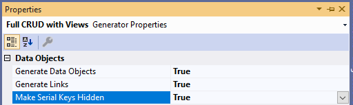

# 2.2 Fields & links display

After our updates to the output of the `read list` operation in the previous section, it should look as follows.

```xml title="sales_order.xom"
  <object name="sales order">
    ...
    <operations>
      <operation name="read list" type="readlist">
        <input>[...]
        <output list="true">
          <param name="sales order id"/>
          <param name="sales order number"/>
          <param name="order date" type="date"/>
          <param name="due date" type="date"/>
          <param name="ship date" type="date"/>
          <param name="status"/>
          <param name="online order flag" type="yesno" required="true"/>
          <param name="customer store" type="string"/>
          <param name="customer name" type="string"/>
          <param name="sales person id"/>
          <param name="territory id"/>
          <param name="total due"/>
          <config>
            <!-- highlight-next-line -->
            <xfk:add-to-object class="SalesOrderList"/>
          </config>
        </output>
      </operation>
    </operations>
  </object>
```

Please note the `xfk:add-to-object` element under the `config` section of the output structure, which specifies that all result parameters should be added as properties to the client data object `SalesOrderList`, which is defined separately in the model. This data object serves as part of the view model for our search view, and you can update its model configuration to adjust visibility of the fields, set custom labels, etc.


## Hidden fields

If you noticed before, our *Sales Order List* screen was not showing internal sales order IDs, which would not be very useful for the users. However, we still need to have those IDs in the result, in order to generate a proper link to the details screen, so it cannot be just removed from the output parameters. For such internal fields that we still need on the client, but don't want to display, the model provides a way to configure the corresponding client data object to hide them on the UI.

When we generated the CRUD operations for the sales order, it automatically configured the data object to hide a serial key, which is specified on the generator's parameters as follows:



Let's navigate to the `SalesOrderList` data object in the model to see how you can configure a field to be hidden on the UI. If you are still in the output of the `read list` operation, you can just go to the data object class in the `xfk:add-to-object` element and hit F12, or select *Go To Definition* from the context menu, which will move you right to the declaration of that data object.

```xml title="sales_order.xom"
  <xfk:data-object class="SalesOrderList" list="true">
    <ui:display>
      <ui:fields>
        <!-- highlight-next-line -->
        <ui:field param="sales order id" hidden="true"/>
      </ui:fields>
    </ui:display>
    <ui:link name="details" view="SalesOrderView" child="true">[...]
    <ui:link name="new" view="SalesOrderView" child="true">[...]
  </xfk:data-object>
```

If you expand the definition of the `SalesOrderList` data object, you'll see that it has a `ui:display` element inside of it, where the `sales order id` parameter is configured to be hidden. This is how you can make any data object fields hidden on the UI.

:::note
You can also configure fields to be read-only here to make them generated as a text control, rather than as an editing control.
:::

## Custom field label

For fields that are not hidden, you can set a custom label to use, if you don't like the automatic label derived from the parameter's name.

To make the column headers shorter, we will set the label for the `online order flag` field to be just "Online", and the label for the `sales order number` to be "SO#" as follows.

```xml title="sales_order.xom"
  <xfk:data-object class="SalesOrderList" list="true">
    <ui:display>
      <ui:fields>
        <ui:field param="sales order id" hidden="true"/>
        <!-- highlight-start -->
        <ui:field param="online order flag" label="Online"/>
        <ui:field param="sales order number" label="SO#"/>
        <!-- highlight-end -->
      </ui:fields>
    </ui:display>
  </xfk:data-object>
```

:::note
The label text you provide here will be added to a resource file to allow you to localize your application and support multiple languages.
:::

## Grid column widths

By default the column widths of the results grid will be allocated proportionate to the typical length of the data in each column, in order to work better for different screen sizes. You have the following two ways to configure the width of the grid columns in the model.

### Configure field's type

Each object field or parameter has a corresponding logical type defined in the model, which the view generator uses to figure out the typical length of the field data for the column width calculation. For textual fields it uses the maximum field size by default.

For example, the `sales order number` field was imported with an automatically created type `string25` that has a maximum length of 25, as shown below.

```xml
    <object name="sales order">
      <fields>...
        <!-- highlight-next-line -->
        <field name="sales order number" type="string25" required="true">[...]
      </fields>
    </object>
```

Normally, you should define specialized logical types for different fields or parameters, which would provide consistent configuration for these fields wherever you use them.

In our case, we will define a `sales order number` type with `size` set to 25, but will set `typical-length` to just 10, since its values are mostly formatted as "SO12345". The code below illustrates this configuration.

```xml
  <types>
    <type name="sales order number" base="string" size="25">
      <config>
        <!-- highlight-next-line -->
        <ui:display-config typical-length="10"/>
      </config>
    </type>
  </types>
```

Now any field or parameter that will use this type in the model will be assumed to have a typical length of 10 for the purposes of the column width calculation. So let's go ahead and update the type on the `sales order number` field to use our newly defined type.

```xml
        <field name="sales order number" type="sales order number" required="true">[...]
```

### Set field's width directly

You can also set the `width` attribute directly on the field configuration of the `xfk:data-object` using CSS-style format as follows.

```xml
        <ui:field param="online order flag" label="Online" width="20px"/>
        <ui:field param="sales order number" label="SO#" width="10%"/>
```

This will apply only to the specific views that use that data object, and will override the type-level configuration.

:::caution
Since it's using CSS-style format, it will apply primarily to the web technologies, and may not work for desktop applications. Currently it's implemented for Blazor views only.
:::

## Link display config

In addition to the `ui:display` element, you can find two links under the `SalesOrderList` data object - one to open details of an existing sales order, and another one to create a new sales order.

Inside the `details` link you will see that the model displays a validation error, telling you that the link cannot be displayed on the `revision number` field anymore, because we removed it from the output parameters.

Go to that attribute in error, press Ctrl+Space to pull up the list of other non-hidden fields on the data object, and select the `sales order number` to display the details link on that column, as shown below.

```xml title="sales_order.xom"
  <xfk:data-object class="SalesOrderList" list="true">
    <ui:display>[...]
    <ui:link name="details" view="SalesOrderView" child="true">
      <ui:params>
        <ui:param name="sales order id" field="sales order id"/>
      </ui:params>
<!-- removed-next-line -->
      <ui:display on-field="revision number"/>
<!-- added-next-line -->
      <ui:display on-field="sales order number"/>
    </ui:link>
    <ui:link name="new" view="SalesOrderView" child="true">[...]
  </xfk:data-object>
```