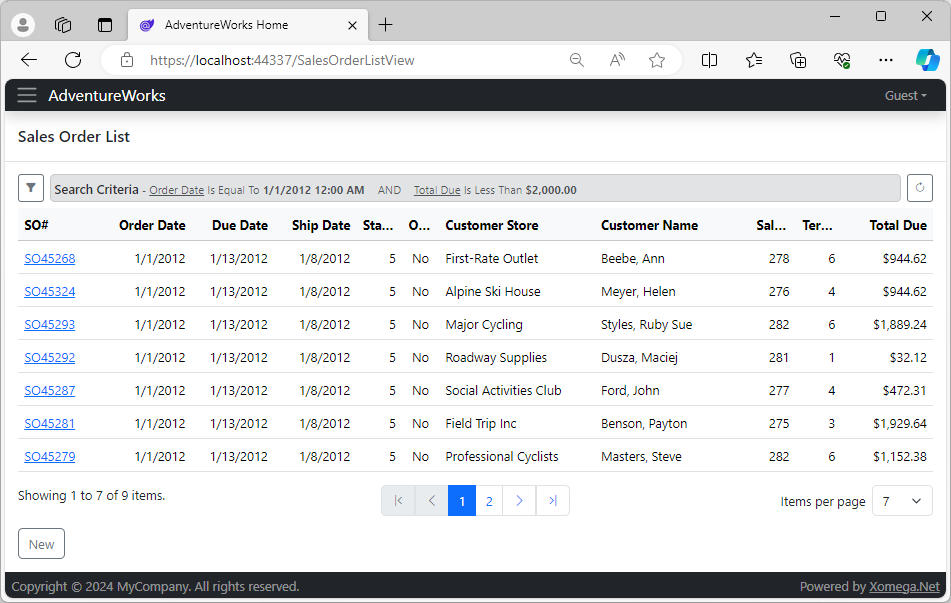

# 2.3 Custom result fields

If you remember, we added two custom fields to the results list that are not declared on the sales order object itself: `customer store` and `customer name`. The system would not know where they are sourced from, so it cannot generate code that would retrieve these values.

What it does generate though is a set of placeholders in the generated service implementation code, where you can supply your custom code to retrieve these fields. They are marked with `TODO` comments to let you easily find all such places that need custom implementation.

Before we can provide the custom code, we first need to build our model, which runs all the generators. To do that let's right-click on the `AdventureWorks.Model` project, and select the *Build* menu option. Next, we will expand the `AdventureWorks.Services.Entities` project and find the `SalesOrderService` class that implements our service contract.

## Implementing custom result fields

The generated `ReadListAsync` method will have a LINQ query over our entities, where you will see the commented *TODO* placeholders to implement between the `CUSTOM_CODE_START` and `CUSTOM_CODE_END` marker comments. We will provide a custom implementation for these fields, which reads it from the related `CustomerObject`, as shown below.


```cs title="SalesOrderService.cs"
public virtual async Task<Output<ICollection<SalesOrder_ReadListOutput>>>
    ReadListAsync(SalesOrder_ReadListInput_Criteria _criteria, CancellationToken token = default)
{
    [...]
    var qry = from obj in src
              select new SalesOrder_ReadListOutput() {
                  SalesOrderId = obj.SalesOrderId,
                  OrderDate = obj.OrderDate,
                  DueDate = obj.DueDate,
                  ShipDate = obj.ShipDate,
                  Status = obj.Status,
                  OnlineOrderFlag = obj.OnlineOrderFlag,
                  SalesOrderNumber = obj.SalesOrderNumber,
                  // CUSTOM_CODE_START: set the CustomerStore output parameter of ReadList operation below
/* removed-next-line */
                  // TODO: CustomerStore = obj.???, // CUSTOM_CODE_END
/* added-next-line */
                  CustomerStore = obj.CustomerObject.StoreObject.Name, // CUSTOM_CODE_END
                  // CUSTOM_CODE_START: set the CustomerName output parameter of ReadList operation below
/* removed-next-line */
                  // TODO: CustomerName = obj.???, // CUSTOM_CODE_END
/* added-lines-start */
                  CustomerName = obj.CustomerObject.PersonObject.LastName + ", " + 
                                 obj.CustomerObject.PersonObject.FirstName, // CUSTOM_CODE_END
/* added-lines-end */
                  SalesPersonId = obj.SalesPersonId,
                  TerritoryId = obj.TerritoryId,
                  TotalDue = obj.TotalDue,
              };
    [...]
```

This approach allows you to easily provide custom implementations for individual fields without having to rewrite the entire service method.

## Caution on mixed-in customizations

You may be wondering if the custom code you have just written, which is mixed in with the generated code, will be erased next time you build the model and regenerate this class. As long as you **don't rename the result fields or operation in the model,** or change anything in the comments with the corresponding `CUSTOM_CODE_START` and `CUSTOM_CODE_END` markers, your custom code should be safe during the next model build. Essentially, the marker's text is used to find the custom code when the class is regenerated, so you need to make sure it doesn't change.

If you do need to rename the custom parameters or their operation in the model, make sure you make a copy of your custom implementation, or, better yet, **version control your code** so that you could see any differences in the generated code after you regenerate the model.

You can also manually update the marker's text in the comments before renaming to match what it would be after renaming, which will preserve the custom code in between these markers.

:::danger
Another danger to your custom code could be if you select a *Clean* command on the model project or the corresponding *Service Implementations* generator. Don't use those options, unless you know what you're doing!

This option will delete the generated files first, which is okay only if the files have no custom code, and basically make sense only if you have renamed some objects in the model, or plan to change the output path patterns for the generators, and would like to automatically clean up the old generated files and update the projects with new files.

To preserve the custom code during the clean operation, please follow the instructions at the top of the generated file, which instruct you to delete a certain line in the header comment.
:::

For the service implementations, you can also configure that in the model in the config section for the object by adding an `svc:customize` element and setting its `preserve-on-clean` flag to `true` as follows.

```xml title="sales_order.xom"
      <config>
        <sql:table name="Sales.SalesOrderHeader"/>
<!-- added-next-line -->
        <svc:customize preserve-on-clean="true"/>
      </config>
```

## Reviewing the results

Let's run the application and review the effect of our changes so far. Below is a sample screenshot of what it looks like now.



Notice how our result list has only the columns we specified in the output of the `read list` operation, with the details link on the sales order number, which has a width proportionate to the length of its values.

Also notice that the dates are showing properly without a time component, and the customer store and customer name are populated based on our custom logic.
