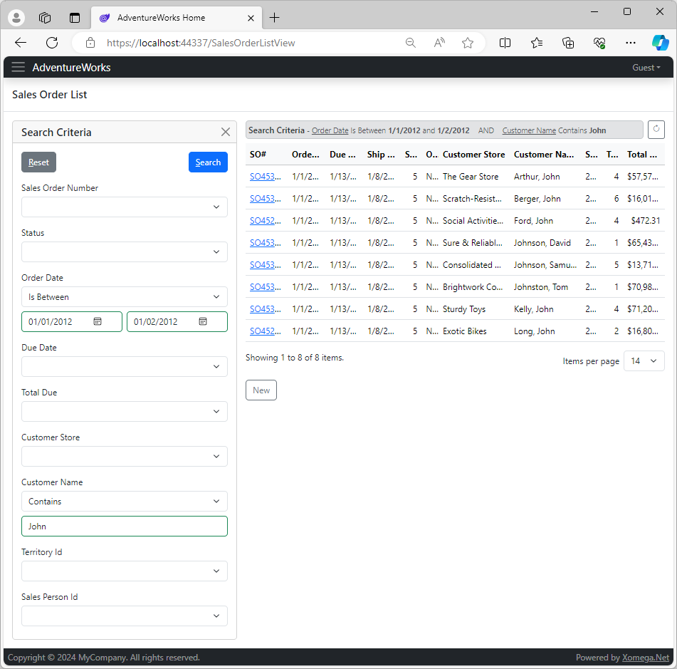

# 2.4 Model search criteria

Now that we have modeled our list results, let's move on to modeling the search criteria. They are defined in a structure with a name `criteria` inside the input of the `read list` operation.

```xml title="sales_order.xom"
    <operation name="read list" type="readlist">
      <input>
        <!-- highlight-next-line -->
        <struct name="criteria">
          <param name="revision number operator" type="operator">[...]
          <param name="revision number" required="false"/>
          <param name="revision number2" type="tiny int" required="false">[...]
          ...
        </struct>
      </input>
      <output list="true">[...]
    </operation>
```

With all the operators and second values for the `BETWEEN` operator, the current criteria for all sales order fields won't fit on one page, even when collapsed to definitions, so we're not showing them here.

We will first need to delete any criteria that we don't need, so it's good that we have them all, since reviewing all the criteria and then deleting unnecessary ones is so much easier than just adding them from scratch.

## Search use cases

Deciding which criteria to keep may be even more important than picking the result fields, since they directly support the business use cases. Here are some sample use cases that we will use to determine which criteria we need:
- Looking up a specific sales order by a sales order number.
- Searching sales orders in a certain status.
- Finding orders placed during a certain time period.
- Finding orders that are past due or due soon.
- Finding large orders and small orders by the total amount.
- Finding orders by the customer store name or individual name.
- Searching orders within certain geographical regions and territories.
- Searching orders placed by specific sales people.

## Search criteria model

This is what our model will look like for these use cases.

```xml title="sales_order.xom"
    <operation name="read list" type="readlist">
      <input>
        <struct name="criteria">
          <param name="sales order number operator" type="operator">[...]
          <param name="sales order number" required="false"/>
          <param name="status operator" type="operator">[...]
          <param name="status" required="false"/>
          <param name="order date operator" type="operator">[...]
          <param name="order date" type="date" required="false"/>
          <param name="order date2" type="date" required="false">[...]
          <param name="due date operator" type="operator">[...]
          <param name="due date" type="date" required="false"/>
          <param name="due date2" type="date" required="false">[...]
          <param name="total due operator" type="operator">[...]
          <param name="total due" required="false"/>
          <param name="total due2" type="money" required="false">[...]
            <!-- highlight-start -->
          <param name="customer store operator" type="operator">[...]
          <param name="customer store" type="string" required="false"/>
          <param name="customer name operator" type="operator">[...]
          <param name="customer name" type="string" required="false"/>
            <!-- highlight-end -->
          <param name="territory id operator" type="operator">[...]
          <param name="territory id" required="false"/>
          <param name="sales person id operator" type="operator">[...]
          <param name="sales person id" required="false"/>
          <config>
            <!-- highlight-next-line -->
            <xfk:add-to-object class="SalesOrderCriteria"/>
          </config>
        </struct>
      </input>
      <output list="true">[...]
    </operation>
```

As with the result fields, we will override the type on the date criteria to be just date without the time component, as well as set the type on the custom criteria `customer store` and `customer name` that don't have a corresponding object field. We have also added operator parameters for our custom criteria, and removed the second values for numeric criteria that don't need a `BETWEEN` operator, such as `status`, `territory id` and `sales person id`.

Notice also the highlighted config section, which specifies that all these parameters should be added to the client data object `SalesOrderCriteria` that the search criteria panel will be bound to. This data object is where we will be able to configure criteria labels in the model.

:::note
Remember that when we added custom result fields to the output, we had to also add custom code to the service implementation to retrieve these fields.

Since the custom criteria we just added have exactly the same names as the corresponding result fields (`customer store` and `customer name`), Xomega was able to generate code that simply filters on those results fields, so we don't need to provide any additional custom code.
:::

## Reviewing criteria updates

With that, we can just go ahead and build the Model project, and then run the application. You should get a screen that looks like this now.



You should be able to recognize our modeled criteria on the screen, see that the dates have no time component and use a calendar control, and verify that filtering by our new customer store/name fields works as expected.
