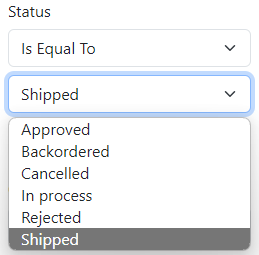
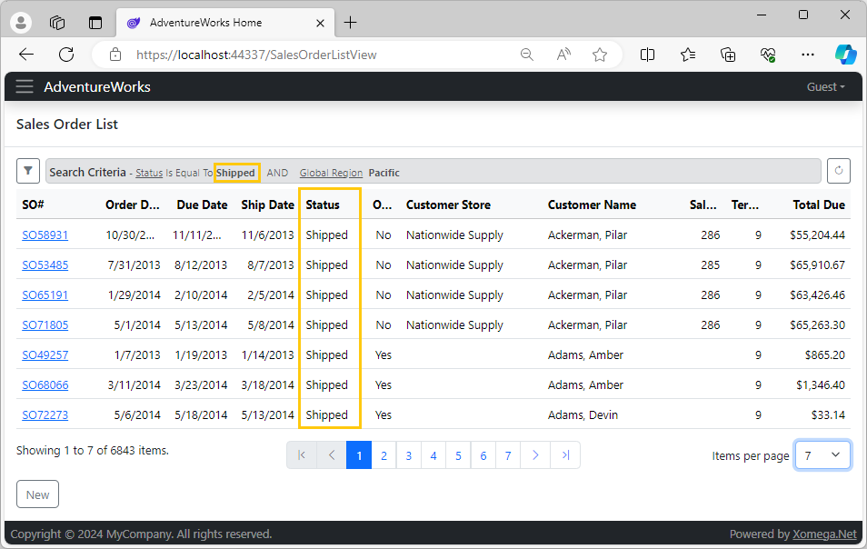

# 2.5 Static enumerations

When you look at the status column on the *Sales Order List* screen, you will notice that it shows internally stored numeric values instead of user-friendly status descriptions. The list of possible status values and their descriptions is static and is not stored in any of the database tables.

Right now you can only find it in the documentation stored in the *Status* column of the `SalesOrderHeader` database table, which was imported into the model as shown below.

```xml title="sales_order.xom"
<field name="status" type="tiny int" required="true">
  <config>
    <sql:column name="Status" default="((1))"/>
  </config>
  <doc>
    <!-- highlight-start -->
    <summary>Order current status. 1 = In process; 2 = Approved; 3 = Backordered;
                                   4 = Rejected; 5 = Shipped; 6 = Cancelled</summary>
    <!-- highlight-end -->
  </doc>
</field>
```

Xomega model allows you to describe this information in a structured way, and use it in the generated screens. It also generates constants in the code that you can use instead of hardcoding these values.

So let's see how we can enhance our model with static lists of values like the one for the sales order status.

## Enumerations for numeric values

We will start by adding an `enums` element after the `types` element in the `sales_order.xom` file, and will declare an enumeration named `sales order status` in there, listing all its items with their respective names and values.

```xml title="sales_order.xom"
  <enums>
    <enum name="sales order status">
      <item name="In process" value="1"/>
      <item name="Approved" value="2"/>
      <item name="Backordered" value="3"/>
      <item name="Rejected" value="4"/>
      <item name="Shipped" value="5"/>
      <item name="Cancelled" value="6"/>
    </enum>
  </enums>
```

:::tip
You can also define and set additional properties for enumeration items, and even inherit one enumeration from another, but, for our simple status enumeration, this basic setup is enough.
:::

Next, we will declare a new logical type, which we can also call `sales order status`, and will add a reference to our enumeration inside of it.

```xml
  <types>
    <type name="sales order status" base="tiny int enumeration">
      <enum ref="sales order status"/>
    </type>
  </types>
```

Since the original type of the status field is `tiny int`, we set the base type for our new type to be **`tiny int enumeration`**, which is declared in the framework and combines various enumeration configurations with the `tiny int` configurations.

As you add the new type, you will notice a warning on it, telling you that this type is currently not used in the model. So the next logical thing to do will be to set this type on the `status` field of the `sales order` object as follows.

```xml
    <object name="sales order">
      <fields>
        <!-- highlight-next-line -->
        <field name="status" type="sales order status" required="true">[...]
      </fields>
    </object>
```

## Enumerations for string codes

To provide another example, let's define one more static enumeration, which will be based on string values now, rather than on numeric values. This is also typical if you store short codes that have longer decodes, e.g. a list of states with NJ as a code and "New Jersey" as a decode.

If you open `sales_territory.xom` file, then you will see that sales territories have a `group` field, which specifies one of the territories' global regions: North America, Europe, or the Pacific.

```xml title="sales_territory.xom"
<object name="sales territory">
  <fields>
    ...
<!-- highlight-next-line -->
    <field name="group" type="string50" required="true">[...]
    ...
  </fields>
</object>
```

Note that this field has an auto-generated type `string50`, which maps a Unicode string of up to 50 characters long.

As we've done before, we will first define an enumeration `sales territory group` in the same file, with all its values listed, as follows.

```xml title="sales_territory.xom"
  <enums>
    <enum name="sales territory group">
      <item name="North America" value="North America"/>
      <item name="Europe" value="Europe"/>
      <item name="Pacific" value="Pacific"/>
    </enum>
  </enums>
```

Then we'll declare a type with the same name that references this enumeration. This time though, we will inherit our new type from the string-based `enumeration` type. But to preserve the database properties of our original type, we will set its size to 50 and will use the `nvarchar` SQL type, as shown below.

```xml
  <types>
    ...
    <type name="sales territory group" base="enumeration" size="50">
      <config>
        <!-- highlight-next-line -->
        <sql:type name="nvarchar"/>
      </config>
      <!-- highlight-next-line -->
      <enum ref="sales territory group"/>
    </type>
  </types>
```

And finally, we'll set that type on the `group` field of the `sales territory` object. 

```xml title="sales_territory.xom"
<object name="sales territory">
  <fields>
    <!-- highlight-next-line -->
    <field name="group" type="sales territory group" required="true">[...]
  </fields>
</object>
```

## Adding custom criteria

Now, the reason we've added this territory group enumeration is to be able to add another criteria parameter `global region` to the `read list` operation on the `sales order` object, which would use our new type as follows.

```xml title="sales_order.xom"
    <operation name="read list" type="readlist">
      <input>
        <struct name="criteria">
          ...
          <param name="customer name operator" type="operator">[...]
          <param name="customer name" type="string" required="false"/>
            <!-- highlight-next-line -->
          <param name="global region" type="sales territory group" required="false"/>
          <param name="territory id operator" type="operator">[...]
          <param name="territory id" required="false"/>
          ...
        </struct>
      </input>
      <output list="true">[...]
    </operation>
```

:::note
Unlike other criteria, we did not add a separate operator parameter for simplicity, which implies the equality operator will be used whenever this value is selected.
:::

Because this criteria parameter does not match any of the object's fields, nor does it match any of the output parameters, we will need to provide a custom implementation on how to use it in the implementation of the `read list` operation of our service.

Let's build the model, and then navigate to the `ReadListAsync` method of the `SalesOrderService` class, and provide the custom code for filtering by the global region as follows.

```cs title="SalesOrderService.cs"
public virtual async Task<Output<ICollection<SalesOrder_ReadListOutput>>>
    ReadListAsync(SalesOrder_ReadListInput_Criteria _criteria, CancellationToken token = default)
{
    ...
    var src = from obj in ctx.SalesOrder select obj;

    // Source filter
    if (_criteria != null)
    {
        // CUSTOM_CODE_START: add code for GlobalRegion criteria of ReadList operation below
/* removed-next-line */
        // TODO: src = AddClause(src, "GlobalRegion", o => ???, _criteria.GlobalRegion);
/* added-lines-start */
        src = AddClause(src, "GlobalRegion", o => o.TerritoryObject.Group,
                        Operators.IsEqualTo, _criteria.GlobalRegion);
/* added-lines-end */
        // CUSTOM_CODE_END
    }
    ...
```

To use the generated constant for the `IsEqualTo` operator, we will add a using statement for the `Enumerations` namespace at the top of the file as custom code, so that it doesn't get erased when the code is regenerated, as follows.

```cs title="SalesOrderService.cs"
// CUSTOM_CODE_START: add namespaces for custom code below
/* added-next-line */
using AdventureWorks.Services.Common.Enumerations;
// CUSTOM_CODE_END
```

## Reviewing the results

Finally, let's build and run the application to review our changes for the static enumerations. After you open the *Sales Order List* screen, you'll notice that the *Status* criteria displays a dropdown list with our enumeration values.

 

Also, you'll notice a new *Global Region* dropdown list in the search criteria, which allows filtering sales orders by the specified sales territory group. Since there is no operator for the *Global Region*, its dropdown list will be not required, so it provides a blank option to clear this field.

If you run the search now, the results grid will look like this.



Notice that the Status automatically shows decoded descriptions instead of numeric values, both in the grid and in the criteria summary panel above the grid.
