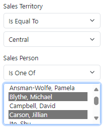

# 2.6 Dynamic enumerations

In the previous section, we have seen how to define static enumerations in the model, which have a fixed list of values that doesn't change within any specific version of the application. In addition to static enumerations, applications also typically have dynamic enumerations based on some reference data.

The lists of values for dynamic enumerations are often small enough to allow selecting values from a dropdown list or a list box. The lists may change over time, but this generally happens rather infrequently, which warrants caching them in the application.

## Sales territory enumeration

In our project, a list of sales territories is a good example of such a dynamic enumeration. Instead of showing or entering internal numeric territory ID on the sales order screens, we would like to show or select the territory name that is defined on the `sales territory` object.

In a nutshell, defining dynamic enumerations in the model is similar to defining static ones, except that instead of explicitly providing a list of values in the model, you need to configure a `readlist` type of operation with an `xfk:enum-cache` element, where you can give enumeration a name, and indicate which output parameter returns the ID, and which parameter returns the description for each enumeration element.

### Generating Read List operation

Xomega makes it really easy by providing a special *Enumeration Read List* generator under the *Model Enhancement* group. Let's go ahead and right-click on the `sales_territory.xom` file and run this generator on the `sales territory` object, as shown below.


Once you have run the generator, you will see that it added a single `read list` operation to the object without any other CRUD operations, and decorated it with the `xfk:enum-cache` specification.

Since the result of the operation will be cached, we'll want to remove any extraneous parameters to minimize the amount of data in the cache. We will only leave the ID and description parameters, and a couple of other important attributes such as the territory group, which will allow us to do cascading selection later on. This is how the model will look like after that.

```xml title="sales_territory.xom"
<object name="sales territory">
  ...
  <operations>
    <operation name="read list" type="readlist">
      <output list="true">
        <!-- highlight-start -->
        <param name="territory id"/>
        <param name="name"/>
        <param name="country region code"/>
        <param name="group"/>
        <!-- highlight-end -->
      </output>
      <config>
        <rest:method verb="GET" uri-template="sales-territory"/>
        <!-- highlight-next-line -->
        <xfk:enum-cache enum-name="sales territory" id-param="territory id" desc-param="name"/>
      </config>
    </operation>
  </operations>
</object>
```

### Configuring key type

You'll notice that the generator also changed the `sales territory` key type to inherit from the `integer enumeration` type, and added to it a reference to the new enumeration.

Since instead of territory IDs we'll want to display the name, let's also update this type to set the `typical-length` of the data to 10 for a better calculation of column widths, as follows.

```xml
  <types>
    <type name="sales territory" base="integer enumeration">
      <config>
        <!-- highlight-next-line -->
        <ui:display-config typical-length="10"/>
      </config>
      <!-- highlight-next-line -->
      <enum ref="sales territory"/>
    </type>
  </types>
```

## Sales person enumeration

Now that we understand the structure of the model for dynamic enumerations, let's set it up for another object `sales person`, which will have a couple if additional twists to it.

The problem is that the key type `sales person` inherits from another key type `employee` for the employee object, which tells the model that a salesperson is a type of employee, and establishes an implicit zero-to-one relationship between the two objects.

```xml title="sales_person.xom"
  <types>
    <type name="sales person" base="employee"/>
  </types>
```

Therefore, we don't want to change the base type for the `sales person` type, and inherit it from `integer enumeration`, since we don't want to break this relationship.

### Generating Read List operation

We can configure the *Enumeration Read List* generator to leave the key types alone by setting its `Make Key Type Enumerated` property to `False`, as shown below.


:::note
You'll need to set it back to `True` after running the generator, if you're not planning to keep it this way.
:::

Let's again right-click on the `sales_person.xom` file and run the *Enumeration Read List* generator.

As before, this will add a `read list` operation to the `sales person` object, decorated with the enumeration specification. We will strip it off of any extraneous parameters, except for the key and the `territory id`, which we can use for cascading selection. Then we'll add a couple of new output parameters as follows.


```xml
<object name="sales person">
  <operations>
    <operation name="read list" type="readlist">
      <output list="true">
        <param name="business entity id"/>
        <param name="territory id"/>
        <!-- highlight-start -->
        <param name="name" type="string"/>
        <param name="is-current" type="boolean" required="true"/>
        <!-- highlight-end -->
      </output>
      <config>
        <rest:method verb="GET" uri-template="sales-person"/>
        <xfk:enum-cache enum-name="sales person" id-param="business entity id"
                        <!-- highlight-next-line -->
                        desc-param="name" is-active-param="is-current"/>
      </config>
    </operation>
  </operations>
</object>
```

Since the `sales person` object does not have any suitable fields for the display name of its own, we added a `name` output parameter to the operation, and also set it as the description parameter `desc-param` for our enumeration.

We also added `is current` output parameter, which indicates whether or not this is a currently employed salesperson, and used it for the `is-active-param` attribute on the enumeration. This will allow displaying only active/current salespersons in any selection lists, while still using any inactive items to decode salesperson ID to their name.

### Configuring key type for enumeration

Because the key type was not updated to inherit from the `integer enumeration` type, for the reasons that we discussed earlier, we will need to add any relevant configurations from the `integer enumeration` type and its base type `selection` to the `sales person` type. Specifically, we need to add the Xomega Framework property type, and single-value and multi-value Blazor edit controls, as follows. 

```xml title="sales_person.xom"
  <types>
    <type name="sales person" base="employee">
      <config>
        <!-- highlight-next-line -->
        <xfk:property class="EnumIntProperty" namespace="Xomega.Framework.Properties" tsModule="xomega"/>
        <!-- highlight-next-line -->
        <ui:display-config typical-length="20"/>
        <ui:blazor-control>
          <!-- highlight-next-line -->
          <XSelect />
        </ui:blazor-control>
        <ui:blazor-control multi-value="true">
          <!-- highlight-next-line -->
          <XSelect />
        </ui:blazor-control>
      </config>
      <!-- highlight-next-line -->
      <enum ref="sales person"/>
    </type>
  </types>
```

:::note
When using other UI technologies, such as WPF, WebForms or HTML, you'll need to configure the appropriate controls here for those technologies.
:::

And, of course, we added a reference to our dynamic enumeration to the type, in order to make it enumerated, and also set the `typical-length` to 20 for a better calculation of the column width.

### Implementing custom attributes

To add a custom implementation for our `name` and `is-current` parameters, we will build the model first, and then will update the `ReadListAsync` service method on the generated `SalesPersonService` class as follows.

```cs title="SalesPersonService.cs"
public virtual async Task<Output<ICollection<SalesPerson_ReadListOutput>>>
    ReadListAsync(CancellationToken token = default)
{
    ...
    var src = from obj in ctx.SalesPerson select obj;
    ...
    var qry = from obj in src
              select new SalesPerson_ReadListOutput() {
                  BusinessEntityId = obj.BusinessEntityId,
                  TerritoryId = obj.TerritoryId,
                  // CUSTOM_CODE_START: set the Name output parameter of ReadList operation below
                  // highlight-start
                  Name = obj.BusinessEntityObject.BusinessEntityObject.LastName + ", " +
                         obj.BusinessEntityObject.BusinessEntityObject.FirstName, // CUSTOM_CODE_END
                  // highlight-end
                  // CUSTOM_CODE_START: set the IsCurrent output parameter of ReadList operation below
                  // highlight-next-line
                  IsCurrent = obj.BusinessEntityObject.CurrentFlag, // CUSTOM_CODE_END
              };
    ...
```

### Configuring multi-value criteria

Let's also allow filtering sales orders by multiple salespersons, by making the `sales person id` criteria multi-value.

All you have to do for that is to simply set the `list` attribute to `true `on the corresponding input parameter element of the sales order's `read list` operation, as shown below.

```xml title="sales_order.xom"
    <operation name="read list" type="readlist">
      <input>
        <struct name="criteria">
          ...
          <param name="sales person id operator" type="operator">[...]
          <!-- highlight-next-line -->
          <param name="sales person id" required="false" list="true"/>
          <config>
            <xfk:add-to-object class="SalesOrderCriteria"/>
          </config>
        </struct>
      </input>
      <output list="true">[...]
    </operation>
```

### Configuring custom labels

Finally, we will update the labels for the `sales person id` and `sales territory id` criteria and result list columns, since they will no longer display the internal ID.

```xml
    <xfk:data-object class="SalesOrderCriteria">
      <ui:display>
        <ui:fields>
          <!-- highlight-start -->
          <ui:field param="sales person id" label="Sales Person"/>
          <ui:field param="territory id" label="Sales Territory"/>
          <!-- highlight-end -->
        </ui:fields>
      </ui:display>
    </xfk:data-object>
    <xfk:data-object class="SalesOrderList" list="true">
      <ui:display>
        <ui:fields>
          <ui:field param="sales order id" hidden="true"/>
          <ui:field param="online order flag" label="Online"/>
          <ui:field param="sales order number" label="SO#"/>
          <!-- highlight-start -->
          <ui:field param="sales person id" label="Sales Person"/>
          <ui:field param="territory id" label="Sales Territory"/>
          <!-- highlight-end -->
        </ui:fields>
      </ui:display>
```

## Reviewing the results

Now, following an already familiar procedure, we will build the model again to regenerate all the artifacts, and then run the application.

If you open the *Sales Order List* screen, you'll see that *Search Criteria* panel features a drop down list to select a sales territory, and a listbox to select multiple salespersons.




You can check that the filtering also works for the multi-value criteria when you hit *Search*, and the results grid will look as depicted below.


As you see, both Sales Person and Sales Territory now show their display names rather than IDs in both the results list and in the search criteria summary above the grid.
