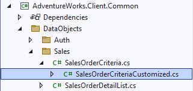

# 2.7 Using auto-complete

Sometimes, for relatively large enumerations, it is better to give the users a text field to enter the values, where they can type in partial names, and then select the value from a smaller, filtered drop down list. The list may show full names, but when the user selects an item, an internal value will be inserted into the text field.

For example, the drop down list may display a list of state names, such as "New Jersey", but the text field will have the 2-character code NJ, which is used internally by the system.

To demonstrate how to configure auto-complete in the model, we will use the order status criteria. This may not be the best example, since the list of statuses is pretty small, and their internal codes are numeric, and not that user friendly, but it should be okay for the demonstration purposes.

We want to show that auto-complete will work even for text fields that accept multiple values. So let's go ahead and add the `list="true"` attribute on the `status` parameter of the sales order criteria, as shown below.

```xml title="sales_order.xom"
    <operation name="read list" type="readlist">
      <input>
        <struct name="criteria">
          <param name="sales order number operator" type="operator">[...]
          <param name="sales order number" required="false"/>
          <param name="status operator" type="operator">[...]
            <!-- highlight-next-line -->
          <param name="status" required="false" list="true"/>
          ...
        </struct>
      </input>
      <output list="true">[...]
    </operation>
```

## Setting up auto-complete

Next, we will update the configuration of the `sales order status` type in the model to override the blazor control used for multi-value properties to use `XAutoComplete`, as opposed to the `XSelect` that is inherited from its base type `tiny int enumeration`.

```xml
    <type name="sales order status" base="tiny int enumeration">
      <config>
        <!-- highlight-start -->
        <ui:blazor-control multi-value="true">
          <XAutoComplete />
        </ui:blazor-control>
        <!-- highlight-end -->
      </config>
      <enum ref="sales order status"/>
    </type>
```

## Customizing display format

Finally, we will want to update the display format for the status values in the selection list to display both the code and decode, e.g. "Code - Decode". This will allow the selection list to be filtered correctly when you drop it down for an existing value, which would be just the code.

This must be done in the custom code for our criteria data object, which gives us a great opportunity to show you how to customize generated data objects. We will start by finding the definition of the `SalesOrderCriteria` data object in the model, and setting its `customize="true"` attribute as follows.

```xml
    <xfk:data-object class="SalesOrderCriteria" customize="true">[...]
```

After that, let's build the model project, and navigate to the generated `SalesOrderCriteria` data object class under the *AdventureWorks.Client.Common* project. If you expand it in the solution explorer, you will notice that it has a `SalesOrderCriteriaCustomized` class nested under it now.



Open it up, and set the `DisplayFormat` of the generated `StatusProperty` in the `OnInitialized` method as follows.

```cs title="SalesOrderCriteriaCustomized.cs"
    public class SalesOrderCriteriaCustomized : SalesOrderCriteria
    {
        public SalesOrderCriteriaCustomized()[...]

        public SalesOrderCriteriaCustomized(IServiceProvider serviceProvider) : base(serviceProvider)[...]

        // construct properties and child objects
        protected override void Initialize()[...]

        // perform post initialization
        protected override void OnInitialized()
        {
            base.OnInitialized();
            // highlight-next-line
            StatusProperty.DisplayFormat = $"{Header.FieldId} - {Header.FieldText}";
        }

        // add custom code here
    }
```

## Reviewing results

That's all there is to it. If you run the application now, you will see that the status operators have been updated for the multi-value properties.

If you select an operator, e.g. *Is One Of*, you'll see that the selection control has been changed to a textbox with a drop down list, which displays the statuses using our new display format.


:::note
Notice that the selection list will be filtered based on the current value at the caret's position, and not based on the entire text of the control.
:::