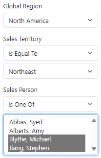

# 2.8 Cascading selection

In this section we will show you how to configure cascading selection for enumeration properties, where a list of possible values for one property depends on the selected value in another property. This also needs to be done in the custom code for a data object, but Xomega Framework's support makes it extremely easy.

## Setting up cascading selection

We will make the list of sales territories on the `SalesOrderCriteria` cascade off of the selected global region (territory group), and the list of sales persons cascade off of the selected sales territory.

Let's open the `SalesOrderCriteriaCustomized` class that we generated in the previous section, and add the following code to its `OnInitialized()` method.

```cs title="SalesOrderCriteriaCustomized.cs"
// highlight-next-line
using AdventureWorks.Services.Common.Enumerations;
...
public class SalesOrderCriteriaCustomized : SalesOrderCriteria
{
    ...
    // perform post initialization
    protected override void OnInitialized()
    {
        base.OnInitialized();
        StatusProperty.DisplayFormat = $"{Header.FieldId} - {Header.FieldText}";
        // highlight-start
        TerritoryIdProperty.SetCascadingProperty(SalesTerritory.Attributes.Group, GlobalRegionProperty);
        SalesPersonIdProperty.SetCascadingProperty(SalesPerson.Attributes.TerritoryId, TerritoryIdProperty);
        SalesPersonIdProperty.NullsMatchAnyCascading = true;
        SalesPersonIdProperty.DisplayListSeparator = "; ";
        // highlight-end
    }
}
```

As you see, Xomega Framework allows us to do it in just a few lines.

Instead of hardcoding names of enumeration attributes that are used for cascading, such as `group` or `territory id`, we were able to specify them using constants, conveniently generated for us by a Xomega generator based on those additional parameters that are returned by our dynamic enumerations. We just needed to add the namespace for these constants in the `using` statement first.

You can also configure the behavior of cascading selection with regards to nulls in the attributes of the possible values or in the cascading property. By default, salespersons not assigned to any territory would be shown only when you don't select any territory, and it shows all salespersons, but we configured it to always show such salespersons regardless of the currently selected territory.

Finally, we configured the semicolon to be a separator between salespersons when multiple salespersons are displayed in the applied criteria summary. This is to avoid confusion, because the default list separator comma is already used to separate the last name from the first name.

## Reviewing the results

Let's run the application now, and try changing the global region and the sales territory.



As you change the global region, you will see that the list of sales territories will be updated for that region only. Similarly, once you select a sales territory, the Sales Person selection will be narrowed down to that territory only, and also to salespersons without any territories. From the screenshot, you can see that there are only four such salespersons for the Northeast territory.

If you select several salespersons and run the search, you'll see that their names are separated with a semicolon in the criteria summary panel.


