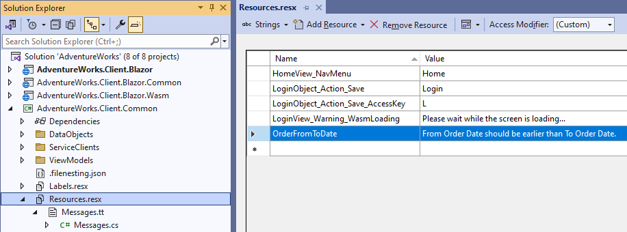
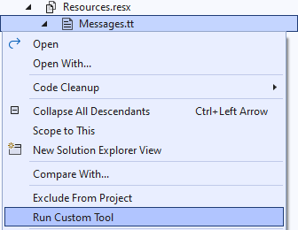
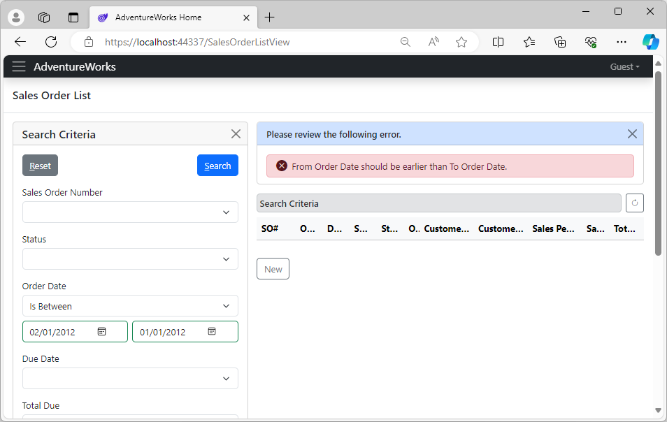

# 2.9 Custom UI validations

The generated UI data objects for our application already provide validation of individual properties, such as when the field is required or when the supplied value was not in the correct format. However, you may need additional UI validations, including cross-field validations.

Let's add a validation to our customized `SalesOrderCriteria` class, that will check that the *From* date is not later than the *To* date for the *Order Date* criteria, and will add a validation error otherwise.

## Adding message resources

In order to make the text of the validation message localizable, we are going to add it to the `Resources.resx` file in the *AdventureWorks.Client.Common* project, and give it a short name `OrderFromToDate` and the default message text, as follows.

|Name|Value|
|-|-|
|OrderFromToDate|From Order Date should be earlier than To Order Date.|

Here is how it will look in Visual Studio.



### Generating message constants

Along with the resources files, the Xomega template for this project included a T4 Text Template transformation script [`Messages.tt`](../../framework/services/errors#message-constants-generator), which generates `Messages.cs` file with the resource manager for these resources, as well as constants for message keys that you can use instead of the hardcoded names.

To regenerate the `Messages.cs` file you need to run the `Messages.tt` generator after adding your message resources, as shown below.



## Adding custom UI validation

Finally, let's open the `SalesOrderCriteriaCustomized.cs` file, and override the `Validate` function on the customized criteria object, where we check the *From* and *To* values for the *Order Date* criteria, and add a validation error, if the former is greater than the latter, as follows.

```cs title="SalesOrderCriteriaCustomized.cs"
public class SalesOrderCriteriaCustomized : SalesOrderCriteria
{
    ...
/* added-lines-start */
    public override void Validate(bool force)
    {
        base.Validate(force);
        DateTime? orderDateFrom = OrderDateProperty.Value;
        DateTime? orderDateTo = OrderDate2Property.Value;
        if (orderDateFrom != null && orderDateTo != null && orderDateFrom > orderDateTo)
            validationErrorList.AddValidationError(Messages.OrderFromToDate);
    }
/* added-lines-end */
}
```

Notice how we used the generated constant `Messages.OrderFromToDate` for our message instead of hardcoding the message key.

## Reviewing the results

Now if you run the application and specify invalid *From* and *To* order dates in the criteria and hit *Search*, you will see our validation error displayed.



:::note
Note that so far we have been adding all that custom code to the generated data objects, which are reusable between multiple C#-based clients, such as Blazor, WPF, or Web Forms.

This means that all these custom validations, cascading selections, etc. will be also available in the corresponding Web Forms or WPF desktop applications out of the box. This is just an example of how Xomega Framework helps you write reusable code.
:::