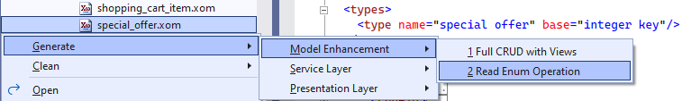

# 3.1 Details child list

With all the changes that we have already made to the model, let's run the application and review what the *Sales Order* details screen looks like now.

## Overview of updates

You will notice that the fields, for which we have defined static and dynamic enumerations in the model, such as *Status*, *Sales Person* and the *Sales Territory* already have drop-down list controls for selecting a value, which display a user-friendly name, as highlighted in green below.


We will start improving the *Sales Order* details screen by updating the child table with the order line items, which shows the products ordered, their quantities and prices. Looking at the current table, the following updates come to mind.
1. Display *Product* using product name as the first column, which will have a link to the line item details, and move the *Carrier Tracking Number* to the end.
1. Display the *Special Offer* using its description instead of the internal ID.
1. Remove *Rowguid* and *Modified Date* internal columns
1. Display *Unit Price Discount* as percentage, and the *Line Total* in the currency format.

## Product enumeration

We will turn the list of products into a dynamic enumeration, since it does not change very often, and is not too large, so it can be cached. Make sure that you set the `Make Key Type Enumerated` property of the *Enumeration Read List* generator to `True`, so that it would automatically configure the key type. Next, open up the `product.xom` file in the model, and run that generator on that file, as shown below.


### Configuring enumeration fields

Expand the generated `read list` operation on the `product` object, and remove any extraneous parameters, except for the `product id` and `name`, which are used as the enumeration's ID and description parameters respectively, as well as the `product subcategory id` and the `product model id`, which we could use for cascading selection.

Also, add a required boolean parameter `is active`, which will indicate if this is a current product that has not been discontinued. We will also set this parameter as such on the enumeration configuration, so that it would not prompt discontinued products in any selection lists, but can still use them to decode a product ID into the corresponding name.

Your `read list` operation will look as follows.

```xml title="product.xom"
    <object name="product">
      ...
      <operations>
        <operation name="read list" type="readlist">
          <output list="true">
            <param name="product id"/>
            <param name="name"/>
            <!-- highlight-next-line -->
            <param name="is active" type="boolean" required="true"/>
            <param name="product subcategory id"/>
            <param name="product model id"/>
          </output>
          <config>
            <rest:method verb="GET" uri-template="product"/>
            <xfk:enum-cache enum-name="product" id-param="product id" desc-param="name"
                            <!-- highlight-next-line -->
                            is-active-param="is active"/>
          </config>
        </operation>
      </operations>
    </object>
```

### Configuring key type

Since we will display the product name instead of ID, let's configure the typical length for the `product` type to be based on the name now, and set it to 20, as follows.

```xml
    <type name="product" base="integer enumeration">
      <config>
        <!-- highlight-next-line -->
        <ui:display-config typical-length="20"/>
      </config>
      <enum ref="product"/>
    </type>
```

### Implementing custom fields

To add implementation for our `is active` parameter, we will regenerate all code by building the model, and then insert the following custom code into the generated `ReadListAsync` method of the `ProductService`.

```cs title="ProductService.cs"
public virtual async Task<Output<ICollection<Product_ReadListOutput>>>
    ReadListAsync(CancellationToken token = default)
{
    ...
    var qry = from obj in src
              select new Product_ReadListOutput() {
                  ProductId = obj.ProductId,
                  Name = obj.Name,
                  // CUSTOM_CODE_START: set the IsActive output parameter of ReadList operation below
                  // highlight-start
                  IsActive = (obj.SellEndDate == null || obj.SellEndDate > DateTime.Today)
                              && obj.DiscontinuedDate == null, // CUSTOM_CODE_END
                  // highlight-end
                  ProductSubcategoryId = obj.ProductSubcategoryId,
                  ProductModelId = obj.ProductModelId,
              };
    ...
}
```

## Special offer enumeration

We will do similar steps for the `special offer` object, generating a `read list` operation decorated with an enumeration declaration.



### Configuring enumeration fields

We will strip it off of any extraneous parameters except for the `special offer id`, `description`, and the `category` attribute for cascading selection. We will also add `is active` parameter to indicate current special offers, and will set it on the enumeration as well.

```xml title="special_offer.xom"
    <object name="special offer">
      <operations>
        <operation name="read list" type="readlist">
          <output list="true">
            <param name="special offer id"/>
            <param name="description"/>
            <!-- highlight-next-line -->
            <param name="is active" type="boolean" required="true"/>
            <param name="category"/>
          </output>
          <config>
            <rest:method verb="GET" uri-template="special-offer"/>
            <xfk:enum-cache enum-name="special offer" id-param="special offer id"
                            <!-- highlight-next-line -->
                            desc-param="description" is-active-param="is active"/>
          </config>
        </operation>
      </operations>
    </object>
```

### Configuring key type

Since we will display the special offer description instead of ID, let's configure the typical length for the `special offer` type to be based on the description now, and set it to 20, as follows.

```xml
    <type name="special offer" base="integer enumeration">
      <config>
        <!-- highlight-next-line -->
        <ui:display-config typical-length="20"/>
      </config>
      <enum ref="special offer"/>
    </type>
```

### Implementing custom fields

Lastly, we will build the model again, and will provide the custom code for the `is active` parameter implementation, as follows.

```cs title="SpecialOfferService.cs"
public virtual async Task<Output<ICollection<SpecialOffer_ReadListOutput>>>
    ReadListAsync(CancellationToken token = default)
{
    ...
    var qry = from obj in src
              select new SpecialOffer_ReadListOutput() {
                  SpecialOfferId = obj.SpecialOfferId,
                  Description = obj.Description,
                  // CUSTOM_CODE_START: set the IsActive output parameter of ReadList operation below
                  // highlight-start
                  IsActive = (obj.StartDate == null || obj.StartDate < DateTime.Today) &&
                             (obj.EndDate == null || obj.EndDate > DateTime.Today), // CUSTOM_CODE_END
                  // highlight-end
                  Category = obj.Category,
              };
    ...
}
```

## Modeling child list

Now that we have done all these preparations, let's open the `read list` operation on the `detail` sub-object of the `sales order` object.

We will remove the `rowguid` and the `modified date` output parameters, and reorder other parameters to show them in the proper order on the screen, as shown below.

```xml title="sales_order.xom"
    <object name="sales order">
      ...
      <subobjects>
        <!-- highlight-next-line -->
        <object name="detail">
          <operations>
            ...
            <!-- highlight-next-line -->
            <operation name="read list" type="readlist">
              <input>
                <param name="sales order id" type="sales order header" required="true"/>
                <config>
                  <xfk:add-to-object class="SalesOrderObject"/>
                </config>
              </input>
              <output list="true">
                <!-- highlight-start -->
                <param name="sales order detail id"/>
                <param name="product id" type="product" required="true"/>
                <param name="order qty"/>
                <param name="unit price"/>
                <param name="unit price discount"/>
                <param name="special offer id" type="special offer" required="true"/>
                <param name="line total"/>
                <param name="carrier tracking number"/>
                <!-- highlight-end -->
                <config>
                  <xfk:add-to-object class="SalesOrderDetailList"/>
                </config>
              </output>
            </operation>
          </operations>
      </subobjects>
    </object>
```

:::note
Note that these parameters will be added to the `SalesOrderDetailList` data object, which we will use to update the labels for the details table columns later.
:::

### Formatting result fields

For now, let's address the issues with the formatting of the `unit price discount` and `line total` fields. You can see that based on their SQL types the price discount was imported with type `money` and the line total was imported with a generated type `numeric_38_6`, which even has a warning on its definition saying that it extends a deprecated type `numeric`.

```xml
    <field name="unit price" type="money" required="true">[...]
    <!-- highlight-start -->
    <field name="unit price discount" type="money" required="true">[...]
    <field name="line total" type="numeric_38_6" required="true">[...]
    <!-- highlight-end -->
```

For the `unit price discount` field, we will define a new type `discount` in the `sales_order.xom`, and use it for this field. The `discount` type will inherit from the `percent` base type to format the value as a percent, and also override the data property to use the `PercentFractionProperty`, which validates that the value is a fractional number between 0 and 1, as shown below.

```xml
<type name="discount" base="percent">
  <config>
    <sql:type name="money" db="sqlsrv"/>
    <xfk:property class="PercentFractionProperty" namespace="Xomega.Framework.Properties" tsModule="xomega"/>
  </config>
</type>
```

:::note
We will also had to use a SQL type override, so that it keeps the mapping to the original SQL type `money`.
:::

Now, if you right click on the `numeric_38_6` type, and select *Find All References*, you will see that it is used solely on our `line total` field. Therefore, we will just rename this type to be `line total`, move it to the same file `sales_order.xom`, and then make it inherit from the `money` type to make sure that it gets formatted as currency. We'll also keep the SQL type configuration override, as shown below.

```xml
    <!-- highlight-next-line -->
    <type name="line total" base="money">
      <config>
        <sql:type name="numeric(38,6)" db="sqlsrv"/>
      </config>
    </type>
```

Once you set the new `discount` type on the `unit price discount` field, these fields would be now configured for the proper format.

```xml
    <field name="unit price discount" type="discount" required="true">
    <field name="line total" type="line total" required="true">
```

### Customizing UI labels and links

Next, let's open the `SalesOrderDetailList` data object, and provide some custom labels for our columns, as follows.

```xml
    <xfk:data-object class="SalesOrderDetailList" list="true">
      <ui:display>
        <ui:fields>
          <ui:field param="sales order detail id" hidden="true"/>
          <!-- highlight-start -->
          <ui:field param="product id" label="Product"/>
          <ui:field param="order qty" label="Qty"/>
          <ui:field param="unit price" label="Price"/>
          <ui:field param="unit price discount" label="Discount"/>
          <ui:field param="line total" label="Total"/>
          <ui:field param="special offer id" label="Special Offer"/>
          <ui:field param="carrier tracking number" label="Tracking #"/>
          <!-- highlight-end -->
        </ui:fields>
      </ui:display>
      <ui:link name="details" view="SalesOrderDetailView" child="true">
        <ui:params>
          <ui:param name="sales order detail id" field="sales order detail id"/>
        </ui:params>
          <!-- highlight-next-line -->
        <ui:display on-field="product id"/>
      </ui:link>
      ...
    </xfk:data-object>
```

We have also updated the `details` link to be displayed on the field `product id`.

## Reviewing the results

After you build the model one more time, and run the application now, you'll see that the *Sales Order Detail* grid looks exactly according to the requirements that we defined earlier. Below is a picture that illustrates this.


As you see, it only shows the columns we specified, uses our labels as column headers, the *Product* and *Special Offer* show names instead of IDs, the *Discount* field is formatted as percent, and the *Line Total* field is displayed using currency format.
