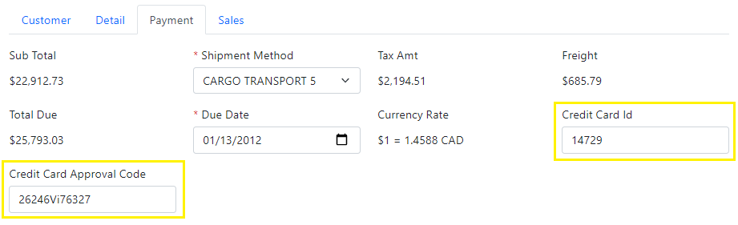
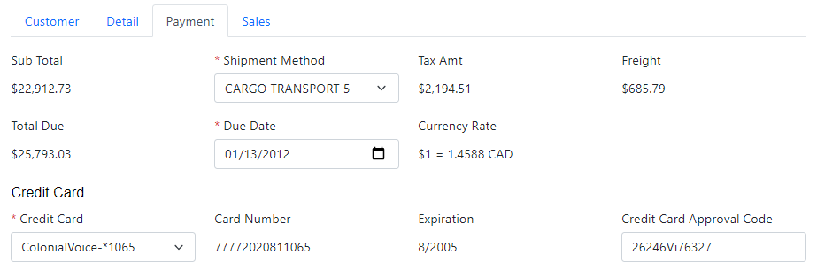

# 3.10 Standard contextual selection

In this section, we will use a similar technique to set up contextual selection for the *Credit Card Id* on the *Payment* tab, but we'll use Xomega Framework support to minimize the custom code needed for standard cases.

## Overview of updates

Instead of showing a text field to enter the ID of a stored credit card, we will display a dropdown list with the credit cards stored for the current customer's person. We will move both the credit card selection and the *Credit Card Approval Code* fields to a child panel *Credit Card* under the *Payment* tab.



When the user selects a credit card, we'll display additional credit card details in the same *Credit Card* child panel.

## Defining contextual enumeration

We will start by defining a contextual dynamic enumeration that returns a list of credit cards with their details for a specific person. 

### Person Credit Card subobject

The list of credit cards of specific persons is defined in the `Sales.PersonCreditCard` database table, which should normally be a subobject of the `person` aggregate object.

However, that table does not have a *cascade* delete on its foreign key to the parent `Person.Person` table, so it was imported into the model as a separate `person credit card` entity that has a compound key defined by a field set with the same name, as follows.

```xml title="person_credit_card.xom"
  <fieldsets>
    <fieldset name="person credit card">
<!-- highlight-start -->
      <field name="business entity id" type="person" required="true">[...]
      <field name="credit card id" type="credit card" required="true">[...]
<!-- highlight-end -->
    </fieldset>
  </fieldsets>
  <objects>
<!-- removed-lines-start -->
    <object name="person credit card">
      <fields>
<!-- highlight-next-line -->
        <fieldset ref="person credit card" key="supplied" required="true"/>
        <field name="modified date" type="date time" required="true">[...]
      </fields>
      ...
    </object>
<!-- removed-lines-end -->
  </objects>
```

In order to make it a subobject of a `person` object, we'll move its `object` element to the `person.xom` file under a `subobjects` element. We'll rename it to be just `credit card`, since its name is automatically qualified with the parent object's name.

Additionally, since the `business entity id` will be already inherited from the parent `person` object, we will change the key field to be just the `credit card id` by copying it from the `person credit card` field-set above, and deleting the old key field-set reference. As a result, your `credit card` subobject should look as follows.


```xml title="person.xom"
  <types>
    <type name="person" base="business entity"/>
  </types>
  <objects>
    <object name="person">
      <fields>
<!-- highlight-next-line -->
        <field name="business entity id" type="person" key="supplied" required="true">
        ...
      </fields>
      ...
<!-- added-lines-start -->
      <subobjects>
        <object name="credit card">
          <fields>
<!-- highlight-next-line -->
            <field name="credit card id" type="credit card" key="reference" required="true">[...]
            <field name="modified date" type="date time" required="true">[...]
          </fields>
          <config>
            <sql:table name="Sales.PersonCreditCard">
<!-- highlight-next-line -->
              <sql:parent-foreign-key delete="no action"/>
            </sql:table>
          </config>
          ...
        </object>
      </subobjects>
<!-- added-lines-end -->
    </object>
  </objects>
```

:::note
Since the `credit card id` field references a separate `credit card` object, we need to set the `key` attribute to `reference`. Also, if we want to keep the `delete` action for the parent foreign key, instead of using the default *cascade* action, then we'll need to set it on the `sql:parent-foreign-key` element.
:::

At this point, we can delete the `person_credit_card.xom` file from the *Sales* folder, since there will be nothing useful left in it.

Since the new `PersonCreditCard` entity will be now in the *Person* module rather than *Sales*, we need to rebuild the entity classes using the new structure. For that we will run a *Clean* command on the *EF Domain Objects* generator under the *Data Layer* folder, followed by the *Generate* command on that generator.

### Configuring credit card types

Before we add our enumeration, let's open the `credit_card.xom` file, and update the `card number` field to use a new logical type `credit card number`, instead of the `string25` that was created by the import process. To make credit card a selection, we will also update the key type `credit card` to be based on `integer enumeration`, as illustrated below.

```xml title="credit_card.xom"
  <types>
<!-- removed-next-line -->
    <type name="credit card" base="integer key"/>
<!-- added-lines-start -->
    <type name="credit card" base="integer enumeration"/>
    <type name="credit card number" base="string" size="25"/>
<!-- added-lines-end -->
  </types>
  <objects>
    <object name="credit card">
      <fields>
        ...
<!-- removed-next-line -->
        <field name="card number" type="string25" required="true">
<!-- added-next-line -->
        <field name="card number" type="credit card number" required="true">
        ...
      </fields>
    </object>
  </objects>
```

### Adding contextual enumeration

Similar to what we did [before](custom-selection#adding-read-enum-on-a-subobject), we will make sure that *Read Enum Operation* generator is configured to generate a `read enum` on subobjects only, and then will run that generator on the `person.xom` file.

Next, instead of the default `modified date` output parameter, we will add output parameters for a number of `credit card` object fields that we want to show when selecting a credit card, using their respective types, as illustrated below.

```xml title="person.xom"
<object name="person">
  ...
  <subobjects>
    <object name="credit card">
      ...
<!-- highlight-next-line -->
        <operation name="read enum">
          <input>
            <param name="business entity id" type="person" required="true"/>
          </input>
          <output list="true">
            <param name="credit card id"/>
            <param name="description" type="string"/>
<!-- removed-next-line -->
            <param name="modified date"/>
<!-- added-lines-start -->
            <param name="person name" type="name" required="true"/>
            <param name="card type" type="name" required="true"/>
            <param name="card number" type="credit card number" required="true"/>
            <param name="exp month" type="tiny int" required="true"/>
            <param name="exp year" type="small int" required="true"/>
<!-- added-lines-end -->
          </output>
          <config>
            <rest:method verb="GET" uri-template="person/{business entity id}/credit-card/enum"/>
<!-- highlight-start -->
            <xfk:enum-cache enum-name="person credit card" id-param="credit card id"
                            desc-param="description"/>
<!-- highlight-end -->
          </config>
          <doc>[...]
        </operation>
        ...
    </object>
  </subobjects>
</object>
```

### Custom service implementation

To provide custom service implementation for our output parameters, let's build the model project and open the generated `PersonService` class. We'll update our `CreditCard_ReadEnumAsync` operation to read all the credit card parameters, where we will return the credit card description as the card type, and the last four digits of the card number, as follows.

```cs title="PersonService.cs"
public partial class PersonService : BaseService, IPersonService
{
    ...
    public virtual async Task<Output<ICollection<PersonCreditCard_ReadEnumOutput>>>
        CreditCard_ReadEnumAsync(int _businessEntityId, CancellationToken token = default)
    {
        ...
        var qry = from obj in src
        select new PersonCreditCard_ReadEnumOutput() {
            CreditCardId = obj.CreditCardId,
            // CUSTOM_CODE_START: set the Description output parameter of CreditCard_ReadEnum operation below
/* removed-next-line */
            // TODO: Description = obj.???, // CUSTOM_CODE_END
/* added-lines-start */
            Description = obj.CreditCardObject.CardType + "-*" +
                          obj.CreditCardObject.CardNumber.Substring(
                              obj.CreditCardObject.CardNumber.Length - 4), // CUSTOM_CODE_END
/* added-lines-end */
            // CUSTOM_CODE_START: set the PersonName output parameter of CreditCard_ReadEnum operation below
/* removed-next-line */
            // TODO: PersonName = obj.???, // CUSTOM_CODE_END
/* added-next-line */
            PersonName = obj.PersonObject.LastName + ", " + obj.PersonObject.FirstName, // CUSTOM_CODE_END
            // CUSTOM_CODE_START: set the CardType output parameter of CreditCard_ReadEnum operation below
/* removed-next-line */
            // TODO: CardType = obj.???, // CUSTOM_CODE_END
/* added-next-line */
            CardType = obj.CreditCardObject.CardType, // CUSTOM_CODE_END
            // CUSTOM_CODE_START: set the CardNumber output parameter of CreditCard_ReadEnum operation below
/* removed-next-line */
            // TODO: CardNumber = obj.???, // CUSTOM_CODE_END
/* added-next-line */
            CardNumber = obj.CreditCardObject.CardNumber, // CUSTOM_CODE_END
            // CUSTOM_CODE_START: set the ExpMonth output parameter of CreditCard_ReadEnum operation below
/* removed-next-line */
            // TODO: ExpMonth = obj.???, // CUSTOM_CODE_END
/* added-next-line */
            ExpMonth = obj.CreditCardObject.ExpMonth, // CUSTOM_CODE_END
            // CUSTOM_CODE_START: set the ExpYear output parameter of CreditCard_ReadEnum operation below
/* removed-next-line */
            // TODO: ExpYear = obj.???, // CUSTOM_CODE_END
/* added-next-line */
            ExpYear = obj.CreditCardObject.ExpYear // CUSTOM_CODE_END
        };
        ...
    }
}
```

In order to make sure that your inline customizations are [preserved if you run the *Clean* command](../search/custom-result#caution-on-mixed-in-customizations) on the model, you can add an `svc:customize` config element to the `person` object, and set the `preserve-on-clean="true"` attribute, as follows.

```xml title="person.xom"
    <config>
      <sql:table name="Person.Person"/>
      <edm:customize extend="true"/>
<!-- added-next-line -->
      <svc:customize preserve-on-clean="true"/>
    </config>
```

## Credit Card grouping object

To group credit card fields into a child panel, let's define a new data object `CreditCardPaymentObject`, and add it as a child of the `SalesOrderPaymentObject` using `credit card` as the name, as shown below.

```xml title="sales_order.xom"
  <xfk:data-objects>
<!-- added-next-line -->
    <xfk:data-object class="CreditCardPaymentObject"/>
    ...
    <xfk:data-object class="SalesOrderPaymentObject">
<!-- added-next-line -->
      <xfk:add-child name="credit card" class="CreditCardPaymentObject"/>
      <ui:display>[...]
    </xfk:data-object>
  </xfk:data-objects>
```

Next, we will add a generic `credit card info` structure for this object to add fields to it, as shown below.

```xml title="sales_order.xom"
<!-- added-lines-start -->
  <struct name="credit card info" object="credit card">
    <param name="credit card id"/>
    <param name="card number"/>
    <param name="expiration" type="string"/>
    <config>
<!-- highlight-next-line -->
      <xfk:add-to-object class="CreditCardPaymentObject"/>
    </config>
<!-- highlight-next-line -->
    <usage generic="true"/>
  </struct>
<!-- added-lines-end -->
```

Now we can configure our data object to make credit card non-key fields read-only, and to set a proper label for the `credit card id`, as follows.

```xml title="sales_order.xom"
  <xfk:data-object class="CreditCardPaymentObject">
<!-- added-lines-start -->
    <ui:display>
      <ui:fields>
        <ui:field param="credit card id" label="Credit Card"/>
        <ui:field param="card number" editable="false"/>
        <ui:field param="expiration" editable="false"/>
      </ui:fields>
    </ui:display>
  </xfk:data-object>
<!-- added-lines-end -->
```

### Updating operation structures

Next, we will move the `credit card id` and `credit card approval code` parameters from the `payment info` and `payment update` structures to a new structure `sales order credit card`, and will update both payment structures to use a reference to this new structure instead, as follows.

```xml title="sales_order.xom"
<!-- highlight-next-line -->
    <struct name="payment info" object="sales order">
      ...
<!-- removed-lines-start -->
      <param name="credit card id"/>
      <param name="credit card approval code"/>
<!-- removed-lines-end -->
<!-- added-next-line -->
      <struct name="credit card" ref="sales order credit card"/>
      ...
    </struct>
<!-- highlight-next-line -->
    <struct name="payment update" object="sales order">
      ...
<!-- removed-lines-start -->
      <param name="credit card id"/>
      <param name="credit card approval code"/>
<!-- removed-lines-end -->
<!-- added-next-line -->
      <struct name="credit card" ref="sales order credit card"/>
      ...
    </struct>
<!-- added-lines-start -->
    <struct name="sales order credit card" object="sales order">
      <param name="credit card id" required="true"/>
      <param name="credit card approval code"/>
      <config>
        <xfk:add-to-object class="CreditCardPaymentObject"/>
      </config>
    </struct>
<!-- added-lines-end -->
```

:::note
This new structure is different from the `credit card info` structure that we defined since it's used specifically for the operations. It must be referenced using the same name `credit card`, as the one that we used for our child data object earlier.
:::

### Refactoring custom service code

Let's build the model project, and refactor our custom service code in the `SalesOrderServiceExtended.cs` to use the new structure, as follows.

```cs title="SalesOrderServiceExtended.cs"
public partial class SalesOrderService
{
    protected static PaymentInfo GetPaymentInfo(SalesOrder obj) => new()
    {
        ...
/* added-next-line */
        CreditCard = new SalesOrderCreditCard {
            CreditCardId = obj.CreditCardObject?.CreditCardId ?? 0,
            CreditCardApprovalCode = obj.CreditCardApprovalCode,
/* added-next-line */
        },
        CurrencyRate = obj.CurrencyRateObject?.RateString
    };

    protected async Task UpdatePayment(SalesOrder obj, PaymentUpdate pmt, CancellationToken token)
    {
        ...
/* removed-next-line */
        obj.CreditCardApprovalCode = pmt.CreditCardApprovalCode;
/* added-next-line */
        obj.CreditCardApprovalCode = pmt.CreditCard.CreditCardApprovalCode;
/* removed-next-line */
        obj.CreditCardObject = await ctx.FindEntityAsync<CreditCard>(currentErrors, token, pmt.CreditCardId);
/* added-lines-start */
        obj.CreditCardObject = await ctx.FindEntityAsync<CreditCard>(currentErrors, token,
                                                                     pmt.CreditCard.CreditCardId);
/* added-lines-end */
    }
    ...
}
```

## Contextual UI selection

Now we need to populate a list of person's credit cards for the selected customer on the sales order.

Since the customer and payment are sibling child objects on the sales order data object, we will implement this logic in their common parent object `SalesOrderObject`, so we'll need to customize it as follows.

```xml title="sales_order.xom"
    <xfk:data-object class="SalesOrderObject" customize="true">[...]
```

Let's build the model project and open up the generated `SalesOrderObjectCustomized.cs` file. We'll set up the local lookup cache loader for the `CreditCardIdProperty` using `PersonCreditCardReadEnumCacheLoader` generated for our enumeration.

Then, instead of manually listening to the updates of the `PersonIdProperty` and then refreshing the cache loader and updating the `CreditCardIdProperty`, we'll just call the `SetCacheLoaderParameters` method with the generated constant for the input parameter name and the source property, and Xomega Framework will automatically handle all the rest.

The following snippet illustrates this logic.

```cs title="SalesOrderObjectCustomized.cs"
/* added-lines-start */
using AdventureWorks.Services.Common;
using AdventureWorks.Services.Common.Enumerations;
/* added-lines-end */

public class SalesOrderObjectCustomized : SalesOrderObject
{
    ...
    // perform post initialization
    protected override void OnInitialized()
    {
        base.OnInitialized();
/* added-lines-start */
        var ccProp = PaymentObject.CreditCardObject.CreditCardIdProperty;
        ccProp.LocalCacheLoader = new PersonCreditCardReadEnumCacheLoader(ServiceProvider);
        ccProp.SetCacheLoaderParameters(PersonCreditCard.Parameters.BusinessEntityId,
                                        CustomerObject.PersonIdProperty);
/* added-lines-end */
    }
}
```

:::tip
If a list of possible values in your property depends on values of multiple other properties, then you can call `SetCacheLoaderParameters` for each such property/input parameter, and the framework will update the list whenever either of those properties changes.
:::

## Populating credit card on selection

Now, in order to display the credit card details whenever a credit card is selected on the screen, we'll need to populate the read-only properties in the customized `CreditCardPaymentObject`. So let's add `customize="true"` to it in the model, and build the model project to generate the customization file.

```xml title="sales_order.xom"
    <xfk:data-object class="CreditCardPaymentObject" customize="true">[...]
```

 We'll add a credit card change listener in the `OnInitialized` method, which will populate other properties from the credit card attributes. The expiration property will combine both the expiration month and year, as shown below.

```cs title="CreditCardPaymentObjectCustomized.cs"
/* added-next-line */
using AdventureWorks.Services.Common.Enumerations;

public class CreditCardPaymentObjectCustomized : CreditCardPaymentObject
{
    ...
    // perform post initialization
    protected override void OnInitialized()
    {
        base.OnInitialized();
/* added-next-line */
        CreditCardIdProperty.Change += OnCreditCardChanged;
    }

/* added-lines-start */
    private void OnCreditCardChanged(object sender, PropertyChangeEventArgs e)
    {
        if (e.Change.IncludesValue() && !Equals(e.OldValue, e.NewValue))
        {
            Header cc = CreditCardIdProperty.Value;
            CardNumberProperty.SetValue(cc?[PersonCreditCard.Attributes.CardNumber]);
            ExpirationProperty.SetValue(cc == null ? null : cc[PersonCreditCard.Attributes.ExpMonth]
                                                    + "/" + cc[PersonCreditCard.Attributes.ExpYear]);
        }
    }
/* added-lines-end */
}
```

## Reviewing the results

Let's run the application, and review our changes. The *Payment* tab should now look as shown below.



As you see, we're displaying a list of the person's saved credit cards using the credit card type and the last four digits of the card number now, and show specific credit card details when one is selected from the list.

If you change the customer on the *Customer* tab, the list of credit cards will be automatically refreshed, and the credit card fields will be blanked out until you select a new credit card.