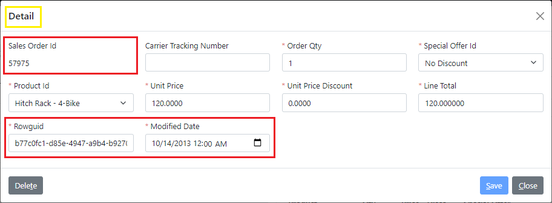
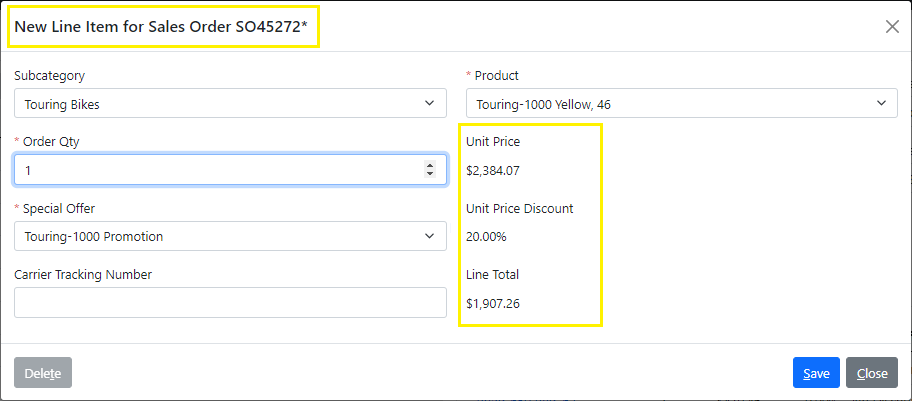

# 3.11 Computed fields

In the beginning of this chapter we have [updated the list of line items](child-list) for a sales order to show the relevant information.

In this section we will add ability to edit line items via a child view using some techniques that we have already learned before, and some new Xomega Framework methods for working with computed fields.

## Overview of updates

When we initially generated CRUD operations and views for the `sales order` object, it also generated a child view for the sales order line items, which can be opened from the *Detail* tab of the *Sales Order* details screen, and would look as follows by default.



Let's review the changes that we want to make on this screen.

To help identify the sales order, for which we are adding or editing a line item, we will add the *Sales Order Number* to the title of the view. We also want to update the title to say "*Line Item for Sales Order [SO#]*".

Since the number of products is too large to allow easy selection from the dropdown list, we will add a *Product Subcategory* dropdown, which will narrow down the list of products to the selected subcategory.

Also we want to hide all internal fields like `rowguid`, `modified date` and `sales order id`, and make fields that are calculated from other fields readonly.

Selecting a product should populate the *Unit Price*, and filter the *Special Offer* dropdown list to the offers for the selected product. Selecting a *Special Offer* should populate the *Unit Price Discount* accordingly.

And entering the *Order Quantity* should recalculate the *Line Total*, taking into account the unit price and the selected *Special Offer*, just like changing the *Product* or selecting a different  *Special Offer*.

## Updating Detail CRUD operations

Let's start by updating the CRUD operations for the `details` sub-object of the `sales order` object, in order to return all the necessary information, and to only update fields that can be updated.

### Configuring the Read operation

We'll start by making the `read` operation return additional output parameters `sales order number` and `subcategory`, and will remove the `rowguid` and `modified date` parameters. In order to set up a proper order of fields on the screen when displayed in two columns, we will also **reorder** some of the **remaining parameters**, as illustrated below.

```xml title="sales_order.xom"
    <object name="sales order">
      ...
      <subobjects>
<!-- highlight-next-line -->
        <object name="detail">
            ...
<!-- highlight-next-line -->
            <operation name="read" type="read">
              <input>[...]
              <output>
                <param name="sales order id" type="sales order header" required="true"/>
<!-- added-lines-start -->
                <param name="sales order number" type="sales order number"/>
                <param name="subcategory" type="product subcategory"/>
                <param name="product id" type="product" required="true"/>
<!-- added-lines-end -->
<!-- removed-next-line -->
                <param name="carrier tracking number"/>
                <param name="order qty"/>
<!-- removed-next-line -->
                <param name="special offer id" type="special offer" required="true"/>
                <param name="unit price"/>
<!-- added-next-line -->
                <param name="special offer id" type="special offer" required="true"/>
                <param name="unit price discount"/>
<!-- removed-next-line -->
                <param name="product id" type="product" required="true"/>
<!-- added-next-line -->
                <param name="carrier tracking number"/>
                <param name="line total"/>
<!-- removed-lines-start -->
                <param name="rowguid"/>
                <param name="modified date"/>
<!-- removed-lines-end -->
                <config>
                  <xfk:add-to-object class="SalesOrderDetailObject"/>
                </config>
              </output>
            </operation>
            ...
        </object>
      </subobjects>
    </object>
```

### Fixing Create and Update operations

Following the best service design principles, you don't want to send any calculated values in the `create` or `update` operations, but let the service operations calculate and store those values on its own instead.

So we will remove any computed values from both the `create` and `update` operations, leaving only the fields that can be updated by the user, as follows.

```xml
<!-- highlight-next-line -->
    <operation name="create" type="create">
      <input>
        <param name="sales order id" type="sales order header" required="true"/>
        <struct name="data">
          <param name="carrier tracking number"/>
          <param name="order qty"/>
          <param name="special offer id" type="special offer" required="true"/>
          <param name="product id" type="product" required="true"/>
<!-- removed-lines-start -->
          <param name="unit price"/>
          <param name="unit price discount"/>
          <param name="line total"/>
          <param name="rowguid"/>
          <param name="modified date"/>
<!-- removed-lines-end -->
          <config>[...]
        </struct>
        <config>[...]
      </input>
      <output>[...]
    </operation>
<!-- highlight-next-line -->
    <operation name="update" type="update">
      <input>
        <param name="sales order detail id"/>
        <struct name="data">
          <param name="carrier tracking number"/>
          <param name="order qty"/>
          <param name="special offer id" type="special offer" required="true"/>
          <param name="product id" type="product" required="true"/>
<!-- removed-lines-start -->
          <param name="unit price"/>
          <param name="unit price discount"/>
          <param name="line total"/>
          <param name="rowguid"/>
          <param name="modified date"/>
<!-- removed-lines-end -->
          <config>[...]
        </struct>
        <config>[...]
      </input>
      ...
    </operation>
```

## Implementing custom service code

Now let's build the model project, and provide some custom code for the service implementations.

### Custom code for new fields

To populate the new `sales order number` and `subcategory` parameters in the `read` operation, we will open the generated `SalesOrderService` class and update its `Detail_ReadAsync` method, as shown below.

```cs title="SalesOrderService.cs"
public partial class SalesOrderService : BaseService, ISalesOrderService
{
// highlight-next-line
    public virtual async Task<Output<SalesOrderDetail_ReadOutput>> Detail_ReadAsync(
        int _salesOrderDetailId, CancellationToken token = default)
    {
        ...
        // CUSTOM_CODE_START: set the SalesOrderNumber output field of Detail_Read operation below
/* removed-next-line */
        // TODO: res.SalesOrderNumber = ???; // CUSTOM_CODE_END
/* added-next-line */
        res.SalesOrderNumber = obj.SalesOrderObject.SalesOrderNumber; // CUSTOM_CODE_END
        // CUSTOM_CODE_START: set the Subcategory output field of Detail_Read operation below
/* removed-next-line */
        // TODO: res.Subcategory = ???; // CUSTOM_CODE_END
/* added-next-line */
        res.Subcategory = obj.SpecialOfferProductObject.ProductObject.ProductSubcategoryId; // CUSTOM_CODE_END
        ...
    }
}
```

### Custom code for computed fields

To make reusable custom code for both the `create` and `update` operations, let's open the extended `SalesOrderService`, and add the following `UpdateOrderDetail` method.

```cs title="SalesOrderServiceExtended.cs"
public partial class SalesOrderService
{
    ...
/* added-lines-start */
    protected void UpdateOrderDetail(SalesOrderDetail obj)
    {
        currentErrors.AbortIfHasErrors(); // prevent invalid data

        obj.UnitPrice = obj.SpecialOfferProductObject.ProductObject.ListPrice;
        obj.UnitPriceDiscount = obj.SpecialOfferProductObject.SpecialOfferObject.DiscountPct;
        obj.LineTotal = obj.OrderQty * obj.UnitPrice * (1 - obj.UnitPriceDiscount);

        obj.ModifiedDate = DateTime.Now;
        if (obj.Rowguid == default)
            obj.Rowguid = Guid.NewGuid();
    }
/* added-lines-end */
}
```

The first call to `AbortIfHasErrors` ensures that there are no validation errors so far, and all objects have been resolved from their IDs. Then, we set the computed fields from the values of other underlying fields, and initialize the `ModifiedDate` and `Rowguid` as needed.

Next, we will open the generated `SalesOrderService` class, and will update the `Detail_CreateAsync` and `Detail_UpdateAsync` method to use our new method, as follows.

```cs title="SalesOrderService.cs"
public partial class SalesOrderService : BaseService, ISalesOrderService
{
// highlight-next-line
    public virtual async Task<Output<SalesOrderDetail_CreateOutput>> Detail_CreateAsync(
        int _salesOrderId, SalesOrderDetail_CreateInput_Data _data, CancellationToken token = default)
    {
        ...
        // CUSTOM_CODE_START: add custom code for Detail_Create operation below
/* added-next-line */
        UpdateOrderDetail(obj);
        // CUSTOM_CODE_END
        ...
    }

// highlight-next-line
    public virtual async Task<Output> Detail_UpdateAsync(
      int _salesOrderDetailId, SalesOrderDetail_UpdateInput_Data _data, CancellationToken token = default)
    {
        ...
        // CUSTOM_CODE_START: add custom code for Detail_Update operation below
/* added-next-line */
        UpdateOrderDetail(obj);
        // CUSTOM_CODE_END
        ...
    }
}
```

## Configuring dynamic enumerations

Before we move to update the UI, let's first configure some dynamic enumerations that are required in the *Line Item* details screen.

### Adding Subcategory enumeration

To allow selection of a subcategory, we will configure the *Read Enum Operation* generator to set the *Generate Read Enum* parameter back to `True`, and then will run that generator on the `product_subcategory.xom` file. In the generated `read enum` operation, we will remove the `rowguid` and `modified date` output parameters as follows.

```xml title="product_subcategory.xom"
<object name="product subcategory">
  ...
  <operation name="read enum">
    <output list="true">
      <param name="product subcategory id"/>
      <param name="product category id"/>
      <param name="name"/>
<!-- removed-lines-start -->
      <param name="rowguid"/>
      <param name="modified date"/>
<!-- removed-lines-end -->
    </output>
    <config>
      <rest:method verb="GET" uri-template="product-subcategory/enum"/>
<!-- highlight-start -->
      <xfk:enum-cache enum-name="product subcategory" id-param="product subcategory id"
                      desc-param="name"/>
<!-- highlight-end -->
    </config>
    <doc>[...]
  </operation>
  ...
</object>
```

### Updating Product enumeration

Since we need to populate the unit price when selecting a product, we need to make sure that the `product` enumeration that we [added earlier](child-list#product-enumeration), has a `list price` in the output of the `read enum` operation. So let's go ahead and add it, as follows.

```xml title="product.xom"
<object name="product">
  ...
  <operation name="read enum">
    <output list="true">
      <param name="product id"/>
      <param name="name"/>
      <param name="is active" type="boolean" required="true"/>
      <param name="product subcategory id"/>
      <param name="product model id"/>
<!-- added-next-line -->
      <param name="list price"/>
    </output>
    <config>[...]
  </operation>
  ...
</object>
```

### Special Offer Product enumeration

In order to update a list of special offers for the selected product, we will create a contextual enumeration that returns special offers for a single product. Let's run the *Read Enum Operation* generator on the `special_offer_product.xom` file, add `product id` as an `input` parameter of the generated `read enum` operation.

We will also add some output parameters that we'll need from the special offer for our calculated fields, remove some default output parameters, and update the `rest:method` and `xfk:enum-cache` elements accordingly, as shown below.

```xml title="special_offer_product.xom"
<object name="special offer product">
  ...
  <operation name="read enum">
<!-- added-lines-start -->
    <input>
      <param name="product id" type="product" required="true"/>
    </input>
<!-- added-lines-end -->
    <output list="true">
<!-- added-next-line -->
      <param name="special offer id" type="special offer" required="true"/>
<!-- removed-next-line -->
      <param name="id" type="string"/>
      <param name="description" type="string"/>
<!-- removed-lines-start -->
      <param name="rowguid"/>
      <param name="modified date"/>
<!-- removed-lines-end -->
<!-- added-lines-start -->
      <param name="discount" type="percent"/>
      <param name="min qty" type="integer"/>
      <param name="max qty" type="integer"/>
      <param name="active" type="boolean"/>
<!-- added-lines-end -->
    </output>
    <config>
<!-- removed-next-line -->
      <rest:method verb="GET" uri-template="special-offer-product/enum"/>
<!-- added-next-line -->
      <rest:method verb="GET" uri-template="product/{product id}/special-offer"/>
<!-- removed-next-line -->
      <xfk:enum-cache enum-name="special offer product" id-param="id" desc-param="description"/>
<!-- added-lines-start -->
      <xfk:enum-cache enum-name="special offer product" id-param="special offer id"
                      desc-param="description" is-active-param="active"/>
<!-- added-lines-end -->
    </config>
    <doc>[...]
  </operation>
  ...
</object>
```

:::note
Normally, we would turn the `special offer product` object into a `product` subobject of the `special offer` object, similar to [what we did before](context-selection#person-credit-card-subobject) with the `person credit card` object. In this case the above operation would be on the `special offer` object, and would look slightly different.

However, the problem is that the `special offer product` object is referenced directly by the `detail` subobject of the `sales order` object. Domain Driven Design principles do not allow referencing subobjects from outside of their aggregate object, and there is no way to set up such a reference in the Xomega model either.
:::

### Custom service implementation

With these model updates, let's build the *Model* project to generate the services. We don't need to provide any custom code for the `Subcategory` and `Product` enumerations, since they only return fields from the corresponding object.

 We just need to provide custom code for all unknown output parameters in the generated `ReadEnumAsync` method of the `SpecialOfferProductService`, as follows.

```cs title="SpecialOfferProductService.cs"
public partial class SpecialOfferProductService : BaseService, ISpecialOfferProductService
{
    ...
    public virtual async Task<Output<ICollection<SpecialOfferProduct_ReadEnumOutput>>>
        ReadEnumAsync(int _productId, CancellationToken token = default)
    {
        ...
        var qry = from obj in src
                  select new SpecialOfferProduct_ReadEnumOutput() {
                      SpecialOfferId = obj.SpecialOfferId,
                      // CUSTOM_CODE_START: set the Description output parameter of ReadEnum operation below
/* removed-next-line */
                      // TODO: Description = obj.???, // CUSTOM_CODE_END
/* added-next-line */
                      Description = obj.SpecialOfferObject.Description, // CUSTOM_CODE_END
                      // CUSTOM_CODE_START: set the Discount output parameter of ReadEnum operation below
/* removed-next-line */
                      // TODO: Discount = obj.???, // CUSTOM_CODE_END
/* added-next-line */
                      Discount = obj.SpecialOfferObject.DiscountPct, // CUSTOM_CODE_END
                      // CUSTOM_CODE_START: set the MinQty output parameter of ReadEnum operation below
/* removed-next-line */
                      // TODO: MinQty = obj.???, // CUSTOM_CODE_END
/* added-next-line */
                      MinQty = obj.SpecialOfferObject.MinQty, // CUSTOM_CODE_END
                      // CUSTOM_CODE_START: set the MaxQty output parameter of ReadEnum operation below
/* removed-next-line */
                      // TODO: MaxQty = obj.???, // CUSTOM_CODE_END
/* added-next-line */
                      MaxQty = obj.SpecialOfferObject.MaxQty, // CUSTOM_CODE_END
                      // CUSTOM_CODE_START: set the Active output parameter of ReadEnum operation below
/* removed-next-line */
                      // TODO: Active = obj.???, // CUSTOM_CODE_END
/* added-next-line */
                      Active = true, // CUSTOM_CODE_END
                  };
        ...
    }
}
```

:::note
Normally, we would set the `Active` parameter based on the *Start Date* and *End Date* of the corresponding special offer.

However, given that we use an older sample database, where all special offers would be expired by now, we would see no active records to select there, so we just default it to `true`.
:::

## Updating UI view and behavior

Now we are ready to finish up the *Line Item* view with the UI updates.

### Implementing dynamic view title

Let's start with updating the view title, and make it dynamically include the order number.

We will set the `title` of our `SalesOrderDetailView` to be "*Line Item for Sales Order {0}*", where the placeholder will contain the order number. We'll implement the dynamic title in the custom view model, so we'll need to set the `customize="true"` on its `ui:view-model` element, as follows.

```xml title="sales_order.xom"
<!-- highlight-next-line -->
<ui:view name="SalesOrderDetailView" title="Line Item for Sales Order {0}" child="true">
<!-- highlight-next-line -->
  <ui:view-model data-object="SalesOrderDetailObject" customize="true"/>
</ui:view>
```

We have added the `sales order number` to the `read` operation, so it should be available when editing existing line items. Yet, to make it also available when adding a new line item, we will need to pass it to the `SalesOrderDetailView` from the parent *Sales Order* details view. So we'll add it as a parameter for the `new` link, as follows.

```xml
<xfk:data-object class="SalesOrderDetailList" list="true">
  ...
<!-- highlight-next-line -->
  <ui:link name="new" view="SalesOrderDetailView" child="true">
    <ui:params>
      <ui:param name="_action" value="create"/>
      <ui:param name="sales order id" field="sales order id" data-object=".."/>
<!-- added-next-line -->
      <ui:param name="sales order number" field="sales order number" data-object=".."/>
    </ui:params>
  </ui:link>
</xfk:data-object>
```

Now we need to build the *Model* again, and add an override for the `BaseTitle` to the `SalesOrderDetailViewModelCustomized` class, as shown below.

```cs title="SalesOrderDetailViewModelCustomized.cs"
public class SalesOrderDetailViewModelCustomized : SalesOrderDetailViewModel
{
    ...
/* added-next-line */
    public override string BaseTitle => GetString("View_Title", MainObj.SalesOrderNumberProperty.Value);
}
```

This code reads the localized resource for the view title, and formats it using the value of the `SalesOrderNumberProperty`.

### Configuring data object fields

We are going to implement behavior for computed fields and cascading selection in the customized `SalesOrderDetailObject`, so let's set the `customize="true"` attribute on this data object.

We will also lay out the fields in two columns by setting `field-cols="2"` here, and will configure them to hide `sales order id` and `sales order number`. Then we'll manually make the `subcategory` editable, since it's not updated in any operations, and will set proper labels for `product id` and `special offer id`, as follows.

```xml title="sales_order.xom"
<!-- highlight-next-line -->
    <xfk:data-object class="SalesOrderDetailObject" customize="true">
      <ui:display>
<!-- removed-next-line -->
        <ui:fields>
<!-- added-next-line -->
        <ui:fields field-cols="2">
          <ui:field param="sales order detail id" hidden="true"/>
<!-- added-lines-start -->
          <ui:field param="sales order id" hidden="true"/>
          <ui:field param="sales order number" hidden="true"/>
          <ui:field param="subcategory" editable="true"/>
          <ui:field param="product id" label="Product"/>
          <ui:field param="special offer id" label="Special Offer"/>
<!-- added-lines-end -->
        </ui:fields>
      </ui:display>
    </xfk:data-object>
```

### Cascading and contextual selection

Let's build the *Model* project one more time, and open the generated `SalesOrderDetailObjectCustomized.cs` file. We will set up cascading selection of the product off of the selected subcategory by calling the `SetCascadingProperty` method. We'll also configure it to show uncategorized products only, when the selected subcategory is blank, as opposed to showing all products.

To configure contextual selection of the special offer based on the selected product, we'll set up a `LocalCacheLoader` using a class generated from our contextual enumeration, and then we will call `SetCacheLoaderParameters` to provide a source property for the `ProductId` parameter of the cache loader, as shown below.

```cs title="SalesOrderDetailObjectCustomized.cs"
/* added-lines-start */
using AdventureWorks.Services.Common;
using AdventureWorks.Services.Common.Enumerations;
/* added-lines-end */
...
public class SalesOrderDetailObjectCustomized : SalesOrderDetailObject
{
    ...
    // perform post initialization
    protected override void OnInitialized()
    {
        base.OnInitialized();

/* added-lines-start */
        ProductIdProperty.SetCascadingProperty(Product.Attributes.ProductSubcategoryId, SubcategoryProperty);
        // configure blank subcategory to display products with no categories
        ProductIdProperty.CascadingMatchNulls = true;

        SpecialOfferIdProperty.LocalCacheLoader = new SpecialOfferProductReadEnumCacheLoader(ServiceProvider);
        SpecialOfferIdProperty.SetCacheLoaderParameters(
            SpecialOfferProduct.Parameters.ProductId, ProductIdProperty);
/* added-lines-end */
    }
}
```

### Configuring computed properties

Finally, let's configure computed properties on the UI to have them automatically update whenever values of the underlying properties change. You can set it up manually using property listeners, but Xomega Framework makes it extremely easy using LINQ expressions.

All you have to do is to create an expression that returns the computed value based on the provided arguments, and pass it to the `SetComputedValue` method along with the instances of those arguments. You can pass the entire data object or individual properties as the arguments, or any combination thereof. To make the expression easier to write, you can also define and use helper functions, such as the `GetLineTotal` for calculating the line total from nullable values, as illustrated below.

```cs title="SalesOrderDetailObjectCustomized.cs"
...
/* added-next-line */
using System.Linq.Expressions;
using Xomega.Framework.Properties;
...
public class SalesOrderDetailObjectCustomized : SalesOrderDetailObject
{
    ...
    protected override void OnInitialized()
    {
        ...
/* added-lines-start */
        // computed property using the entire object
        Expression<Func<SalesOrderDetailObject, object>> xPrice = sod => sod.ProductIdProperty.IsNull(null) ?
            null : sod.ProductIdProperty.Value[Product.Attributes.ListPrice];
        UnitPriceProperty.SetComputedValue(xPrice, this);

        // computed property using individual property
        Expression<Func<EnumProperty, object>> xDiscount = spOf =>
            spOf.IsNull(null) ? null : spOf.Value[SpecialOfferProduct.Attributes.Discount];
        UnitPriceDiscountProperty.SetComputedValue(xDiscount, SpecialOfferIdProperty);

        // computed total using a helper function
        Expression<Func<SalesOrderDetailObject, decimal>> xLineTotal = sod => GetLineTotal(
            sod.UnitPriceProperty.Value, sod.UnitPriceDiscountProperty.Value, sod.OrderQtyProperty.Value);
        LineTotalProperty.SetComputedValue(xLineTotal, this);
/* added-lines-end */
    }

/* added-lines-start */
    private static decimal GetLineTotal(decimal? price, decimal? discount, long? qty) =>
        (price ?? 0) * (1 - (discount ?? 0)) * (qty ?? 0);
/* added-lines-end */
}
```


## Reviewing the results

Let's run the application to review the results of our hard work. If you open details of an existing sales order, and click *New* on the *Details* tab, the following screen will appear.



Notice how the view title has been updated, and includes the number of the current sales order. The fields are laid out in two columns, and include a *Subcategory* to help you select a *Product*.

Once you select a *Product*, the readonly *Unit Price* field will show the price, and the *Special Offer* list will be updated with applicable special offers. Selecting a special offer will update the calculated *Unit Price Discount* value that is displayed as %.

Finally, changing the *Product*, *Order Qty* or *Special Offer* will trigger recalculation of the *Line Total* value.