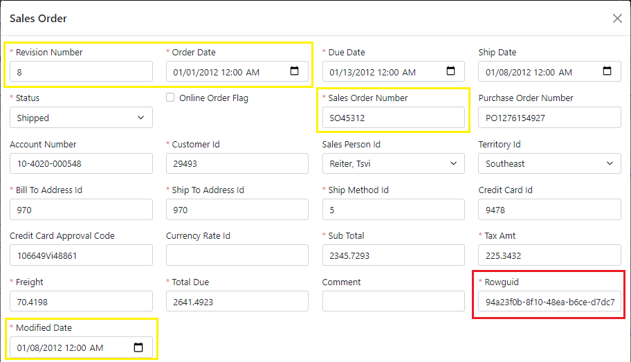
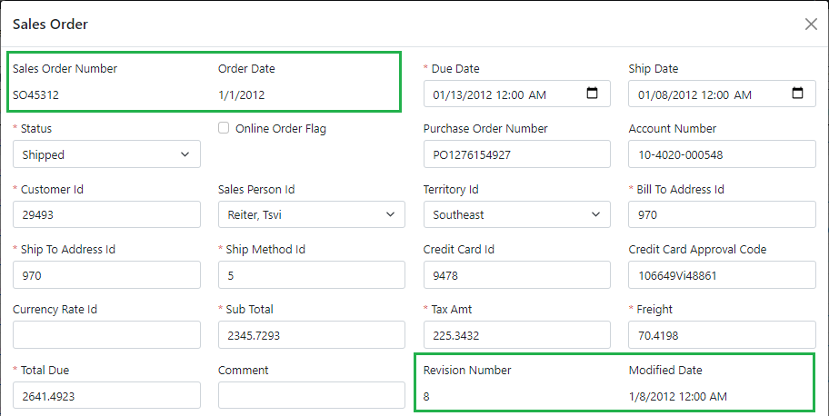

# 3.2 Read-only fields

In this section, you will learn how to model read-only fields, which will be automatically reflected on the screen.

## Overview of updates

If we look at the details screen generated for us by default, we will notice that all object fields there are editable. However, some fields are completely internal, and should not even be displayed to the user, such as the *Rowguid* highlighted in red below.



Other fields, such as the ones highlighted in yellow, are set internally by the system and should be read only on the screen.

## Updating CRUD operations

To address these issues, we will need to properly update the generated CRUD operations to specify which fields can be updated on the object.

### Fixing the Read operation

We will start by updating the output parameters of the `read` operation for the `sales order` object.

Since it is the first structure in the model that is added to the data object `SalesOrderObject`, and includes all properties of that data object, the order of its output parameters will drive the order of the fields on the screen, so we can use it to rearrange some fields on the screen as well.

Let's remove the `rowguid` parameter, move the `sales order number` to be the first parameter, and move the `revision number` to go right before the `modified date`. We'll also override the type on the `order date` parameter to be just the `date`, without the time component, as illustrated in the following snippet.

```xml title="sales_order.xom"
    <object name="sales order">
        ...
        <operation name="read" type="read">
          <input>[...]
          <output>
<!-- added-next-line -->
            <param name="sales order number"/>
<!-- removed-next-line -->
            <param name="revision number"/>
<!-- highlight-next-line -->
            <param name="order date" type="date"/>
            <param name="due date"/>
            <param name="ship date"/>
            <param name="status"/>
            <param name="online order flag"/>
<!-- removed-next-line -->
            <param name="sales order number"/>
            <param name="purchase order number"/>
            <param name="account number"/>
            <param name="customer id"/>
            <param name="sales person id"/>
            <param name="territory id"/>
            <param name="bill to address id"/>
            <param name="ship to address id"/>
            <param name="ship method id"/>
            <param name="credit card id"/>
            <param name="credit card approval code"/>
            <param name="currency rate id"/>
            <param name="sub total"/>
            <param name="tax amt"/>
            <param name="freight"/>
            <param name="total due"/>
            <param name="comment"/>
<!-- removed-next-line -->
            <param name="rowguid"/>
<!-- added-next-line -->
            <param name="revision number"/>
            <param name="modified date"/>
          </output>
        </operation>
        ...
    </object>
```

### Fixing the Create operation

Next, let's remove the `rowguid` parameter from the input of the `create` operation, and move the other parameters, that are calculated during order creation, from the input to the output of the `create` operation, as shown below.

```xml
    <object name="sales order">
        ...
        <operation name="create" type="create">
          <input arg="data">
<!-- removed-lines-start -->
            <param name="revision number"/>
            <param name="order date"/>
<!-- removed-lines-end -->
            <param name="due date"/>
            <param name="ship date"/>
            <param name="status"/>
            <param name="online order flag"/>
<!-- removed-next-line -->
            <param name="sales order number"/>
            <param name="purchase order number"/>
            <param name="account number"/>
            <param name="customer id"/>
            <param name="sales person id"/>
            <param name="territory id"/>
            <param name="bill to address id"/>
            <param name="ship to address id"/>
            <param name="ship method id"/>
            <param name="credit card id"/>
            <param name="credit card approval code"/>
            <param name="currency rate id"/>
            <param name="sub total"/>
            <param name="tax amt"/>
            <param name="freight"/>
            <param name="total due"/>
            <param name="comment"/>
<!-- removed-lines-start -->
            <param name="rowguid"/>
            <param name="modified date"/>
<!-- removed-lines-end -->
            <config>
              <xfk:add-to-object class="SalesOrderObject"/>
            </config>
          </input>
<!-- highlight-next-line -->
          <output>
            <param name="sales order id"/>
<!-- added-lines-start -->
            <param name="sales order number"/>
            <param name="order date" type="date"/>
            <param name="revision number"/>
            <param name="modified date"/>
<!-- added-lines-end -->
            <config>
              <xfk:add-to-object class="SalesOrderObject"/>
            </config>
          </output>
        </operation>
        ...
    </object>
```

:::note
Note that we also need to update the type of the `order date` parameter here to be the `date`, so that it would be consistent with the type of this parameter in the `read` operation.
:::

### Fixing the Update operation

Similarly, we will remove all those parameters (including `rowguid`) from the input of the `update` operation, and will move the `revision number` and `modified date` to the output of the operation, since they are changed on each update.

```xml
    <object name="sales order">
        ...
        <operation name="update" type="update">
          <input>
            <param name="sales order id"/>
            <struct name="data">
<!-- removed-lines-start -->
              <param name="revision number"/>
              <param name="order date"/>
<!-- removed-lines-end -->
              <param name="due date"/>
              <param name="ship date"/>
              <param name="status"/>
              <param name="online order flag"/>
<!-- removed-next-line -->
              <param name="sales order number"/>
              <param name="purchase order number"/>
              <param name="account number"/>
              <param name="customer id"/>
              <param name="sales person id"/>
              <param name="territory id"/>
              <param name="bill to address id"/>
              <param name="ship to address id"/>
              <param name="ship method id"/>
              <param name="credit card id"/>
              <param name="credit card approval code"/>
              <param name="currency rate id"/>
              <param name="sub total"/>
              <param name="tax amt"/>
              <param name="freight"/>
              <param name="total due"/>
              <param name="comment"/>
<!-- removed-lines-start -->
              <param name="rowguid"/>
              <param name="modified date"/>
<!-- removed-lines-end -->
              <config>
                <xfk:add-to-object class="SalesOrderObject"/>
              </config>
            </struct>
            <config>
              <xfk:add-to-object class="SalesOrderObject"/>
            </config>
          </input>
<!-- added-lines-start -->
          <output>
            <param name="revision number"/>
            <param name="modified date"/>
            <config>
              <xfk:add-to-object class="SalesOrderObject"/>
            </config>
          </output>
<!-- added-lines-end -->
       </operation>
        ...
    </object>
```

:::tip
As you update operations' inputs and outputs, make sure to insert the `config` section with an `xfk:add-to-object` element as needed.

This will allow the data object to set the input parameters from its properties when calling the operation and to update its properties from the output parameters when handling the operation result.
:::

## Custom code for read-only fields

The system may set the read-only parameters in different ways. For example, the `sales order number` is just a computed field in the database, and the `revision number` is incremented by a database trigger.

The `rowguid`, `modified date`, and `order date`, which would presumably be the order creation date, are not updated in the database, so we will add custom code in the `CreateAsync` method of the `SalesOrderService` to populate them as follows.

```cs title="SalesOrderService.cs"
public virtual async Task<Output<SalesOrder_CreateOutput>>
    CreateAsync(SalesOrder_CreateInput _data, CancellationToken token = default)
{
    ...
    // CUSTOM_CODE_START: add custom code for Create operation below
/* added-lines-start */
    obj.OrderDate = DateTime.Now;
    obj.ModifiedDate = DateTime.Now;
    obj.Rowguid = Guid.NewGuid();
/* added-lines-end */
    // CUSTOM_CODE_END
    ...
}
```

And similarly, we will add custom code in the `UpdateAsync` method to set the `modified date`.

```cs
public virtual async Task<Output> UpdateAsync(int _salesOrderId,
    SalesOrder_UpdateInput_Data _data, CancellationToken token = default)
{
    ...
    // CUSTOM_CODE_START: add custom code for Update operation below
/* added-next-line */
    obj.ModifiedDate = DateTime.Now;
    ...
}
```

## Reviewing the results

Let's build the model, and run the application to review the results. Here's what the *Sales Order Details* panel will look like.



Notice how our fields are displayed as read-only labels, and in the correct order now. Also, notice the absence of the *Rowguid* field, and that the *Order Date* is shown as just a date.
