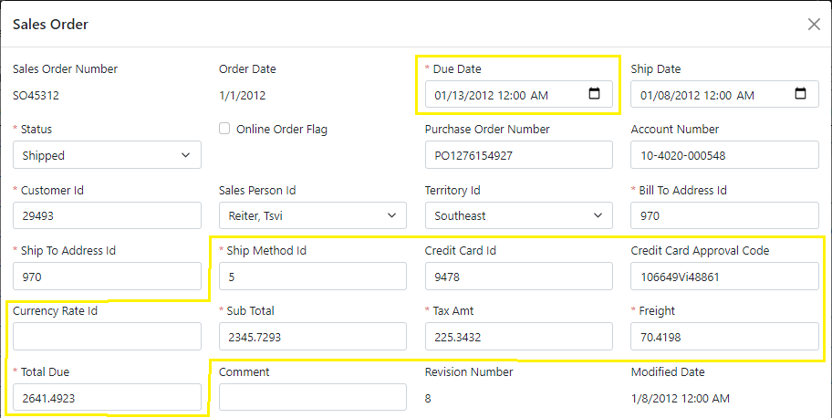
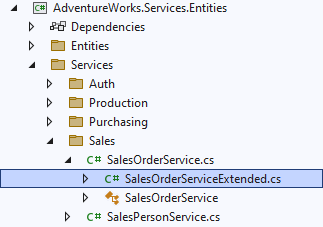
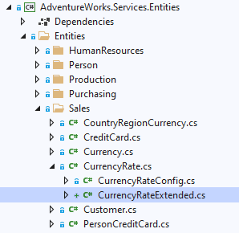
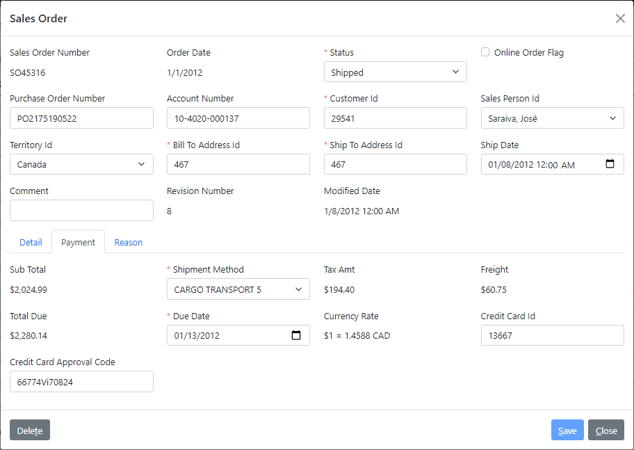

# 3.3 Group fields into sub-panel

When working with such a large data object as the `SalesOrder`, it makes sense to break it up into groups of related fields and display them in tabbed child panels.

## Overview of updates

For example, the fields highlighted below in yellow are related to the payment information and can be grouped under the *Payment* tab.



Let's update our model so that these fields would be displayed in the *Payment* child panel.

## Shipment method enumeration

Before we do that though, we can quickly turn the *Shipment Method* into a dynamic enumeration to allow selecting it from a list of possible shipping methods.

As usual, we will run the *Read Enum Operation* generator on the `ship_method.xom` file, and then we'll update the output of the generated `read enum` operation to return only the `ship method id` and `name`, as shown below.

```xml title="ship_method.xom"
  <object name="ship method">
      ...
      <operation name="read enum">
        <output list="true">
          <param name="ship method id"/>
          <param name="name"/>
<!-- removed-lines-start -->
          <param name="ship base"/>
          <param name="ship rate"/>
          <param name="rowguid"/>
          <param name="modified date"/>
<!-- removed-lines-end -->
        </output>
        <config>
          <rest:method verb="GET" uri-template="ship-method/enum"/>
<!-- highlight-next-line -->
          <xfk:enum-cache enum-name="ship method" id-param="ship method id" desc-param="name"/>
        </config>
      </operation>
      ...
  </object>
```

## Defining child data object

Turning our group of payment fields into a child object will require a more advanced level of modeling, but it's still pretty straightforward once you get the hang of it.

### Declaring child data object

We will start by declaring a new `xfk:data-object` in the `sales_order.xom` with a class `SalesOrderPaymentObject`. Then we'll add it as a child to the data object `SalesOrderObject` under the name `payment` as follows.

```xml title="sales_order.xom"
  <xfk:data-objects>
    <xfk:data-object class="SalesOrderObject">
      <xfk:add-child name="detail" class="SalesOrderDetailList"/>
<!-- added-next-line -->
      <xfk:add-child name="payment" class="SalesOrderPaymentObject"/>
      <xfk:add-child name="reason" class="SalesOrderReasonList"/>
      <ui:display>[...]
    </xfk:data-object>
    ...
<!-- added-next-line -->
    <xfk:data-object class="SalesOrderPaymentObject"/>
    <xfk:data-object class="SalesOrderReasonObject">[...]
    ...
  </xfk:data-objects>
```

:::note
Once you do that, you will get a model warning telling you that your new data object doesn't have any properties defined. We will fix this next.
:::

### Defining data object structures

Right above the top-level `objects` element, we will add a `structs` element and define two structures named `payment info` and `payment update` that are based on the `sales order` object and will configure them to have their parameters added to the `SalesOrderPaymentObject` data object.

The first structure, `payment info`, will represent the payment fields that we read from the `SalesOrderService`, so we'll go ahead and move all those read output parameters to this structure.

Again, since it has all parameters for our data object, and goes first in the model, the order of these parameters will determine the order of the fields on the screen. So we'll put these parameters in the desired order, as follows.

```xml
  <enums>[...]
<!-- added-lines-start -->
  <structs>
    <struct name="payment info" object="sales order">
      <param name="sub total"/>
      <param name="ship method id"/>
      <param name="tax amt"/>
      <param name="freight"/>
      <param name="total due"/>
<!-- highlight-start -->
      <param name="due date" type="date"/>
      <param name="currency rate" type="string"/>
<!-- highlight-end -->
      <param name="credit card id"/>
      <param name="credit card approval code"/>
      <config>
<!-- highlight-next-line -->
        <xfk:add-to-object class="SalesOrderPaymentObject"/>
      </config>
    </struct>
  </structs>
<!-- added-lines-end -->
  <objects>[...]
```

While we were at it, we also overrode the type for the `due date` parameter to be just the `date` and set the type of the `currency rate` to be a string, so that we could return a user-friendly description of the currency rate.

:::tip
Remember to add a `config/xfk:add-to-object` to each structure to configure it for your data object.
:::

The second structure, `payment update`, will represent a smaller subset of the fields, which can be set by the user, as shown in the following snippet. Those will not include any amounts or the currency rate, which are calculated internally by the system from other data.

```xml
  <structs>
    <struct name="payment info" object="sales order">[...]
<!-- added-lines-start -->
    <struct name="payment update" object="sales order">
      <param name="ship method id"/>
<!-- highlight-next-line -->
      <param name="due date" type="date"/>
      <param name="credit card id"/>
      <param name="credit card approval code"/>
      <config>
<!-- highlight-next-line -->
        <xfk:add-to-object class="SalesOrderPaymentObject"/>
      </config>
    </struct>
<!-- added-lines-end -->
  </structs>
```

:::note
Despite its name, we will use this structure in both `create` and `update` operations.
:::

### Configuring child data object

Now that we have defined structures for our `SalesOrderPaymentObject`, and thereby defined its properties, the warning on the object should disappear. So we can go ahead and configure its fields, such as using a proper *Shipment Method* label as follows.

```xml
    <xfk:data-object class="SalesOrderPaymentObject">
<!-- added-lines-start -->
      <ui:display>
        <ui:fields>
          <ui:field param="ship method id" label="Shipment Method"/>
        </ui:fields>
      </ui:display>
    </xfk:data-object>
<!-- added-lines-end -->
```

## Refactoring CRUD operations

After you added the structures, you may have noticed the warnings on them, telling you that those structures are not used in the model. So let's update the CRUD operations of the `sales order` object to use these structures.

### Refactoring Read operation

Let's open the output of the `sales order` object's `read` operation, move the `ship date` parameter down, and replace all the payment output parameters with a reference to the `payment info` structure under the `payment` name, as shown below.

```xml
    <object name="sales order">
        ...
<!-- highlight-next-line -->
        <operation name="read" type="read">
          <input>[...]
          <output>
            ...
<!-- removed-lines-start -->
            <param name="due date"/>
            <param name="ship date"/>
<!-- removed-lines-end -->
            ...
<!-- removed-lines-start -->
            <param name="ship method id"/>
            <param name="credit card id"/>
            <param name="credit card approval code"/>
            <param name="currency rate id"/>
            <param name="sub total"/>
            <param name="tax amt"/>
            <param name="freight"/>
            <param name="total due"/>
<!-- removed-lines-end -->
<!-- added-lines-start -->
            <param name="ship date"/>
            <struct name="payment" ref="payment info"/>
<!-- added-lines-end -->
            <param name="comment"/>
            ...
          </output>
        </operation>
        ...
    </object>
```

:::warning
For things to work auto-magically, it is important to use the same name (`payment`) for the referenced structure here, as the name that you used to add the child object `SalesOrderPaymentObject` to the `SalesOrderObject`.

Otherwise, you would need to do some custom coding to ensure that the child object is read from the proper output structure.
:::

### Refactoring Create operation

Similarly, we will replace those same payment parameters in the input of the `create` operations, with a reference to the `payment update` structure, using the same name, as follows.

```xml
    <object name="sales order">
        ...
<!-- highlight-next-line -->
        <operation name="create" type="create">
          <input arg="data">
<!-- removed-lines-start -->
            <param name="due date"/>
            <param name="ship date"/>
<!-- removed-lines-end -->
            ...
<!-- removed-lines-start -->
            <param name="ship method id"/>
            <param name="credit card id"/>
            <param name="credit card approval code"/>
            <param name="currency rate id"/>
            <param name="sub total"/>
            <param name="tax amt"/>
            <param name="freight"/>
            <param name="total due"/>
<!-- removed-lines-end -->
<!-- added-lines-start -->
            <param name="ship date"/>
            <struct name="payment" ref="payment update"/>
<!-- added-lines-end -->
            <param name="comment"/>
            <config>[...]
          </input>
          <output>[...]
        </operation>
        ...
    </object>
```
 
 As before, we also moved the `ship date` parameter down to keep the same order.

### Refactoring Update operation

Finally, we will perform the same replacements in the input of the `update` operations, as shown below.

```xml
    <object name="sales order">
        ...
<!-- highlight-next-line -->
        <operation name="update" type="update">
          <input>
            <param name="sales order id"/>
            <struct name="data">
<!-- removed-lines-start -->
              <param name="due date"/>
              <param name="ship date"/>
<!-- removed-lines-end -->
              ...
<!-- removed-lines-start -->
              <param name="ship method id"/>
              <param name="credit card id"/>
              <param name="credit card approval code"/>
              <param name="currency rate id"/>
              <param name="sub total"/>
              <param name="tax amt"/>
              <param name="freight"/>
              <param name="total due"/>
<!-- removed-lines-end -->
<!-- added-lines-start -->
              <param name="ship date"/>
              <struct name="payment" ref="payment update"/>
<!-- added-lines-end -->
              <param name="comment"/>
              <config>[...]
            </struct>
            <config>[...]
          </input>
          <output>[...]
        </operation>
        ...
    </object>
```

## Custom service implementation

Now that we have updated our service model to return and accept child structures like this, we will need to provide custom implementations for handling these parameters in the generated service.

However, those will be pretty large pieces of custom code, which we don't want to be mixed in with the generated code. Plus, that custom code for the `update` and `create` operations will be pretty much the same.

So a better design will be for us to extend the generated partial class `SalesOrderService` with our own file, where we can implement this custom code in separate methods, and mix in the calls to those methods in the generated file, which we are about to see.

### Custom partial service class

The easiest way to do it is to set the `extend="true"` attribute on the `svc:customize` element of the `sales order` object's configuration, as shown below.

```xml
    <object name="sales order">
      <fields>[...]
      <operations>[...]
      <config>
        <sql:table name="Sales.SalesOrderHeader"/>
<!-- highlight-next-line -->
        <svc:customize extend="true" preserve-on-clean="true"/>
      </config>
      ...
    </object>
```

Once we build the model, we will notice that there is a `SalesOrderServiceExtended.cs` file nested under the `SalesOrderService.cs` file, which provides an extension of the partial class for our custom methods.



### Custom partial entity class

Before we add custom code for the service implementation, let's also create a custom partial class for the `CurrencyRate` entity, in order to provide an easy way to get the rate as a display string.

You can manually add a `CurrencyRateExtended.cs` class next to that entity, or simply set the `extend="true"` attribute on the `edm:customize` element of the `currency rate` object's configuration, as shown below.

```xml title="currency_rate.xom"
    <object name="currency rate">
      <fields>[...]
      <config>
        <sql:table name="Sales.CurrencyRate"/>
<!-- added-next-line -->
        <edm:customize extend="true"/>
      </config>
      ...
    </object>
```

Once you build the model, you will notice that there is a `CurrencyRateExtended.cs` file nested under the `CurrencyRate.cs` file, which provides an extension of the partial class for our customized entity.



So let's go ahead and add a new property to our entity with the rate display string, as follows.

```cs title="CurrencyRateExtended.cs"
    public partial class CurrencyRate
    {
/* added-next-line */
        public string RateString => $"$1 = {EndOfDayRate} {ToCurrencyCodeObject.CurrencyCode}";
    }
```

### Custom Get for the output structure

Next, let's open up the `SalesOrderServiceExtended.cs` file that we created earlier, and add a `GetPaymentInfo` method that populates and returns a `PaymentInfo` structure for the given `SalesOrder` object as follows.

```cs title="SalesOrderServiceExtended.cs"
    public partial class SalesOrderService
    {
/* added-lines-start */
        protected static PaymentInfo GetPaymentInfo(SalesOrder obj) => new()
        {
            DueDate = obj.DueDate,
            SubTotal = obj.SubTotal,
            Freight = obj.Freight,
            TaxAmt = obj.TaxAmt,
            TotalDue = obj.TotalDue,
            ShipMethodId = obj.ShipMethodObject?.ShipMethodId ?? 0,
            CreditCardId = obj.CreditCardObject?.CreditCardId ?? 0,
            CreditCardApprovalCode = obj.CreditCardApprovalCode,
            // highlight-next-line
            CurrencyRate = obj.CurrencyRateObject?.RateString
        };
/* added-lines-end */
    }
```

:::note
Notice how we were able to easily set the currency rate string to our new `RateString` property on the `CurrencyRate` entity, which allowed us to use a null propagation operator to handle `null` cases.
:::

After that, you can go ahead and update the custom code for the `Payment` output parameter in the generated `SalesOrderService.ReadAsync` method to call our `GetPaymentInfo` method as follows.

```cs title="SalesOrderService.cs"
    public partial class SalesOrderService : BaseService, ISalesOrderService
    {
        public virtual async Task<Output<SalesOrder_ReadOutput>>
            ReadAsync(int _salesOrderId, CancellationToken token = default)
        {
            ...
            SalesOrder obj = await ctx.FindEntityAsync<SalesOrder>(currentErrors, token, _salesOrderId);
            ServiceUtil.CopyProperties(obj, res);
            // CUSTOM_CODE_START: populate the Payment output structure of Read operation below
/* removed-next-line */
            // TODO: res.Payment = ???; // CUSTOM_CODE_END
/* added-next-line */
            res.Payment = GetPaymentInfo(obj); // CUSTOM_CODE_END
            ...
        }
    }
```

### Custom Update for the input structure

In the custom Update method for the payment input structure, we'll want to validate that the provided `Payment` structure parameter is not null, and report an error otherwise. We will add a localizable message for this error to the `Resources.resx` file in the `AdventureWorks.Services.Entities` project, as follows. 

|Name|Value|Comment|
|-|-|-|
|PaymentRequired|Payment information is required for order {0}.|{0}=Order ID|

Then we will run the custom tool on the [`Messages.tt`](../../framework/services/errors#message-constants-generator) T4 template file nested under it to generate the constants, similar to how we did it for the [UI validation messages](../search/ui-validation#generating-message-constants) earlier.

Next, we will add a reusable method `UpdatePayment`, which takes input data as a `PaymentUpdate` structure, and updates the `SalesOrder` object provided within the specified context. This method can accept both new and existing `SalesOrder` objects, and therefore can be used for both `create` and `update` operations. The snippet below shows what it would look like.

```cs title="SalesOrderServiceExtended.cs"
public partial class SalesOrderService
{
    ...
/* added-lines-start */
    protected async Task UpdatePayment(SalesOrder obj, PaymentUpdate pmt, CancellationToken token)
    {
        if (pmt == null)
        {
            // highlight-next-line
            currentErrors.AddValidationError(Messages.PaymentRequired, obj.SalesOrderId);
            return;
        }
        obj.DueDate = pmt.DueDate;
        obj.ShipMethodObject = await ctx.FindEntityAsync<ShipMethod>(currentErrors, token, pmt.ShipMethodId);
        obj.CreditCardApprovalCode = pmt.CreditCardApprovalCode;
        obj.CreditCardObject = await ctx.FindEntityAsync<CreditCard>(currentErrors, token, pmt.CreditCardId);
    }
/* added-lines-end */
}
```

:::note
Notice how we were able you use a generated constant `Messages.PaymentRequired` as a key for our validation message, instead of hardcoding it as a string.
:::

Finally, let's update the custom code in the generated `CreateAsync` and `UpdateAsync` operations in the `SalesOrderService` to call our `UpdatePayment` method, as shown below.

```cs title="SalesOrderService.cs"
public partial class SalesOrderService : BaseService, ISalesOrderService
{
    public virtual async Task<Output<SalesOrder_CreateOutput>>
        CreateAsync(SalesOrder_CreateInput _data, CancellationToken token = default)
    {
        ...
        // CUSTOM_CODE_START: use the Payment input parameter of Create operation below
/* removed-next-line */
        // TODO: ??? = _data.Payment; // CUSTOM_CODE_END
/* added-next-line */
        await UpdatePayment(obj, _data.Payment, token); // CUSTOM_CODE_END
        ...
    }

    public virtual async Task<Output<SalesOrder_UpdateOutput>>
        UpdateAsync(int _salesOrderId, SalesOrder_UpdateInput_Data _data, CancellationToken token = default)
    {
        ...
        // CUSTOM_CODE_START: use the Payment input parameter of Update operation below
/* removed-next-line */
        // TODO: ??? = _data.Payment; // CUSTOM_CODE_END
/* added-next-line */
        await UpdatePayment(obj, _data.Payment, token); // CUSTOM_CODE_END
        ...
    }
}
```

## Reviewing the results

Let's run the application, and review the updated *Sales Order* details screen. The following picture illustrates this.



As you can see, our payment fields have been moved down from the main panel to a separate *Payment* tab, where they are laid out in the order they were listed in the `payment info` structure.

The fields that are not listed in the `payment update` structure, such as the calculated amounts, are displayed as read-only labels.

*Shipment Method* with an updated label is a dropdown list with available shipment methods, the *Due Date* is displayed as a date only, and the *Currency Rate* is shown as a string that we build in our customized entity.
