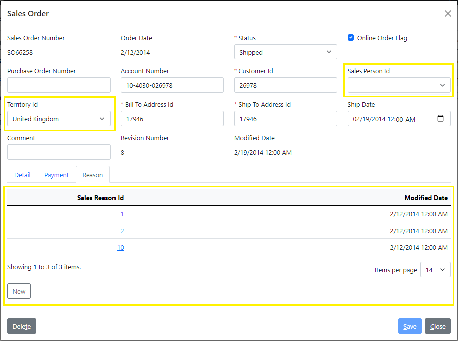
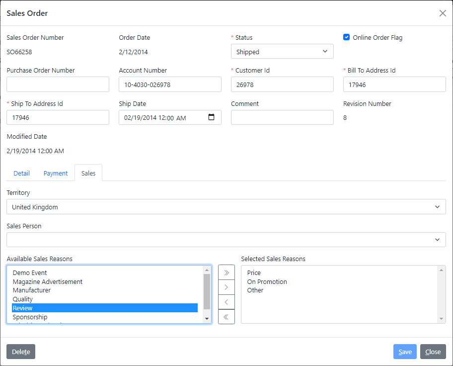

# 3.4 Child list as multi-select

Multi-value properties on a details screen are usually modeled within relational database design as simple child tables, which have a reference to the parent object and a single column for the values. The list of sales reasons on a `sales order` object is a very good example of such a design.

## Overview of updates

The data grid of sales reasons in the auto-generated *Reason* tab currently has a main column with the *Sales Reason Id*, and an audit column with the *Modified Date*, as illustrated in the following screenshot.



What we want to have on this screen for editing sales reasons is a convenient multi-select control showing reason names instead of this default table.

We also want it on a separate *Sales* child panel on this screen grouped with other sales-related fields, such as the *Sales Person* and *Sales Territory*, also highlighted in yellow.

## Removing child CRUD and views

We will start by removing any elements related to the `reason` sub-object, that have been added for us by the *Full CRUD with Views* generator that we ran initially on the `sales_order.xom` file. Those include operations, data objects, and views, as shown below.

```xml title="sales_order.xom"
  <objects>
    <object name="sales order">
      ...
      <subobjects>
        <object name="reason">
<!-- removed-next-line -->
          <operations>[...]
      </subobjects>
    </object>
  </objects>
  <xfk:data-objects>
    <xfk:data-object class="SalesOrderObject">
      <xfk:add-child name="detail" class="SalesOrderDetailList"/>
      <xfk:add-child name="payment" class="SalesOrderPaymentObject"/>
<!-- removed-next-line -->
      <xfk:add-child name="reason" class="SalesOrderReasonList"/>
      <ui:display>[...]
    </xfk:data-object>
    ...
<!-- removed-lines-start -->
    <xfk:data-object class="SalesOrderReasonObject">[...]
    <xfk:data-object class="SalesOrderReasonList" list="true">[...]
<!-- removed-lines-end -->
  </xfk:data-objects>
  <ui:views>
    ...
<!-- removed-next-line -->
    <ui:view name="SalesOrderReasonView" title="Reason" child="true">[...]
  </ui:views>
```

One way to also clean any previously generated artifacts for those removed elements is to run a `Clean` command on the *AdventureWorks.Model* project before the `Build` command. This will delete those generated files and will remove them from their projects.

:::danger
Before you do anything like that though, you want to absolutely make sure that any generated classes containing custom code will be preserved during the *Clean*.

If you previously set `preserve-on-clean="true"` on the `svc:customize` element for the `sales order` object, as we showed before, then you don't need to do anything now. Otherwise, you can remove some lines in the top comments in your customized files, as described in those comments.
:::

:::tip
It is also a good idea to **check everything in **your version control before you run a *Clean* command on the model. This way you will be able to easily review all the changes made by the generators, and revert any unwanted changes.
:::

## Sales Reason enumeration

After we clean and then build the model, we will want to define a dynamic enumeration for the `sales reason` object by running the *Read Enum Operation* generator on the `sales_reason.xom` file, and trim the output of the generated `read enum` operation to keep just the `sales reason id` and `name`, as shown below.

```xml title="sales_reason.xom"
    <object name="sales reason">
      ...
      <operations>
        <operation name="read enum">
          <output list="true">
            <param name="sales reason id"/>
            <param name="name"/>
<!-- removed-lines-start -->
            <param name="reason type"/>
            <param name="modified date"/>
<!-- removed-lines-end -->
          </output>
          <config>
            <rest:method verb="GET" uri-template="sales-reason/enum"/>
<!-- highlight-next-line -->
            <xfk:enum-cache enum-name="sales reason" id-param="sales reason id" desc-param="name"/>
          </config>
        </operation>
      </operations>
    </object>
```

### Configuring key type

In addition, we will override the Blazor control that is used for multi-selection on the `sales reason` type as follows.

```xml
    <type name="sales reason" base="integer enumeration">
<!-- added-lines-start -->
      <config>
        <ui:blazor-control multi-value="true">
          <XPickList/>
        </ui:blazor-control>
      </config>
<!-- added-lines-end -->
      <enum ref="sales reason"/>
    </type>
```

We will use the [`XPickList`](../../framework/blazor/controls#xpicklist) component from the `Xomega.Framework.Blazor` package, which has two lists and the *Add/Remove* buttons to move items from one list to another.

## Grouping into the Sales tab

Next, we'll follow the technique for grouping fields in a child panel that we described earlier.

### Defining child data object

We will first declare a new data object in the model with a class `SalesOrderSalesObject` and will add it as a child of the `SalesOrderObject` under the name `sales`, as shown below.

```xml title="sales_order.xom"
  <xfk:data-objects>
    <xfk:data-object class="SalesOrderObject">
      <xfk:add-child name="detail" class="SalesOrderDetailList"/>
      <xfk:add-child name="payment" class="SalesOrderPaymentObject"/>
<!-- added-next-line -->
      <xfk:add-child name="sales" class="SalesOrderSalesObject"/>
      <ui:display>[...]
    </xfk:data-object>
    ...
<!-- added-next-line -->
    <xfk:data-object class="SalesOrderSalesObject"/>
  </xfk:data-objects>
```

Next, we will define a new structure of `sales info` with our sales fields for the new data object. To allow multiple values for the `sales reason` parameter, we will set its attribute `list="true"`, as follows.

```xml
<!-- added-lines-start -->
    <struct name="sales info" object="sales order">
      <param name="territory id"/>
      <param name="sales person id"/>
      <!-- highlight-next-line -->
      <param name="sales reason" type="sales reason" list="true"/>
      <config>
        <!-- highlight-next-line -->
        <xfk:add-to-object class="SalesOrderSalesObject"/>
      </config>
    </struct>
<!-- added-lines-end -->
```

:::note
Since we have dynamic enumerations for all of these fields, which can decode IDs to names, we don't need to read anything else in addition to these IDs, so we can use the same structure for both `read` and `update` operations.
:::

Now that we have properties on the `SalesOrderSalesObject` data object, we can configure proper labels for our fields.
Also, since the `XPickList` control for the *Sales Reasons* selection contains two list boxes and would be pretty wide, we will set the [`field-cols="1"`](../../visual-studio/modeling/presentation#ui-panel-layout) attribute on the `ui:fields` element to stack all our sales fields in a single column.

The following snippet demonstrates this configuration.

```xml
<!-- removed-next-line -->
    <xfk:data-object class="SalesOrderSalesObject"/>
<!-- added-lines-start -->
    <xfk:data-object class="SalesOrderSalesObject" customize="true">
      <ui:display>
        <ui:fields field-cols="1">
          <ui:field param="territory id" label="Territory"/>
          <ui:field param="sales person id" label="Sales Person"/>
          <ui:field param="sales reason" label="Sales Reasons"/>
        </ui:fields>
      </ui:display>
    </xfk:data-object>
<!-- added-lines-end -->
```

:::note
We have also set the `customize="true"` attribute on the data object, to set up cascading selection for a salesperson off of the selected territory, which we will do in a generated customized subclass later in this section.
:::

### Refactoring CRUD operations

Finally, we will replace the `territory id` and `sales person id` parameters in the output of the `read` operation, and in the input of both `create` and `update` operations, with a reference to the `sales info` structure using `sales` as a name, as outlined below.

```xml
    <object name="sales order">
      <operations>
<!-- highlight-next-line -->
        <operation name="read" type="read">
          <input>[...]
          <output>
            ...
<!-- removed-lines-start -->
            <param name="sales person id"/>
            <param name="territory id"/>
<!-- removed-lines-end -->
            ...
            <struct name="payment" ref="payment info"/>
<!-- added-next-line -->
            <struct name="sales" ref="sales info"/>
            ...
          </output>
        </operation>
<!-- highlight-next-line -->
        <operation name="create" type="create">
          <input arg="data">
            ...
<!-- removed-lines-start -->
            <param name="sales person id"/>
            <param name="territory id"/>
<!-- removed-lines-end -->
            ...
            <struct name="payment" ref="payment update"/>
<!-- added-next-line -->
            <struct name="sales" ref="sales info"/>
            ...
          </input>
          <output>[...]
        </operation>
<!-- highlight-next-line -->
        <operation name="update" type="update">
          <input>
            <param name="sales order id"/>
            <struct name="data">
              ...
<!-- removed-lines-start -->
              <param name="sales person id"/>
              <param name="territory id"/>
<!-- removed-lines-end -->
              ...
              <struct name="payment" ref="payment update"/>
<!-- added-next-line -->
              <struct name="sales" ref="sales info"/>
              ...
            </struct>
          </input>
          <output>[...]
        </operation>
      </operations>
    </object>
```

After all these model updates, let's build the model project again to regenerate all the artifacts.

## Custom service implementation

Once all the code is regenerated, we'll need to provide a custom service implementation for our CRUD operations to handle the new `sales` structure.

### Custom Get for the output

First, let's open up the extended `SalesOrderService` class, and add to it the following `GetSalesInfo` method, which populates the `SalesInfo` structure for the given sales order.

```cs title="SalesOrderServiceExtended.cs"
public partial class SalesOrderService
{
    ...
/* added-lines-start */
    protected static SalesInfo GetSalesInfo(SalesOrder obj) => new()
    {
        SalesPersonId = obj.SalesPersonId,
        TerritoryId = obj.TerritoryId,
        // select a list of sales reason IDs from the child list
        // highlight-next-line
        SalesReason = obj.ReasonObjectList?.Select(r => r.SalesReasonId).ToList()
    };
/* added-lines-end */
}
```

:::note
Notice how we select a list of sales reason IDs from the child reason list there.
:::

To populate the `sales` structure in the read results, we'll call this method in the custom code of the generated `ReadAsync` method of the `SalesOrderService`, as follows.

```cs title="SalesOrderService.cs"
    public partial class SalesOrderService : BaseService, ISalesOrderService
    {
        public virtual async Task<Output<SalesOrder_ReadOutput>>
            ReadAsync(int _salesOrderId, CancellationToken token = default)
        {
            ...
            // CUSTOM_CODE_START: populate the Sales output structure of Read operation below
/* removed-next-line */
            // TODO: res.Sales = ???; // CUSTOM_CODE_END
/* added-next-line */
            res.Sales = GetSalesInfo(obj); // CUSTOM_CODE_END
            ...
        }
    }
```

### Custom Update for the input

Similar to [what we did in the previous section](group-fields#custom-update-for-the-input-structure), we will first add the following validation message to the `Resources.resx` file in the services project, and will run the custom tool on the nested `Messages.tt` to [generate the message constants](../../framework/services/errors#message-constants-generator).

|Name|Value|Comment|
|-|-|-|
|SalesRequired|Sales information is required for order {0}.|{0}=Order ID|

Next let's add a custom `UpdateSalesInfo` method to our extended service, which will update the specified `SalesOrder` with the provided `SalesInfo` structure as follows.

```cs title="SalesOrderServiceExtended.cs"
public partial class SalesOrderService
{
    ...
/* added-lines-start */
    protected async Task UpdateSalesInfo(SalesOrder obj, SalesInfo _data)
    {
        if (_data == null)
        {
// highlight-next-line
            currentErrors.AddValidationError(Messages.SalesRequired, obj.SalesOrderId);
            return;
        }
        obj.TerritoryObject = _data.TerritoryId == null ? null :
            await ctx.FindEntityAsync<SalesTerritory>(currentErrors, _data.TerritoryId);
        obj.SalesPersonObject = _data.SalesPersonId == null ? null :
            await ctx.FindEntityAsync<SalesPerson>(currentErrors, _data.SalesPersonId);

        // remove sales reasons that are not in the provided list
        obj.ReasonObjectList
            .Where(r => _data.SalesReason == null || !_data.SalesReason.Contains(r.SalesReasonId))
            .ToList().ForEach(r => obj.ReasonObjectList.Remove(r));
        if (_data.SalesReason != null)
        {
            // add sales reasons from provided list that don't exist yet
            _data.SalesReason
                .Where(rId => !obj.ReasonObjectList.Any(r => r.SalesReasonId == rId))
                .ToList().ForEach(rId => obj.ReasonObjectList.Add(new SalesOrderReason()
                {
                    SalesOrderId = obj.SalesOrderId,
                    SalesReasonId = rId,
                    ModifiedDate = DateTime.Now
                }));
        }
    }
/* added-lines-end */
}
```

:::note
Notice how the method adds or removes sales reasons to the child list based on the supplied new list of reasons.
:::

After that, we can update both `CreateAsync` and `UpdateAsync` methods in the generated `SalesOrderService` class to handle the new `Sales` structure, as follows.

```cs title="SalesOrderService.cs"
public partial class SalesOrderService : BaseService, ISalesOrderService
{
    public virtual async Task<Output<SalesOrder_CreateOutput>>
        CreateAsync(SalesOrder_CreateInput _data, CancellationToken token = default)
    {
        ...
        // CUSTOM_CODE_START: use the Sales input parameter of Create operation below
/* removed-next-line */
        // TODO: ??? = _data.Sales; // CUSTOM_CODE_END
/* added-next-line */
        await UpdateSalesInfo(obj, _data.Sales); // CUSTOM_CODE_END
        ...
    }

    public virtual async Task<Output<SalesOrder_UpdateOutput>>
        UpdateAsync(int _salesOrderId, SalesOrder_UpdateInput_Data _data, CancellationToken token = default)
    {
        ...
        // CUSTOM_CODE_START: use the Sales input parameter of Update operation below
/* removed-next-line */
        // TODO: ??? = _data.Sales; // CUSTOM_CODE_END
/* added-next-line */
        await UpdateSalesInfo(obj, _data.Sales); // CUSTOM_CODE_END
        ...
    }
}
```

## Setting up cascading selection

To set up the [cascading selection](../../framework/common-ui/properties/enum#cascading-selection) of the territory and the salesperson, we will add the following code to the `SalesOrderSalesObjectCustomized.cs` class that was generated for us in the `AdventureWorks.Client.Common` project.

```cs title="SalesOrderSalesObjectCustomized.cs"
/* added-next-line */
using AdventureWorks.Services.Common.Enumerations;
...
public class SalesOrderSalesObjectCustomized : SalesOrderSalesObject
{
    ...
    protected override void OnInitialized()
    {
        base.OnInitialized();
/* added-next-line */
        SalesPersonIdProperty.SetCascadingProperty(SalesPerson.Attributes.TerritoryId, TerritoryIdProperty);
    }
}
```

Notice how we can use generated constants for the attributes of the *sales person* dynamic enumeration that we defined earlier.

## Reviewing the results

Let's run the application again, and review our changes.



As you see, instead of the *Reason* tab, our sales order details screen now has a *Sales* tab, where our sales fields are displayed in a single column.

The *Sales Person* selection cascades off of the selected territory now, and the *Sales Reasons* field has a convenient selection control to pick one or more reasons for the sales order.
