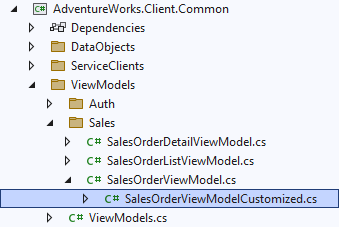

# 3.5 Dynamic view title

In this section we are going to make our view *Sales Order Details* use a dynamic title, which would include the current sales order number.

## View title overview

The base titles of our views are specified as an attribute of the view definition, and were set up for us from the object names when we initially added CRUD operations and views to our model, as shown below.

```xml title="sales_order.xom"
  <ui:views>
    <!-- highlight-next-line -->
    <ui:view name="SalesOrderView" title="Sales Order">
      <ui:view-model data-object="SalesOrderObject"/>
    </ui:view>
    <ui:view name="SalesOrderListView" title="Sales Order List">
      <ui:view-model data-object="SalesOrderList"/>
    </ui:view>
    ...
  </ui:views>
```

You can update these static titles, and regenerate the views, but the title of a Details view is also updated dynamically by the Xomega Framework based on the state of the underlying data object.

For example, if you create a new sales order, the view title will start with the word *New*, and if you make any changes on that screen, then the title will have an asterisk at the end to indicate the modified state, as shown below.


Once you fill in the order details and save it, the title will become the base *Sales Order* without any asterisk, until you start making additional changes.

While this is great functionality that you get right out of the box, which normally requires a lot of tedious coding, you may also want to include additional dynamic information from the view in the title, such as the sales order number for existing sales orders. This could be especially helpful if you can open multiple child windows for different sales orders, and need to identify *Details* views by their titles.

## Customizing view model

Xomega makes setting up dynamic view titles pretty easy by letting you override the base title in your custom view model, which will make it automatically work for all clients. In order to customize the view model, you need to set the `customize="true"` attribute on the view's view model, as follows.

```xml
    <ui:view name="SalesOrderView" title="Sales Order">
<!-- highlight-next-line -->
      <ui:view-model data-object="SalesOrderObject" customize="true"/>
    </ui:view>
```

Then you need to run the *View Models* generator under the *Presentation Layer/Common* folder, navigate to the *AdventureWorks.Client.Common* project, and open the generated `SalesOrderViewModelCustomized.cs` file, which will be nested under the corresponding `ViewModels/Sales/SalesOrderViewModel.cs`.



To make the title of our *Sales Order Details* view display the sales order number, we will add an override for the base title in the customized view model as follows.

```cs title="SalesOrderViewModelCustomized.cs"
    public class SalesOrderViewModelCustomized : SalesOrderViewModel
    {
/* added-lines-start */
        public override string BaseTitle => base.BaseTitle +
            (MainObj.IsNew ? "" : " - " + MainObj.SalesOrderNumberProperty.Value);
/* added-lines-end */
        ...
    }

```

Notice how we append the value of the `SalesOrderNumberProperty` to the base title for existing orders using `MainObj` to reference the main data object for the view. The title will be automatically updated when you save the order, which works for us, since the sales order number is only set once when you save a new sales order.

:::tip
If you need to display the value of another data property in the title, then you may need to subscribe to that data property's changes in your view model, and then fire a change of the `ViewTitle` property as a result.

But normally, users would not expect the view title to change while you edit the view except for the asterisk at the end, so the default behavior of updating the view title on save should cover most of the cases.
:::

## Reviewing the results

If you run the application now, you'll see that the title of our details view includes the sales order number, as shown below.


Notice that after we edited the *Comment* field, the view title still displayed an asterisk indicating that the view has been modified.

This also enabled the *Save* button, and will pop up a confirmation message about unsaved changes, if you try to close a modified view without saving.
