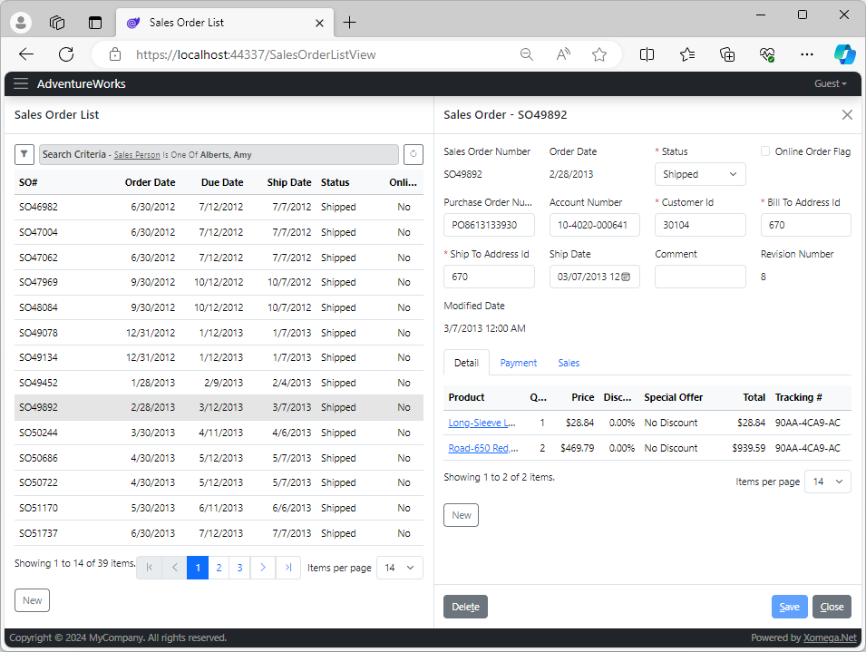

# 3.6 Master-details layout

Currently, when you select a sales order or create a new one from the *Sales Oder List*, it opens up the details screen in a modal dialog by default.

Instead of using a modal popup dialog, you may want to open the details view on the side in a non-modal way. This will make it easier to view and edit details of multiple sales orders since you can easily open the order details from the grid. But it also presents some challenges that we'll discuss later in this section.

## Enabling master-details

To open the *Sales Order Details* view from the *Sales Order List* view for new or existing sales orders, all you have to do is to update the `new` and `details` links defined on the `SalesOrderList` data object, and set the `mode="inline"` attribute, as shown below.

```xml title="sales_order.xom"
    <xfk:data-object class="SalesOrderList" list="true">
      <ui:display>[...]
      <!-- highlight-start -->
      <ui:link name="details" view="SalesOrderView" child="true" mode="inline">[...]
      <ui:link name="new" view="SalesOrderView" child="true" mode="inline">[...]
      <!-- highlight-end -->
    </xfk:data-object>
```

:::note
The default value for this `mode` attribute is a `popup`, which opens the view in a popup dialog.
:::

## Enabling grid selection

When using a master-details layout with a single child view, it makes sense to open the details panel by selecting a row in the results data grid, instead of having to click on a link on one of the columns, such as *SO#*, like we did for the popup dialog.

You can easily configure it in the `ui:display` element of that link by setting the `on-selection="true"` attribute instead of the `on-field` attribute, as follows.

```xml
    <xfk:data-object class="SalesOrderList" list="true">
      <ui:display>[...]
<!-- highlight-next-line -->
      <ui:link name="details" view="SalesOrderView" child="true" mode="inline">
        <ui:params>
          <ui:param name="sales order id" field="sales order id"/>
        </ui:params>
<!-- removed-next-line -->
        <ui:display on-field="sales order number"/>
<!-- added-next-line -->
        <ui:display on-selection="true"/>
      </ui:link>
      <ui:link name="new" view="SalesOrderView" child="true" mode="inline">[...]
    </xfk:data-object>
```

:::note
The model doesn't prevent you from setting both `on-field` and `on-selection` attributes, but in practicality, you may want to set either one or another.
:::

## Reviewing the results

Let's build the model and run the application to review the results. If you open the *Sales Order List* screen and run the search, you'll notice that there's no link on the *SO#* column now.

Instead, the results grid will have selection enabled, which will open up the *Sales Order Details* view to the right, as illustrated below.



Let's review some of the notable changes that took place on our screen.

### Master grid columns

You may have noticed that when a details panel is open, taking half the screen on the right-hand side, the master grid now displays only about half of the original columns. Otherwise, if you try to cram all the original columns in half the space, they will each be half the original width, which would not provide a good user experience.

The idea is that you'd put the most important columns in the first half of the master grid, which would allow the user to easily identify the record to select it to view its details. And for any selected record, the details panel will presumably already include all of the original fields from the master grid in addition to the other details.

:::note
If you don't like the default behavior of showing only the first columns in the master grid, you can override this behavior in the customized list object.
:::

### Responsive layout

Even with the master-details layout, the view will use a responsive layout based on the width of the screen. So as the screen width goes down, the details panel will start wrapping into fewer columns until, at some point, half a screen would not be enough for it, and it will take up the entire screen, hiding the master list.

At this point, the layout of the details fields may also go back to using more columns, since the view will take more screen real estate.

### Unsaved changes

If you make any changes in the details view and will try to close it without saving, you'll get a confirmation message about the unsaved changes, just like with the popup dialog.

However, with the master-details layout, you will also get the confirmation message if you try to select another record from the master grid, or create a new record. Canceling this message will also cancel the new row selection, and will keep the selection on the original row.