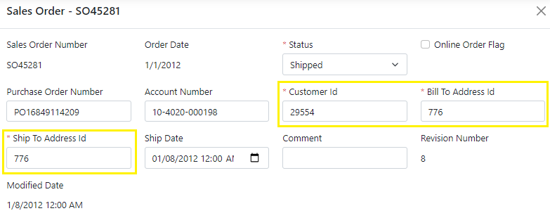
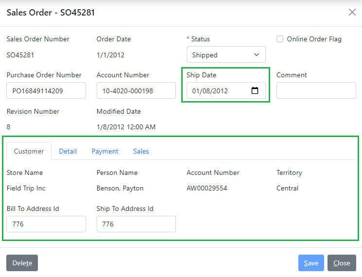

# 3.7 Fields from related objects

In this step we will demonstrate how to show fields from related objects on a details screen using techniques that we've learned so far.

## Overview of updates

The customer related fields, highlighted in yellow on the *Sales Order* details screen below, are just the internal IDs of the related customer and address objects that are stored on the `sales order` object, and were added to our screen by default.



What we need to do is to move them into a child panel *Customer*, and display the relevant customer fields instead of the IDs. In the next step, we will also show how to enable selection of a customer ID using a lookup form.

## Grouping into Customer tab

Let's make the necessary model updates, in order to group the customer fields into a separate tab.

### Defining child data object

Similar to the steps that we did before, we will define a new data object `SalesOrderCustomerObject` and will add it as a child to the `SalesOrderObject` under the name `customer` as follows.

```xml title="sales_order.xom"
  <xfk:data-objects>
    <xfk:data-object class="SalesOrderObject">
<!-- added-next-line -->
      <xfk:add-child name="customer" class="SalesOrderCustomerObject"/>
      <xfk:add-child name="detail" class="SalesOrderDetailList"/>
      ...
    </xfk:data-object>
    ...
<!-- added-next-line -->
    <xfk:data-object class="SalesOrderCustomerObject"/>
  </xfk:data-objects>
```

Now let's define a `customer info` structure for this data object, which will be used for reading customer information as part of the sales order, including additional customer fields that we want to display on the sales order details, such as the customer account number and territory.

If you remember from the search screen, a customer object consists of a store and/or a person, so we will add a `store name` and a `person name` parameters to our structure. We'll also add the corresponding `store id` and `person id` hidden parameters, which we will need later in order to read address details.

The resulting structure should look as shown below.

```xml
  <structs>
<!-- added-lines-start -->
    <struct name="customer info" object="customer">
      <param name="customer id"/>
      <param name="store id"/>
      <param name="store name" type="string" required="false"/>
      <param name="person id"/>
      <param name="person name" type="string" required="false"/>
      <param name="account number"/>
      <param name="territory id"/>
      <param name="bill to address id" type="address"/>
      <param name="ship to address id" type="address"/>
      <config>
        <!-- highlight-next-line -->
        <xfk:add-to-object class="SalesOrderCustomerObject"/>
      </config>
    </struct>
<!-- added-lines-end -->
    ...
  </structs>
```

:::note
We used `object="customer"` to set `customer` as the base object for our structure. Therefore, any parameters that don't have a matching field on the `customer` object must be qualified with a type. 
:::

Similarly, we'll define a `customer update` structure for updating customer information on the sales order. It will have just a few customer-related fields that can be actually saved on the order, as shown below.

```xml
    <struct name="customer info" object="customer">[...]
<!-- added-lines-start -->
    <struct name="customer update" object="customer">
      <param name="customer id"/>
      <param name="bill to address id" type="address"/>
      <param name="ship to address id" type="address"/>
      <config>
        <xfk:add-to-object class="SalesOrderCustomerObject"/>
      </config>
    </struct>
<!-- added-lines-end -->
```

Now we can configure our `SalesOrderCustomerObject` data object to have those internal ID fields hidden on the screen, and to set a proper label for the `territory id` parameter, as follows.

```xml
    <xfk:data-object class="SalesOrderCustomerObject">
<!-- added-lines-start -->
      <ui:display>
        <ui:fields>
          <ui:field param="customer id" hidden="true"/>
          <ui:field param="person id" hidden="true"/>
          <ui:field param="store id" hidden="true"/>
          <ui:field param="territory id" label="Territory"/>
        </ui:fields>
      </ui:display>
    </xfk:data-object>
<!-- added-lines-end -->
```

### Refactoring CRUD operations

Next, we will replace those internal ID parameters (i.e. `customer id`, `bill to address id` and `ship to address id`) on the output of the `read` operation, and the input for the `create` and `update` operations with references to the `customer info` and `customer update` structures respectively.

While we're at it, we will also set the type for the `ship date` parameter to be just `date` without the time component in all those operations.

Below is a snippet that highlights all these changes.

```xml
    <object name="sales order">
      <operations>
<!-- highlight-next-line -->
        <operation name="read" type="read">
          <input>[...]
          <output>
            ...
<!-- added-next-line -->
            <struct name="customer" ref="customer info"/>
<!-- removed-lines-start -->
            <param name="customer id"/>
            <param name="bill to address id"/>
            <param name="ship to address id"/>
<!-- removed-lines-end -->
<!-- highlight-next-line -->
            <param name="ship date" type="date"/>
            ...
          </output>
        </operation>
<!-- highlight-next-line -->
        <operation name="create" type="create">
          <input arg="data">
            ...
<!-- added-next-line -->
            <struct name="customer" ref="customer update"/>
<!-- removed-lines-start -->
            <param name="customer id"/>
            <param name="bill to address id"/>
            <param name="ship to address id"/>
<!-- removed-lines-end -->
<!-- highlight-next-line -->
            <param name="ship date" type="date"/>
            ...
            ...
          </input>
          <output>[...]
        </operation>
<!-- highlight-next-line -->
        <operation name="update" type="update">
          <input>
            <param name="sales order id"/>
            <struct name="data">
              ...
<!-- added-next-line -->
              <struct name="customer" ref="customer update"/>
<!-- removed-lines-start -->
              <param name="customer id"/>
              <param name="bill to address id"/>
              <param name="ship to address id"/>
<!-- removed-lines-end -->
<!-- highlight-next-line -->
              <param name="ship date" type="date"/>
              ...
            </struct>
          </input>
          <output>[...]
        </operation>
      </operations>
    </object>
```

:::note
As usual, we had to add the structure references using the same name `customer` that we used for our child data object earlier.
:::

## Custom service implementation

Now that we have updated the model, let's provide custom implementation for the services to support our updates.

### Customized Person entity

To make writing custom service code easier, let's fist create a custom partial class for the `Person` entity, in order to expose a `FullName` property to display a person as a string.

As we did before, we can simply set the `extend="true"` attribute on the `edm:customize` element of the `person` object's configuration, as shown below.

```xml title="person.xom"
    <object name="person">
      <fields>[...]
      <config>
        <sql:table name="Person.Person"/>
<!-- added-next-line -->
        <edm:customize extend="true"/>
      </config>
    </object>
```

After you build the model, open up the `PersonExtended.cs` file nested under the `Entities/Person/Person.cs` file of the `AdventureWorks.Services.Entities` project, and add a new property `FullName`, as follows.

```cs title="PersonExtended.cs"
    public partial class Person
    {
/* added-next-line */
        public string FullName => $"{LastName}, {FirstName}";
    }
```

### Custom Get for the output

Now let's open the `SalesOrderServiceExtended.cs` file, and add a `GetCustomerInfo` method to populate our `customer info` structure from the `SalesOrder` object, as follows.

```cs title="SalesOrderServiceExtended.cs"
public partial class SalesOrderService
{
    ...
/* added-lines-start */
    protected static CustomerInfo GetCustomerInfo(SalesOrder obj) => new()
    {
        CustomerId = obj.CustomerId,
        AccountNumber = obj.CustomerObject?.AccountNumber,
        PersonId = obj.CustomerObject?.PersonObject?.BusinessEntityId,
// highlight-next-line
        PersonName = obj.CustomerObject?.PersonObject?.FullName,
        StoreId = obj.CustomerObject?.StoreObject?.BusinessEntityId,
        StoreName = obj.CustomerObject?.StoreObject?.Name,
        TerritoryId = obj.CustomerObject?.TerritoryObject?.TerritoryId,
        BillToAddressId = obj.BillToAddressId,
        ShipToAddressId = obj.ShipToAddressId,
    };
/* added-lines-end */
}
```

As you see, the structure parameters are just populated from the various related objects' fields. 

:::note
Notice how we used our new custom `FullName` property, which allowed us to easily use a null propagation operator.
:::

:::tip
You can also use our new `FullName` property in other places where we had to manually construct it in the LINQ queries. This will allow you to define this format in just one place.

However, you may want to watch performance of any such LINQ queries, since Entity Framework will no longer be able to translate this property directly to SQL, which means that it will have to always read the entire `Person` entity and evaluate the `FullName` on the service side after the query has been executed.
:::

To populate the `customer` structure in the read results, we'll call this method in the custom code of the generated `ReadAsync` method of the `SalesOrderService`, as follows.

```cs title="SalesOrderService.cs"
    public partial class SalesOrderService : BaseService, ISalesOrderService
    {
        public virtual async Task<Output<SalesOrder_ReadOutput>>
            ReadAsync(int _salesOrderId, CancellationToken token = default)
        {
            ...
            // CUSTOM_CODE_START: populate the Customer output structure of Read operation below
/* removed-next-line */
            // TODO: res.Customer = ???; // CUSTOM_CODE_END
/* added-next-line */
            res.Customer = GetCustomerInfo(obj); // CUSTOM_CODE_END
            ...
        }
    }
```

### Custom Update for the input

Just like we did before, we are going to add a customer validation message to the `Resources.resx` file in the `AdventureWorks.Services.Entities` project, and then run the custom tool on the nested [`Messages.tt`](../../framework/services/errors#message-constants-generator) to generate message constants.

|Name|Value|Comment|
|-|-|-|
|CustomerRequired|Customer information is required for order {0}.|{0}=Order ID|

Next, we will add `UpdateCustomer` method to the extended `SalesOrderService` service, in order to update customer and address objects on the `SalesOrder` object from the provided `CustomerUpdate` structure, as follows.

```cs title="SalesOrderServiceExtended.cs"
public partial class SalesOrderService
{
    ...
/* added-lines-start */
    protected async Task UpdateCustomer(SalesOrder obj, CustomerUpdate _data)
    {
        if (_data == null)
        {
// highlight-next-line
            currentErrors.AddValidationError(Messages.CustomerRequired, obj.SalesOrderId);
            return;
        }
        obj.CustomerObject = await ctx.FindEntityAsync<Customer>(currentErrors, _data.CustomerId);
        obj.BillToAddressObject = await ctx.FindEntityAsync<Address>(currentErrors, _data.BillToAddressId);
        obj.ShipToAddressObject = await ctx.FindEntityAsync<Address>(currentErrors, _data.ShipToAddressId);
    }
/* added-lines-end */
}
```

:::note
Notice how we use a generated constant for the validation error message that we added to the resources.
:::

After that we can update both `CreateAsync` and `UpdateAsync` methods in the generated `SalesOrderService` class to handle the new `CustomerUpdate` structure, as follows.

```cs title="SalesOrderService.cs"
public partial class SalesOrderService : BaseService, ISalesOrderService
{
    public virtual async Task<Output<SalesOrder_CreateOutput>>
        CreateAsync(SalesOrder_CreateInput _data, CancellationToken token = default)
    {
        ...
        // CUSTOM_CODE_START: use the Customer input parameter of Create operation below
/* removed-next-line */
        // TODO: ??? = _data.Customer; // CUSTOM_CODE_END
/* added-next-line */
        await UpdateCustomer(obj, _data.Customer); // CUSTOM_CODE_END
        ...
    }

    public virtual async Task<Output<SalesOrder_UpdateOutput>>
        UpdateAsync(int _salesOrderId, SalesOrder_UpdateInput_Data _data, CancellationToken token = default)
    {
        ...
        // CUSTOM_CODE_START: use the Customer input parameter of Update operation below
/* removed-next-line */
        // TODO: ??? = _data.Customer; // CUSTOM_CODE_END
/* added-next-line */
        await UpdateCustomer(obj, _data.Customer); // CUSTOM_CODE_END
        ...
    }
}
```

## Reviewing the results

Let's run the application to review our changes. The following screenshot shows what the *Sales Order* details screen will look like now.



Notice that now we have a child tab *Customer* with the customer information, and that the *Ship Date* has no time component anymore. 

Since the internal customer ID is no longer visible on the screen, and hence not editable either, we will need to provide another way to select a customer for a sales order, which we will do in the next step.
