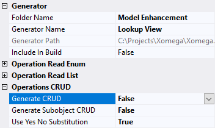

# 3.8 Lookup selection form

When creating sales orders, one of the main things the user needs to do is to select a customer for the order. Unlike other enumerated fields, such as a `sales person`, which you can select from a relatively small list that can be cached on the client, there could be potentially thousands of customers to select from, which doesn't lend itself to selecting them from a drop-down list or caching them on the client.

What we really need is a way to look up the customer by some attributes like names, or a specific account number, and then select it for the current sales order. In this step we will show you how Xomega makes it extremely easy when leveraging all the techniques that you've learned so far.

## Adding Lookup View generator

First thing we need to do is to create a *Customer Search* view similar to how we've created a search view for sales orders. However, in this particular case, we're interested in only the Search view for customers, without any Details views.

So, to enhance the customer object in the model with just a `read list` operation and a search view without the CRUD operations or views, we will configure a new *Lookup View* generator by cloning existing *Full CRUD with Views* generator. You can do it by selecting it, pressing Ctrl+C to clone, and then pressing F2 to rename it in the tree, as illustrated below.


We will give it a name `Lookup View`, and then open its properties, and set the `Generate CRUD` flag to `False` under the *Operations* group as follows.



:::tip
This is a way to save a custom configuration for a generator as a separate generator in the model project. 
:::

## Generating a Lookup view

After that, let's go ahead and run the *Lookup View* generator on the `customer.xom` file as shown below.


The generator will add the necessary model elements to configure the customer search view, but we will want to update the input and output parameters for the generated `read list` operation, so that the view would accept the criteria that we want, and show the result columns that we need.

### Configuring results and criteria

We need to add all customer-related parameters from our `customer info` structure to the output of the `read list` operation, so that the lookup screen could return their values to the invoking screen for the selected record.

As for the criteria, we'll just allow filtering by the same parameters using operators, as follows.

```xml title="customer.xom"
    <object name="customer">
        ...
        <operation name="read list" type="readlist">
          <input>
            <struct name="criteria">
              <param name="territory id" required="false"/>
              <!-- highlight-start -->
              <param name="person name operator" type="operator"/>
              <param name="person name" type="string"/>
              <param name="store name operator" type="operator"/>
              <param name="store name" type="string"/>
              <!-- highlight-end -->
              <param name="account number operator" type="operator"/>
              <param name="account number" required="false"/>
              <config>
                <xfk:add-to-object class="CustomerCriteria"/>
              </config>
            </struct>
          </input>
          <output list="true">
            <param name="customer id"/>
            <param name="person id"/>
            <!-- highlight-next-line -->
            <param name="person name" type="string"/>
            <param name="store id"/>
            <!-- highlight-next-line -->
            <param name="store name" type="string"/>
            <param name="territory id"/>
            <param name="account number"/>
            <config>
              <xfk:add-to-object class="CustomerList"/>
            </config>
          </output>
        </operation>
        ...
    </object>
```

### Configuring data objects

To make our customer lookup view look pretty, we will configure the data objects to hide the internal `store id` and `person id` columns in the list, and to set a proper label for the `territory id` column and criteria, as follows.

```xml title="customer.xom"
  <xfk:data-objects>
    <!-- highlight-next-line -->
    <xfk:data-object class="CustomerCriteria">
      <ui:display>
        <ui:fields>
          <!-- highlight-next-line -->
          <ui:field param="territory id" label="Territory"/>
        </ui:fields>
      </ui:display>
    </xfk:data-object>
    <!-- highlight-next-line -->
    <xfk:data-object class="CustomerList" list="true">
      <ui:display>
        <ui:fields>
          <ui:field param="customer id" hidden="true"/>
          <!-- highlight-start -->
          <ui:field param="store id" hidden="true"/>
          <ui:field param="person id" hidden="true"/>
          <ui:field param="territory id" label="Territory"/>
          <!-- highlight-end -->
        </ui:fields>
      </ui:display>
    </xfk:data-object>
  </xfk:data-objects>
```

### Custom service implementation

Since we have custom output parameters, we will need to build the model to regenerate the services, and provide custom implementations in the `ReadListAsync` method of the `CustomerService` class as follows.

```cs title="CustomerService.cs"
public partial class CustomerService : BaseService, ICustomerService
{
    ...
    public virtual async Task<Output<ICollection<Customer_ReadListOutput>>>
        ReadListAsync(Customer_ReadListInput_Criteria _criteria, CancellationToken token = default)
    {
        ...
        var qry = from obj in src
                  select new Customer_ReadListOutput() {
                      CustomerId = obj.CustomerId,
                      PersonId = obj.PersonId,
                      // CUSTOM_CODE_START: set the PersonName output parameter of ReadList operation below
// highlight-start
                      PersonName = obj.PersonObject == null ? null :
                                   obj.PersonObject.LastName + ", " +
                                   obj.PersonObject.FirstName, // CUSTOM_CODE_END
// highlight-end
                      StoreId = obj.StoreId,
                      // CUSTOM_CODE_START: set the StoreName output parameter of ReadList operation below
// highlight-next-line
                      StoreName = obj.StoreObject.Name, // CUSTOM_CODE_END
                      TerritoryId = obj.TerritoryId,
                      AccountNumber = obj.AccountNumber,
                  };
        ...
    }
}
```

## Adding a Lookup link

Now that we have the *Customer List* view ready, we need to add a link to that view from the *Sales Order* details screen. Since the link will be to select a customer, we will add it to the `SalesOrderCustomerObject` data object under a name `look up`.

We'll set the target `view` to `CustomerListView` and will set the `child="true"` attribute to open it as a child popup window. To configure the target view for selection of a a single customer, we'll pass to it an `_action` parameter with a value `select`, and a `_selection` parameter with a value `single`.

To map the columns of the selected record to the data object properties to be populated from it, we will also add `ui:result` parameters to the link for each customer list output parameter used, and indicate the fields on the current object that these output parameters will populate.

The following snippet shows what this setup will look like.

```xml title="sales_order.xom"
    <xfk:data-object class="SalesOrderCustomerObject">
      <ui:display>[...]
      <!-- highlight-next-line -->
      <ui:link name="look up" view="CustomerListView" child="true">
        <ui:params>
          <!-- highlight-start -->
          <ui:param name="_action" value="select"/>
          <ui:param name="_selection" value="single"/>
          <!-- highlight-end -->
        </ui:params>
        <ui:result>
          <!-- highlight-start -->
          <ui:param name="customer id" field="customer id"/>
          <ui:param name="store id" field="store id"/>
          <ui:param name="store name" field="store name"/>
          <ui:param name="person id" field="person id"/>
          <ui:param name="person name" field="person name"/>
          <ui:param name="account number" field="account number"/>
          <ui:param name="territory id" field="territory id"/>
          <!-- highlight-end -->
        </ui:result>
      </ui:link>
    </xfk:data-object>
```

:::tip
To make this mapping process easier Xomega provides Intellisense for the values in parameter names, as well as in the source or target fields.
:::

### Reviewing the results

If we build the model now, and run the application, then we will see that the *Customer* tab will have a *Look Up* link now, which opens up the *Customer List* screen as a child dialog, where you can search for customers using our criteria, and select a specific customer, as shown in the picture below.


Notice how the child *Customer List* screen automatically allows single selection in the grid, and provides a *Select* button to confirm your selection, thanks to the selection parameters that we configured on our `look up` link.

Technically, this fulfills our requirements for allowing to select a customer, but this process could be a little cumbersome, since you always have to pull up the customer list screen, populate the criteria, and run the search, in order to select a customer.

## Lookup form with parameters

What would be better is if you could enter some common lookup criteria, such as the store and the person names, right on the *Sales Order* details screen. If they match exactly one customer, the *Look Up* button would populate its values without even popping up a selection dialog. If they match no customer or multiple customers, then the link will open up the *Customer List* dialog with the specified criteria and results pre-populated.

### Adding a lookup child object

To implement this, let's define another data object with a class `SalesCustomerLookupObject`, and add it as a child to the `SalesOrderCustomerObject`.

Then we'll move the `look up` link to that new object, and will update the result parameters to populate the fields of the parent object by adding `data-object=".."` attribute to the `ui:result` element as shown below.

```xml
    <xfk:data-object class="SalesOrderCustomerObject">
      <!-- highlight-next-line -->
      <xfk:add-child name="lookup" class="SalesCustomerLookupObject"/>
      <ui:display>[...]
    </xfk:data-object>
    <!-- highlight-next-line -->
    <xfk:data-object class="SalesCustomerLookupObject">
      <ui:link name="look up" view="CustomerListView" child="true">
        <ui:params>
          <ui:param name="_action" value="select"/>
          <ui:param name="_selection" value="single"/>
        </ui:params>
        <!-- highlight-next-line -->
        <ui:result data-object="..">
          <ui:param name="customer id" field="customer id"/>
          <ui:param name="store id" field="store id"/>
          <ui:param name="store name" field="store name"/>
          <ui:param name="person id" field="person id"/>
          <ui:param name="person name" field="person name"/>
          <ui:param name="account number" field="account number"/>
          <ui:param name="territory id" field="territory id"/>
        </ui:result>
      </ui:link>
    </xfk:data-object>
```

To add properties to this data object we will define an auxiliary structure `customer lookup` with `store name` and `person name` parameters added to this data object, as follows.

```xml
    <!-- highlight-next-line -->
    <struct name="customer lookup">
      <param name="store name" type="string"/>
      <param name="person name" type="string"/>
      <config>
        <!-- highlight-next-line -->
        <xfk:add-to-object class="SalesCustomerLookupObject"/>
      </config>
      <!-- highlight-next-line -->
      <usage generic="true"/>
    </struct>
```

:::note
Notice how we marked this structure with a `generic="true"` usage attribute to suppress a warning from the model that was telling us that this structure is not referenced anywhere.
:::

Now that we have added the `store name` and `person name` properties to our lookup child object, we can use them as source fields for the `look up` link parameters coupled with corresponding operator parameters, for which we will use a specific value `CN` for the `Contains` operator, as follows.

```xml
    <xfk:data-object class="SalesCustomerLookupObject">
      <ui:link name="look up" view="CustomerListView" child="true">
        <ui:params>
          <ui:param name="_action" value="select"/>
          <ui:param name="_selection" value="single"/>
<!-- highlight-start -->
          <ui:param name="store name operator" value="CN"/>
          <ui:param name="store name" field="store name"/>
          <ui:param name="person name operator" value="CN"/>
          <ui:param name="person name" field="person name"/>
<!-- highlight-end -->
        </ui:params>
        <ui:result data-object="..">[...]
      </ui:link>
    </xfk:data-object>
```

With `CN` value for the operators, the search will automatically look for customers, whose store or person name contains the string entered by the user.

### Disabling modification tracking

With the `SalesCustomerLookupObject` object being a child of the `SalesOrderCustomerObject`, which, in turn, is a child of the main `SalesOrderObject`, any changes to the fields of the lookup object will automatically make the entire sales order modified, which will cause a confirmation prompt for unsaved changes. This would be undesirable though, since this object is not really a part of the sales order.

We can disable modification tracking for this object in its customized subclass. For this we'll set the `customize="true"` attribute on the data object declaration as follows.

```xml
    <xfk:data-object class="SalesCustomerLookupObject" customize="true">[...]
```

Next, we'll need to build the model project, open up the generated `SalesCustomerLookupObjectCustomized.cs` file, and add the following code to it.

```cs title="SalesCustomerLookupObjectCustomized.cs"
    public class SalesCustomerLookupObjectCustomized : SalesCustomerLookupObject
    {
        ...
        protected override void Initialize()
        {
            base.Initialize();
// highlight-next-line
            TrackModifications = false;
        }
        ...
    }
```

### Reviewing the results

So, let's run the application again to review our changes. The picture below demonstrates what the screen will look like now.


As you see, the *Customer* tab has a child *Lookup* panel with the *Store Name* and a *Person Name* to look up the customer by.

You can confirm that entering anything in these fields alone would not mark the view as modified, which you can check by making sure that the view title doesn't get an asterisk, the *Save* button remains disabled, and there won't be a confirmation message if you close the view, when it was opened from the *Sales Order List* screen.

If you enter a person name that matches multiple customers and click the *Look Up* button, then you will get a *Customer List* dialog pre-populated with the matching customers to select. On the other hand, if you enter a person's name that results in a single match, then it will be automatically selected and populated when you click the *Look Up* button, without even popping up the *Customer List* dialog.