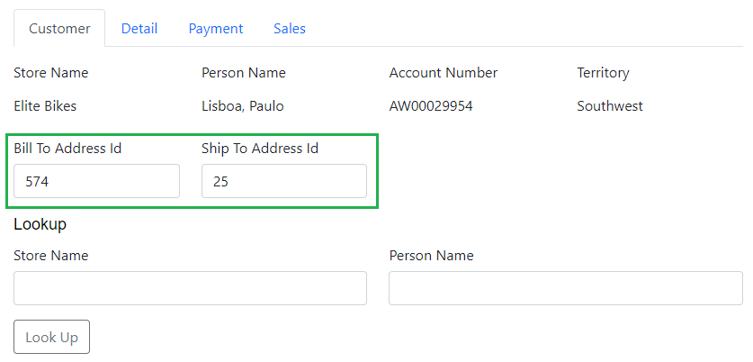
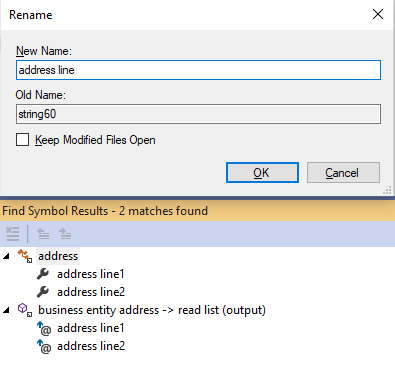
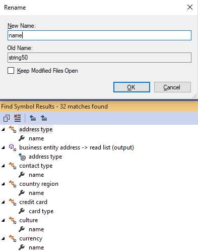
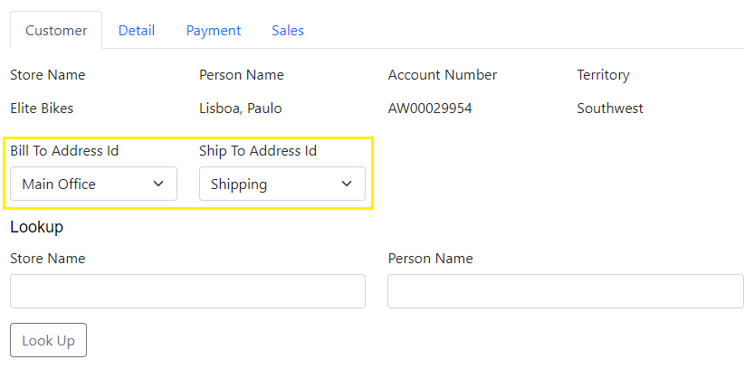
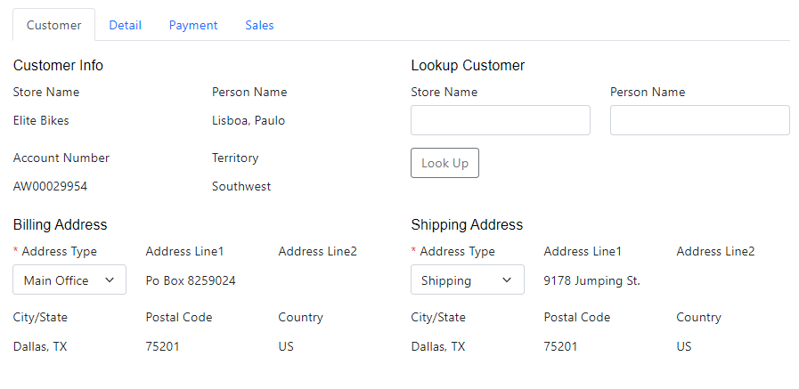

# 3.9 Custom contextual selection

In this section you will learn how to implement custom selection from a list that depends on the current values on the screen, rather than always having the same options. You will also see how to further display the values of additional related attributes when selecting an option from a list.

## Overview of updates

If we take another look at the *Customer* tab, we will notice that we still have the *Bill To* and *Ship To* address fields displayed as editable internal IDs that point to some stored `Address` entities in the normalized `AdventureWorks` database, as shown below.



This is clearly not how we want the users to enter these values. Normally, we would want the user to select the stored address from a list of addresses for the current customer, which is defined in the `business entity address` association object.

However, there are tens of thousands records in this association table, and we don't want to load them all into a cache, like we did with dynamic enumerations previously.

It would also not be too user-friendly to make the user select the address from a separate look-up form, as we did for the customer selection.

What we want is a contextual dropdown list, which would use the currently selected customer to read the list of associated addresses. To implement populating of such a contextual list, we can leverage many of the existing Xomega features, but we will need to write some custom code to glue it all together, as you'll see below.

## Defining contextual enumeration

We will start by running the *Enumeration Read List* generator on the `business_entity_address.xom` file, which will add a standard `read list` operation that returns all association records.

### Adding input parameters

In order to return only addresses for a specific business entity, we'll add an input parameter `business entity id` to our `read list` operation, which we will also need to add to the `uri-template` of the REST method, as follows.

```xml title="business_entity_address.xom"
    <object name="business entity address">
      ...
        <operation name="read list" type="readlist">
          <input>
            <!-- highlight-next-line -->
            <param name="business entity id" type="business entity" required="true"/>
          </input>
          <output list="true">[...]
          <config>
            <!-- highlight-next-line -->
            <rest:method verb="GET" uri-template="business-entity/{business entity id}/address"/>
          </config>
        </operation>
      ...
    </object>
```

:::note
We named our input parameter `business entity id` based on the name of the entity's key field from the `business entity address` fieldset. This allows Xomega to handle this parameter automatically.
:::

### Configuring enumeration attributes

Then we'll update the output of our `read list` operation to return address fields using their types from the corresponding objects. We'll also need to define a dynamic enumeration with the `xfk:enum-cache` element, and use the `address id` and the `address type` as the ID and description parameters respectively, as illustrated below.

```xml
    <object name="business entity address">
      ...
        <operation name="read list" type="readlist">
          <input>
            <param name="business entity id" type="business entity" required="true"/>
          </input>
          <output list="true">
            <param name="address id" type="address" required="true"/>
            <!-- highlight-start -->
            <param name="address type" type="string50" required="true"/>
            <param name="address line1" type="string60"/>
            <param name="address line2" type="string60"/>
            <param name="city" type="string30"/>
            <param name="state" type="code3"/>
            <param name="postal code" type="string15"/>
            <param name="country" type="country region"/>
            <!-- highlight-end -->
          </output>
          <config>
            <rest:method verb="GET" uri-template="business-entity/{business entity id}/address"/>
            <!-- highlight-start -->
            <xfk:enum-cache enum-name="business entity address"
                            id-param="address id" desc-param="address type"/>
            <!-- highlight-end -->
          </config>
        </operation>
      ...
    </object>
```

The main difference from the dynamic enumerations that we created so far is that now we have input criteria for the operation, which consists of the required `business entity id`. This will ensure that the operation returns addresses only for the specified business entity.

### Refactoring logical types

Technically, input and output parameters here should use the same logical types, as the types for the corresponding fields on the related objects. But to add more clarity to the model, you will want to rename the default types that were generated by the import process, and give them more meaningful names.

You can do it right here, where you use these types, by selecting *Rename* from the context menu, or by pressing *Ctrl+R,R*. This will bring up the *Rename* dialog, and will display all references of the selected type that will be renamed.

For example, if you open *Rename* dialog for the `string60` type, you will see that it is used only by the `address line` fields, so we'll go ahead and rename it to a more appropriate `address line` type, as follows.



Similarly, we'll rename `string30` to `city name`, and `code3` to `state province code`, since they are used only by the corresponding fields.

If you try to rename the generated `string50` type, you'll notice that it is mostly used by fields that represent some sort of name. So you can go ahead and rename it to the `name` type for now, and then separately refactor a few fields where this type may be less appropriate.



A generated type may be also used by various types of fields, such as the case with the `string15` that is used on the `postal code`, but also on some other fields such as `account number`. In this case you can just create a new type `postal code` with the same setup, and manually update the `postal code` field of the `address` object to use the new type, without touching the other fields.

Normally, you'll want to move the new specific types to the same files where they are being used the most. In our case we will move the renamed address-related types from `_types.xom` to the `address.xom` file, which will look like this.

```xml title="address.xom"
  <types>
    <!-- highlight-next-line -->
    <type name="address" base="integer enumeration"/>
    <type name="address line" base="string" size="60"/>
    <type name="city name" base="string" size="30"/>
    <type name="postal code" base="string" size="15"/>
    <type name="state province code" base="code" size="3"/>
  </types>
```

Notice that we also changed the base type for the `address` type from `integer key` to `integer enumeration`, so that it would use enumeration-related properties and controls.

Here is what our parameters will look like after the refactoring.

```xml title="business_entity_address.xom"
    <object name="business entity address">
      ...
        <operation name="read list" type="readlist">
          <input>[...]
          <output list="true">
<!-- highlight-start -->
            <param name="address id" type="address" required="true"/>
            <param name="address type" type="name" required="true"/>
            <param name="address line1" type="address line"/>
            <param name="address line2" type="address line"/>
            <param name="city" type="city name"/>
            <param name="state" type="state province code"/>
            <param name="postal code" type="postal code"/>
            <param name="country" type="country region"/>
<!-- highlight-end -->
          </output>
          <config>[...]
        </operation>
      ...
    </object>
```

### Custom service implementation

To provide custom service implementation for all our output parameters, let's build the model project to regenerate the services. Once they are regenerated, we will provide the following implementation in the `ReadListAsync` method of our new `BusinessEntityAddressService` to populate the output fields from the related objects.

```cs title="BusinessEntityAddressService.cs"
public partial class BusinessEntityAddressService : BaseService, IBusinessEntityAddressService
{
    public virtual async Task<Output<ICollection<BusinessEntityAddress_ReadListOutput>>>
        ReadListAsync(int _businessEntityId, CancellationToken token = default)
    {
        ...
        var qry = from obj in src
                  select new BusinessEntityAddress_ReadListOutput() {
                      AddressId = obj.AddressId,
// highlight-start
                      // CUSTOM_CODE_START: set the AddressType output parameter of ReadList operation below
                      AddressType = obj.AddressTypeObject.Name, // CUSTOM_CODE_END
                      // CUSTOM_CODE_START: set the AddressLine1 output parameter of ReadList operation below
                      AddressLine1 = obj.AddressObject.AddressLine1, // CUSTOM_CODE_END
                      // CUSTOM_CODE_START: set the AddressLine2 output parameter of ReadList operation below
                      AddressLine2 = obj.AddressObject.AddressLine2, // CUSTOM_CODE_END
                      // CUSTOM_CODE_START: set the City output parameter of ReadList operation below
                      City = obj.AddressObject.City, // CUSTOM_CODE_END
                      // CUSTOM_CODE_START: set the State output parameter of ReadList operation below
                      State = obj.AddressObject.StateProvinceObject.StateProvinceCode, // CUSTOM_CODE_END
                      // CUSTOM_CODE_START: set the PostalCode output parameter of ReadList operation below
                      PostalCode = obj.AddressObject.PostalCode, // CUSTOM_CODE_END
                      // CUSTOM_CODE_START: set the Country output parameter of ReadList operation below
                      Country = obj.AddressObject.StateProvinceObject.CountryRegionCode, // CUSTOM_CODE_END
// highlight-end
                  };
        ...
    }
}
```

## Contextual UI selection

For the contextual address selection we need to add custom code in the customized `SalesOrderCustomerObject`, so let's set the `customize="true"` attribute in the model, and build the model project to generate a customization subclass.

```xml title="sales_order.xom"
    <xfk:data-object class="SalesOrderCustomerObject" customize="true">[...]
```

Now, let's open the generated `SalesOrderCustomerObjectCustomized.cs` file in the `AdventureWorks.Client.Common` project, and implement custom logic for the *Bill-To* and *Ship-To* addresses.

### Local lookup cache loaders

Since both of these fields use the same list of addresses based on the currently selected customer, we are going to declare a local lookup cache loader that we'll call `AddressLoader`, and instantiate it in the `OnInitialized` method using the `BusinessEntityAddressReadListCacheLoader` class that was generated for us from the `read list` operation that we defined. Then we'll set it as the `LocalCacheLoader` on both properties, as follows.

```cs title="SalesOrderCustomerObjectCustomized.cs"
using AdventureWorks.Services.Common;
using Xomega.Framework.Lookup;

public class SalesOrderCustomerObjectCustomized : SalesOrderCustomerObject
{
// highlight-next-line
    private LocalLookupCacheLoader AddressLoader;
    ...
    // perform post initialization
    protected override void OnInitialized()
    {
        base.OnInitialized();

// highlight-start
        AddressLoader = new BusinessEntityAddressReadListCacheLoader(ServiceProvider);
        BillToAddressIdProperty.LocalCacheLoader = AddressLoader;
        ShipToAddressIdProperty.LocalCacheLoader = AddressLoader;
// highlight-end
    }
}
```

### Handling property changes

To read a list of addresses for the current customer we will use either the `store id` or the `person id` of the current customer as the `business entity id` parameter for the operation.

Therefore, we need to add an async listener `OnCustomerChanged` to both of these properties, and update the list of addresses in the `AddressLoader` when the value of either of them changes. This is done by calling the `SetParametersAsync` method on our local cache loader and passing a dictionary of named input parameters and their values, as shown below.

```cs title="SalesOrderCustomerObjectCustomized.cs"
using AdventureWorks.Services.Common;
using AdventureWorks.Services.Common.Enumerations;
...
using Xomega.Framework;
using Xomega.Framework.Lookup;

public class SalesOrderCustomerObjectCustomized : SalesOrderCustomerObject
{
    ...
    // perform post initialization
    protected override void OnInitialized()
    {
        ...
// highlight-start
        StoreIdProperty.AsyncChange += OnCustomerChanged;
        PersonIdProperty.AsyncChange += OnCustomerChanged;
// highlight-end
    }

// highlight-next-line
    private async Task OnCustomerChanged(object sender, PropertyChangeEventArgs e, CancellationToken token)
    {
        if (!e.Change.IncludesValue() || Equals(e.OldValue, e.NewValue) ||
            PersonIdProperty.Value == null && StoreIdProperty.Value == null) return;

        int entityId = StoreIdProperty.Value == null ? // use store or person id
            PersonIdProperty.Value.Value : StoreIdProperty.Value.Value;

// highlight-start
        await AddressLoader.SetParametersAsync(new Dictionary<string, object>() {
            { BusinessEntityAddress.Parameters.BusinessEntityId, entityId }
        }, AddressLoader.LocalCache, token);
// highlight-end

        await BillToAddressIdProperty.ClearInvalidValues();
        await ShipToAddressIdProperty.ClearInvalidValues();

        var args = new PropertyChangeEventArgs(PropertyChange.Items, null, null, e.Row);
        await BillToAddressIdProperty.FirePropertyChangeAsync(args, token);
        await ShipToAddressIdProperty.FirePropertyChangeAsync(args, token);
    }
}
```

:::note
To avoid hardcoding input parameters' names we used the `BusinessEntityAddress.Parameters.BusinessEntityId` constant that was also generated for us in the `Enumerations` class.
:::

Once the local cache is loaded with new values, we want to clear the current values of the *Bill-To* and *Ship-To* properties, if they are no longer valid, and then make those properties notify their listeners about the change of their list of items.

:::tip
We had to write all this custom code because the input parameter is sourced from two properties - `store id` or `person id`, and because we used the same cache loader to populate a list of addresses for both *Bill-To* and *Ship-To* properties.

For a more standard case, where a list for a single property depends on the value of another property, Xomega Framework provides a much easier method, as you'll see in the next section.
:::

## Reviewing contextual selection

If we run our application now, we'll see that the address properties display dropdowns with different types of addresses for the current customer, which get blanked out and their lists updated whenever you change the customer. The following picture shows what it looks like now.



This setup is much more usable now, since you can select one of the stored addresses for the current customer instead of entering their internal ID.

What is missing though, is ability to view the details of the selected address beyond the address type, such as the street address, city, state etc. All this information is already returned from the service, and stored as attributes of the selected value, so we just need to show them on the screen as separate fields.

## Grouping selection attributes

It makes sense to group the address fields for each type of address in its own child panel. To configure that in the model we will use the techniques that we have learned earlier.

### Defining grouping data object

First off, let's declare a data object `AddressObject` in the `address.xom` file, and then define two structures contributing their parameters to this data object - one for updates with just the `address key`, and another with the full `address info`, as shown below.

```xml title="address.xom"
  <structs>
<!-- highlight-next-line -->
    <struct name="address key" object="address">
      <param name="address id"/>
      <config>
<!-- highlight-next-line -->
        <xfk:add-to-object class="AddressObject"/>
      </config>
      <doc>
        <summary>Address key information</summary>
      </doc>
    </struct>
<!-- highlight-next-line -->
    <struct name="address info" object="address">
      <param name="address line1"/>
      <param name="address line2"/>
      <param name="city state" type="string"/>
      <param name="postal code"/>
      <param name="country" type="country region"/>
      <config>
<!-- highlight-next-line -->
        <xfk:add-to-object class="AddressObject"/>
      </config>
<!-- highlight-next-line -->
      <usage generic="true"/>
      <doc>
        <summary>Full address information</summary>
      </doc>
    </struct>
  </structs>
  ...
  <xfk:data-objects>
<!-- highlight-next-line -->
    <xfk:data-object class="AddressObject"/>
  </xfk:data-objects>
```

The purpose for the `address info` structure is to add more fields to the `AddressObject`, and we're not going to use it in any operations. Therefore, to suppress a warning that this structure is not being used, we have marked it with `generic="true"`.

### Configuring address fields

For the same reason, since the system cannot determine if its fields are editable based on whether or not this structure appears in the input of any of the operations, we will need to explicitly mark all those parameters in the `AddressObject` with `editable="false"` to generate data labels instead of edit controls for these fields, as shown below.

```xml title="address.xom"
    <xfk:data-object class="AddressObject">
      <ui:display>
<!-- highlight-next-line -->
        <ui:fields field-cols="3" field-width="100">
          <ui:field param="address id" label="Address Type"/>
          <ui:field param="address line1" editable="false"/>
          <ui:field param="address line2" editable="false"/>
          <ui:field param="city state" editable="false" label="City/State"/>
          <ui:field param="postal code" editable="false"/>
          <ui:field param="country" editable="false"/>
        </ui:fields>
      </ui:display>
    </xfk:data-object>
```

While we were at it, we also set proper labels on some fields and configured their layout in the panel in the `ui:fields` element. Specifically, we set `field-cols="3"` to lay out the fields in no more than 3 columns, and also set the `field-width` to be 100px, which will be used by the framework to determine how many columns to use for the current view size.

### Updating operation structures

Next, we will replace the `bill to address id` and `ship to address id` parameters with references to our new `address key` structure in the `customer info` and `customer update` structures, as follows.

```diff title="sales_order.xom"
# highlight-next-line
    <struct name="customer info" object="customer">
      ...
-     <param name="bill to address id" type="address"/>
-     <param name="ship to address id" type="address"/>
+     <struct name="billing address" ref="address key"/>
+     <struct name="shipping address" ref="address key"/>
      <config>[...]
    </struct>
# highlight-next-line
    <struct name="customer update" object="customer">
      <param name="customer id"/>
-     <param name="bill to address id" type="address"/>
-     <param name="ship to address id" type="address"/>
+     <struct name="billing address" ref="address key"/>
+     <struct name="shipping address" ref="address key"/>
      <config>[...]
    </struct>
```

We used `billing address` and `shipping address` as the names for the new structure, and now need to add `AddressObject` as a child of the `SalesOrderCustomerObject` for both the billing and shipping addresses using the same names, as shown below.

```xml
    <xfk:data-object class="SalesOrderCustomerObject" customize="true">
      <xfk:add-child name="lookup" class="SalesCustomerLookupObject"/>
<!-- highlight-start -->
      <xfk:add-child name="billing address" class="AddressObject"/>
      <xfk:add-child name="shipping address" class="AddressObject"/>
<!-- highlight-end -->
      <ui:display>[...]
    </xfk:data-object>
```

### Configuring Customer panel layout

While we are editing the `SalesOrderCustomerObject` data object, let's configure it to better lay out its own customer fields, as well as its child panels, which are placed under the *Customer* tab along with the main fields.

First, we will configure the main panel with customer fields that is represented by the `ui:fields` element. To identify this panel on the screen among other child panels, we'll set it's `title="Customer Info"` attribute. We will also layout the fields in the main panel in two columns by setting the `field-cols="2"` attribute.

Next, we will set the title for the `lookup` panel to be "Lookup Customer" in the corresponding `ui:child-panels/ui:panel` element, and will also use 2-column layout for the lookup panel by setting `field-cols="2"` there.

Finally, we will lay out the main panel and all the child panels in 2 columns within their parent *Customer* tab by setting `panel-cols="2"` on the `ui:fields` and `ui:panel` elements.

The following snippet illustrates this setup.

```xml
    <xfk:data-object class="SalesOrderCustomerObject" customize="true">
      <xfk:add-child name="lookup" class="SalesCustomerLookupObject"/>
      <xfk:add-child name="billing address" class="AddressObject"/>
      <xfk:add-child name="shipping address" class="AddressObject"/>
      <ui:display>
<!-- highlight-next-line -->
        <ui:fields field-cols="2" panel-cols="2" title="Customer Info">
          <ui:field param="customer id" hidden="true"/>
          <ui:field param="person id" hidden="true"/>
          <ui:field param="store id" hidden="true"/>
          <ui:field param="territory id" label="Territory"/>
        </ui:fields>
<!-- highlight-start -->
        <ui:child-panels>
          <ui:panel child="lookup" panel-cols="2" field-cols="2" title="Lookup Customer"/>
          <ui:panel child="billing address" panel-cols="2"/>
          <ui:panel child="shipping address" panel-cols="2"/>
        </ui:child-panels>
<!-- highlight-end -->
      </ui:display>
    </xfk:data-object>
```

:::note
You can also lay out some or all child panels as tabs using `ui:tabs/ui:tab` element, but given that the *Customer* panel is already in a tab, it makes sense to keep them all displayed at once as panels.
:::

### Refactoring custom service code

Now that we have made all the model updates, let's build the model project, and refactor our custom implementations in the `SalesOrderServiceExtended.cs` file to use the new `AddressKey` structure, as follows.

```diff title="SalesOrderServiceExtended.cs"
protected CustomerInfo GetCustomerInfo(SalesOrder obj) => new CustomerInfo()
{
    ...
-   BillToAddressId = obj.BillToAddressId,
-   ShipToAddressId = obj.ShipToAddressId,
+   BillingAddress = new AddressKey { AddressId = obj.BillToAddressId },
+   ShippingAddress = new AddressKey { AddressId = obj.ShipToAddressId },
};

protected async Task UpdateCustomer(SalesOrder obj, CustomerUpdate _data)
{
    ...
-   obj.BillToAddressObject = await ctx.FindEntityAsync<Address>(currentErrors, _data.BillToAddressId);
-   obj.ShipToAddressObject = await ctx.FindEntityAsync<Address>(currentErrors, _data.ShipToAddressId);
+   obj.BillToAddressObject = await ctx.FindEntityAsync<Address>(currentErrors, _data.BillingAddress.AddressId);
+   obj.ShipToAddressObject = await ctx.FindEntityAsync<Address>(currentErrors, _data.ShippingAddress.AddressId);
}
```

### Refactoring custom client code

We also need to update our `SalesOrderCustomerObjectCustomized.cs` to take the `AddressIdProperty` from the corresponding child object as follows.

```diff title="SalesOrderCustomerObjectCustomized.cs"

public class SalesOrderCustomerObjectCustomized : SalesOrderCustomerObject
{
    ...
    // perform post initialization
    protected override void OnInitialized()
    {
        ...
-       BillToAddressIdProperty.LocalCacheLoader = AddressLoader;
-       ShipToAddressIdProperty.LocalCacheLoader = AddressLoader;
+       BillingAddressObject.AddressIdProperty.LocalCacheLoader = AddressLoader;
+       ShippingAddressObject.AddressIdProperty.LocalCacheLoader = AddressLoader;
        ...
    }

    private async Task OnCustomerChanged(object sender, PropertyChangeEventArgs e, CancellationToken token)
    {
        ...
-       await BillToAddressIdProperty.ClearInvalidValues();
-       await ShipToAddressIdProperty.ClearInvalidValues();
+       await BillingAddressObject.AddressIdProperty.ClearInvalidValues();
+       await ShippingAddressObject.AddressIdProperty.ClearInvalidValues();

        var args = new PropertyChangeEventArgs(PropertyChange.Items, null, null, e.Row);
-       await BillToAddressIdProperty.FirePropertyChangeAsync(args, token);
-       await ShipToAddressIdProperty.FirePropertyChangeAsync(args, token);
+       await BillingAddressObject.AddressIdProperty.FirePropertyChangeAsync(args, token);
+       await ShippingAddressObject.AddressIdProperty.FirePropertyChangeAsync(args, token);
    }
}
```

## Populating address from selection

So far we've just pushed the billing and shipping address IDs to separate panels, and added extra address fields to those panels.

Now we need to populate all those fields from the attributes of the selected address. We'll implement this in the customized  `AddressObject`, so let's add the  `customize="true"` to this data object, as follows.

```xml title="address.xom"
    <xfk:data-object class="AddressObject" customize="true">[...]
```

After we build the model, let's open the `AddressObjectCustomized.cs` file, and subscribe to the `Change` event for the `AddressIdProperty` to populate other address properties from the corresponding attributes of the selected `AddressId` value, as follows.

```cs title="AddressObjectCustomized.cs"
using AdventureWorks.Services.Common.Enumerations;
...
public class AddressObjectCustomized : AddressObject
{
    ...
    protected override void OnInitialized()
    {
        base.OnInitialized();
// highlight-next-line
        AddressIdProperty.Change += OnAddressChanged;
    }

// highlight-next-line
    private void OnAddressChanged(object sender, PropertyChangeEventArgs e)
    {
        if (!e.Change.IncludesValue() || Equals(e.OldValue, e.NewValue)) return;

        Header addr = AddressIdProperty.Value;
        AddressLine1Property.SetValue(addr?[BusinessEntityAddress.Attributes.AddressLine1]);
        AddressLine2Property.SetValue(addr?[BusinessEntityAddress.Attributes.AddressLine2]);
        CityStateProperty.SetValue(addr == null ? null : addr[BusinessEntityAddress.Attributes.City]
                                                + ", " + addr[BusinessEntityAddress.Attributes.State]);
        PostalCodeProperty.SetValue(addr?[BusinessEntityAddress.Attributes.PostalCode]);
        CountryProperty.SetValue(addr?[BusinessEntityAddress.Attributes.Country]);
    }
}
```

Here we are able to read all address attributes that we return in our contextual enumeration, and populate the extra read-only properties that we added to the data object. Notice how we use the generated constants to access enumeration attributes.

## Reviewing address grouping
Let's run the application now, and check out the *Customer* panel on the *Sales Order* details view. The picture below shows what it will look like.



As you see, we have turned it into a fully fledged customer panel, where you can look up the customer, and select one of the customer addresses as the billing and shipping address, which will display read-only details of each address.

You can also see that the *Customer* panel uses our custom layout, where all panels have proper titles and are arranged in two columns. Both the main panel *Customer Info* and the child panel *Lookup Customer* have their fields arranged in two columns, while *Billing Address* and *Shipping Address* child panels lay out their fields in three columns.

We had to write some custom code to handle contextual selection here, since the *Customer* tab is a little non-standard, where the input parameter for the list of addresses is sourced from one of two fields - store ID or person ID, and the same list of addresses is used on two fields - bill-to and ship-to address IDs. In a more standard case, when the value for each parameter comes from a single property, Xomega Framework minimizes the custom code you need to write, as you will see in the following section.
