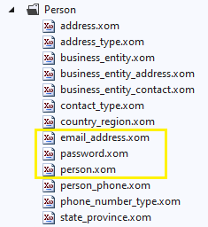

# 4. Implementing security

Virtually any business application requires the implementation of some level of security to authenticate the user and to restrict the application's functionality based on the user's permissions. In this section, we are going to show you how to add security to our demo application using Xomega and standard claims-based .Net security frameworks.

## Authentication entities

The Adventure Works data model that we use in our example doesn't really have a clear representation of a user entity with a unique user ID that can be used for sign-in. There is a `person` object, which we can use as a surrogate for the user object, but it has an internal auto-generated integer ID, which we cannot really expect the users to provide for authentication. Therefore, we will use the e-mail address associated with the person as the user ID.

We also have a `password` object, which stores hashed passwords and the salt, that can be used to authenticate the user. Highlighted below are the relevant files in the model.



## Authorization support

Similarly, our data model doesn't have any tables that store user roles or privileges, but the `person` object has a `person type` field that we can use as a surrogate for the user role. Following is the description of the different types of persons, and their meanings.

```xml title="person.xom"
<object name="person">
  <fields>
    ...
    <field name="person type" type="code2" required="true">
      <config>[...]
      <doc>
<!-- highlight-start -->
        <summary>Primary type of person: SC = Store Contact, IN = Individual (retail) customer,
          SP = Sales person, EM = Employee (non-sales), VC = Vendor contact, GC = General contact</summary>
<!-- highlight-end -->
      </doc>
    </field>
    ...
  </fields>
</object>
```

As you see, it allows for both internal users, such as an employee or a salesperson, as well as external users that are associated with a particular vendor, store, or individual customer.

We will allow access to the application for all types of users, but external users will need to be able to see only the data that is associated with their business entity, i.e. only their own sales orders.
