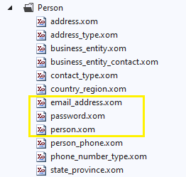

# 4. Implementing security

Virtually any business application requires implementation of some level of security to authenticate the user and to restrict the application's functionality based on the user's permissions.

As you saw in the beginning, Xomega solution wizard already created a [password-based *Login* form](../basic/create#login) and all the necessary infrastructure for password logins. In this section, we are going to show you how to implement the password authentication and claims-based authorization within our demo application using Xomega.

## Authentication entities

The Adventure Works data model that we use in our example doesn't really have a clear representation of a user entity with a unique user ID that can be used for sign-in. There is a `person` object, which we can use as a surrogate for the user object, but it has an internal auto-generated integer ID, which we cannot really expect the users to provide for authentication. Therefore, we will use the e-mail address associated with the person as the user ID.

We also have a `password` object, which stores hashed passwords and the salt, that can be used to authenticate the user. Highlighted below are the relevant files in the model.



## Authorization support

Similarly, our data model doesn't have any tables that store user roles or privileges, but the `person` object has a `person type` field that we can use as a surrogate for the user role. Following is the description of the different types of persons, and their meanings.

```xml title="person.xom"
<object name="person">
  <fields>
    ...
<!-- highlight-next-line -->
    <field name="person type" type="code2" required="true">
      <config>[...]
      <doc>
<!-- highlight-start -->
        <summary>Primary type of person: SC = Store Contact, IN = Individual (retail) customer,
          SP = Sales person, EM = Employee (non-sales), VC = Vendor contact, GC = General contact</summary>
<!-- highlight-end -->
      </doc>
    </field>
    ...
  </fields>
</object>
```

As you see, it allows for both internal users, such as an employee or a salesperson, as well as external users that are associated with a particular vendor, store, or individual customer.

We will allow access to the application for all types of users. However, external users will need to be able to see only the data that is associated with their business entity, i.e. only their own sales orders.

### Person Type enum

To make working with roles more structured, let's create a `person type` enumeration with possible values of the person type and their descriptions, and then declare a type with the same name for that enumeration, as shown below.

```xml title="person.xom"
<types>
  <type name="person" base="business entity"/>
<!-- added-lines-start -->
  <type name="person type" base="enumeration" size="2">
    <enum ref="person type"/>
  </type>
<!-- added-lines-end -->
</types>
<!-- added-lines-start -->
<enums>
  <enum name="person type">
    <item name="Store contact" value="SC"/>
    <item name="Individual customer" value="IN"/>
    <item name="Sales person" value="SP"/>
    <item name="Employee" value="EM"/>
    <item name="Vendor contact" value="VC"/>
    <item name="General contact" value="GC"/>
  </enum>
</enums>
<!-- added-lines-end -->
```
 
 Let's also update the `person type` field of the `person` object to use the new type, as follows.

```xml title="person.xom"
<objects>
  <object name="person">
    <fields>
      ...
<!-- removed-next-line -->
      <field name="person type" type="code2" required="true">
<!-- added-next-line -->
      <field name="person type" type="person type" required="true">
      ...
    </fields>
  </object>
</objects>
```
