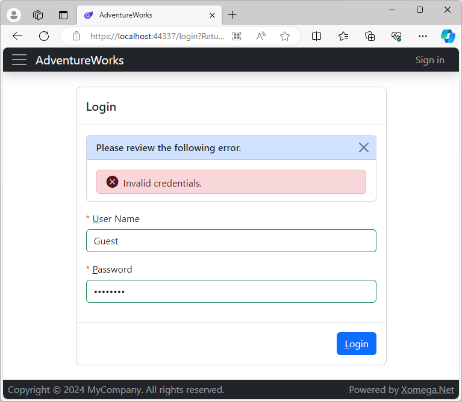
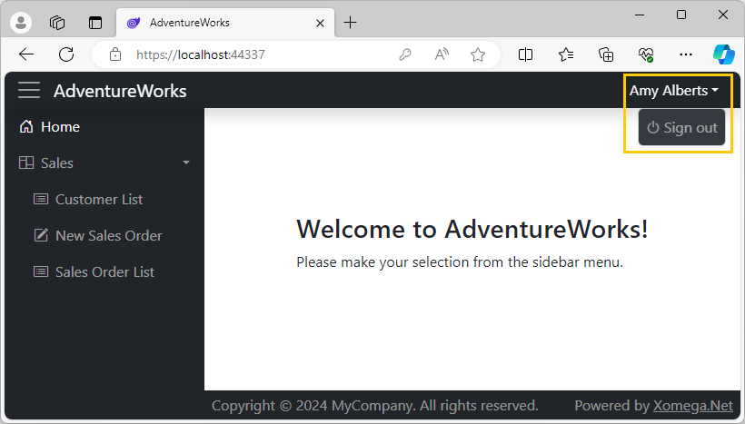

# 4.1 Password authentication

As we mentioned [before](../basic/create#login), the initial implementation of the password login that was added by our solution template is functionally limited to accepting any user name and comparing provided password to the word "password".

However, it created all the necessary plumbing and infrastructure that allows logging in using any of the selected architectures, be it Blazor Server or WebAssembly with either cookie-based or JWT authentication mechanism, so that you could just implement the functional security requirements without worrying about underlying technology.

Here we are going to implement this authentication using our AdventureWorks entities that we picked for user authentication.

## Password login model

To help you understand the initial security structure in the project let's review the model file `login.xom` that solution wizard created under the *Auth* folder of our *Model* project. This file allowed us to generate the login view and all the supporting structures and services.

### Login view

To generate the *Login* view our model file includes the definition of that view, as well as a data object `LoginObject`, which serves as its view model, as illustrated below.

```xml title="login.xom"
<xfk:data-objects>
<!-- highlight-next-line -->
  <xfk:data-object class="LoginObject" customize="true">[...]
</xfk:data-objects>
<ui:views>
<!-- highlight-start -->
  <ui:view name="LoginView" title="Login" customize="true" child="true">
    <ui:view-model data-object="LoginObject" customize="true"/>
<!-- highlight-end -->
    <ui:layout>[...]
  </ui:view>
</ui:views>
```

:::note
Notice that all these objects have a `customize="true"` attribute set to allow us to customize generated code, in order to support logins for different technologies.
:::

### Login structures

Next, our login file defines two structures: `password credentials`, which represents the properties of the `LoginObject`, as well as `user info`, which is intended to provide security details of an authenticated user, similar to the `ClaimsIdentity` class in .Net.

The following snippet illustrates these structures.

```xml title="login.xom"
<types>
  <type name="user name" base="string" size="50"/>
</types>
<structs>
<!-- highlight-next-line -->
  <struct name="password credentials">
    <param name="user name" type="user name" required="true"/>
    <param name="password" type="plain password" required="true"/>
    <config>
<!-- highlight-next-line -->
      <xfk:add-to-object class="LoginObject"/>
    </config>
  </struct>
<!-- highlight-next-line -->
  <struct name="user info">
    <param name="authentication type" type="string"/>
    <param name="user name" type="user name"/>
  </struct>
</structs>
```

:::note
Note that we have a dedicated type `user name` that is used for the user name.
:::

### Login service

Finally, our login file defines a `password login` object that doesn't have any fields and only a `login` operation, which makes it a pure service. The `login` operation takes the `password credentials` structure as the input and returns a `user info` structure as the output, as shown below.

```xml title="login.xom"
<!-- highlight-next-line -->
<object name="password login">
  <operations>
<!-- highlight-next-line -->
    <operation name="login" type="update">
      <input struct="password credentials" arg="credentials"/>
      <output struct="user info"/>
      <config>
<!-- highlight-next-line -->
        <rest:method not-supported="true"/>
      </config>
    </operation>
    <doc>[...]
  </operations>
  <config>
<!-- highlight-next-line -->
    <svc:customize subclass="true"/>
  </config>
</object>
```

We don't want to expose our `login` operation via REST, since REST API authentication is implemented differently by either setting a [cookie](../../framework/services/api/rest#cookie-authentication) or returning a [JWT auth token](../../framework/services/api/rest#token-authentication). Therefore, we configured our operation using `rest:method` with `not-supported="true"`.

:::note
Notice that our `password login` service has a `svc:customize` config with a `subclass="true"` attribute that allows us to override the generated implementation of the `login` operation in a subclass of the generated service.
:::

## Login model enhancements

Now that you got familiar with the initial structure of the login model, let's update it according to our security requirements.

### User name type

Since we decided to use an email address as a user name, we will start by declaring a type for an email in the `email_address.xom` file. We will also update the `email address` field of the `email address` object to use this type instead of a more generic type `name`, as follows.

```xml title="email_address.xom"
<!-- added-lines-start -->
<types>
  <type name="email" base="name"/>
</types>
<!-- added-lines-end -->
...
  <object name="email address">
    <fields>
      ...
<!-- removed-next-line -->
      <field name="email address" type="name">[...]
<!-- added-next-line -->
      <field name="email address" type="email">[...]
      ...
    </fields>
  </object>
```

This will allow us to update the `user name` type to be based on our new `email` type, as follows.

```xml title="login.xom"
<types>
<!-- removed-next-line -->
  <type name="user name" base="string" size="50"/>
<!-- added-next-line -->
  <type name="user name" base="email"/>
</types>
```

### Security user info

Next, we'll need to update the `user info` structure to add any additional claims that we want as part of the user's identity. Given that our users are stored in the `Person` table, we'll set the `object="person"` attribute on the `user info` structure, so that we won't have to set the type on any fields from the `person` object.

We are going to add the following fields to the `user info`:
- `business entity id` as the internal user ID;
- `person type` as a surrogate for the user's role;
- `last name` and `first name` for display purposes;
- `store` - ID of the store associated with a store contact;
- `vendor` - ID of the vendor associated with a vendor contact.

As a result our `user info` structure would look as follows.

```xml title="login.xom"
<!-- highlight-next-line -->
  <struct name="user info" object="person">
    <param name="authentication type" type="string"/>
    <param name="user name" type="user name"/>
<!-- added-lines-start -->
    <param name="business entity id"/>
    <param name="person type"/>
    <param name="first name"/>
    <param name="last name"/>
    <param name="store" type="store"/>
    <param name="vendor" type="vendor"/>
<!-- added-lines-end -->
  </struct>
```

:::note
Notice that since the `store` and `vendor` are not fields on the `person` object, we had to explicitly set the type on those parameters.
:::

## Implementing login operation

Now that we have enhanced our login model, let's **build the model project** to regenerate the corresponding structures, which we'll use to implement password authentication.

### Initial login operation

If you recall, our `password login` service was declared in the model with a `svc:customize` config that has `subclass="true"`, which means that we can override  implementation of the `LoginAsync` operation in a subclass of the generated service. Xomega solution wizard added such a subclass initially in the `PasswordLoginServiceCustomized.cs` file, as illustrated below.

```cs title="PasswordLoginServiceCustomized.cs"
public class PasswordLoginServiceCustomized : PasswordLoginService
{
    ...
/* highlight-start */
    public override async Task<Output<UserInfo>> LoginAsync(
        PasswordCredentials _credentials, CancellationToken token = default)
/* highlight-end */
    {
        if (_credentials == null)
            currentErrors.AddValidationError(
                Xomega.Framework.Messages.Validation_Required, nameof(_credentials));
        else
        {
            if (string.IsNullOrEmpty(_credentials?.UserName))
                currentErrors.AddValidationError(
                    Xomega.Framework.Messages.Validation_Required, nameof(_credentials.UserName));
            if (string.IsNullOrEmpty(_credentials?.Password))
                currentErrors.AddValidationError(
                    Xomega.Framework.Messages.Validation_Required, nameof(_credentials.Password));
        }

/* highlight-start */
        // TODO: validate _credentials.Username and _credentials.Password here
        bool passwordValid = _credentials.Password == "password";
/* highlight-end */
        if (!passwordValid)
            currentErrors.AddValidationError(Messages.InvalidCredentials);

        currentErrors.AbortIfHasErrors();

/* highlight-start */
        // TODO: read user info here
        var userInfo = new UserInfo()
        {
            UserName = _credentials.UserName,
        };
/* highlight-end */
        return await Task.FromResult(new Output<UserInfo>(currentErrors, userInfo));
    }
}
```

As you can see, this implementation validates that both the `UserName` and `Password` are provided in the credentials. Next, it simply checks if the provided password equals "password" and includes a `TODO` comment for you to properly validate it. Then it returns `UserInfo` with the provided user name, and includes another `TODO` to implement reading this data.

### Password validation

To implement password validation we will look up a record in the `EmailAddress` table for the provided `UserName` and find the corresponding `Password` record.

:::note
Technically, we should use the `PasswordSalt` from the password record to hash the `_credentials.Password` and compare it with the `PasswordHash` stored on the password record. However, it's not clear how exactly passwords are hashed in the sample AdventureWorks database. So, for ease of testing, we'll leave the password validation to check for the word "password".
:::

As a result, our password validation will just make sure that the provided `UserName` is a registered email address with associated `Password` record, as shown below.

```cs title="PasswordLoginServiceCustomized.cs"
/* added-next-line */
using Microsoft.EntityFrameworkCore;
using System;
/* added-next-line */
using System.Linq;
...
public class PasswordLoginServiceCustomized : PasswordLoginService
{
    ...
/* highlight-next-line */
    public override async Task<Output<UserInfo>> LoginAsync(
        PasswordCredentials _credentials, CancellationToken token = default)
    {
        ...
/* removed-next-line */
        // TODO: validate _credentials.Username and _credentials.Password here
/* added-lines-start */
        currentErrors.AbortIfHasErrors(); // abort on empty user name or password

        // lookup password
        var pwdQry = from em in ctx.EmailAddress
                     join pw in ctx.Password on em.BusinessEntityId equals pw.BusinessEntityId
                     where em.EmailAddress1 == _credentials.UserName
                     select pw;
        var pwd = await pwdQry.FirstOrDefaultAsync(token);

        // validate password
        bool passwordValid = false;
        if (pwd != null)
        {
            passwordValid = _credentials.Password == "password"; // for testing only
            // TODO: hash _credentials.Password using pwd.PasswordSalt,
            //       and compare it with pwd.PasswordHash instead
        }
/* added-lines-end */
/* removed-next-line */
        bool passwordValid = _credentials.Password == "password";
        ...
    }
}
```

:::tip
In a real system you can use special frameworks, such as ASP.NET Identity, that are designed to support password authentication.
:::

### Reading user info

To read the `UserInfo` that we enhanced in the model with additional fields, we can use the `BusinessEntityId` from the `Password` record that we looked up before, in order to find a corresponding `Person` record. To populate optional IDs of an associated store or vendor we can left join `Store` and `Vendor` records through the `BusinessEntityContact`, as illustrated below.

```cs title="PasswordLoginServiceCustomized.cs"
public class PasswordLoginServiceCustomized : PasswordLoginService
{
    ...
/* highlight-next-line */
    public override async Task<Output<UserInfo>> LoginAsync(
        PasswordCredentials _credentials, CancellationToken token = default)
    {
        ...
/* removed-next-line */
        // TODO: read user info here
/* added-lines-start */
        // lookup and return user info
        var qry = from ps in ctx.Person
                  join bc in ctx.BusinessEntityContact on ps.BusinessEntityId equals bc.PersonId into bec
                  from bc in bec.DefaultIfEmpty()
                  join st in ctx.Store on bc.BusinessEntityId equals st.BusinessEntityId into store
                  from st in store.DefaultIfEmpty()
                  join vn in ctx.Vendor on bc.BusinessEntityId equals vn.BusinessEntityId into vendor
                  from vn in vendor.DefaultIfEmpty()
/* highlight-next-line */
                  where ps.BusinessEntityId == pwd.BusinessEntityId
                  select new UserInfo
                  {
                      UserName = _credentials.UserName,
                      BusinessEntityId = ps.BusinessEntityId,
                      PersonType = ps.PersonType,
                      FirstName = ps.FirstName,
                      LastName = ps.LastName,
                      Store = st.BusinessEntityId,
                      Vendor = vn.BusinessEntityId
                  };
        var userInfo = await qry.FirstAsync(token);
/* added-lines-end */
/* removed-lines-start */
        var userInfo = new UserInfo()
        {
            UserName = _credentials.UserName,
        };
/* removed-lines-end */
        return await Task.FromResult(new Output<UserInfo>(currentErrors, userInfo));
    }
}
```

:::note
`EmailAddress.BusinessEntityId` has a foreign key to the `Person.BusinessEntityId`. So, if we found an `EmailAddress` record, then we should also find a `Person` record, and don't have to worry about the query not returning anything.
:::

## User info principal converter

Xomega solution wizard also added a new class `UserInfoPrincipalConverter` in the `AdventureWorks.Services.Common` under the *ServiceContracts/Auth* folder. This class implements `IPrincipalConverter<UserInfo>` and allows converting `UserInfo` structure to a `ClaimsPrincipal` and vice versa. Initially, this class contained just a minimum default implementation, as follows.

```cs title="UserInfoPrincipalConverter.cs"
/* highlight-next-line */
public class UserInfoPrincipalConverter : IPrincipalConverter<UserInfo>
{
/* highlight-next-line */
    public UserInfo FromPrincipal(ClaimsPrincipal principal)
    {
        var username = principal.FindFirst(ClaimTypes.Name)?.Value;

        if (username != null)
        {
            return new UserInfo
            {
                AuthenticationType = principal.Identity.AuthenticationType,
                UserName = username,
            };
        }
        return null;
    }

/* highlight-next-line */
    public ClaimsPrincipal ToPrincipal(UserInfo userInfo)
    {
        Claim[] claims = new[] {
            new Claim(ClaimTypes.Name, userInfo.UserName)
        };

        return new ClaimsPrincipal(new ClaimsIdentity(claims, userInfo.AuthenticationType));
    }
}
```

:::note
Since this class is defined in the `AdventureWorks.Services.Common`, which is shared between the client and the server, it can be used on both sides. Our solution wizard already added registration of this class with the DI container on both server and client.
:::

Given our enhancements of the `UserInfo` structure, we need to update the `ToPrincipal` and `FromPrincipal` methods to use the new fields in that structure.

### User info to principal

To convert our updated `UserInfo` structure to a `ClaimsPrincipal` we will define constants `ClaimTypeStore` and `ClaimTypeVendor` for the types of our custom claims. Then we'll construct a list of claims from the values of the `UserInfo` structure, as shown below.

```cs title="UserInfoPrincipalConverter.cs"
/* highlight-next-line */
public class UserInfoPrincipalConverter : IPrincipalConverter<UserInfo>
{
/* added-lines-start */
    public const string ClaimTypeStore = "http://adventure-works.com/store";
    public const string ClaimTypeVendor = "http://adventure-works.com/vendor";
/* added-lines-end */

    ...
/* highlight-next-line */
    public ClaimsPrincipal ToPrincipal(UserInfo userInfo)
    {
/* removed-lines-start */
        Claim[] claims = new[] {
            new Claim(ClaimTypes.Name, userInfo.UserName)
        };
/* removed-lines-end */
/* added-lines-start */
        var claims = new List<Claim>() {
            new Claim(ClaimTypes.NameIdentifier, "" + userInfo.BusinessEntityId, ClaimValueTypes.Integer),
/* highlight-next-line */
            new Claim(ClaimTypes.Name, userInfo.FirstName + " " + userInfo.LastName),
            new Claim(ClaimTypes.GivenName, userInfo.FirstName),
            new Claim(ClaimTypes.Surname, userInfo.LastName),
            new Claim(ClaimTypes.Email, userInfo.UserName),
            new Claim(ClaimTypes.Role, userInfo.PersonType) // person type is user's role
        };
        if (userInfo.Store != null)
            claims.Add(new Claim(ClaimTypeStore, "" + userInfo.Store.Value, ClaimValueTypes.Integer));
        if (userInfo.Vendor != null)
            claims.Add(new Claim(ClaimTypeVendor, "" + userInfo.Vendor.Value, ClaimValueTypes.Integer));
/* added-lines-end */

        return new ClaimsPrincipal(new ClaimsIdentity(claims, userInfo.AuthenticationType));
    }
}
```

:::note
The `ClaimTypes.Name` claim is what's normally displayed on the UI for the logged in user, so we construct it from the user's first and last name. However, you can pick different value(s) to display there as needed.
:::

### Principal to user info

Similarly, we will update the `FromPrincipal` that converts a `ClaimsPrincipal` to `UserInfo` as follows.

```cs title="UserInfoPrincipalConverter.cs"
public class UserInfoPrincipalConverter : IPrincipalConverter<UserInfo>
{
    ...
/* highlight-next-line */
    public UserInfo FromPrincipal(ClaimsPrincipal principal)
    {
/* removed-lines-start */
        var username = principal.FindFirst(ClaimTypes.Name)?.Value;

        if (username != null)
        {
            return new UserInfo
            {
                AuthenticationType = principal.Identity.AuthenticationType,
                UserName = username,
            };
        }
        return null;
/* removed-lines-end */
/* added-lines-start */
        var userInfo = new UserInfo
        {
            AuthenticationType = principal.Identity.AuthenticationType,
            UserName = principal.FindFirst(ClaimTypes.Email)?.Value,
            FirstName = principal.FindFirst(ClaimTypes.GivenName)?.Value,
            LastName = principal.FindFirst(ClaimTypes.Surname)?.Value,
            PersonType = principal.FindFirst(ClaimTypes.Role)?.Value,
        };
        if (int.TryParse(principal.FindFirst(ClaimTypes.NameIdentifier)?.Value, out int id))
            userInfo.BusinessEntityId = id;
        if (int.TryParse(principal.FindFirst(ClaimTypeStore)?.Value, out int store))
            userInfo.Store = store;
        if (int.TryParse(principal.FindFirst(ClaimTypeVendor)?.Value, out int vendor))
            userInfo.Vendor = vendor;

        return userInfo;
/* added-lines-end */
    }
    ...
}
```

:::note
This method is important for persisting authentication state and transferring it from Blazor Server to the WebAssembly client in the `InteractiveAuto` rendering mode.
:::

## Remove default credentials

So far our login form had pre-populated *Guest* credentials that allow you to quickly skip the *Login* screen during the development of other screens. Now that we have implemented proper authentication, it's a good idea to remove such default credentials.

Those are set in the customized login object `LoginObjectCustomized` that was added by the solution wizard to the `AdventureWorks.Client.Common` project under the *DataObjects/Auth* folder. All you have to do is to remove the code that sets default values during initialization, as follows.

```cs title="LoginObjectCustomized.cs"
    public class LoginObjectCustomized : LoginObject
    {
        ...
        // construct properties and child objects
        protected override void Initialize()
        {
            base.Initialize();

            // disable modification tracking to avoid unsaved changes prompts
            TrackModifications = false;
            IsNew = false;
/* removed-lines-start */

            // TODO: remove the following code after implementing security
            UserNameProperty.SetValue("Guest");
            PasswordProperty.SetValue("password");
/* removed-lines-end */
        }
        ...
    }
```

## Review authentication

If you launch our application now, you'll see that the user name and password are no longer populated by default. If you enter the default *Guest* credentials, you'll get an authentication error, as shown below.



If you enter a valid email address that exists in AdventureWorks database though, such as `amy1@adventure-works.com`, and "password" as the password, then the login should succeed, and you will see the full user name in the top right menu, as follows.



In the next section, you'll learn how to use the authenticated user's info to restrict functionality in the backend business services.