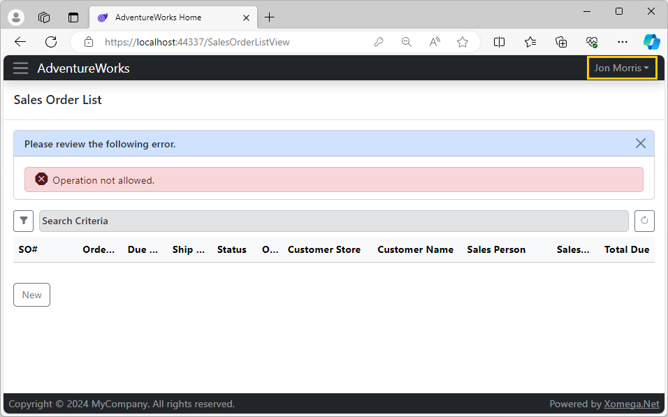
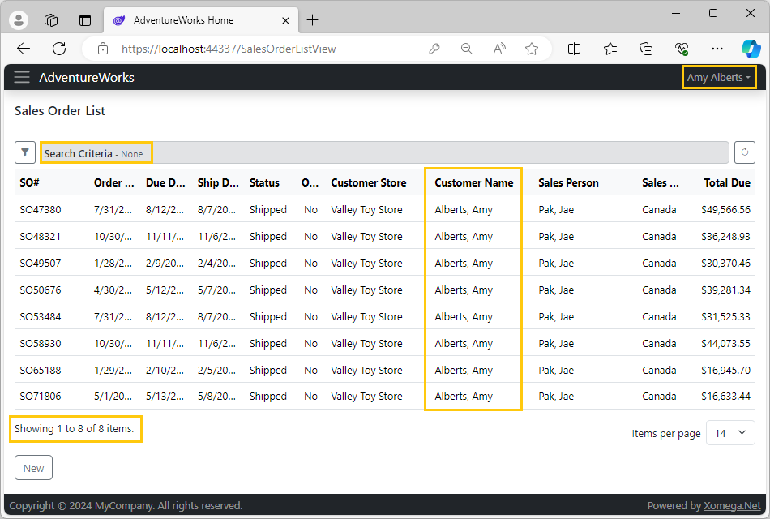

# 4.2 Secure business services

Following best security practices, you'd always want to secure business services first, to make sure that the user cannot call any operations that they are not allowed to call, and that they don't have access to any data that they are not allowed to see.

In our example application, access to sales orders should be allowed only to internal employees, and to individual or store customers, but not to vendors or other types of users. Moreover, external customers should be able to see only their own sales orders. Let's see how we can implement these security requirements within the business services generated by Xomega.

## Principal extensions

To simplify any security checks in the code, we can also define some handy extension methods on the `IPrincipal` interface. So, let's add a new file `PrincipalExtensions.cs` to the shared project `AdventureWorks.Services.Common` under the folder *ServiceContracts/Auth*, so that it can be reused on both the server and the client side. 

### Role checking utilities

We will start by adding methods that will allow us to easily check user roles, while also leveraging constants that were generated from the `person type` enumeration that we defined in the model, as follows.

```cs title="PrincipalExtensions.cs"
/* added-lines-start */
using AdventureWorks.Services.Common.Enumerations;
using System.Security.Principal;

namespace AdventureWorks.Services.Common
{
    public static class PrincipalExtensions
    {
        public static bool IsStoreContact(this IPrincipal principal) =>
            principal.IsInRole(PersonType.StoreContact);

        public static bool IsIndividualCustomer(this IPrincipal principal) =>
            principal.IsInRole(PersonType.IndividualCustomer);

        public static bool IsSalesPerson(this IPrincipal principal) =>
            principal.IsInRole(PersonType.SalesPerson);

        public static bool IsEmployee(this IPrincipal principal) =>
            principal.IsSalesPerson() || principal.IsInRole(PersonType.Employee);
    }
}
/* added-lines-end */
```

### Custom claims utilities

Next, let's add extension methods that help us easily retrieve typed values of the custom claims, such as the store ID associated with the user, as follows.

```cs title="PrincipalExtensions.cs"
/* added-next-line */
using System.Linq;
...
public static class PrincipalExtensions
{
    ...
/* added-lines-start */
    public static int? GetStoreId(this IPrincipal principal)
    {
        Claim storeIdClaim = null;
        if (principal.Identity is ClaimsIdentity ci && (storeIdClaim = 
/* highlight-next-line */
            ci.Claims.FirstOrDefault(c => c.Type == UserInfoPrincipalConverter.ClaimTypeStore)) != null)
            return int.Parse(storeIdClaim.Value);
        return null;
    }

    public static int? GetPersonId(this IPrincipal principal)
    {
        Claim idClaim = null;
        if (principal.Identity is ClaimsIdentity ci &&
            (idClaim = ci.Claims.FirstOrDefault(c => c.Type == ClaimTypes.NameIdentifier)) != null)
            return int.Parse(idClaim.Value);
        return null;
    }
/* added-lines-end */
}
```

:::note
Notice how we use the custom claim type `ClaimTypeStore` that we defined on the `UserInfoPrincipalConverter` class.
:::

You can add other extension methods here as needed, but we have what we need now to start securing our business services.

## Restricting access to operations

We'll start by restricting access to the `read list` operation for sales orders to external users that are not customers.

First, let's open the `Resources.resx` file under the `AdventureWorks.Services.Entities` project, and add a message for restricted operations, as follows.

|Name|Value|Comment|
| -- | --- | ----- |
|OperationNotAllowed|Operation not allowed.||

Don't forget to run the custom tool on the nested `Messages.tt` file to regenerate message constants.

Now let's open the `ReadListAsync` method of our `SalesOrderService` implementation class, and add the following custom code for security checks at the top of the method.

```cs title="SalesOrderService.cs"
// CUSTOM_CODE_START: add namespaces for custom code below
using AdventureWorks.Services.Common.Enumerations;
/* added-next-line */
using Xomega.Framework;
// CUSTOM_CODE_END
...
public partial class SalesOrderService : BaseService, ISalesOrderService
{
    ...
// highlight-next-line
    public virtual async Task<Output<ICollection<SalesOrder_ReadListOutput>>> ReadListAsync(
        SalesOrder_ReadListInput_Criteria _criteria, CancellationToken token = default)
    {
        ...
        // CUSTOM_CODE_START: add custom security checks for Read operation below
/* added-lines-start */
        if (!CurrentPrincipal.IsEmployee() && !CurrentPrincipal.IsIndividualCustomer() &&
            !CurrentPrincipal.IsStoreContact())
        {
/* highlight-next-line */
            currentErrors.CriticalError(ErrorType.Security, Messages.OperationNotAllowed);
        }
/* added-lines-end */
        // CUSTOM_CODE_END
        ...
    }
}
```

Notice how we are using the `CurrentPrincipal` member of the service to determine the permissions of the current user, and leverage the convenient extensions methods that we added to the `PrincipalExtensions` class earlier.

:::note
Since the `ErrorType` enum is in the `Xomega.Framework` namespace, which was not used or declared in this generated file, we needed to make sure it's declared in the custom section for the namespaces at the top of the file to prevent it from being erased during regeneration.
:::

If the security check fails, we report a critical error of type `Security`, which will abort the execution and will return the `OperationNotAllowed` message to the client.

:::note
When the business services are called via REST API, these security errors will be reported using the HTTP status code 403 (Forbidden), following the REST standards.
:::

### Testing operation access

To test access to our `read list` operation for the sales orders, let's run the app and login using a vendor contact, such as `jon2@adventure-works.com`, which should not be allowed to access it. If you navigate to the *Sales Order List* screen now, and try to run any search, you'll see our security error displayed, as follows.



:::warning
Technically, vendor users should not even have access to this screen, which we'll take care of later.

However, you should still **always secure your business operations separately**, even if the UI will not provide any access to it, so that unauthorized users wouldn't be able to call it via WebAPI, bypassing the UI.
:::

## Restricting access to data

Now, let's restrict the data returned by the `ReadListAsync` method for external customers to show only their own sales orders.

We need to find a custom code placeholder for additional filter criteria on the source query and add some custom code that checks if the `CurrentPrincipal` is a store or an individual customer, and then add their associated `storeId` or `personId` respectively as additional filter criteria for the sales order's customer, as follows.

```cs
public partial class SalesOrderService : BaseService, ISalesOrderService
{
    ...
// highlight-next-line
    public virtual async Task<Output<ICollection<SalesOrder_ReadListOutput>>> ReadListAsync(
        SalesOrder_ReadListInput_Criteria _criteria, CancellationToken token = default)
    {
        ...
        // CUSTOM_CODE_START: add custom filter criteria to the source query for ReadList operation below
/* added-lines-start */
        if (CurrentPrincipal.IsStoreContact())
        {
            int? storeId = CurrentPrincipal.GetStoreId();
/* highlight-next-line */
            src = src.Where(o => o.CustomerObject.StoreObject.BusinessEntityId == storeId);
        }
        if (CurrentPrincipal.IsIndividualCustomer())
        {
            int? personId = CurrentPrincipal.GetPersonId();
/* highlight-next-line */
            src = src.Where(o => o.CustomerObject.PersonObject.BusinessEntityId == personId);
        }
/* added-lines-end */
        // CUSTOM_CODE_END
        ...
    }
}
```

As before, we are using our custom extension methods from `PrincipalExtensions` to easily retrieve the `storeId` or `personId` for the `CurrentPrincipal`.

### Testing data access

To test that our `read list` operation returns only sales orders placed by the customer, let's run the app and login using a store contact, such as `amy1@adventure-works.com`. If you navigate to the *Sales Order List* screen now, and try to run a blank search with no criteria, you'll see that only 8 sales orders are returned, all with the customer being our user, as shown below.



:::warning
To properly secure all business services you'll need to add similar custom security checks to other CRUD operations of the `SalesOrderService`, and report any security errors as appropriate.
:::

Now that we learned how to secure access to business services and data, let's see how to secure the UI views.