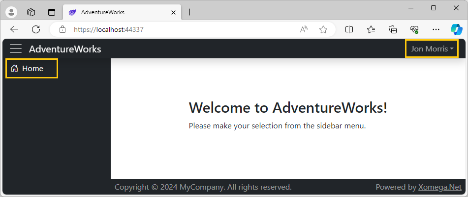

# 4.3 Secure UI views and fields

While securing business services can be the minimum to secure your application, you typically also want to add security on the UI to restrict user access to certain views, hide any UI fields that the user should have no access to, or disable those that they have read-only access to. In this section you'll learn how to implement UI security with Xomega.

## Securing access to pages

If you remember, we secured our `SalesOrderService` to allow reading a list of sales orders only for internal employees and external customers, but not for other users, such as vendor contacts.

Let's see how we can also restrict access to the pages under the *Sales* module only to internal employees and external customers.

### Adding authorization policies

To describe such a security restriction in our Blazor application, we'll define a new policy "*Sales*" for internal employees and external customers.

When we created our project, Xomega solution wizard added a special class `AuthConfig` under the *Views* folder of the `AdventureWorks.Client.Blazor.Common` project. This class contains an extension method `AddAppPolicies` that is called from the startup code, which allows us to define application policies. So, let's go ahead and add a "*Sales*" policy in there as follows.

```cs title="AuthConfig.cs"
using Microsoft.AspNetCore.Authorization;
/* added-next-line */
using AdventureWorks.Services.Common;

namespace AdventureWorks.Client.Blazor.Common.Views
{
    public static class AuthConfig
    {
        public static void AddAppPolicies(this AuthorizationOptions opts)
        {
/* removed-next-line */
            // TODO: configure app policies here
/* added-lines-start */
            opts.AddPolicy("Sales", policy => policy.RequireAssertion(ctx =>
                ctx.User.IsEmployee() ||
                ctx.User.IsIndividualCustomer() ||
                ctx.User.IsStoreContact()));
/* added-lines-end */
        }
    }
}
```

:::tip
Note that this policy mimics the security check in the `SalesOrderService`. If we want maximum reusability, then we can create an extension method on the `IPrincipal` specifically for this policy, e.g. `IsSalesUser()`, and then call it from both the Blazor policy assertion and in the security check of that service.
:::

:::warning
If we want to keep our business services platform-independent, then we can't use this policy in the service directly. Otherwise, all our projects will have to depend on ASP.NET Core, which may limit their reusability with other architectures.
:::

### Securing model views

After we defined our security policy, we can set it on the appropriate top-level views in our Xomega model using the [`policy` attribute](../../visual-studio/modeling/presentation#security-policy). For example, the views in `sales_order.xom` will look as follows.

```xml title="sales_order.xom"
<ui:views>
<!-- highlight-next-line -->
  <ui:view name="SalesOrderView" title="Sales Order" policy="Sales">
    <ui:view-model data-object="SalesOrderObject" customize="true"/>
  </ui:view>
<!-- highlight-next-line -->
  <ui:view name="SalesOrderListView" title="Sales Order List" policy="Sales">
      <ui:view-model data-object="SalesOrderList"/>
  </ui:view>
  ...
</ui:views>
```

Similarly, you can set it on the *Customer List* view, if you want to keep it in the main navigation menu.

```xml title="customer.xom"
<ui:views>
<!-- highlight-next-line -->
  <ui:view name="CustomerListView" title="Customer List" policy="Sales">
    <ui:view-model data-object="CustomerList"/>
  </ui:view>
</ui:views>
```

Once you update the views in the model, you need to run the [*Blazor Views* generator](../../generators/presentation/blazor/views), or simply **build the model project** to re-run all generators.

### Securing main navigation menu

If you run the application now, you'll notice that our *Sales* menu options are missing from the menu on the *Login* screen.


:::note
If all menu items in a certain submenu are hidden, then [Xomega menu component](../../framework/blazor/components#menu-security) automatically hides that submenu as well, just like it did with the *Sales* submenu here.
:::

Notice that the sidebar in the *Login* screen still has the *Home* menu, which is added to the generated menus in a custom file `MainMenuCustomized.cs`. If you want to hide the *Home* menu there, and only show it to authenticated users, then you can set the `Policy` for that menu item to an empty string, as follows.

```cs title="MainMenuCustomized.cs"
public partial class MainMenu
{
    private partial List<MenuItem> GeneratedItems();

    public List<MenuItem> Items
    {
        get
        {
            var res = GeneratedItems();
            res.Insert(0, new MenuItem()
            {
/* added-next-line */
                Policy = "",
                ResourceKey = Messages.HomeView_NavMenu,
                IconClass = "bi bi-house-door",
                Href = "/"
            });
            // TODO: add authorization with any security policies
            return res;
        }
    }
}
```

:::tip
You can also further adjust the policy values for main menu items here, as per the *TODO* comment.
:::

### Testing page access

To test security access to our pages, let's log in as a **vendor** contact user `jon2@adventure-works.com`. After the login you will see the default *Home* screen without the *Sales* menu in the sidebar, which is not available to vendors, as shown below.



However, hiding menu items is not enough, since the user can just type the URL in the browser or open up a bookmarked URL. If you manually navigate to the */SalesOrderListView* URL while logged in as a vendor contact user, you'll get the following *Unauthorized* page.


If you log out now, and then log back in as an **external customer** user `amy1@adventure-works.com`, you'll see that all *Sales* menu items will re-appear, as illustrated below.


This confirms that our security policy is properly configured for those views.

## Securing access to fields

In addition to hiding entire screens, you may also need to restrict user's access to specific fields on the screen. Xomega Framework defines three levels of [field access](../../framework/common-ui/properties/base#access): `Full`, `ReadOnly` and `None`, which you can set on the properties of the underlying data objects.

:::tip
Configuring your UI security logic on the data objects helps you to **reuse it with other UI technologies** that allow you to bind different type of views (e.g. WPF) to the same data objects.
:::

For example, our *Sales Order List* screen has criteria by *Customer Store* and *Customer Name*, as shown below.


However, they don't make much sense for external customer users, since the list will always show only their own sales orders, based on the way we [secured access to sales order data](secure-service#restricting-access-to-data) earlier.

### Hiding restricted fields

To hide these fields for external customers, let's open our `SalesOrderCriteriaCustomized` data object, and add the following code to its `OnInitialized` method.

```cs title="SalesOrderCriteriaCustomized.cs"
/* added-next-line */
using AdventureWorks.Services.Common;
...
public class SalesOrderCriteriaCustomized : SalesOrderCriteria
{
    ...
// highlight-next-line
    protected override void OnInitialized()
    {
        base.OnInitialized();
        StatusProperty.DisplayFormat = $"{Header.FieldId} - {Header.FieldText}";
        TerritoryIdProperty.SetCascadingProperty(SalesTerritory.Attributes.Group, GlobalRegionProperty);
        SalesPersonIdProperty.SetCascadingProperty(SalesPerson.Attributes.TerritoryId, TerritoryIdProperty);
        SalesPersonIdProperty.NullsMatchAnyCascading = true;
        SalesPersonIdProperty.DisplayListSeparator = "; ";
/* added-lines-start */

        if (CurrentPrincipal.IsStoreContact() || CurrentPrincipal.IsIndividualCustomer())
        {
            CustomerStoreOperatorProperty.AccessLevel = AccessLevel.None;
            CustomerNameOperatorProperty.AccessLevel = AccessLevel.None;
        }
/* added-lines-end */
    }
}
```

In this case, we are using the `CurrentPrincipal` member of the data object, as well as our handy extension methods to determine the user privileges. For external customers, we set the `AccessLevel` to `None` on the operator properties for customer store and name, and Xomega Framework takes care of hiding the property-bound controls, and their labels for us.

### Testing field access

Let's run the application, log in as an **external customer** user `amy1@adventure-works.com`, and open up the *Sales Order List* screen.

If you expand the criteria section, you'll notice that the *Customer Store* and *Customer Name* criteria, which were right before the *Global Region* criteria, are no longer available, as illustrated in the following screenshot.


