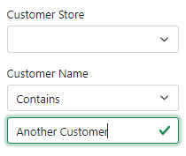

# 4.4 Secure UI objects

While securing business services can generally fulfill your security requirements, you typically also want to hide any UI fields that the user should have no access to, or disable those that they have read-only access to.

## Restricted criteria fields

Our *Sales Order List* screen has criteria by customer store and names as shown below.



However, they don't make much sense for external customer users, since the list will always show only their own sales orders, as we have coded in the previous section.

## Hiding restricted fields

To hide these fields for external customers, let's open our `SalesOrderCriteriaCustomized` data object, and add the following code to its `OnInitialized` method.

```cs title="SalesOrderCriteriaCustomized.cs"
/* added-next-line */
using AdventureWorks.Services.Common;
...
public class SalesOrderCriteriaCustomized : SalesOrderCriteria
{
    ...
// highlight-next-line
    protected override void OnInitialized()
    {
        base.OnInitialized();
        StatusProperty.DisplayFormat = $"{Header.FieldId} - {Header.FieldText}";
        TerritoryIdProperty.SetCascadingProperty(SalesTerritory.Attributes.Group, GlobalRegionProperty);
        SalesPersonIdProperty.SetCascadingProperty(SalesPerson.Attributes.TerritoryId, TerritoryIdProperty);
        SalesPersonIdProperty.NullsMatchAnyCascading = true;
        SalesPersonIdProperty.DisplayListSeparator = "; ";

/* added-lines-start */
        if (CurrentPrincipal.IsStoreContact() || CurrentPrincipal.IsIndividualCustomer())
        {
            CustomerStoreOperatorProperty.AccessLevel = AccessLevel.None;
            CustomerNameOperatorProperty.AccessLevel = AccessLevel.None;
        }
/* added-lines-end */
    }
}
```

In this case, we are using the `CurrentPrincipal` member of the data object, as well as our handy extension methods to determine the user privileges. For external customers, we set the `AccessLevel` to `None` on the operator properties for customer store and name, and Xomega Framework takes care of hiding the property-bound controls, and their labels for us.

:::note
With this logic being in a data object class, it will be also reusable with other C# based clients like WebForms or WPF desktop clients.
:::

We will see the effect of these security checks once we implement the actual authentication for each specific technology, as described in the following sections.
