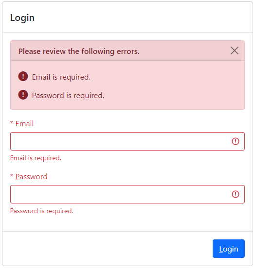
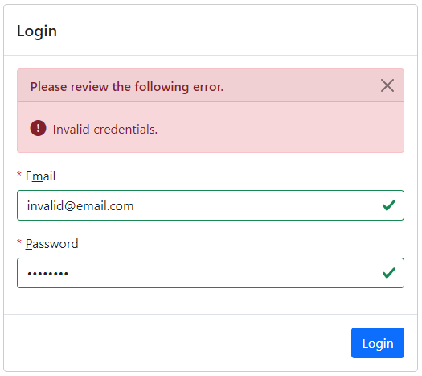
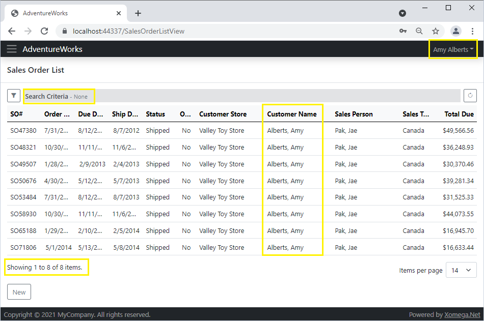
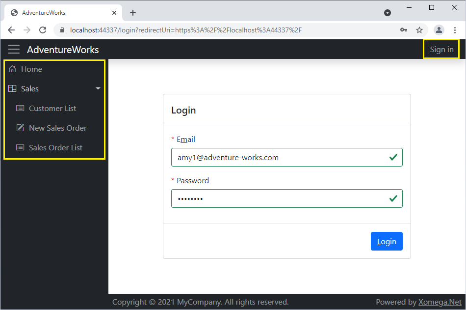
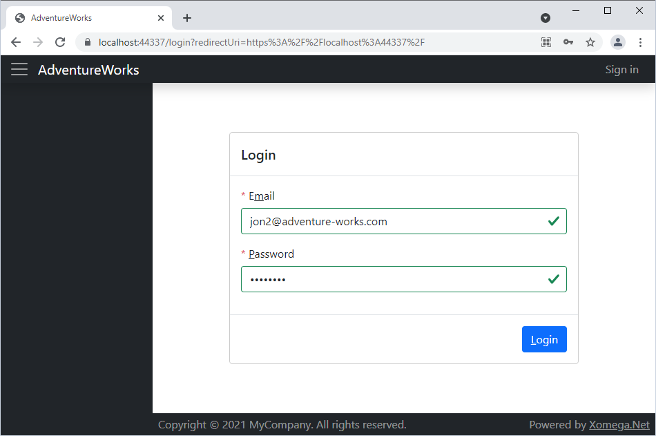
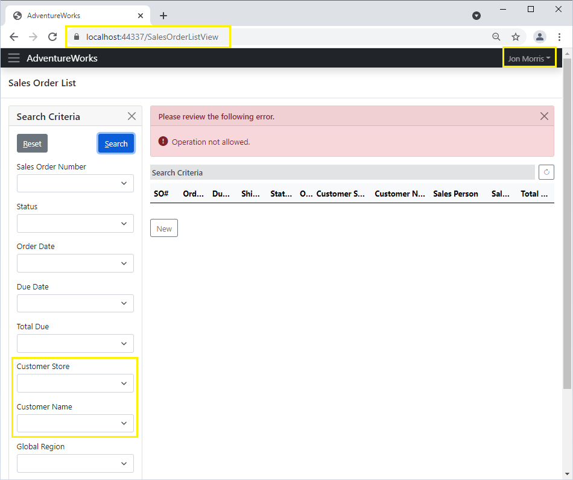
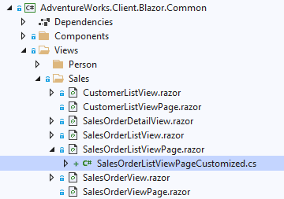
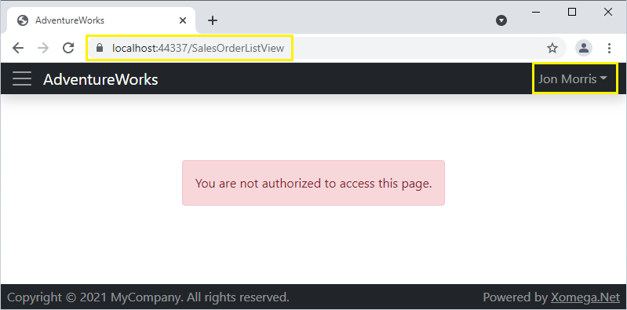

# 4.5 Blazor Server security

So far we've been writing and generating common security code that you can reuse in different platforms. In this section we'll leverage this code to add authentication to our Blazor Server app.

## Enabling authentication

First, let's open the main `App.razor` file in the `AdventureWorks.Client.Blazor.Common` project that was installed with the Xomega template, comment out the usage of the standard `RouteView` component, and uncomment the secured `AuthorizeRouteView` component, as follows.

```razor title="App.razor"
<Router AppAssembly="@typeof(App).Assembly" AdditionalAssemblies="@AdditionalAssemblies">
    <Found Context="routeData">
        @*<RouteView RouteData="@routeData" DefaultLayout="@typeof(MainLayout)"/>*@
<!-- highlight-start -->
        <AuthorizeRouteView RouteData="@routeData" DefaultLayout="@typeof(MainLayout)">
            <NotAuthorized>
                @if (!context.User.Identity.IsAuthenticated)
                {
                    <NotAuthenticated />
                }
                else
                {
                    <LayoutView>
                        <div class="d-flex flex-column align-items-center justify-content-evenly w-100">
                            <div class="alert alert-danger">You are not authorized to access this page.</div>
                        </div>
                    </LayoutView>
                }
            </NotAuthorized>
        </AuthorizeRouteView>
<!-- highlight-end -->
    </Found>
    <NotFound>
        <LayoutView Layout="@typeof(MainLayout)">
            <p>Sorry, there's nothing at this address.</p>
        </LayoutView>
    </NotFound>
</Router>
```

Inside the `NotAuthorize` template it uses the `NotAuthenticated` component that was also added by the Xomega template.

### Login redirect

If you look at the code for the `NotAuthenticated` component under the *Components* folder, you'll see that it uses an injected `NavigationManager` to redirect unauthenticated users to the "/login" route, as follows.

```razor title="NotAuthenticated.razor"
@inject NavigationManager Navigation

@code {
<!-- highlight-start -->
    protected override void OnInitialized() =>
        Navigation.NavigateTo($"/login?redirectUri={Uri.EscapeDataString(Navigation.Uri)}");
<!-- highlight-end -->
}
```

Currently there is nothing registered at this route, so you'd get a "*Sorry, there's nothing at this address.*" message from the `NotFound` template, if you run the application.

## Implementing LoginView

We want the "/login" route to show our generated `LoginView.razor` from the *Views/Person* folder of the `AdventureWorks.Client.Blazor.Common` project.

### Blazor Server login logic

To implement the actual sign-in logic for our Blazor Server app, we'll need to add a new class `BlazorLoginView` to the `AdventureWorks.Client.Blazor.Server` project, which will extend from our common `LoginView`, have an attribute for the "/login" route, and the code that performs authentication as shown below.

```cs title="BlazorLoginView.cs"
/* added-lines-start */
using AdventureWorks.Client.Blazor.Common.Views;
using AdventureWorks.Services.Common;
using Microsoft.AspNetCore.Authentication.Cookies;
using Microsoft.AspNetCore.Authorization;
using Microsoft.AspNetCore.Components;
using System.Security.Claims;
using System.Threading;
using System.Threading.Tasks;
using Xomega.Framework;
using Xomega.Framework.Services;

namespace AdventureWorks.Client.Blazor.Server
{
// highlight-start  
    [AllowAnonymous]
    [Route("/login")]
    public class BlazorLoginView : LoginView
// highlight-end
    {
        [Inject] SignInManager signInManager { get; set; }
        [Inject] IPersonService personService { get; set; }

// highlight-next-line
        protected override async Task OnViewEventsAsync(
            object sender, ViewEvent e, CancellationToken token = default)
        {
            await base.OnViewEventsAsync(sender, e, token);
            if (e.IsSaved())
            {
                ClaimsIdentity ci = null;
                if (VM?.MainObj?.EmailProperty?.Value != null)
                {
// highlight-start  
                    Output<PersonInfo> output = await personService.ReadAsync(VM.MainObj.EmailProperty.Value,
                                                                              token);
                    ci = SecurityManager.CreateIdentity(CookieAuthenticationDefaults.AuthenticationScheme,
                                                        output.Result);
// highlight-end  
                }
                var principal = new ClaimsPrincipal(ci);
// highlight-start  
                string ticket = signInManager.GetSignInTicket(principal);
                Navigation.NavigateTo("/SignIn?ticket=" + ticket, true);
// highlight-end  
            }
        }
    }
}
/* added-lines-end */
```

Essentially, we let the framework validate the user email and password from our `AuthenticationObject`, and let it call our `Authenticate` service operation when the user clicks the *Save* button. If there are any client-side or server-side errors, then they will be displayed on the screen. Otherwise, the view will raise a `Saved` event, which we will handle in our custom method `OnViewEventsAsync`.

Upon successful save (i.e. authentication by the service), we will use an injected `IPersonService` to read the person info by the user's email address, and will construct a `ClaimsIdentity` from it using our utility class `SecurityManager`.

### Sign-in ticket for Blazor Server

In a regular web application we'd be able to just sign in the user in the above method with the constructed claims identity using cookies authentication. However, Blazor Server apps run on a SignalR channel, and you cannot modify the response headers to set the authentication cookie from a Blazor component.

Therefore, up above we used the injected `signInManager` from the Xomega Framework to create an encrypted authentication ticket that expires in 1 minute by default, and then we passed that ticket in the URL to a separate Razor page `SignIn.cshtml`, which does the actual sign-in process and sets the authentication cookies using the same `signInManager`, as follows.

```cshtml title="SignIn.cshtml"
@page

@inject Xomega.Framework.Services.SignInManager signInManager

@functions {
<!-- highlight-next-line -->
    public async Task OnGetAsync(string ticket) => await signInManager.SignInAsync(ticket);
}
```

### Making LoginView visible

The Blazor views generated by Xomega are not visible by default, since they can be used both as a top-level view or as a child view that is initially hidden. To set up a top-level view, we need to make it visible, and tell Xomega Framework to activate it from the query parameters.

For regular generated Xomega views this is done in a separate generated page file, which has an associated route, such as the one shown below.

```razor title="SalesOrderListViewPage.razor"
<!-- highlight-next-line -->
@page "/SalesOrderListView"
@attribute [Authorize]

@namespace AdventureWorks.Client.Blazor.Common.Views
<!-- highlight-next-line -->
<SalesOrderListView ActivateFromQuery="true" Visible="true"></SalesOrderListView>
```

Since our `LoginView` doesn't have a separate generated page file, because we marked it with `child="true"` in the model, we will need to set these parameters in the `OnInitialized` method of the `LoginViewCustomized` class, as follows.

```cs title="LoginViewCustomized.cs"
namespace AdventureWorks.Client.Blazor.Common.Views
{
    public partial class LoginView
    {
        protected override void OnInitialized()
        {
            base.OnInitialized();

/* added-lines-start */
            Visible = true;
            ActivateFromQuery = true;
/* added-lines-end */
        }
    }
}
```

### Overriding Save button text

Finally, since the generated details view have a *Save* button for updatable views, we will want to change its text to *Login* on our `LoginView`. This is best done in the `Resources.resx` file under the `AdventureWorks.Client.Common` project, so that it could be localized to different languages.

So, let's open up this resource file, and add an override for the *Save* button text and the access key, as follows.

|Name|Value|Comment|
| -- | --- | ----- |
|AuthenticationObject_Action_Save|Login||
|AuthenticationObject_Action_Save_AccessKey|L||

## Reviewing authentication

If we run the Blazor Server application now, we'll be redirected to our *Login* view.

:::tip
If you run it in Debug mode and get a `Microsoft.AspNetCore.Components.NavigationException`, then you can just click *Continue*, and also configure it to not break on such exceptions.
:::

### Client-side validations

If you click on the *Login* button without entering anything, it will show the client-side validation errors, as shown below.



:::note
Notice how the text for the *Save* button says *Login*, and it has a shortcut key underlined for easy access, just like the *Email* and *Password* fields do, which we configured in the model.
:::

### Authentication service errors

If you supply invalid email and password though, then you'll see the error message from our `Authenticate` service operation, as follows.



:::note
The *Password* field is automatically masked, since we used the `plain password` type for that field, which is configured with the password UI control.
:::

### External customer restrictions

Let's enter a valid email "*amy1@adventure-works.com*" for an external customer associated with a store, and use our test "*password*". Once you hit *Login*, the system will log you in and will show your full name in the upper right corner.

If you open the *Sales Order List* screen now, then you'll notice that the criteria by *Customer Store* and *Customer Name* are missing, as per the custom code that we've added in the customized criteria object, since you should see only your own orders.

If you click *Search* without specifying any criteria, then you'll see only 8 orders total, where you are the customer. This means that our custom security code that we added to the `ReadList` operation of the `SalesOrderService` is also working properly. The following picture demonstrates this scenario.



## Securing main navigation menu

So now we've got a secure Blazor server application that requires authentication and restricts the data and fields based on the currently logged in user. However, if you expand the side navigation menu on the *Login* screen, you'll see that it still has menu options before you log in, as shown below.



Let's see how we can secure the main navigation menu.

### Adding authorization policies

If you remember, we made our `SalesOrderService` to allow reading a list of sales orders only for internal employees and external customers, but not for other users, such as vendor contacts. To describe this in our Blazor application, we'll define a new policy called "*Sales*" for those roles.

We'll add it in the `ConfigureServices` method of the `Startup` class under the corresponding *TODO* comment, as follows.

```cs title="Startup.cs"
public class Startup
{
    public void ConfigureServices(IServiceCollection services)
    {
        ...
        // TODO: add authorization with any security policies
/* added-lines-start */
        services.AddAuthorization(o => {
            o.AddPolicy("Sales", policy => policy.RequireAssertion(ctx =>
                ctx.User.IsEmployee() ||
                ctx.User.IsIndividualCustomer() ||
                ctx.User.IsStoreContact()));
        });
/* added-lines-end */
        ...
    }
}
```

:::tip
Note that this policy mimics the security check in the `SalesOrderService`. So if we want maximum reusability, then we can create an extension method on the `IPrincipal` specifically for this policy, e.g. `IsSalesUser()`, and then call it from both the Blazor policy assertion and the service security check.
:::

:::caution
We can also define this policy in the `AdventureWorks.Client.Blazor.Common` project to make it reusable between the Blazor Server and WebAssembly, but we don't necessarily want to make the service use this policy directly to keep it platform-independent. Otherwise it will make our `AdventureWorks.Services.Entities` project dependent on the ASP.NET Core.
:::

### Setting policy on navigation menu

After we define the authorization policies we can set them on the items of the main menu. If you manually maintain the structure of the main menu, then you can just set the policy on each menu item individually.

If you use the `MainMenu` class that is auto-generated from the model, then you can recursively call the `SecureMenu` method on each item, which sets the policy for each menu item.

So let's update the `SecureMenu` method to set the "*Sales*" policy on all menu items under the *Sales* sub-menu by checking the `Href` of the corresponding views, as follows.

```cs title="Startup.cs"
public class Startup
{
    public void ConfigureServices(IServiceCollection services)
    {
        ...
// highlight-start
        foreach (var mi in MainMenu.Items)
            mi.ForEachItem(SecureMenu);
// highlight-end
    }

    private void SecureMenu(MenuItem mi)
    {
/* removed-next-line */
        mi.Policy = null;
/* added-lines-start */
        if (mi?.Href == null) return;
        if (mi.Href.StartsWith("Sales") || mi.Href.StartsWith("Customer"))
            mi.Policy = "Sales";
        else mi.Policy = ""; // visible for all authorized users
/* added-lines-end */
    }
}
```

### Reviewing menu security

If we run the application now, we'll see that the menu is hidden on the *Login* screen.



Let's log in as a **vendor** contact user "*jon2@adventure-works.com*". You will be taken to the default *Home* screen, and the *Sales* menu will be missing, as shown below.


## Securing access to pages

Unfortunately, securing the menu still doesn't restrict access to the *Sales* screens, as the user can just type in the path to the view directly in the URL.

So, if the user adds *SalesOrderListView* to the URL, the *Sales Order List* screen will open up. However, if they try to search any sales orders, they'll get our security error message from the `ReadList` service operation, which means that our services are still protected. The following picture illustrates this case.



You can also see that even the customer store and name criteria are shown, since we did not bother to restrict them for *Vendor Contact* users, assuming they will not be able to access this screen at all.

### Adding policies to generated pages

In order to restrict the unauthorized users from accessing this screen, we'll need to add an `Authorize` attribute to the top-level `SalesOrderListViewPage` that is mapped to this route, and set the policy on this attribute to be "*Sales*". The problem is that this file is generated from the Xomega model, so any changes you make to it will be wiped out once you regenerate Blazor views.

To work around it, we'll add a new file in the same *Views/Sales* project folder in the `AdventureWorks.Client.Blazor.Common` project, and we'll call it `SalesOrderListViewPageCustomized.cs`, so that it would be nested under that page file.



In that new file we'll declare a partial class for the same page *using the same namespace*, and will add our `Authorize` attribute, as follows.

```cs title="SalesOrderListViewPageCustomized.cs"
/* added-lines-start */
using Microsoft.AspNetCore.Authorization;

// highlight-next-line
namespace AdventureWorks.Client.Blazor.Common.Views
{
// highlight-next-line
    [Authorize(Policy = "Sales")]
    public partial class SalesOrderListViewPage
    {
    }
}
/* added-lines-end */
```

### Reviewing page security

If we run the application now, log in as our *Vendor Contact* user, and try to access the URL for the *Sales Order List* view, then we'll get the `NotAuthorized` view that is defined in our `AuthorizeRouteView` of the `App.razor` file. The screenshot below demonstrates what it will look like.



:::note
You will need to repeat the same process for any other page that should be restricted to some authenticated users, but not others.
:::

Now in addition to securing the business services and reusable UI objects, you have also learned how to implement authentication and authorization for the Blazor Server application using Xomega.
