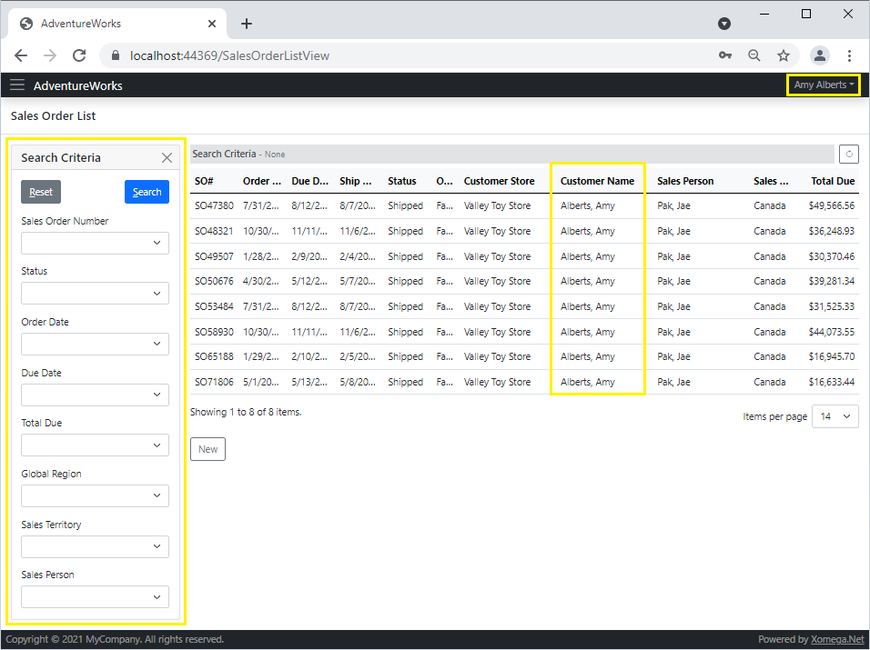

# 4.6 WebAssembly security

In this section, you'll learn how to secure a Blazor WebAssembly application, which uses a different authentication mechanism than the Blazor Server application that we secured earlier since it uses a standalone REST API to call business services.

Nevertheless, make sure you **complete the previous section** on [Blazor Server security](5-blazor-server) first since we added some common code that applies to both Blazor Server and WebAssembly.

## Adding REST API authentication

If you look at the `AdventureWorks.Services.Rest` project that was included in our Xomega solution, then you'll see that it already contains all ASP.NET Core controllers to expose our services via REST, which were generated from our model when we were building the model.

This project was also pre-configured with an `AuthenticationController` under the *App_Start* folder, which uses JWT authentication, and by default authenticates any user (including *anonymous*) as a *Guest*.

The first thing that we need to do to implement proper authentication for the REST API is to inject our `PersonService` into the `AuthenticationController` as follows.

```cs title="AuthenticationController.cs"
/* added-next-line */
using AdventureWorks.Services.Common;
...
public class AuthenticationController : TokenAuthController
{
    ...
/* added-next-line */
    private readonly IPersonService personService;

    public AuthenticationController(ErrorList errorList, ErrorParser errorParser,
        IOptionsMonitor<AuthConfig> configOptions,
/* added-next-line */
        IPersonService personService)
        : base(errorList, errorParser, configOptions)
    {
/* added-next-line */
        this.personService = personService;
    }
}
```

Next, we will need to update the `AuthenticateAsync` method in it to uncomment the code that checks the `ModelState` to make sure credentials are populated, and then call the `personService.AuthenticateAsync` and `ReadAsync` operations to read the person's info and construct proper claims identity from it, as shown below.

```cs title="AuthenticationController.cs"
[AllowAnonymous]
[HttpPost]
[Route("authentication")]
public async Task<ActionResult> AuthenticateAsync([FromBody] Credentials credentials, CancellationToken token)
{
    try
    {
        // TODO: uncomment lines below to validate that user and password are populated
// highlight-start
        if (!ModelState.IsValid)
            currentErrors.AddModelErrors(ModelState);
// highlight-end
        currentErrors.AbortIfHasErrors();

        // TODO: validate credentials.UserName and credentials.Password here.
        // Inject services in the controller for that as needed.
/* removed-lines-start */
        await Task.CompletedTask;

        string user = string.IsNullOrEmpty(credentials?.Username) ? "Guest" : credentials.Username;
/* removed-lines-end */

        ClaimsIdentity identity = new ClaimsIdentity();
/* removed-lines-start */
        // TODO: add claims for the validated user
        identity.AddClaim(new Claim(ClaimTypes.Name, user));
/* removed-lines-end */
/* added-lines-start */
        await personService.AuthenticateAsync(new Common.Credentials()
        {
            Email = credentials.Username,
            Password = credentials.Password
        }, token);
        var info = await personService.ReadAsync(credentials.Username, token);
        identity = SecurityManager.CreateIdentity(JwtBearerDefaults.AuthenticationScheme, info.Result);
/* added-lines-end */

        // generate jwt token
        var jwtTokenHandler = new JwtSecurityTokenHandler();
        string jwtToken = GetSecurityToken(identity, jwtTokenHandler);
        return StatusCode((int)currentErrors.HttpStatus, new Output<string>(currentErrors, jwtToken));
    }
    catch (Exception ex)
    {
        currentErrors.MergeWith(errorsParser.FromException(ex));
    }
    return StatusCode((int)currentErrors.HttpStatus, new Output(currentErrors));
}
```

This should secure our REST services using the password authentication that we set up earlier in our services.

## Implementing the Login view

Next, similarly to [what we did](blazor-server#implementing-loginview) for the `AdventureWorks.Client.Blazor.Server` project, we need to add a subclass of the generated `LoginView` to our project, which will map to the "/login" route, and implement the WebAssembly-specific authentication logic.

Unlike the Blazor Server application, instead of calling our custom operation `authenticate` directly, we need to call the `AuthenticationController` that we set up above, which will return a JWT authentication token. Therefore, we'll need to override the entire *Save* button click handler `OnSaveAsync` and implement a custom authentication code.

So let's add a class `BlazorLoginView` to the `AdventureWorks.Client.Blazor.Wasm` project set the `Route` attribute for the "/login" route, and provide WebAssembly authentication logic, as shown below.

```cs title="BlazorLoginView.cs"
/* added-lines-start */
using AdventureWorks.Client.Blazor.Common.Views;
using AdventureWorks.Client.Common.DataObjects;
using AdventureWorks.Services.Common;
using System.Linq;
using Xomega.Framework.Views;

namespace AdventureWorks.Client.Blazor.Wasm
{
// highlight-start
    [AllowAnonymous]
    [Route("/login")]
    public class BlazorLoginView : LoginView
// highlight-end
    {
        [Inject] AuthenticationStateProvider authStateProvider { get; set; }

// highlight-next-line
        protected async override Task OnSaveAsync(MouseEventArgs e)
        {
            try
            {
                DetailsViewModel dvm = Model as DetailsViewModel;
                AuthenticationObject authObj = dvm.DetailsObject as AuthenticationObject;
                authObj.Validate(true);
                authObj.GetValidationErrors().AbortIfHasErrors();

// highlight-start
                var user = await RestServices.Authenticate(dvm.ServiceProvider,
                    authObj.EmailProperty.Value, authObj.PasswordProperty.Value);
// highlight-end

// highlight-start
                if (authStateProvider is AuthStateProvider asp)
                    asp.SetCurrentPrincipal(user);
// highlight-end

                if (QueryHelpers.ParseQuery(new Uri(Navigation.Uri).Query)
                                .TryGetValue("redirectUri", out var param))
                    Navigation.NavigateTo(param.First());
                else Navigation.NavigateTo("/");
            }
            catch (Exception ex)
            {
                Model.Errors = Model.ErrorParser.FromException(ex);
            }
        }
    }
}
/* added-lines-end */
```

First, we validate the data object properties and report any client-side errors.

Then we call the `RestServices.Authenticate` method from the `AdventureWorks.Client.Common` package with the supplied username and password. This method, in turn, calls the `authentication` REST endpoint to get an access token, constructs a `ClaimsPrincipal` from it, and updates the `HttpClient` to use this token for any subsequent service calls.

To apply the current principal to the Blazor WebAssembly project, the Xomega project template provided a class `AuthStateProvider`, which implements the Blazor's `AuthenticationStateProvider` service as a singleton, and allows setting the current principal.

After a successful login, the view redirects you to the URL supplied in the `redirectUri` parameter, or to the root page.

### Removing anonymous authentication

By default the WebAssembly project was set up to get an access token using an *anonymous* user in the main `Program.cs`, so we need to remove that code, as shown below.

```cs title="Program.cs"
public class Program
{
    public static async Task Main(string[] args)
    {
        ...
        // TODO: add any custom initialization here
/* removed-next-line */
        await RestServices.Authenticate(host.Services, "anonymous", null);
        ...
    }
}
```

## Securing navigation menu

Now we just need to add the same authorization policy and menu security, as we added earlier to the Blazor Server project, as follows.

```cs title="Program.cs"
public class Program
{
    public static async Task Main(string[] args)
    {
        ...
        // add authorization
/* removed-next-line */
        services.AddAuthorizationCore(); // TODO: add security policies
/* added-lines-start */
        services.AddAuthorizationCore(o => {
            o.AddPolicy("Sales", policy => policy.RequireAssertion(ctx =>
                ctx.User.IsEmployee() ||
                ctx.User.IsIndividualCustomer() ||
                ctx.User.IsStoreContact()));
        });
/* added-lines-end */
        ...
    }

    private static void SecureMenu(MenuItem mi)
    {
/* removed-lines-start */
        // TODO: set security policy for navigation menu items here
        mi.Policy = null;
/* removed-lines-end */
/* added-lines-start */
        if (mi?.Href == null) return;
        if (mi.Href.StartsWith("Sales") || mi.Href.StartsWith("Customer"))
            mi.Policy = "Sales";
        else mi.Policy = ""; // visible for all authorized users
/* added-lines-end */
    }
}
```

:::tip
If you are planning to have both Blazor Server and WebAssembly projects, it would be better to add this security code to the shared `AdventureWorks.Client.Blazor.Common` project instead.
:::

## Reviewing the results

That's all we need to add Blazor WebAssembly security. To run the WebAssembly application, let's set the `Client.Blazor.Wasm` and `Services.Rest` projects as the startup projects in the solution properties as described in the [first chapter](../1-basic/5-run#running-webassembly-application).

If we run the application now, we'll see our usual *Login* screen, where we can enter credentials for our customer "amy1@adventure-works.com". Once you hit *Login* and navigate to the *Sales Order List* screen, you should be able to see only your sales orders, and the customer criteria will be hidden, as illustrated in the picture below.



As you can see, the Blazor WebAssembly application can reuse the same backend services exposed via REST, the common UI logic, and also the common Blazor components that are shared with the Blazor Server application. All we had to do was to add some custom login logic that is specific to the WebAssembly platform, and we got a web app with the same functionality.

:::tip
If you use an industry-standard authentication mechanism for your REST services, such as an OpenID Connect identity provider, instead of a custom-made password-based login form that we used in our example, then you'd be able to use the standard security support provided by the Blazor WebAssembly framework, which will make it even easier.
:::