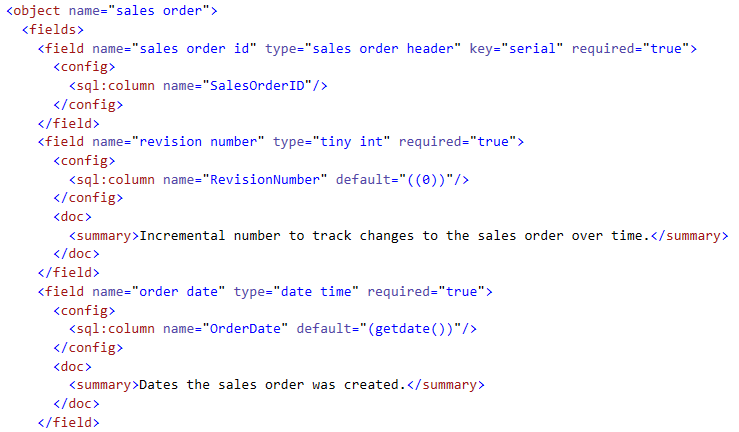
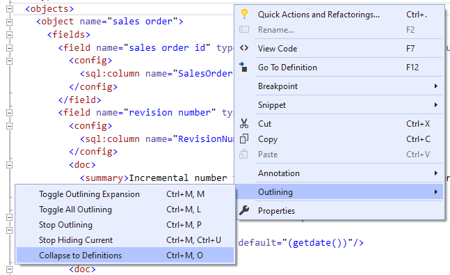
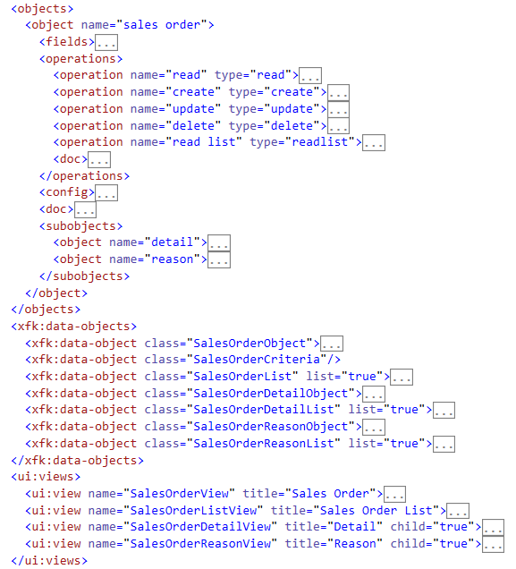
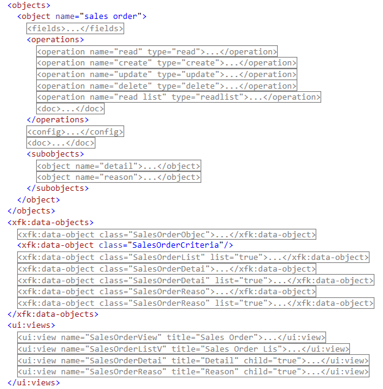

# Outlining and Collapsing

Working with raw XML to browse and edit Xomega models could be a daunting task, even with the syntax highlighting and indentation provided by Visual Studio.

Xomega model supports many nested elements for configuration and documentation of your model elements, which could clutter your view and make it very hard to read as is and to navigate around your model, as illustrated by the following picture.

Xomega.Net editor alleviates this pain and makes working with XML models so much easier by allowing them to collapse to definitions, and by improving the default Visual Studio outlining, as described below.

## Collapsing to definitions

Collapsing to definition, which is a common feature in many Visual Studio languages, allows you to collapse the model XML elements to the model definitions with just a single click or a `Ctrl+M, O` shortcut, as shown below.

As a result, you can easily browse the structure of the XML model right in the editor and then expand only the nodes you are interested in, without cluttering your view with irrelevant information. When collapsed to definitions, the model would look as follows.

In fact, each Xomega model file is initially open being collapsed to definitions to allow you to quickly and easily get to the right part and expand the nodes you are interested in.

:::info
You can configure which elements are collapsed or expanded when you collapse to definitions in the underlying XSD schema.
:::

:::note
You can also, of course, expand all nodes to view the raw XML or stop outlining altogether using some of the other *Outlining* menu options.
:::

## User-friendly outlining

As you may have noticed in the previous section, the Xomega outlining collapses the XML nodes starting with the child nodes so that the tag name and element's attributes remain clearly visible on the screen.

This improves the document readability as compared to the standard XML outlining in Visual Studio 2008 and up, where the whole element is collapsed with no color coding of the tags and attributes, and where attribute names and values can get truncated, as illustrated below.

:::info
In fact, Xomega Editor is just doing the XML outlining the way it was done in Visual Studio 2005, which should be familiar to those, who have used Visual Studio long enough.
:::