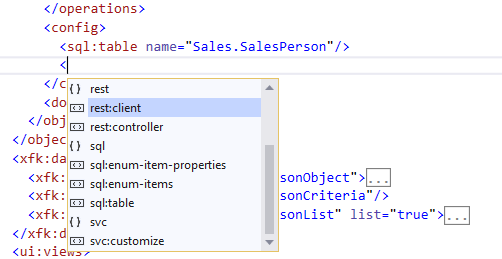
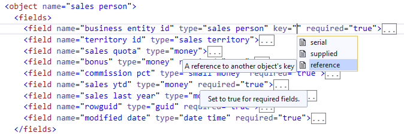
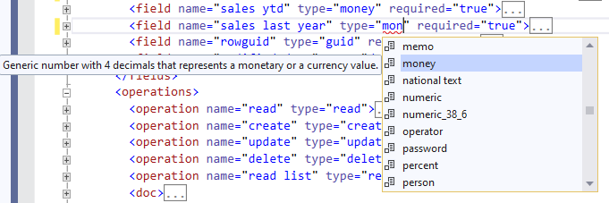
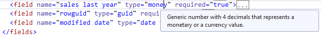

# IntelliSense and Descriptions

To help you edit Xomega models, Xomega Editor provides IntelliSense and tooltip descriptions for both model structures, based on the underlying XSD schemas, as well as for specific values that reference various elements defined in your Xomega model itself.

## Schema-based IntelliSense

The structure of the Xomega models is defined by extensible XSD schemas, which govern what elements and attributes are allowed in the model within each element, what order these elements go in, the types of allowed values, as well as specific enumerations for attributes that allow values only from a strict list.

The core model is defined in the `http://www.xomega.net/omodel` namespace, but any technology-specific extensions, including custom ones, are defined in separate namespaces, which would require their own prefix, e.g. `xmlns:ui="http://www.xomega.net/ui"`.

For both core and extension schemas, Xomega Editor provides IntelliSense that allows you to select the allowed element or attribute names, as well as allowed enumerated values, from a dropdown list, as follows.



:::note
It should be familiar to you since this is standard for any schema-based XML that you edit with the regular Visual Studio editor.
:::

:::tip
The IntelliSense dropdown will appear as you type. To explicitly bring it up, you can also press `Ctrl+Space`.
:::

### Schema-based descriptions

In addition, the schemas may contain documentation for some XML elements, attributes, or allowed values, as well as for their types.

By default, the Xomega editor will display this documentation in a tooltip for the corresponding element the same way the standard Visual Studio XML editor does, as illustrated below.



:::note
The tooltip will also include documentation on the element's or attribute's type, if it's available in the model.
:::

:::tip
Viewing the XSD descriptions by hovering over the corresponding element or attribute will help you easily edit your models, and minimize the need to look it up in the documentation.
:::

## Model-based IntelliSense

In addition to the standard schema-based XML IntelliSense, Xomega Editor also allows dynamic suggestions that are based on the values defined in the model itself.

For example, whenever you need to reference a Xomega type, you can press `Ctrl+Space` to drop down a list of types defined in the model with the selection positioned at the entry that best matches your input so far, as follows.



:::note
This should be also familiar to you, as it is similar to suggesting classes or properties when editing C# files in Visual Studio.
:::

### Model-based descriptions

To help reduce errors, the tooltip for the selected record also shows the description of the current type (or any other model entity being referenced), similar to the schema-based descriptions that we discussed above.

You can see this tooltip both when you select the value from the dropdown list, which helps you pick the right value, as well as by hovering over the specific reference to the model element, as follows.



This description is taken from the documentation tag that you specify on your model entity, as illustrated below.

```xml title="base_types.xom"
<type name="money" base="decimal">
  <config>
    <sql:type name="money" db="sqlsrv"/>
    <xfk:property class="MoneyProperty" namespace="Xomega.Framework.Properties" tsModule="xomega"/>
    <ui:display-config typical-length="12"/>
  </config>
  <usage generic="true"/>
<!-- highlight-start -->
  <doc>
    <summary>Generic number with 4 decimals that represents a monetary or a currency value.</summary>
  </doc>
<!-- highlight-end -->
</type>
```

:::note
This is also similar to showing descriptions from the `<doc>` comments for classes or properties in C# files.
:::

:::tip
Providing good documentation for your model elements will go a long way, as it will allow you to define easy-to-understand, logical models, and will minimize any errors when building your models.

You can also leverage this model documentation to generate technical design docs from your model.
:::
