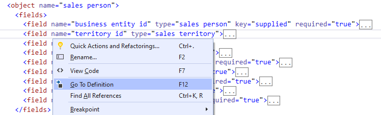
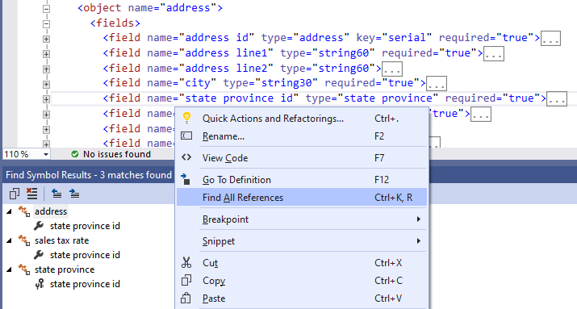
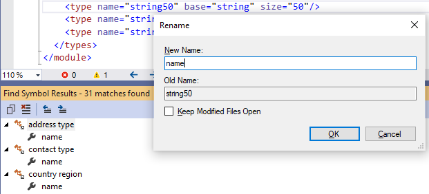

# Navigation and Refactoring

Xomega Editor provides a set of familiar navigation and refactoring features for Xomega models that help you browse and edit the models, as described below.

## Going to the definition

This feature should be familiar to you from other Visual Studio languages by pressing `F12` or selecting the *Go To Definition* menu, and allows you to quickly navigate to the definition of the referenced entity under the cursor.

For example, if you right-click on the `sales territory` type on the field `territory id`, and select *Go To Definition* menu, as shown below, Xomega Editor will take you to the definition of the `sales territory` type in another `.xom` file.

This is useful, for example, if you want to view the details of the type definition you are using for a field or as a base type. Or when you have a reference to a structure, data object or any other entity defined in the model, and want to go to its definition.

:::tip
You can then navigate back via the standard Visual Studio action *Navigate Backward*, or with the `Ctrl+-` shortcut.
:::

## Finding all references

Finding all model references to the entity under the cursor is another standard Visual Studio action, which you can invoke using the *Find All References* context menu or the corresponding shortcut, e.g. `Shift+F12` or `Ctrl+K, R`. It displays the references in a concise and easy to read form in the standard *Find Symbol Results* window.

:::tip
You don't necessarily need to be on the actual definition of the model entity to find all the references. You can also invoke it from any other place where it's referenced.
:::

For example, if you right-click on the `state province` type on the `state province id` field of the `address` object, and select the *Find All Reference* menu, then you'll see all the fields and keys that use that type in the *Find Symbol Results* window, including the one you just clicked on, as illustrated below.

This helps you better understand the structure of your model and dependencies between different model elements, as well as to easily refactor your model, as you can see below.

## Renaming model entities

Xomega Editor allows you to rename model entities and automatically update all the references using a standard Visual Studio action, which you can invoke by selecting *Rename* context menu of by using the `F2` shortcut. It will show all references that will be updated in the *Find Symbol Results* window, and will pop up a *Rename* dialog, where you can supply a new name for the entity.

This can help you build models that are easier to navigate and understand, which will result in improved productivity and fewer errors.

:::tip
It becomes especially useful if you start building your model by importing it from a database. The system will generate the necessary types which will be automatically named based on the database metadata. However, you'll find it useful to give them more logical names.
:::

For example, most of the fields that represent some kind of a name in `AdventureWorks` model are of length 50, and hence are imported with a type `string50`. You may want to rename this type to be `name`, so that when developers are adding another field that is a name, they will more likely use this type, and therefore keep it consistent with the other names, as illustrated below.

:::caution
If you don't explicitly specify a table name for a domain object, it will be derived from the object's fully qualified name. So, renaming an object would effectively result in renaming the underlying table, which may or may not be intended.

If you also generate a DB change script after that, it may also result in some issues, where the original table will be dropped, and a new table will be added, instead of just renaming the original table.
:::