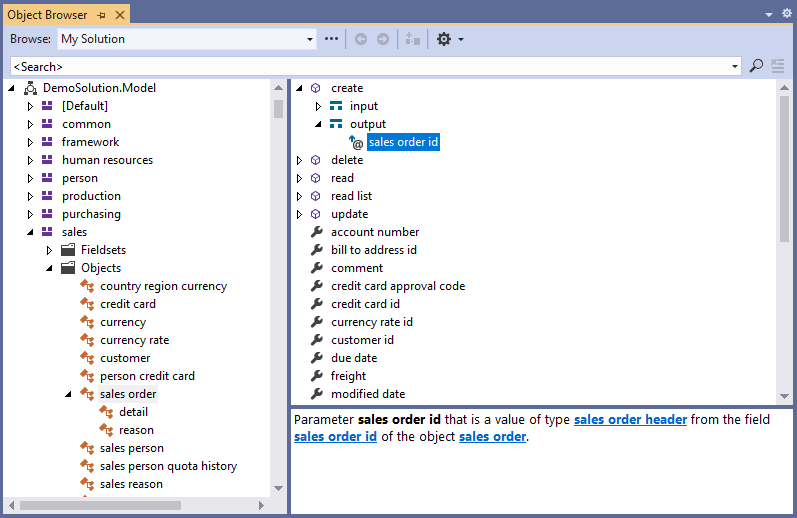

# Browsing Model Entities

If you organize your model entities with each domain object in its own `.xom` file grouped in folders by module, then it will make it easier to browse the model right in the *Solution Explorer* as part of the model project.

You can also use the standard Visual Studio *Find in Files* dialog to search the XML model by any text or regular expression. If you have a specific model file open, you can use the Xomega navigation features to *Go To Definition* or to *Find All References*, as we described earlier.

However, if you want to browse a concise view of model entities, then you can use the *Object Browser* view for your Xomega solution, which allows you to browse the logical structure of the model rather than the physical files.

:::note
You can also browse it in other Visual Studio views, such as the *Class View* or *Resource View*, but those will provide more limited functionality.
:::

## Object Browser view

Object Browser view allows browsing the object model via standard Visual Studio tools, navigating between the model entities, and locating selected elements in the Xomega Editor.

The model entities are organized in a tree view under the model project by their respective modules and the types of entities, e.g. *Objects*, *Types*, *Fieldsets*, etc. Elements that have no module will be grouped under the `[Default]` tree node.

The *Members* pane on the right will display the fields of the currently selected object, as well as the operations with their input and output structures, as illustrated below.

The details pane at the bottom shows a generated description of the selected element in the *Members* pane, as well as its documentation from the model. The generated description will contain navigation links to the related model elements within the *Object Browser*.

:::tip
You can navigate directly to the corresponding XML definition of the currently selected element by double-clicking on it.

You can also view all references to the selected entity right from the *Object Browser* view.
:::