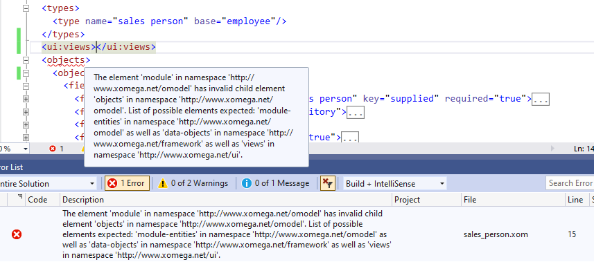
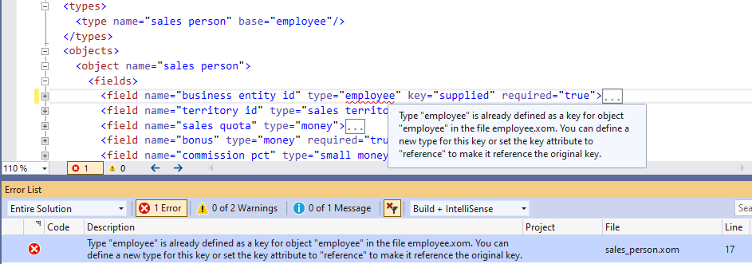

# Model Validations

When you edit Xomega models with a Xomega.Net editor, they will be validated for being a well-formed XML, for adhering to the corresponding XSD schemas, and for the specific validation rules that are defined for Xomega models, as described below.

:::caution
Generally, you will not be able to run any generators on a model that has validation errors. However, you can still run them, if there are only warnings, which will be displayed when you run the generators.
:::

## Standard XML validations

The standard XML validations are available in Visual Studio for any XML file, even when using a standard XML editor. Xomega.Net editor performs the same validations of Xomega model files for well-formed XML, as well as against the defined XSD schemas that specify the allowed elements and attributes, the order of the elements, and allowed values, where appropriate.

For example, the top-level elements under the root `module` element should go in a specific order, which helps you keep your model files well organized and minimizes the issues with merging and conflicts.

If you add elements out of order, you will get a validation error both in the tooltip of the underlined element and in the *Error List* window, as illustrated below.

:::tip
These error messages use standard texts, which at times may not be all that user-friendly. Besides deciphering the issue from the text, you can consult the structure of the underlying XSD, or the documentation for the specific elements.
:::

## Custom model validations

In addition to standard XML validations, Xomega Editor validates the model against a number of logical rules, which would be hard or impossible to express in the XSD. These rules are designed to keep the model consistent and clean to save developers from costly troubleshooting of model errors in the generated artifacts.

Just like with the standard validations, Xomega Editor will highlight the invalid element, attribute or value, and will show the validation message both as a tooltip, and in the *Error List* window, as follows.

:::tip
The custom validation errors and warnings are typically very **detailed and user-friendly**, and usually advise you on how to deal with them.
:::

## Validating the entire model

While Xomega Editor shows validation errors only for the currently open file, you can also validate the entire model to see validation errors and warnings in all model files. To do that you can right-click on the model project, and select the *Validate* option, or pick the *Project > Validate* menu when the model project is selected.

:::info
The validation will happen automatically whenever you run any generators, so this standalone option is useful when you don't want to run any generators.
:::

As you can see from the pictures above, the validation errors and warnings in the *Error List* window specify the file name and the line number. You can double-click on the error message to open the file and navigate to that line in error.