# Enhancing model editor

Once you [extend the Xomega model](model) with your own elements and attributes, you will be able to add the new elements with your custom namespace to the model and use the standard IntelliSense support, validation, and tooltip descriptions in the editor based on your custom XSD schema.

However, Xomega model editor extends the standard XML editor and provides additional features, such as [*Collapse To Definitions*](../editing-models/collapsing), [additional model validations](../editing-models/validation) and [IntelliSense](../editing-models/intellisense#model-based-intellisense), [*Go To Definition*](../editing-models/navigation#going-to-the-definition), [*Find All References*](../editing-models/navigation#finding-all-references) and [*Rename*](../editing-models/navigation#renaming-model-entities), and [Symbol Browsing](../editing-models/symbol-browsing) support. You can **customize all of these features** to include your custom model elements and attributes, as described in the sections below.


:::note
Extending the model and customizing generators requires the **Full license** of the Xomega.Net for Visual Studio.
:::

## Configuring Collapse To Definitions

Xomega model editor allows you to right-click anywhere on the model file and select [*Collapse To Definitions*](../editing-models/collapsing) from the *Outlining* menu, or just press `Ctrl+M, O`, which will collapse "verbose" model elements and leave only the "definition" elements expanded. This allows you to quickly see the overall structure of the model and easily navigate to and expand the definitions you are interested in.

If you add a [new custom element](model#adding-new-entity-types) that represents a large entity definition, e.g. `my:entity`, or a large [extension of an existing element](model#adding-element-extensions), you may want to configure it so that it is also collapsed when you use the *Collapse To Definitions* command, as shown below.

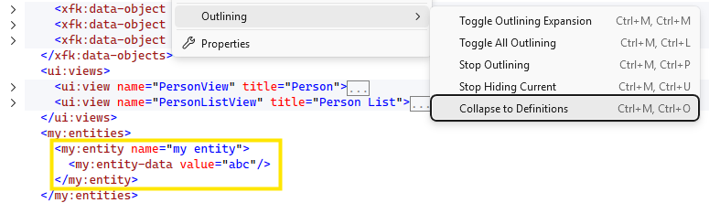

To enable collapsing for your custom element, you just need to add an `xom:outline-definition` annotation to its XSD schema definition using the `urn:xomega-net:language` namespace, and set its `collapse` attribute to one of the following values:
- `true` - the element will be always collapsed when you use the *Collapse To Definitions* command.
- `service` - the element will be collapsed to definition only when the current file has an object with `operation` element. This allows expanding fieldsets, object fields and subobjects when working with the domain model initially, and then having them collapsed when working with service operations.

The following example demonstrates how to configure the `my:entity` element to be collapsed when you use the *Collapse To Definitions* command.

```xml title="Xomega_xMy.xsd"
<xs:schema targetNamespace="http://www.mydomain.net/xomega"
<!-- added-next-line -->
           xmlns:xom="urn:xomega-net:language"
           xmlns:o="http://www.xomega.net/omodel" ...>
  <xs:element name="entities" substitutionGroup="o:module-entities">
    <xs:complexType>
      <xs:complexContent>
        <xs:extension base="o:moduleEntities">
          <xs:sequence>
            <xs:element name="entity" maxOccurs="unbounded">
<!-- added-lines-start -->
              <xs:annotation>
                <xs:appinfo>
                  <xom:outline-definition collapse="true"/>
                </xs:appinfo>
              </xs:annotation>
<!-- added-lines-end -->
              <xs:complexType>[...]
            </xs:element>
          </xs:sequence>
        </xs:extension>
      </xs:complexContent>
    </xs:complexType>
  </xs:element>
</xs:schema>
```

Now, when you use the *Collapse To Definitions* command, all `my:entity` elements will be collapsed as well, while the grouping `my:entities` element will remain expanded, and you will see the following structure in the editor.

```xml
<my:entities>
  <my:entity name="my entity1">[...]
  <my:entity name="my entity2">[...]
</my:entities>
```

:::tip
You can also customize the `xom:outline-definition` annotation for the existing Xomega elements in the default Xomega schemas, but you will need to merge your changes whenever you [upgrade to a new version](model#updating-custom-schemas-on-upgrade) of Xomega SDK.
:::

## Adding model validations

XML schema that you define for your custom model elements and attributes specifies the structure of those elements and attributes, and the XSD validation will ensure that the model conforms to that structure. However, it does not allow you to specify more complex validation rules that your model elements must follow.

For example, you may want to specify that the `name` attribute of your `my:entity` element must be unique across all `my:entity` elements in the model to prevent the user from defining multiple entities with the same name, such as those shown below.

```xml
<my:entities>
  <my:entity name="my entity">[...]
  <my:entity name="my entity">[...]
</my:entities>
```

In this case, you'll want to show a validation error on the second `my:entity` element saying that its `name` attribute value is not unique.

### Customizing model validation

In order to implement custom validation rules for your model, you need to customize the Xomega model validation stylesheet that comes with the Xomega SDK. You can do this by right-clicking on the model project in the Solution Explorer and selecting the *Customize Model > Customize Model Validation* from the context menu as shown below.

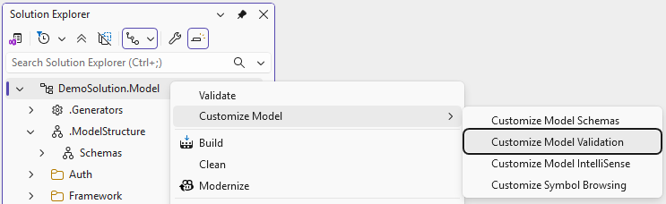

This will add a `validation.xsl` file to your model project under the *.ModelStructure\Stylesheets* folder by default, as shown below.

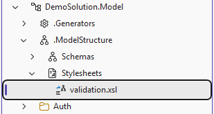

You can also place the `validation.xsl` file in a different location in your project, but you will need to update the `CustomValidationXsl` property and the corresponding `Include` item in the model project file, as illustrated in the example below.

```xml title="DemoSolution.Model.xomproj"
<PropertyGroup>
<!-- removed-next-line -->
  <CustomValidationXsl>$(MSBuildProjectDirectory)\.ModelStructure\Stylesheets\validation.xsl</CustomValidationXsl>
<!-- added-next-line -->
  <CustomValidationXsl>$(MSBuildProjectDirectory)\.MyModelStylesheets\validation.xsl</CustomValidationXsl>
</PropertyGroup>
<ItemGroup>
<!-- removed-next-line -->
  <Template Include=".ModelStructure\Stylesheets\validation.xsl" />
<!-- added-next-line -->
  <Template Include=".MyModelStylesheets\validation.xsl" />
</ItemGroup>
```

### Adding model validation rules

To add a custom  model validation rule, you need to add a new template to the `validation.xsl` file that matches the model elements you want to validate and implements the validation logic. If the validation rule is violated, you can use the `sink:AddError` function to add a validation error for a specific model element or attribute that you pass as the first argument to the function, along with the error message as the second argument.

:::warning
The `validation.xsl` stylesheet uses MS XSL engine and XSLT 1.0 syntax rather than the more advanced XSLT 2.0 and Saxon used in the generators, so you will be restricted to the features available in XSLT 1.0 when implementing your validation logic.
:::

For example, to implement the validation rule that requires the `name` attribute of `my:entity` elements to be unique across the model, you can add the following template to your `validation.xsl` file.

```xml title="validation.xsl"
<xsl:stylesheet version="1.0" xmlns:xsl="http://www.w3.org/1999/XSL/Transform"
<!-- added-next-line -->
        xmlns:my="http://www.mydomain.net/xomega"
        xmlns:o="http://www.xomega.net/omodel" ...>
  <!--
  ====================================================
    Custom entity validation
  ====================================================
  -->
  <xsl:template match="my:entity">
    <!-- check if the entity is already defined -->
    <xsl:variable name="entity" select="preceding::my:entity[@name = current()/@name]"/>
    <xsl:if test="$entity">
<!-- highlight-start -->
      <xsl:value-of select="sink:AddError(@name, concat('Entity &quot;', @name,
                    '&quot; is already defined in the file ', cust:GetFile($entity[1]),
                    '. Please pick a different entity name.'))"/>
<!-- highlight-end -->
    </xsl:if>
  </xsl:template>
</xsl:stylesheet>
```

Now, if you add multiple `my:entity` elements with the same `name` attribute value to your model, you will see a validation error on the `name` attribute of the second and subsequent elements with the same name, as shown below.

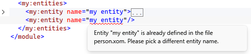

You will also see the same validation error in the Error List both when you are editing the model and when you build the model project, and you can double-click on the error in the Error List to navigate to the corresponding element in the model file.

### Schema type-based validation

In addition to matching specific elements and attributes in the validation templates, you can also use the XML schema types defined in your XSD schemas to apply validation rules to all elements and attributes of a certain type. This allows you to implement more generic validation rules that can be applied to any element or attribute of a specific type, regardless of its name or position in the model.

For example, let's assume that for the `my:entity` elements that you define in your model, as described above, you want to be able to reference them from other elements that you extend in your model, such as from a custom `type` configuration, as shown below.

```xml
<types>
  <type name="person" base="business entity">
    <config>
<!-- highlight-next-line -->
      <my:entity ref="my entity"/>
    </config>
  </type>
</types>
```

The best practice in this case would be to make the `name` attribute of the `my:entity` element use a dedicated simple type, e.g. `entityName`, that extends the standard `o:name` type from the Xomega model schema, and then declare a new simple type `entityRef` that is based on `entityName`, which will be used for the `ref` attribute of the `my:entity` element, as shown below.

```xml title="Xomega_xMy.xsd"
<xs:schema xmlns="http://www.mydomain.net/xomega"
           targetNamespace="http://www.mydomain.net/xomega" ...>
<!-- added-lines-start -->
  <xs:simpleType name="entityName">
    <xs:restriction base="o:name"/>
  </xs:simpleType>
  <xs:simpleType name="entityRef">
    <xs:restriction base="entityName"/>
  </xs:simpleType>
  <xs:element name="entity" substitutionGroup="o:type-extension">
    <xs:complexType>
      <xs:complexContent>
        <xs:extension base="o:typeConfigurationExtension">
          <xs:attribute name="ref" type="entityRef"/>
        </xs:extension>
      </xs:complexContent>
    </xs:complexType>
  </xs:element>
<!-- added-lines-end -->
  ...
    <xs:element name="entity" maxOccurs="unbounded">
        <xs:sequence>[...]
<!-- removed-next-line -->
        <xs:attribute name="name" type="xs:string"/>
<!-- added-next-line -->
        <xs:attribute name="name" type="entityName"/>
    </xs:element>
  ...
</xs:schema>
```

This will allow you to write a schema type-based validation rule in your `validation.xsl` file using the `schema:IsOfType` function that will apply to any attribute of the `entityRef` type, which will validate that the value of the current attribute matches the `name` attribute of an existing `my:entity` element in the model, as shown below.

```xml title="validation.xsl"
<xsl:stylesheet version="1.0" xmlns:xsl="http://www.w3.org/1999/XSL/Transform" ...>
  ...
<!-- added-lines-start -->
  <!-- validate entity to exist -->
  <xsl:template match="@*[schema:IsOfType(., 'entityRef')]">
    <xsl:if test=". and not(//my:entity[@name=current()])">
      <xsl:value-of select="sink:AddError(., concat('Entity &quot;', ., '&quot; is not defined.'))"/>
    </xsl:if>
  </xsl:template>
<!-- added-lines-end -->
</xsl:stylesheet>
```

Now, specifying a `ref` attribute value that does not match the `name` of any existing `my:entity` element in the model will result in a validation error on that attribute, as shown below.

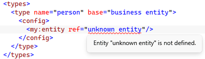

:::tip
You can take a look at the validation logic implemented in the default `validation.xsl` file that comes with the Xomega SDK for more examples of how to implement different types of validation rules for your model.
:::

## Adding IntelliSense support

When your custom model elements have references to other model elements, such as the `ref` attribute of the `my:entity` element in the [example above](#schema-type-based-validation), it would be helpful to provide IntelliSense support for those references in the editor, so that when the user starts typing a reference value, they can see a list of possible values to choose from.

When selecting a value from the IntelliSense list, it would also be helpful to show a tooltip with a description of the referenced element to help the user understand what they are selecting. Once the reference is selected, it would also be helpful to be able to navigate to the definition of the referenced element by using the *Go To Definition* command.

Finally, when an entity defined in the model can be referenced from other elements in the model, it would be helpful to be able to see all the places where that entity is referenced using the *Find All References* command, which can also be used when renaming the entity to automatically update all references to it in the model.

### Customizing IntelliSense rules

In order to implement custom IntelliSense support for your model, you need to customize the Xomega model IntelliSense stylesheet that comes with the Xomega SDK. You can do this by right-clicking on the model project in the Solution Explorer and selecting the *Customize Model > Customize Model IntelliSense* from the context menu as shown below.

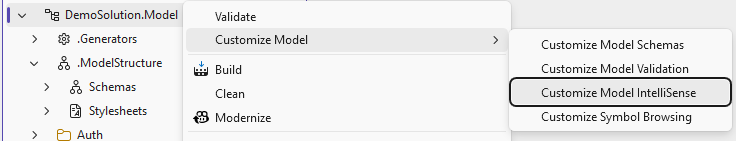

Once you do that, the standard `intellisense.xsl` stylesheet will be added to your model project under the *.ModelStructure\Stylesheets* folder by default, as shown below.

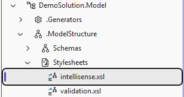

If you don't want to use the default location for the `intellisense.xsl` file, you can place it in a different location in your project, but you will need to update the `CustomIntelliSenseXsl` property and the corresponding `Include` item in the model project file, as illustrated in the example below.

```xml title="DemoSolution.Model.xomproj"
<PropertyGroup>
<!-- removed-next-line -->
  <CustomIntelliSenseXsl>$(MSBuildProjectDirectory)\.ModelStructure\Stylesheets\intellisense.xsl</CustomIntelliSenseXsl>
<!-- added-next-line -->
  <CustomIntelliSenseXsl>$(MSBuildProjectDirectory)\.MyModelStylesheets\intellisense.xsl</CustomIntelliSenseXsl>
</PropertyGroup>
<ItemGroup>
<!-- removed-next-line -->
  <Template Include=".ModelStructure\Stylesheets\intellisense.xsl" />
<!-- added-next-line -->
  <Template Include=".MyModelStylesheets\intellisense.xsl" />
</ItemGroup>
```

:::warning
Just like with the `validation.xsl` file, the `intellisense.xsl` stylesheet also uses MS XSL engine and XSLT 1.0 syntax, so you will be restricted to the features available in XSLT 1.0 when implementing your IntelliSense logic.
:::

### Providing possible values

Now that you have the `intellisense.xsl` file in your project, it's quite easy to add custom IntelliSense rules that will provide possible values for the attributes of your custom model elements based on the existing model content.

You just need to update the main template that matches the root of the model (`match="/"`) for your custom namespace that handles the `get-decl` command for the specific attribute type. To display the possible values in the IntelliSense dropdown, you just build a list of `member` elements with the `name` attribute that will be shown in the dropdown, and then pass that list to the `decl:AddMembers` function.

The following example demonstrates how to provide possible values for the `ref` attribute of the `my:entity` extension element for a type configuration that we described above using the names of the custom entities declared in the model. 

```xml title="intellisense.xsl"
<xsl:stylesheet version="1.0" xmlns:xsl="http://www.w3.org/1999/XSL/Transform"
<!-- added-next-line -->
        xmlns:my="http://www.mydomain.net/xomega"
        xmlns:o="http://www.xomega.net/omodel" ...>
  <xsl:template match="/">
    ...
<!-- added-lines-start -->
    <xsl:if test="$attrTypeNs='http://www.mydomain.net/xomega'">
      <xsl:choose>
        <xsl:when test="$command='get-decl' and $attrType='entityRef'">
          <xsl:variable name="members">
            <xsl:for-each select="//my:entities/my:entity[@name != '']">
              <member name="{@name}" glyph="Class"/>
            </xsl:for-each>
          </xsl:variable>
          <xsl:value-of select="decl:AddMembers(msxsl:node-set($members)/member)"/>
        </xsl:when>
      </xsl:choose>
    </xsl:if>
<!-- added-lines-end -->
  </xsl:template>
</xsl:stylesheet>
```

The `member` elements that you build in the `get-decl` command can also include a `glyph` attribute that specifies the icon to be shown next to the value in the IntelliSense dropdown. You can use one of the following standard glyph names that are supported by Xomega model editor.
- `Class`, `Class_Shortcut`, `IFrame`
- `Enum`, `Enum_Shortcut`, `EnumItem`, `EnumItem_exp`, `EnumItem_Shortcut`
- `InputParameter`, `OutputParameter`
- `KeyDown`, `KeyOutput`, `UniqueKey`
- `Method`, `Method_Shortcut`
- `Module`, `Module_Shortcut`
- `Attribute`, `ComplexProperty`
- `Property`, `Property_Shortcut`, `PropertyWKey`
- `Structure`, `Structure_Shortcut`
- `TypeDefinition`, `TypeDefinition_Shortcut`

Now, when you start typing a reference to an entity in the `ref` attribute of the `my:entity` type config element and press `Ctrl+Space` to open the IntelliSense dropdown, you will see the list of currently defined entities in the model with the specified Class glyph next to them, as shown below.

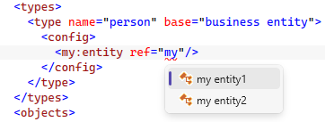

:::note
Auto-completion based on Github Copilot or similar AI tools can also suggest possible values for your custom attributes based on the existing model content, but implementing custom IntelliSense rules as described above allows you to have more control over the values that are shown in the dropdown and to provide additional information such as icons and descriptions for those values.
:::

### Providing description tooltips

When selecting a value from the IntelliSense dropdown, the name alone may not always provide enough information to allow you to make the right selection, especially if there are multiple similar values to choose from. It would be helpful in this case to also show a description of each value in a tooltip when it is selected in the dropdown. Similarly, when hovering over a reference to an entity in the model, it would be helpful to see a tooltip with a description of the referenced entity without having to navigate to its definition.

The description for the entities can come from the documentation elements specified in the model for those entities. For example, you can add a standard `o:doc` documentation element from the Xomega model schema as a child of your `my:entity` element in the model to allow capturing any documentation for that entity, as shown below.

```xml title="Xomega_xMy.xsd"
<xs:element name="entity" maxOccurs="unbounded">
  <xs:annotation>[...]
  <xs:complexType>
    <xs:sequence>
      <xs:element name="entity-data" minOccurs="0" maxOccurs="unbounded">[...]
<!-- added-next-line -->
      <xs:element ref="o:doc" minOccurs="0" maxOccurs="1"/>
    </xs:sequence>
    <xs:attribute name="name" type="entityName"/>
  </xs:complexType>
</xs:element>
```

This will allow you to specify a description for each `my:entity` element in the model using the `o:doc/o:summary` element, as shown below.

```xml
<my:entities>
  <my:entity name="my entity1">
    <my:entity-data value="value1"/>
<!-- added-lines-start -->
    <doc>
      <summary>Description of my entity1</summary>
    </doc>
<!-- added-lines-end -->
  </my:entity>
  <my:entity name="my entity2">
    <my:entity-data value="value2"/>
<!-- added-lines-start -->
    <doc>
      <summary>Description of my entity2</summary>
    </doc>
<!-- added-lines-end -->
  </my:entity>
</my:entities>
```

To show the description of each entity in the tooltip when it is selected in the IntelliSense dropdown, you can update your `intellisense.xsl` file to add the `description` attribute to the `member` elements that you build for the dropdown, and set its value to the content of the `o:doc/o:summary` element for each entity, as follows.

```xml title="intellisense.xsl"
<xsl:if test="$attrTypeNs='http://www.mydomain.net/xomega'">
  <xsl:choose>
    <xsl:when test="$command='get-decl' and $attrType='entityRef'">
      <xsl:variable name="members">
        <xsl:for-each select="//my:entity[@name != '']">
<!-- removed-next-line -->
          <member name="{@name}" glyph="Class"/>
<!-- added-next-line -->
          <member name="{@name}" glyph="Class" description="{o:doc/o:summary}"/>
        </xsl:for-each>
      </xsl:variable>
      <xsl:value-of select="decl:AddMembers(msxsl:node-set($members)/member)"/>
    </xsl:when>
  </xsl:choose>
</xsl:if>
```

With this change, when you select an entity from the IntelliSense dropdown, you will see a tooltip with the description of that entity that is specified in the model, as shown below.

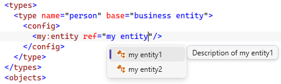

If you want to show the same description tooltip when hovering over a reference to an entity in the model, you can also add a handler for the `get-desc` command for the same attribute type in your `intellisense.xsl` file that will return the description for the currently referenced entity, as shown below.

```xml title="intellisense.xsl"
<xsl:if test="$attrTypeNs='http://www.mydomain.net/xomega'">
  <xsl:choose>
    <xsl:when test="$command='get-decl' and $attrType='entityRef'">[...]
<!-- added-lines-start -->
    <xsl:when test="$command='get-desc' and $attrType='entityRef'">
      <xsl:value-of select="//my:entity[@name=$value]/o:doc/o:summary"/>
    </xsl:when>
<!-- added-lines-end -->
  </xsl:choose>
</xsl:if>
```

Now, when you hover over a reference to an entity in the model, you will see a tooltip with the description of the referenced entity, as illustrated below.

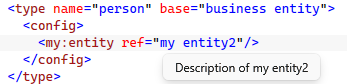

You can also return more detailed descriptions for your entities in the `get-desc` command, e.g. by including the full content of the `o:doc` element, so that the tooltip could be even more informative.

### Implementing Go To Definition

When you have references to other model elements in your model, especially located in different files or modules, it would be extremely helpful to be able to navigate to the definition of the referenced element by pressing `F12` or using the *Go To Definition* context menu, as illustrated below.

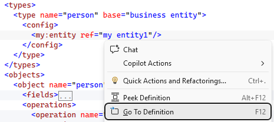

You can implement this functionality in your `intellisense.xsl` file by adding a handler for the `goto-defn` command for the specific attribute type that will find the referenced entity by its name and call the `decl:GoTo` function passing the entity element as an argument, as shown below.

```xml title="intellisense.xsl"
<xsl:if test="$attrTypeNs='http://www.mydomain.net/xomega'">
  <xsl:choose>
    <xsl:when test="$command='get-decl' and $attrType='entityRef'">[...]
    <xsl:when test="$command='get-desc' and $attrType='entityRef'">[...]
<!-- added-lines-start -->
    <xsl:when test="$command='goto-defn' and $attrType='entityRef'">
      <xsl:value-of select="decl:GoTo(//my:entities/my:entity[@name=$value][1])"/>
    </xsl:when>
<!-- added-lines-end -->
  </xsl:choose>
</xsl:if>
```

:::tip
You can review the default `intellisense.xsl` file that comes with the Xomega SDK for any additional examples of how to implement custom IntelliSense rules for your model.
:::

## Viewing references and renaming

In addition to enhancing model validation and IntelliSense support for your custom model elements, you can also implement *Find All References* and *Rename* support for those elements in the editor. This will allow you to easily see all the places where a particular entity is referenced in the model, and to automatically update all those references when renaming that entity.

And finally, you can also enhance the symbol browsing support to be able to show your custom entities with their properties in the Object Browser window.

### Customizing symbol browsing

To provide support for viewing references and renaming for your custom model elements, you need to customize the Xomega model symbol browsing stylesheet that comes with the Xomega SDK. You can do this by right-clicking on the model project in the Solution Explorer and selecting the *Customize Model > Customize Symbol Browsing* from the context menu as shown below.

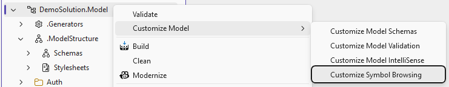

This will add a `symbol_browsing.xsl` file to your model project under the *.ModelStructure\Stylesheets* folder by default, as shown below.

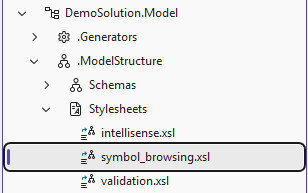

If you don't want to use the default location for the `symbol_browsing.xsl` file, you can place it in a different location in your project, but you will need to update the `CustomSymbolBrowsingXsl` property and the corresponding `Include` item in the model project file, as illustrated in the example below.

```xml title="DemoSolution.Model.xomproj"
<PropertyGroup>
<!-- removed-next-line -->
  <CustomSymbolBrowsingXsl>$(MSBuildProjectDirectory)\.ModelStructure\Stylesheets\symbol_browsing.xsl</CustomSymbolBrowsingXsl>
<!-- added-next-line -->
  <CustomSymbolBrowsingXsl>$(MSBuildProjectDirectory)\.MyModelStylesheets\symbol_browsing.xsl</CustomSymbolBrowsingXsl>
</PropertyGroup>
<ItemGroup>
<!-- removed-next-line -->
  <Template Include=".ModelStructure\Stylesheets\symbol_browsing.xsl" />
<!-- added-next-line -->
  <Template Include=".MyModelStylesheets\symbol_browsing.xsl" />
</ItemGroup>
```

:::warning
Just like with the `validation.xsl` and `intellisense.xsl` files, the `symbol_browsing.xsl` stylesheet also uses MS XSL engine and XSLT 1.0 syntax, so you will be restricted to the features available in XSLT 1.0 when implementing your symbol browsing logic.
:::

### Implementing Find All References

When you add a custom entity to your model that can be referenced from other elements in the model, you want to be able to easily see all the places where that entity is referenced in the model by pressing `Shift+F12` or using the *Find All References* context menu.

To implement this functionality, you first need to enable reference support for specific elements in the XSD schema, and then implement the logic in the `symbol_browsing.xsl` file to find those references and display them in the *Find All References* window in Visual Studio.

#### Finding references for the `name` attribute of `my:entity`

The first most obvious place where you would want to enable reference support is when the user right-clicks on the `name` attribute of a `my:entity` element. To enable the *Find All References* context menu for that attribute, you can update the schema type `entityName` used by the `name` attribute to add the `xom:definition` annotation with the `supports-references` attribute set to `true`, as shown below.

```xml title="Xomega_xMy.xsd"
<xs:simpleType name="entityName">
<!-- added-lines-start -->
  <xs:annotation>
    <xs:appinfo>
      <xom:definition supports-references="true"/>
    </xs:appinfo>
  </xs:annotation>
<!-- added-lines-end -->
  <xs:restriction base="o:name"/>
</xs:simpleType>
```

Next, you need to implement the logic in the `symbol_browsing.xsl` file by adding a new template that matches the `name` attribute of the `my:entity` element in the `refs` mode, which will find all the type configurations in the model that reference that entity and add them to the references list using the `lib:AddNewNode` function that returns the index of the newly added reference.

 Using that index, you need to set the name and the image (from those listed [here](#providing-possible-values)) for that reference using the `lib:SetName` and `lib:SetImageKey` functions, and also set the source context for that reference using the `lib:SetSourceContext` function so that when the user double-clicks on that reference in the *Find All References* window, they will be navigated to the correct place in the model file where that reference is located.

 For the references from the type configurations, you can use the `TypeDefinition_Shortcut` glyph as the reference image and set the the label to be the type name, assuming that the users can infer that it's a type definition from the image, as shown in the example below.

```xml title="symbol_browsing.xsl"
<xsl:stylesheet version="1.0" xmlns:xsl="http://www.w3.org/1999/XSL/Transform"
<!-- added-next-line -->
        xmlns:my="http://www.mydomain.net/xomega"
        xmlns:o="http://www.xomega.net/omodel" ...>
<!-- added-lines-start -->
  <xsl:template match="my:entity/@name" mode="refs">
    <xsl:variable name="this" select="ancestor::my:entity[1]"/>
    <xsl:for-each select="//o:type[o:config/my:entity/@ref=$this/@name]">
      <xsl:variable name="idx" select="lib:AddNewNode($lstCls)"/>
      <xsl:value-of select="lib:SetName($idx, @name)"/>
      <xsl:value-of select="lib:SetImageKey($idx, 'TypeDefinition_Shortcut')"/>
      <xsl:value-of select="lib:SetSourceContext($idx, o:config/my:entity/@ref)"/>
    </xsl:for-each>
  </xsl:template>  
<!-- added-lines-end -->
</xsl:stylesheet>
```

Now, when you right-click on the `name` attribute of a `my:entity` element and select *Find All References*, you will see a list of all the type configurations that reference that entity in the *Find All References* window, and when you double-click on any of those references, you will be navigated to the corresponding `ref` attribute in the model file, as shown below.

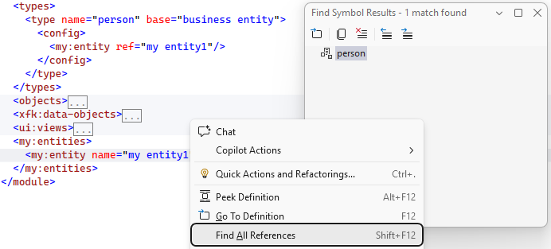

:::warning
If you add **references to standard Xomega elements** such as `o:type` in your custom model extensions, you will need to **update the existing templates** in the `symbol_browsing.xsl` file that handle references to those standard elements, so that they also display your custom elements as references.
:::

#### Finding references for the `my:entity` element

Making the user right-click only on the `name` attribute of the `my:entity` element to find references to that entity is not very intuitive. It would be more natural to also allow the user to right-click on the `my:entity` element itself to find references to that entity.

To enable the *Find All References* context menu for the `my:entity` element itself, you can add the same `xom:definition` annotation with the `supports-references` attribute set to `true` to the `my:entity` element declaration in the XSD schema, as shown below.

```xml title="Xomega_xMy.xsd"
<xs:element name="entity" maxOccurs="unbounded">
  <xs:annotation>
    <xs:appinfo>
      <xom:outline-definition collapse="true"/>
<!-- added-next-line -->
      <xom:definition supports-references="true"/>
    </xs:appinfo>
  </xs:annotation>
  <xs:complexType>[...]
</xs:element>
```

Next, you need to update the template in the `symbol_browsing.xsl` file to match both the `my:entity` element and its `name` attribute in the `refs` mode, and update the variable that selects the current entity to also handle both cases, as shown below.

```xml title="symbol_browsing.xsl"
<!-- removed-next-line -->
  <xsl:template match="my:entity/@name" mode="refs">
<!-- added-next-line -->
  <xsl:template match="my:entity[@name] | my:entity/@name" mode="refs">
<!-- removed-next-line -->
    <xsl:variable name="this" select="ancestor::my:entity[1]"/>
<!-- added-next-line -->
    <xsl:variable name="this" select="ancestor-or-self::my:entity[1]"/>
    ...
  </xsl:template>  
```

#### Finding references for `ref` attributes

If you want to be able to find references to an entity not only from the `name` attribute of the `my:entity` element, but also from any `ref` attribute of any element that references that entity, you can also add the `xom:definition` annotation with the `supports-references` attribute set to `true` to the `entityRef` simple type in the XSD schema, as follows.

```xml title="Xomega_xMy.xsd"
<xs:simpleType name="entityRef">
<!-- added-lines-start -->
  <xs:annotation>
    <xs:appinfo>
      <xom:definition supports-references="true"/>
    </xs:appinfo>
  </xs:annotation>
<!-- added-lines-end -->
  <xs:restriction base="entityName"/>
</xs:simpleType>
```

To update the `symbol_browsing.xsl` logic for this case, you can add a new template that matches the `my:entity/@ref` attribute in the `refs` mode, which will find the referenced entity by its name and apply the existing template to it, as shown below.

```xml title="symbol_browsing.xsl"
<!-- added-lines-start -->
  <xsl:template match="my:entity/@ref" mode="refs">
    <xsl:apply-templates select="//my:entities/my:entity[@name=current()]" mode="refs"/>
  </xsl:template>
<!-- added-lines-end -->
  <xsl:template match="my:entity[@name] | my:entity/@name" mode="refs">[...]
```

### Adding Rename support

Closely related to the *Find All References* functionality is the *Rename* support that requires finding all references to a particular entity in the model and updating those references along with the entity itself with the new name. Renaming an entity via the Xomega model editor requires clicking on the `name` attribute of the `my:entity` element and then pressing `Ctrl+R, Ctrl+R` to pop up the Rename dialog.

:::warning
There is **no context menu** option for popping up the Rename dialog, so you have to **use the `Ctrl+R, Ctrl+R` shortcut**.
:::

To enable support for renaming an entity, you can add the `supports-rename` attribute to the `xom:definition` annotation for the `entityName` simple type that is used for the `name` attribute of the `my:entity` element, as shown below.

```xml title="Xomega_xMy.xsd"
<xs:simpleType name="entityName">
  <xs:annotation>
    <xs:appinfo>
<!-- removed-next-line -->
      <xom:definition supports-references="true"/>
<!-- added-next-line -->
      <xom:definition supports-references="true" supports-rename="true"/>
    </xs:appinfo>
  </xs:annotation>
  <xs:restriction base="o:name"/>
</xs:simpleType>
```

Next, you need to implement the rename logic in the `symbol_browsing.xsl` file by adding a new template that matches the `name` attribute of the `my:entity` element in the `rename` mode, which will find all the references to that entity, including the `name` attribute itself and any `ref` attributes that reference that entity, and pass them to the `lib:SetRenameNodes` function, as shown below.

```xml title="symbol_browsing.xsl"
<!-- added-lines-start -->
  <xsl:template match="my:entity/@name" mode="rename">
    <xsl:value-of select="lib:SetRenameNodes(. | //my:entity[@ref=current()]/@ref)"/>
  </xsl:template>
<!-- added-lines-end -->
```

Now, when you click on the `name` attribute of a `my:entity` element and press `Ctrl+R, Ctrl+R`, you will see the Rename dialog that shows the original name of the entity and allows you to enter a new name for that entity, as shown below.

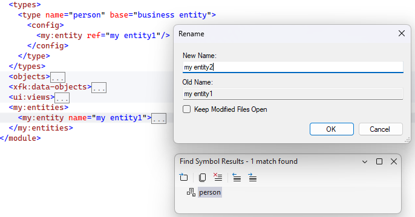

The dialog will also open up a Find Symbol Results window that shows all the places where that entity is referenced in the model, so that you can review those references before confirming the rename operation.

Once you click the *OK* button in the Rename dialog, the entity will be renamed to the new name that you entered, and all references to that entity in the model will also be updated with the new name.

### Enhancing Symbol Browsing

The bulk of the `symbol_browsing.xsl` logic is related to the Symbol Browsing support that allows you to see your model elements and their structure in the Object Browser window in Visual Studio.

The default model structure first groups all entities by their module, and places entities with no module under the `[Default]` node. Within each module, entities are grouped in folders by their type, e.g. Types, Fieldsets, Objects, etc. For each entity, you can view its properties or members on the right-side pane when you select that entity. The bottom right pane also shows the description of the selected entity or member with any appropriate links to other entities, as illustrated in the following screenshot.

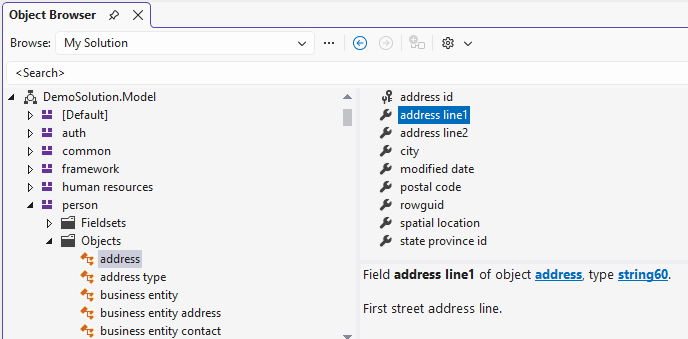

You can enhance the Symbol Browsing support for your custom model elements by adding new templates to the `symbol_browsing.xsl` file, but the **implementation** of those templates can be **quite complex**.

Essentially, you need to build a hierarchical structure for the Object Browser using a Xomega wrapper of the VS library API by adding one layer of nodes at a time, starting from the top-level nodes for your custom entities, and then adding child nodes for the properties of those entities, and so on.

#### Adding `My Entities` node

First, you can start by adding a folder `My Entities` under each module, including the `[Default]` module, that will contain custom entities defined in that module. To do that, you need to update the main template that matches `o:module` to select the corresponding `my:entities` element under the current module and add it to the list that is passed to the `lib:SetChildContext` function, as follows.

```xml title="symbol_browsing.xsl"
<!-- highlight-next-line -->
<xsl:template match="o:module">
  <xsl:when test="not(@name) or @name=''">
    ...
<!-- added-next-line -->
    <xsl:variable name="entities" select="//o:module[not(@name) or @name='']/my:entities"/>
<!-- removed-next-line -->
    <xsl:value-of select="lib:SetChildContext($idx, $types[1] | $fieldsets[1] | $enums[1] | $structs[1] | $objects[1])"/>
<!-- added-next-line -->
    <xsl:value-of select="lib:SetChildContext($idx, $types[1] | $fieldsets[1] | $enums[1] | $structs[1] | $objects[1] | $entities[1])"/>
    ...
  </xsl:when>
  <xsl:otherwise>
    ...
<!-- added-next-line -->
    <xsl:variable name="entities" select="//o:module[@name=current()/@name]/my:entities"/>
<!-- removed-next-line -->
    <xsl:value-of select="lib:SetChildContext($idx, $types[1] | $fieldsets[1] | $enums[1] | $structs[1] | $objects[1])"/>
<!-- added-next-line -->
    <xsl:value-of select="lib:SetChildContext($idx, $types[1] | $fieldsets[1]  | $enums[1] | $structs[1] | $objects[1] | $entities[1])"/>
    ...
  </xsl:otherwise>
</xsl:template>
```

Next, you need to add a new template that matches the `my:entities` element, call the `lib:AddNewNode` function to add a new node and get its index, and then set the name to `My Entities`, image to `Folder`, set category, and build the description conditionally using the `lib:AddDescription` function, as shown below.

```xml
<xsl:template match="my:entities">
<!-- highlight-start -->
  <xsl:variable name="idx" select="lib:AddNewNode($lstNs)"/>
  <xsl:value-of select="lib:SetName($idx, 'My Entities')"/>
  <xsl:value-of select="lib:SetCategory($idx, $catLst, $lstMbr)"/>
  <xsl:value-of select="lib:SetImageKey($idx, 'Folder')"/>
  <xsl:value-of select="lib:AddDescription($idx, 'Entities defined ', $descMisc)"/>
<!-- highlight-end -->
  <xsl:choose>
    <xsl:when test="not(../@name) or ../@name=''">
<!-- highlight-next-line -->
      <xsl:value-of select="lib:SetChildContext($idx, //o:module[not(@name) or @name='']/my:entities/my:entity)"/>
      <xsl:value-of select="lib:AddDescription($idx, 'outside of any module', $descMisc)"/>
    </xsl:when>
    <xsl:otherwise>
<!-- highlight-next-line -->
      <xsl:value-of select="lib:SetChildContext($idx, //o:module[@name=current()/../@name]/my:entities/my:entity)"/>
      <xsl:variable name="modPath">
        <xsl:apply-templates select=".." mode="path"/>
      </xsl:variable>
      <xsl:value-of select="lib:AddDescription($idx, 'in module ', $descMisc)"/>
      <xsl:value-of select="lib:AddDescription($idx, ../@name, $descType, msxsl:node-set($modPath)/node)"/>
    </xsl:otherwise>
  </xsl:choose>
  <xsl:value-of select="lib:AddDescription($idx, '.&#xA;&#xD;', $descEnd)"/>
  <xsl:variable name="path">
    <xsl:apply-templates select="." mode="path"/>
  </xsl:variable>
  <xsl:value-of select="lib:SetNavInfo($idx, msxsl:node-set($path)/node)"/>
</xsl:template>
```

You will also need to call the `lib:SetChildContext` function for all the child entities under this folder, as well as `lib:SetNavInfo` to configure navigation within the Object Browser, which enables clickable links in the description.

#### Adding individual entities

Since we called the `lib:SetChildContext` function for the `my:entities` element to include all `my:entity` child elements, we need to add a new template that matches the `my:entity` element and sets the name, image, category, description, and navigation info for each entity in order for those entities to be displayed properly in the Object Browser.

We will add entity nodes using the `$lstMbr` variable so that they are shown in the right pane when the user selects the `My Entities` folder, as shown below, but you can also add them as child nodes under the `My Entities` folder if you want to show them in the left pane to allow browsing their members in the right pane.

```xml title="symbol_browsing.xsl"
<!-- highlight-next-line -->
<xsl:template match="my:entity | my:entity/@*">
  <xsl:variable name="nd" select="ancestor-or-self::my:entity[1]"/>
  <xsl:variable name="idx" select="lib:AddNewNode($lstMbr)"/>
  <xsl:value-of select="lib:SetName($idx, $nd/@name)"/>
  <xsl:value-of select="lib:SetCategory($idx, $catMbr, $mbrType)"/>
  <xsl:value-of select="lib:SetCategory($idx, $catNode, $nodSymb)"/>
  <xsl:value-of select="lib:SetSourceContext($idx, .)"/>
  <xsl:value-of select="lib:AddDescription($idx, $nd/o:doc/o:summary, $descMisc)"/>
  <xsl:value-of select="lib:SetImageKey($idx, 'Class')"/>
  <xsl:variable name="path">
    <xsl:apply-templates select="." mode="path"/>
  </xsl:variable>
  <xsl:value-of select="lib:SetNavInfo($idx, msxsl:node-set($path)/node)"/>
</xsl:template>
```

After that, you should be able to see the `My Entities` folder under each module in the Object Browser, and when you select that folder, you will see the list of custom entities defined in that module in the right pane, with their descriptions shown in the bottom right pane when you select each entity, as illustrated below.

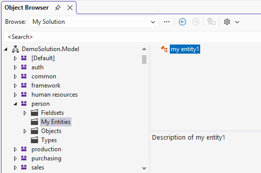

:::tip
To create more advanced structures of your custom entities in the Object Browser, you can check the existing templates in the `symbol_browsing.xsl` file that handle standard Xomega elements, as well as consult the VS library API for the meaning of [different values and flags](https://learn.microsoft.com/en-us/dotnet/api/microsoft.visualstudio.shell.interop.lib_category?view=visualstudiosdk-2022) that you pass to the `lib:AddNewNode` and `lib:SetCategory` functions.
:::